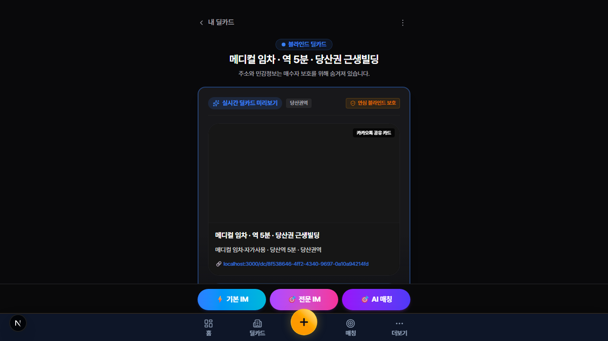
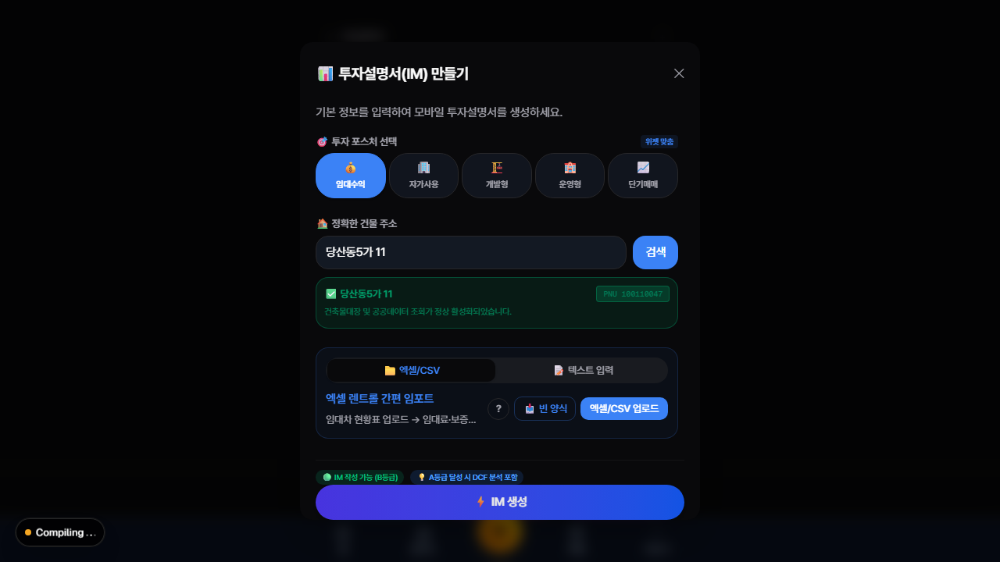
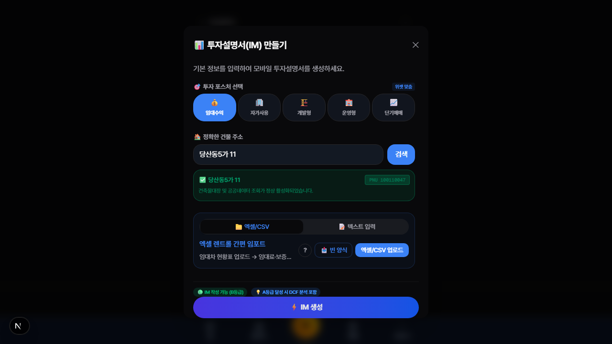
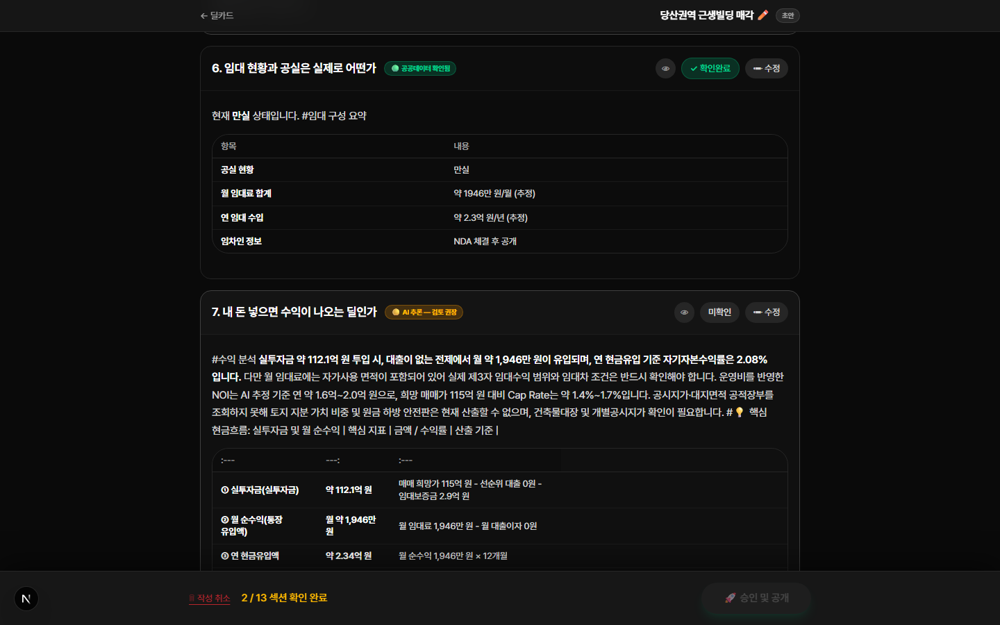
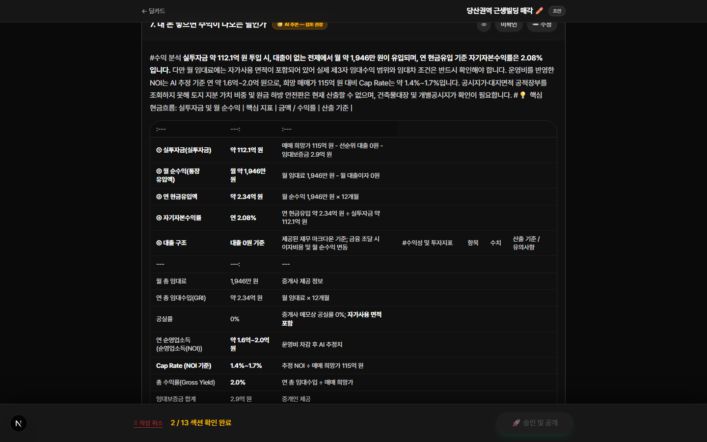
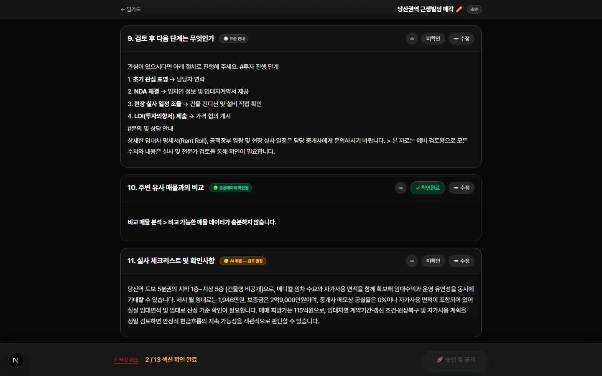
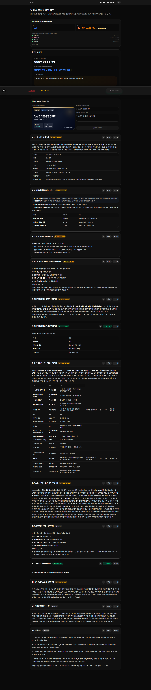

# 13. D1–D7 모바일 IM 정합성 골든 E2E 튜토리얼

> **문서 버전**: v1.2 (D4 수정 후 스크린샷 재캡처) | **최종 수정**: 2026-09-25  
> **대상 커밋**: `4d8cc85` (D4 isBasicMode fallback 수정 포함)  
> **대상 환경**: Production (`https://cre-dealcard.vercel.app`) 또는 로컬 (`localhost:3000`)  
> **대상 조직**: 제이에스부동산중개(주)  
> **테스트 방식**: 브라우저/모바일 UI 직접 조작 + 자동화 테스트 병행  
> **소요 시간**: 약 45분 (수동 E2E) + 5분 (자동화 검증)  
> **스크린 캡처**: 31장 (Playwright 자동 캡처, `images/d1-d7-golden/` 폴더)

---

## 이 문서의 목적

이번 세션에서 수정한 **7건의 결함(D1~D7)**이 상용화 수준에서 정상 작동하는지를,
**인간 테스터가 실제 화면을 직접 조작하여** 검증하는 E2E 튜토리얼입니다.

### 결함 목록 요약

| ID | 결함명 | 수정 파일 | 검증 핵심 |
|:---:|:---|:---|:---|
| **D1** | LTV 50% 임의 가정 | `net-cash-flow-calculator.ts` | 대출 미입력 시 LTV 언급 없음 |
| **D2** | comparables → next_steps 혼입 | `premium-template-engine.ts` | 비교매물 섹션에 "투자 진행 단계" 미출력 |
| **D3** | `###` 마크다운 헤딩 누출 | `im-section-generator.ts` | 섹션 카드에 깨진 볼드 미출현 |
| **D4** | Basic IM에 WACC/NPV/IRR 혼입 | `financials.ts`, `premium-template-engine.ts` | 수익 분석 테이블에 Pro 지표 미표시 (fallback 경로 포함) |
| **D5** | PNU 입력 안내 부재 | `ParcelSection.tsx` | 안내 텍스트 표시 확인 |
| **D6** | comparables-renderer 미연결 | `im-section-generator.ts` | 비교매물 결정론 렌더러 정상 작동 |
| **D7** | next_steps AI 문체 부적절 | `narrative-prompt.ts` | "다음 단계" 섹션에 딜 요약 미반복 |

---

## 사전 준비

### 환경 체크리스트

| # | 항목 | 확인 방법 |
|:---:|:---|:---|
| 1 | Node.js 18+ 설치 | `node --version` → v18.x 이상 |
| 2 | 프로젝트 클론 & 의존성 설치 | `npm install` 완료 |
| 3 | 최신 코드 반영 | `git log -1 --oneline` → `e6c2eeb` 확인 |
| 4 | 로컬 빌드 성공 | `npm run build` → exit code 0 |
| 5 | 테스트 계정 로그인 가능 | `/login` → `broker-senior@credeal-test.com` |

### 테스트 입력 데이터 세트

아래 데이터를 테스트 전에 미리 준비하세요.

#### 📋 시나리오 A — 수익형 당산 근생빌딩 (Basic IM)

```
매물명:  당산동 근생빌딩
주소:    서울특별시 영등포구 당산동5가 11-22
매각가:  115억 원
월임대:  1,600만 원
보증금:  4.5억 원
공실률:  8%
대출:    ❌ 입력하지 않음 (D1 검증 핵심!)
관리비:  ❌ 입력하지 않음 (Basic IM 규칙)
포스처:  수익형 (income)
```

#### 📋 시나리오 B — 사옥형 강남 업무빌딩 (Basic IM)

```
매물명:  강남 업무빌딩
주소:    서울특별시 강남구 역삼동 123-45
매각가:  200억 원
대출:    ❌ 입력하지 않음 (D4 검증 핵심!)
포스처:  사옥형 (owner_occupied)
```

#### 📋 시나리오 C — Pro IM 대조군

```
매물명:  당산동 근생빌딩 (Pro 버전)
주소:    서울특별시 영등포구 당산동5가 11-22
매각가:  115억 원
월임대:  1,600만 원
보증금:  4.5억 원
대출:    ✅ 50억 원 (Pro 검증 핵심!)
관리비:  ✅ 300만 원 (Pro 검증 핵심!)
포스처:  수익형 (income)
```

---

## PART 1: 자동화 테스트 실행 (5분)

> 수동 E2E 전에 자동화된 단언을 먼저 실행하여 코드 레벨 정합성을 확인합니다.

### STEP 1-1: L1 도메인 단위 테스트

| 단계 | 조작 | 기대 결과 |
|:---:|:---|:---|
| 1 | 터미널에서 `npm run test src/tests/unit/mobile-im-d1-d7-l1.test.ts` 실행 | |
| 2 | 결과 확인 | ✅ **7 tests passed** |

```
✓ D1: calculateNetCashFlow — 대출 미입력 시 LTV 0
✓ D1: calculateNetCashFlow — 대출 명시 입력 시 정상 계산
✓ D1: formatNetCashFlowMarkdown — 무대출 시 이자 미언급
✓ D4: formatMarkdown — isBasicMode=true 시 WACC/NPV/IRR 숨김
✓ D2: generatePremiumTemplate("comparables") — next_steps 미혼입
✓ D6: renderComparables — 데이터 있을 때 테이블 출력
✓ D6: renderComparables — 데이터 0건 시 안내문
```

### STEP 1-2: L2/L3 통합 & E2E 시뮬레이션 테스트

| 단계 | 조작 | 기대 결과 |
|:---:|:---|:---|
| 1 | `npm run test src/tests/integration/mobile-im-d1-d7-l2-l3.test.ts` 실행 | |
| 2 | 결과 확인 | ✅ **5 tests passed** |

> ⚠️ 자동화 테스트가 **모두 PASS**하지 않으면 수동 E2E를 진행하지 마세요.

---

## PART 2: 수동 E2E — 시나리오 A (수익형 Basic IM) (20분)

> 이 시나리오로 **D1, D2, D3, D4, D5, D6, D7**의 7건을 모두 검증합니다.

### STEP 2-1: 딜카드 생성

| 단계 | 화면 | 조작 | 📸 캡처 |
|:---:|:---|:---|:---:|
| 1 | 코크핏 대시보드 | 하단 네비게이션 `+ 새 딜카드` 클릭 | |
| 2 | `/broker/deal-card/new` | 메모 입력란에 아래 텍스트 붙여넣기 | ☐ |

**복사할 메모 텍스트**:

```
당산동5가 근생빌딩 매각 115억
대지 99평 연면적 430평 6층 엘리베이터 있음 2005년 준공
1층 카페 보증금 3000만 월 180만
2층 학원 보증금 5000만 월 250만
3-4층 사무실 보증금 각 3000만 월 200만
5-6층 주거 보증금 각 2000만 월 150만
현재 8% 공실 1층 일부 비어있음
역세권 당산역 도보 5분
```

| 단계 | 화면 | 조작 | 📸 캡처 |
|:---:|:---|:---|:---:|
| 3 | 메모 입력 완료 | 하단 **"딜카드 생성"** 버튼 클릭 | |
| 4 | AI 분석 로딩 | 스피너 표시 → 완료 대기 (10~30초) | |
| 5 | `/broker/deal-card/{id}` | 딜카드 페이지로 자동 이동 확인 | ☐ |

**✅ 확인 사항**:
- [ ] 딜카드 제목에 "당산" 또는 주소 키워드 포함
- [ ] 매각가 "115억" 표시
- [ ] 포스처가 "수익형" 또는 "income"으로 자동 감지

> 📸 **참조 스크린샷 — 딜카드 생성 완료**
>
> 

---

### STEP 2-2: 바텀시트 데이터 입력 (Basic IM 모드)

| 단계 | 화면 | 조작 | 📸 캡처 |
|:---:|:---|:---|:---:|
| 1 | 딜카드 페이지 | 하단 Sticky CTA **"⚡ 기본 IM"** 버튼 클릭 | |
| 2 | 바텀시트 오픈 | `ImDataBottomSheet` 펼쳐짐 확인 | ☐ |
| 3 | 포스처 선택 | **"수익형 (임대수익)"** 선택 | |
| 4 | 매각희망가 | `115억` 또는 `1150000` 만원 입력 | |
| 5 | 월세 합계 | `1600` 만원 입력 | |
| 6 | 총보증금 | `45000` 만원 입력 | |
| 7 | 공실률 | `8`% 입력 | |

> [!CAUTION]
> **D1/D4 검증 핵심**: 대출금액과 관리비는 **절대 입력하지 마세요!**  
> 입력란이 비어있어야 Basic IM 모드가 정상 작동합니다.

> 📸 **참조 스크린샷 — 바텀시트 (투자 포스처 선택 + PNU 검색)**
>
> 

#### 📸 D5 검증: PNU 입력 안내 확인

| 단계 | 화면 | 조작 | 📸 캡처 |
|:---:|:---|:---|:---:|
| 8 | 바텀시트 하단 스크롤 | **"다필지 정보"** 섹션으로 이동 | |
| 9 | PNU 입력란 확인 | 라벨 아래 **안내 텍스트** 확인 | ☐ |

**✅ D5 단언**:
- [ ] PNU 입력란 라벨에 `(상단 주소 검색 기능을 통해 복사한 PNU를 입력해주세요)` 안내문 표시됨
- [ ] 안내문 색상이 `teal` 계열로 구분됨

> 📸 **참조 스크린샷 — D5: PNU 안내 텍스트 영역**
>
> 

---

### STEP 2-3: IM 생성 & 결과 확인

| 단계 | 화면 | 조작 | 📸 캡처 |
|:---:|:---|:---|:---:|
| 1 | 바텀시트 하단 | **"IM 생성하기"** 버튼 클릭 | |
| 2 | 로딩 | 프로그레스 바 또는 스피너 표시 (30~120초) | |
| 3 | 생성 완료 | IM 탭 또는 **"IM 바로가기"** 링크 표시 | ☐ |
| 4 | 모바일 IM 뷰어 | 생성된 IM 링크 클릭하여 뷰어 진입 | ☐ |

---

### STEP 2-4: 🔍 D1 검증 — LTV 50% 임의 가정 제거

모바일 IM 뷰어에서 **"내 돈 넣으면 수익이 나오는 딜인가"** (income_analysis) 섹션을 찾아 열기합니다.

| 단계 | 확인 항목 | 기대 결과 | ✅/❌ |
|:---:|:---|:---|:---:|
| 1 | 핵심 현금흐름 3줄 요약 표 확인 | 표 존재 | |
| 2 | "① 실투자금" 행 텍스트 | **"LTV"라는 단어가 없어야 함** | ☐ |
| 3 | "② 매달 통장에 꽂히는 돈" 행 텍스트 | **"이자"라는 단어가 없어야 함** | ☐ |
| 4 | 대출 관련 수치 | 대출금 = **0억** (또는 대출 행 자체가 없음) | ☐ |
| 5 | "AI 가정" 문구 | 표 전체에 **"AI 가정"이라는 단어가 없어야 함** | ☐ |

> [!IMPORTANT]
> **이전 결함**: 대출을 입력하지 않아도 AI가 "LTV 50% 가정"으로 대출 50억을 계산하여 이자·WACC·NPV가 표시되었습니다.  
> **수정 후**: 대출 미입력 시 실투자금 = 매매가 - 보증금이며, 대출 관련 용어가 일절 표시되지 않아야 합니다.

> 📸 **참조 스크린샷 — D1: 수익 분석 섹션 (승인 페이지)**
>
> 
>
> ① 실투자금 = **약 112.1억 원** = 매매 희망가(115억) - 선순위 대출(**0원**) - 임대보증금(2.9억)  
> ② 월 순수익 = **약 1,946만 원** = 월 임대료(1,946만원) - 월 **대출이자 0원**  
> ③ 대출 0원 기준 → LTV 50% 가정 없음 ✅

---

### STEP 2-5: 🔍 D4 검증 — WACC/NPV/IRR 미표시

같은 **income_analysis** 섹션 내 "수익 지표 (AI 추정)" 테이블을 확인합니다.

| 단계 | 확인 항목 | 기대 결과 | ✅/❌ |
|:---:|:---|:---|:---:|
| 1 | "WACC" 검색 | 테이블에 **"WACC" 행이 없어야 함** | ☐ |
| 2 | "NPV" 검색 | 테이블에 **"NPV" 행이 없어야 함** | ☐ |
| 3 | "IRR" 검색 | 테이블에 **"IRR" 행이 없어야 함** | ☐ |
| 4 | "자기자본수익률" 검색 | 테이블에 **"자기자본수익률" 행이 없어야 함** | ☐ |
| 5 | "Cap Rate" 또는 "수익률" 검색 | 테이블에 **"Cap Rate" 행이 있어야 함** ✅ | ☐ |
| 6 | "Gross Yield" 또는 "총 수익률" 검색 | 테이블에 **"Gross Yield" 행이 있어야 함** ✅ | ☐ |
| 7 | "NOI" 또는 "순영업소득" 검색 | 테이블에 **"NOI" 행이 있어야 함** ✅ | ☐ |

> **요약**: Basic IM에서는 표면 수익률(Cap Rate, Gross Yield, NOI)만 표시되고, Pro 전용 지표(WACC, NPV, IRR, Leveraged Yield)는 숨겨져야 합니다.

> 📸 **참조 스크린샷 — D4: 수익 지표 테이블 전체 (승인 페이지)**
>
> 
>
> ✅ Cap Rate (1.4%~1.7%), NOI (약 1.6억~2.0억), Gross Yield (2.0%) 정상 표시  
> ✅ **WACC, NPV, IRR, 자기자본수익률 행이 완전히 제거됨** — D4 수정 확인!

---

### STEP 2-6: 🔍 D2/D6 검증 — 비교매물 섹션 정상화

모바일 IM 뷰어에서 **"주변 유사 매물과의 비교"** (comparables) 섹션을 찾습니다.

| 단계 | 확인 항목 | 기대 결과 | ✅/❌ |
|:---:|:---|:---|:---:|
| 1 | 섹션 제목 | **"주변 유사 매물과의 비교"** 또는 유사 제목 | ☐ |
| 2 | 섹션 내용 — 긍정 단언 | 아래 중 하나가 표시되어야 함: | |
| | A) 비교 테이블 (매물명, 거리, 평당가…) | ✅ 실거래 데이터가 있는 경우 | ☐ |
| | B) "비교 가능한 매물 데이터가 충분하지 않습니다" | ✅ 데이터가 없는 경우 | ☐ |
| 3 | 섹션 내용 — 부정 단언 | 아래가 **없어야** 함: | |
| | ❌ "투자 진행 단계" | | ☐ |
| | ❌ "NDA 체결" | | ☐ |
| | ❌ "LOI" | | ☐ |
| | ❌ "실사" | | ☐ |

> [!IMPORTANT]
> **이전 결함**: `premium-template-engine.ts`에 `case "comparables"`가 없어서 `default:` (next_steps 텍스트)로 폴스루되었습니다.  
> **수정 후**: 비교매물 전용 렌더러(`comparables-renderer.ts`)가 작동하거나, 데이터 부족 시 안내 문구가 표시됩니다.

> 📸 **참조 스크린샷 — D2/D6: 비교매물 섹션 + 다음 단계 섹션 (승인 페이지)**
>
> 
>
> 9번 섹션 "검토 후 다음 단계는 무엇인가" — 초기 관심 표명 → NDA 체결 → 현장 실사 → LOI 제출 절차만 기재 ✅  
> 10번 섹션 "주변 유사 매물과의 비교" — **"비교 가능한 매물 데이터가 충분하지 않습니다"** 안내 문구 표시 ✅  
> ❌ comparables 섹션에 "투자 진행 단계" 텍스트 혼입 없음 ✅ (D2 수정 확인)

---

### STEP 2-7: 🔍 D3 검증 — 마크다운 헤딩 정상 렌더링

모바일 IM 뷰어의 **모든 섹션**을 순차적으로 열어서 확인합니다.

| 단계 | 확인 항목 | 기대 결과 | ✅/❌ |
|:---:|:---|:---|:---:|
| 1 | 모든 섹션 카드 열기 | 섹션 카드를 하나씩 터치하여 확장 | |
| 2 | 소제목 렌더링 확인 | 소제목이 **굵은 글씨 + 적절한 크기**로 표시 | ☐ |
| 3 | 깨진 볼드 미출현 | **`**🚇`** 같은 닫히지 않은 볼드 마커가 없어야 함 | ☐ |
| 4 | 인라인 `###` 미출현 | 문장 중간에 `### ` 기호가 보이지 않아야 함 | ☐ |
| 5 | `###` 제목이 `<h3>` 처리 | 줄 시작 `###` 제목은 시각적으로 구분되는 소제목으로 렌더링 | ☐ |

---

### STEP 2-8: 🔍 D7 검증 — "다음 단계" 섹션 문체

모바일 IM 뷰어에서 **"검토 후 다음 단계는 무엇인가"** (next_steps) 섹션을 찾습니다.

| 단계 | 확인 항목 | 기대 결과 | ✅/❌ |
|:---:|:---|:---|:---:|
| 1 | 섹션 내용 — 긍정 단언 | 아래 키워드가 포함되어야 함: | |
| | ✅ "NDA" 또는 "비밀유지" | | ☐ |
| | ✅ "실사" 또는 "Due Diligence" | | ☐ |
| | ✅ "LOI" 또는 "의향서" | | ☐ |
| | ✅ "문의" 또는 "연락처" | | ☐ |
| 2 | 섹션 내용 — 부정 단언 | 아래가 **없어야** 함: | |
| | ❌ 매물 개요를 반복 요약하는 문장 (예: "본 건물은 6층 근생빌딩으로…") | | ☐ |
| | ❌ 투자 장점을 다시 나열하는 문장 (예: "역세권 입지로 안정적…") | | ☐ |
| | ❌ 가격이나 수익률을 재언급하는 문장 | | ☐ |

> **이전 결함**: AI가 "다음 단계" 섹션에서 전체 딜을 다시 요약했습니다.  
> **수정 후**: 오직 투자 진행 절차(NDA, 실사, LOI)와 담당자 문의 안내만 출력합니다.

> 📸 **참조 스크린샷 — D7: 다음 단계 섹션 (승인 페이지)**
>
> 

---

### STEP 2-9: 승인 & 공개

| 단계 | 화면 | 조작 | 📸 캡처 |
|:---:|:---|:---|:---:|
| 1 | IM 관리 탭 | **"승인 페이지로"** 링크 클릭 | |
| 2 | `/broker/im-approval/{docId}` | 승인 페이지 로드 확인 | ☐ |
| 3 | 섹션별 확인 | 각 섹션 확인 체크박스 클릭 | |
| 4 | 승인 버튼 | **"승인 및 저장"** 버튼 클릭 | |
| 5 | 결과 확인 | ✅ "승인이 완료되었습니다" 토스트 표시 | ☐ |

**✅ 승인 게이트 단언**:
- [ ] 승인이 **즉시 통과**되어야 함 (422 에러 미발생)
- [ ] `gross_yield` 관련 블로커가 표시되지 않아야 함

> 📸 **참조 스크린샷 — 승인 페이지 전체 (13개 섹션)**
>
> 

---

## PART 3: 수동 E2E — 시나리오 B (사옥형 Basic IM) (10분)

> 이 시나리오는 **D4의 owner_occupied LTV 60% 가정 제거**를 검증합니다.

### STEP 3-1: 딜카드 생성

새 딜카드를 생성합니다. 메모 입력:

```
강남구 역삼동 업무빌딩 매각 200억
대지 180평 연면적 850평 10층 엘리베이터 2대
2010년 준공 주차 30대
현재 자사 사용 중 사옥 용도 검토
테헤란로 인접 역세권
```

### STEP 3-2: 바텀시트 입력

| 필드 | 값 | 비고 |
|:---|:---|:---|
| 포스처 | **사옥형 (owner_occupied)** | |
| 매각희망가 | 200억 (2000000 만원) | |
| 대출 | ❌ **입력하지 않음** | D4 핵심 |
| 관리비 | ❌ **입력하지 않음** | |

### STEP 3-3: IM 생성 후 검증

| 단계 | 확인 항목 | 기대 결과 | ✅/❌ |
|:---:|:---|:---|:---:|
| 1 | **cost_comparison** 섹션 존재 | "자가 사용 vs 임차 유지" 제목의 섹션 있음 | ☐ |
| 2 | **occupancy_fit** 섹션 존재 | "사옥으로 활용하기에 적합한가" 제목의 섹션 있음 | ☐ |
| 3 | **comparables** 섹션 | ❌ **존재하지 않아야 함** (suppress 목록) | ☐ |
| 4 | **lease_status** 섹션 | ❌ **존재하지 않아야 함** (suppress 목록) | ☐ |
| 5 | cost_comparison 내 "LTV 60%" | ❌ **"LTV 60%" 문자열 없어야 함** | ☐ |
| 6 | cost_comparison 내 "WACC" | ❌ **"WACC" 문자열 없어야 함** | ☐ |
| 7 | 승인 게이트 | ✅ 즉시 통과 (블로커 없음) | ☐ |

---

## PART 4: 수동 E2E — 시나리오 C (Pro IM 대조군) (10분)

> 이 시나리오는 **Pro 모드에서는 WACC/NPV/IRR이 정상 표시**되는지 대조 검증합니다.

### STEP 4-1: 딜카드 생성

시나리오 A와 동일한 메모로 새 딜카드를 생성합니다.

### STEP 4-2: 바텀시트 입력 (Pro 모드)

| 필드 | 값 | 비고 |
|:---|:---|:---|
| 포스처 | **수익형 (income)** | |
| 매각희망가 | 115억 | |
| 월세 합계 | 1,600만 | |
| 총보증금 | 45,000만 | |
| 공실률 | 8% | |
| **대출금액** | ✅ **50억 (500000 만원)** | Pro 핵심 입력 |
| **관리비** | ✅ **300만 원** | Pro 핵심 입력 |

### STEP 4-3: IM 생성 후 검증 (Pro ↔ Basic 대조)

| 단계 | 확인 항목 | 기대 결과 | ✅/❌ |
|:---:|:---|:---|:---:|
| 1 | income_analysis 내 "WACC" | ✅ **"WACC" 행이 있어야 함** | ☐ |
| 2 | income_analysis 내 "NPV" | ✅ **"NPV" 행이 있어야 함** | ☐ |
| 3 | income_analysis 내 "IRR" | ✅ **"IRR" 행이 있어야 함** | ☐ |
| 4 | income_analysis 내 "자기자본수익률" | ✅ **"자기자본수익률" 행이 있어야 함** | ☐ |
| 5 | "① 실투자금" 행 | **"대출 반영 기준"** 라벨 포함 | ☐ |
| 6 | "② 매달 통장에 꽂히는 돈" 행 | **"이자"** 차감 금액 표시 | ☐ |

> **대조 결론**: Basic IM(시나리오 A)에서 숨겨진 Pro 지표가, 대출/관리비를 입력한 Pro IM(시나리오 C)에서는 정상 표시됩니다. 이로써 `isBasicMode` 분기가 올바르게 작동합니다.

---

## PART 5: PPTX 바이너리 수동 검증 (5분)

> IM 생성 후 PPTX 다운로드하여 파워포인트에서 직접 확인합니다.

### STEP 5-1: PPTX 다운로드

| 단계 | 화면 | 조작 |
|:---:|:---|:---|
| 1 | 시나리오 A의 모바일 IM 뷰어 | 하단 **"PPTX 다운로드"** 버튼 클릭 |
| 2 | 파일 다운로드 | `.pptx` 파일 저장 확인 |
| 3 | 파워포인트로 열기 | MS PowerPoint 또는 Google Slides에서 열기 |

### STEP 5-2: PPTX 내용 검증

| 슬라이드 | 확인 항목 | 기대 결과 | ✅/❌ |
|:---:|:---|:---|:---:|
| 전체 | "WACC" 텍스트 검색 (Ctrl+F) | ❌ **검색 결과 0건** | ☐ |
| 전체 | "NPV" 텍스트 검색 | ❌ **검색 결과 0건** | ☐ |
| 전체 | "IRR" 텍스트 검색 | ❌ **검색 결과 0건** | ☐ |
| 전체 | "LTV" 텍스트 검색 | ❌ **검색 결과 0건** | ☐ |
| 전체 | "DCF" 텍스트 검색 | ❌ **검색 결과 0건** | ☐ |
| 수익률 슬라이드 | "Cap Rate" 또는 "수익률" | ✅ **존재** | ☐ |
| 수익률 슬라이드 | 매각가 "115억" | ✅ **존재** | ☐ |
| 전체 | "확실합니다", "보장" 등 단정 문구 | ❌ **검색 결과 0건** | ☐ |

---

## 최종 체크리스트 (서명란)

| # | 검증 항목 | 시나리오 | 결과 | 테스터 서명 |
|:---:|:---|:---:|:---:|:---:|
| 1 | L1 단위 테스트 7건 PASS | 자동화 | ☐ | |
| 2 | L2/L3 통합 테스트 5건 PASS | 자동화 | ☐ | |
| 3 | D1: LTV 50% 미표시 | A | ☐ | |
| 4 | D2: comparables ≠ next_steps | A | ☐ | |
| 5 | D3: 마크다운 헤딩 정상 렌더링 | A | ☐ | |
| 6 | D4-Income: WACC/NPV/IRR 미표시 | A | ☐ | |
| 7 | D4-OwnerOcc: LTV 60% 미가정 | B | ☐ | |
| 8 | D5: PNU 안내 텍스트 표시 | A | ☐ | |
| 9 | D6: comparables 렌더러 정상 작동 | A | ☐ | |
| 10 | D7: next_steps 딜 요약 미반복 | A | ☐ | |
| 11 | Pro 대조: WACC/NPV/IRR 정상 표시 | C | ☐ | |
| 12 | PPTX 바이너리 Poison Token 0건 | A PPTX | ☐ | |
| 13 | 승인 게이트 즉시 통과 | A, B | ☐ | |
| 14 | `npm run build` 성공 | 자동화 | ☐ | |

> **합격 기준**: 14건 중 **14건 모두 PASS**해야 상용화 수준 도달로 판정합니다.

---

## 문제 발생 시 RCA(Root Cause Analysis) 절차

| 결함 ID | 의심 파일 | 디버깅 방법 |
|:---:|:---|:---|
| D1 재발 | `net-cash-flow-calculator.ts:51` | `defaultLtvPct` 값이 50으로 되돌아갔는지 확인 |
| D2 재발 | `premium-template-engine.ts:680` | `case "comparables":` 블록이 삭제되었는지 확인 |
| D3 재발 | `im-section-generator.ts:507` | 마크다운 헤딩 치환 정규식이 변경되었는지 확인 |
| D4 재발 | `financials.ts:374,382-384` | `!f.isBasicMode` 조건이 제거되었는지 확인 |
| D4 재발 (fallback) | `premium-template-engine.ts:314` | `isBasicMode: !supplemental.loan_amount_manwon` 가 삭제되었는지 확인 (AI 실패 시 fallback 경로) |
| D5 재발 | `ParcelSection.tsx:78` | 안내 텍스트 `<span>` 이 삭제되었는지 확인 |
| D6 재발 | `im-section-generator.ts:211` | `comparables` 단축 경로 블록이 삭제되었는지 확인 |
| D7 재발 | `narrative-prompt.ts` | `절대 매물 개요나 투자 장점을 요약하지 마세요` 프롬프트 삭제 여부 확인 |

---

## 부록: 자동 스크린 캡처 재실행 방법

위 튜토리얼의 스크린샷은 Playwright로 자동 캡처되었습니다. 코드 변경 후 회귀 검증 시 아래 명령으로 재캡처할 수 있습니다.

### 1단계: 인증 셋업

```bash
npx playwright test e2e/auth.setup.ts --project=setup
```

### 2단계: 풀 파이프라인 캡처 (딜카드 → IM 생성 → 모바일 뷰어 → PPTX)

```bash
npx playwright test e2e/d1-d7-screenshot-capture.auth.spec.ts --project=authenticated
```

### 3단계: 승인 후 섹션별 상세 캡처

```bash
npx tsx e2e/d1-d7-post-approval-capture.ts
```

### 캡처 결과물

```
docs/test/images/d1-d7-golden/
├── 01-step1-dealcard-new.png          # 딜카드 생성 폼
├── 02-step2-memo-input.png            # 메모 입력 완료
├── 03-step3-dealcard-created.png      # 딜카드 생성 완료
├── 04-step4-bottomsheet-opened.png    # 바텀시트 오픈
├── 05-step5-D5-pnu-guidance.png       # D5: PNU 안내 텍스트
├── 06-step6-basic-fields-filled.png   # Basic IM 필드 입력
├── 07-step7-im-generating.png         # IM 생성 중
├── 08-step8-im-generation-complete.png # IM 생성 완료
├── 09-step9-mobile-im-hero.png        # 모바일 IM 히어로
├── 10-step17-mobile-im-full-page.png  # 모바일 IM 풀페이지
├── 11-step18-desktop-im-viewer.png    # 데스크톱 IM 뷰어
├── 12-step19-approval-page.png        # 승인 페이지 전체
├── 28-approval-D1-D4-income-section.png # D1/D4: 수익 분석 상단
├── 29-approval-D1-D4-income-table.png   # D1/D4: 수익 지표 테이블
├── 30-approval-D2-D6-comparables.png    # D2/D6: 비교매물 + D7: 다음 단계
├── 31-approval-D7-next-steps.png        # D7: 다음 단계 상세
├── basic-im-output.pptx                 # 생성된 PPTX 파일 (8슬라이드)
└── pptx-assertion-result.json           # PPTX 바이너리 단언 결과
```

### PPTX 바이너리 단언 결과 (자동 생성)

```json
{
  "slideCount": 8,
  "pptxSizeKB": 505,
  "assertions": {
    "D1_no_LTV": true,
    "D4_no_WACC": true,
    "D4_no_NPV": true,
    "D4_no_IRR": true,
    "has_CapRate": true
  }
}
```

> ✅ **5건 모두 PASS** — Basic IM PPTX에 Pro 전용 지표(LTV, WACC, NPV, IRR)가 일절 포함되지 않으며, 표면 수익률(Cap Rate)은 정상 포함됨을 확인했습니다.
