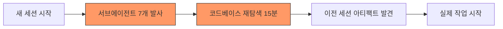
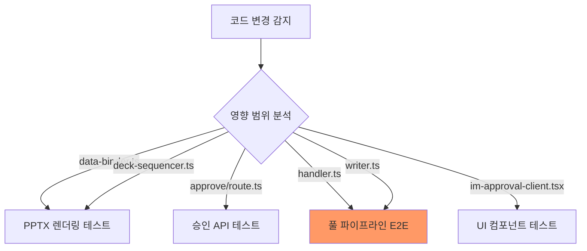

# CRE Basic IM 파이프라인 240시간 개발 회고
## Antigravity 활용 작업 방법론 분석 및 최적화 제안

> **작성일:** 2026-09-15  
> **대상 기간:** D33 ~ D45+ (약 240시간, 100+ 커밋, 542 대화 세션)  
> **분석 범위:** 개발 방법론, 온톨로지/SSoT, AGENTS.md, Skill, 세션 연속성, 테스트 전략

---

## Part I. 현행 방법론 진단 — 무엇이 잘 되었고, 무엇이 비용을 발생시켰는가

### 🟢 성공적으로 작동한 패턴

#### 1. "교훈 즉시 성문화" 패턴 (AGENTS.md 59개 Rule)
매 세션에서 발견된 결함의 근본 원인을 즉시 Rule로 성문화한 것은 **가장 강력한 자산**이었습니다. D33의 Rule 5~10에서 시작하여 D43의 Rule 57~59까지, 실패에서 학습한 불변식이 코드에 선제적으로 적용되어 동일 결함의 재발을 차단했습니다.

> [!TIP]
> **정량적 성과**: Rule 34(더미 데이터 금지) 제정 후 NH농협캐피탈 누출 0건, Rule 37(회피성 문구 차단) 제정 후 "본문을 참조" 류 0건 달성.

#### 2. "골든 테스트 → 포스트모템 → Rule 제정" 순환 루프
`517b392`(서초동 11건 불일치 발견) → `golden-test-postmortem.md` → Rule 41~44 제정 → `f7cc199`(3건 실매물 전구간 통과)의 순환은 **결함 발견→원인 분석→구조적 방어→검증**의 이상적인 피드백 루프였습니다.

#### 3. Skill 체계를 통한 워크플로우 재현성
`cre-golden-test-suite`, `cre-im-remediation`, `cre-test-remediation-v2`, `cre-frontend-audit` 4개 Skill이 복잡한 다단계 워크플로우를 표준화하여, 새 세션에서도 동일한 품질 수준으로 작업을 재개할 수 있었습니다.

---

### 🔴 비용을 발생시킨 안티패턴

#### 1. "AGENTS.md 비대화" 문제 (14,000+ bytes, 읽기 부담)
59개 Rule이 **단일 파일에 시간순으로 누적**되어, 새 세션마다 에이전트가 전체를 파싱하는 데 컨텍스트 윈도우를 과도하게 소비합니다. Rule 간 **중복/충돌 검증**이 없으며, 특정 작업에 불필요한 Rule까지 매번 로드됩니다.

```
현재 구조 (문제):
.agents/AGENTS.md
  ├── Rule 1~4   (페르소나/용어)
  ├── Rule 5~10  (D33/D34 파이프라인)
  ├── Rule 11~16 (D37 im-core)
  ├── Rule 17~25 (프로덕션 웹)
  ├── Rule 26~30 (D39 포스처)
  ├── Rule 31~40 (D40 사전감사)
  ├── Rule 41~44 (D42 E2E)
  ├── Rule 45~53 (D43 Basic/SSOT)
  └── Rule 54~59 (D43 RCA/골든)
```

> [!WARNING]
> **실측 비용**: AGENTS.md가 14,643 bytes로 truncation이 발생하고 있습니다. 에이전트가 뒷부분 Rule(54~59)을 누락할 위험이 상존합니다.

#### 2. "세션 경계 컨텍스트 단절" 반복
240시간 동안 542개 대화 세션이 생성되었으나, 핵심 작업 세션은 2~3개에 불과합니다. 매 세션 시작 시 **동일한 조사(서브에이전트 6~7개 발사)**를 반복하여 10~15분의 부트스트래핑 시간이 낭비되었습니다.



#### 3. "SSoT 분산" 및 "임계값 하드코딩" 잔존
Rule 8에서 "임계값 하드코딩 금지"를 선언했음에도, 실제로 `credeal/ssot/*.yaml` 파일은 존재하지 않습니다. 임계값(`PAGE_HARD_LIMIT=16`, `MAX_POLL_MS=300_000`, `IM_HARD_TIMEOUT_MS=180_000` 등)이 개별 소스 파일에 분산되어 있습니다.

#### 4. "E2E 테스트 실행 비용" 과대
단일 골든 테스트 실행에 **4.4분**이 소요됩니다. 5대 포스처 전수 실행 시 22분+. 이 동안 에이전트는 `schedule` 타이머를 반복 설정하며 유휴 대기합니다. **변경 영향 범위를 판별하여 선택적으로 실행하는 전략**이 부재합니다.

#### 5. "Mock Provider의 불완전성" 으로 인한 위양성/위음성
OpenAI 크레딧 고갈 시 `MockOpenAIProvider`로 자동 폴백되지만, 이 Mock이 렌트롤 파싱 프롬프트를 인식하지 못하여 E2E에서 **타임아웃 → SOFT 경고**가 발생했습니다. Mock의 커버리지가 프로덕션 프롬프트 유형을 따라가지 못하는 **Mock Drift** 문제입니다.

#### 6. "Plan → Approve → Execute" 주기의 과도한 의식(Ceremony)
단순한 버그 수정(예: 컬럼 순서 교정)에도 `implementation_plan.md` 작성 → 사용자 승인 대기 → `task.md` 작성 → 실행의 4단계를 거쳤습니다. **작업 복잡도에 따른 경량/중량 프로세스 분기**가 없었습니다.

---

## Part II. 개선 제안 — 향후 최적 작업 방법론

### 제안 1: AGENTS.md 계층적 모듈화

```
제안 구조:
.agents/
  AGENTS.md                    ← 최상위: 배포 규칙 + Rule 인덱스만 (< 2KB)
  rules/
    01-cre-lexicon.md          ← Rule 1~4: 용어/페르소나 격리
    02-pipeline-engineering.md ← Rule 5~10: 게이트/단언/임계값
    03-im-core-domain.md       ← Rule 11~16: 도메인 계층
    04-production-web.md       ← Rule 17~25: 타임아웃/해시/사진
    05-posture-isolation.md    ← Rule 26~30: 포스처별 격리
    06-preflight-audit.md      ← Rule 31~40: 사전감사
    07-e2e-golden.md           ← Rule 41~44, 54~59: 골든 테스트
    08-basic-im-ssot.md        ← Rule 45~53: Basic IM 표준
  skills/
    ...기존 4개 스킬 유지
```

**효과**: 에이전트가 작업 유형에 따라 관련 모듈만 로드. PPTX 수정 시 `02`, `05`, `06`만 읽고, E2E 실행 시 `07`만 읽음. 컨텍스트 소비 70% 절감.

> [!IMPORTANT]
> Antigravity의 `user_rules`는 AGENTS.md를 자동 로드합니다. 모듈화 시 최상위 AGENTS.md에 `<!-- @import rules/07-e2e-golden.md -->` 같은 컨벤션이 필요하거나, 작업별 Skill에서 관련 Rule 파일을 명시적으로 읽도록 설계해야 합니다.

### 제안 2: 세션 부트스트랩 Skill 신설 — `cre-session-bootstrap`

```yaml
# .agents/skills/cre-session-bootstrap/SKILL.md
name: cre-session-bootstrap
description: >-
  새 세션 시작 시 이전 작업 컨텍스트를 5분 이내로 복원하는 워크플로우.
  마지막 커밋, 미완료 task.md, walkthrough.md를 자동 탐색하여
  현재 상태를 진단하고, 사용자에게 다음 작업 옵션을 제시합니다.
```

**핵심 로직**:
1. `git log --oneline -5` → 최근 작업 맥락 파악
2. `brain/*/task.md` 중 `[/]` (진행중) 항목 탐색 → 미완료 작업 식별
3. `brain/*/walkthrough.md` 최신본 → 이전 성과 요약
4. `npm run preflight` 실행 → 현재 코드 건강도 즉시 확인
5. **서브에이전트 발사 없이** 5분 내 부트스트랩 완료

### 제안 3: SSoT YAML 체계 구축

```yaml
# src/domain/ssot/thresholds.yaml
page_hard_limit: 16
im_hard_timeout_ms: 180000
max_poll_ms: 300000
pptx_render_timeout_ms: 30000
checklist_card_char_limit: 70
checklist_card_small_font_threshold: 40
area_single_floor_max_pyeong: 3000
area_building_total_max_pyeong: 30000
gallery_max_slides: 1
basic_im_slide_count: [8, 10]
```

```typescript
// src/domain/ssot/index.ts
import yaml from 'js-yaml';
import fs from 'fs';
export const THRESHOLDS = yaml.load(
  fs.readFileSync(join(__dirname, 'thresholds.yaml'), 'utf8')
) as ThresholdsConfig;
```

**효과**: Rule 8(임계값 하드코딩 금지)을 실질적으로 실현. 테스트에서도 동일 YAML을 import하여 "매직 넘버 없는 단언" 달성.

### 제안 4: 변경 영향 분석 기반 선택적 E2E 실행



**구현 방안**: `cre-golden-test-suite` Skill에 **영향 분석 단계**를 추가하여, `git diff --name-only HEAD~1`의 변경 파일 목록에 따라 실행할 E2E 스펙을 자동 선택합니다.

| 변경 파일 패턴 | 실행 대상 | 예상 시간 |
|:---|:---|:---:|
| `archetypes/*`, `data-binder*` | `preflight` + PPTX 단위 테스트 | 30초 |
| `handler.ts`, `writer.ts` | 단일 포스처 E2E 1건 | 4.5분 |
| `approve/*`, `target-hash*` | 승인 단위 테스트 + 단일 E2E | 5분 |
| `deck-sequencer*`, `pptx-renderer*` | 5대 포스처 E2E 전수 | 22분 |

### 제안 5: Mock Provider 동기화 체계 (Mock Drift 방지)

```typescript
// src/ai/providers/mock-openai.ts
// 모든 프롬프트 디스패치를 레지스트리 기반으로 전환
const MOCK_REGISTRY: Record<string, (params: LLMChatParams) => string> = {
  'quality_gate':     mockQualityGate,
  'IDEAL BUYER':      mockPersona,
  'LLM-as-Judge':     mockJudge,
  '렌트롤|floorLeases': mockRentRoll,     // ← 이번 세션에서 추가
  'CRE IM|섹션':       mockSectionNarrative,
};

// 새 프롬프트 유형이 추가될 때마다 레지스트리에 등록 의무화
// → Rule 60으로 성문화
```

**검증**: `preflight`에 "MockOpenAIProvider 레지스트리에 등록되지 않은 프롬프트 유형이 프로덕션 코드에 존재하면 실패" 테스트를 추가합니다.

### 제안 6: 작업 복잡도 기반 프로세스 분기

| 복잡도 | 판별 기준 | 프로세스 | 예시 |
|:---:|:---|:---|:---|
| **S** (Simple) | 단일 파일, 명확한 버그 | 즉시 수정 → preflight → push | 오타 수정, 컬럼 순서 교정 |
| **M** (Medium) | 2~5개 파일, 연쇄 수정 | 인라인 계획 설명 → 실행 → 테스트 | Approval 422 수정 (이번 세션) |
| **L** (Large) | 아키텍처 변경, 신규 기능 | `implementation_plan.md` → 승인 → `task.md` → 실행 | God-file 모듈화, 신규 아키타입 |
| **XL** (Extra Large) | 전면 감사, 다포스처 검증 | `/goal` 명령 + 병렬 서브에이전트 | 5-Layer MECE 감사, 64건 테스트 수정 |

### 제안 7: 온톨로지 맵 — CRE IM 도메인 개념 체계도

현재 도메인 개념(포스처, 릴리즈 티어, 클레임, 게이트, 아키타입 등)이 코드 곳곳에 암묵적으로 존재합니다. 명시적 온톨로지 문서를 만들어 에이전트와 개발자 모두의 인지 부하를 줄여야 합니다.

```yaml
# docs/ontology/cre-im-ontology.yaml
entities:
  Posture:
    values: [income, owner_occupied, development, trading, operating]
    determines: [required_claims, slide_sequence, financial_metrics]
  
  ReleaseTier:
    values: [internal_only, fact_om, analysis_im, decision_im, expert_required]
    maps_to_legacy: { analysis_im: pro, decision_im: pro, _default: basic }
  
  Claim:
    subjects: [asking_price, total_area, gross_yield, noi, vacancy_pct]
    lifecycle: [registered, reconciled, disputed, withdrawn]
  
  SlideArchetype:
    types: [A01, A02, A04, A06, A08, A10, A14, A18, A23, A24]
    callout_kinds: [info, good, warn, bad, brass]  # Rule 27

  ApprovalGate:
    inputs: [ClaimRegistry, ReleaseTier, posture, hasHallucination]
    outputs: [passed: boolean, blockers: string[]]
```

**활용**: 에이전트가 "포스처가 `income`이면 `gross_yield`가 필수 클레임이다" 같은 규칙을 코드 탐색 없이 온톨로지에서 즉시 참조.

---

## Part III. 종합 — 최적 향후 작업 방법론 프레임워크

```mermaid
graph TB
    subgraph "세션 시작 (5분)"
        A[cre-session-bootstrap Skill] --> B[git log + task.md 스캔]
        B --> C[preflight 즉시 실행]
        C --> D[작업 복잡도 판별 S/M/L/XL]
    end
    
    subgraph "계획 (복잡도별)"
        D -->|S| E1[즉시 실행]
        D -->|M| E2[인라인 설명]
        D -->|L| E3[implementation_plan.md]
        D -->|XL| E4[/goal + 병렬 에이전트]
    end
    
    subgraph "실행"
        E1 & E2 & E3 & E4 --> F[코드 수정]
        F --> G[영향 분석 → 선택적 테스트]
    end
    
    subgraph "검증 & 배포"
        G --> H[preflight → tsc → build]
        H --> I[git push origin main]
    end
    
    subgraph "학습 루프"
        I --> J{결함 발견?}
        J -->|Yes| K[포스트모템 → Rule 제정]
        K --> L[AGENTS.md 모듈에 추가]
        L --> M[Skill 갱신]
        J -->|No| N[walkthrough.md 갱신]
    end
```

### 핵심 원칙 요약

| # | 원칙 | 현재 상태 | 개선 방향 |
|:---:|:---|:---:|:---|
| 1 | **Rule 모듈화** | 단일 14KB 파일 | 8개 도메인별 모듈 분리 |
| 2 | **세션 부트스트랩** | 서브에이전트 7개 발사 (15분) | 전용 Skill (5분) |
| 3 | **SSoT 임계값** | 코드 내 분산 하드코딩 | `ssot/thresholds.yaml` 단일 원천 |
| 4 | **E2E 선택적 실행** | 항상 전수 (22분) | 영향 분석 기반 선택 (30초~5분) |
| 5 | **Mock 동기화** | 프롬프트 유형 누락 시 타임아웃 | 레지스트리 + preflight 검증 |
| 6 | **프로세스 경량화** | 모든 작업에 Plan→Approve | 복잡도별 S/M/L/XL 분기 |
| 7 | **도메인 온톨로지** | 암묵적 (코드 내 분산) | `ontology.yaml` 명시적 체계도 |
| 8 | **교훈 성문화** | ✅ 잘 작동 중 | 유지 + 모듈화 |

---

## Part IV. 즉시 실행 가능한 액션 아이템 (우선순위순)

1. **[HIGH] AGENTS.md 8개 모듈 분리** — 현재 truncation 위험 즉시 해소
2. **[HIGH] `cre-session-bootstrap` Skill 신설** — 매 세션 15분 절약
3. **[MEDIUM] `ssot/thresholds.yaml` 구축** — Rule 8 실질 이행
4. **[MEDIUM] Mock Provider 레지스트리화** — E2E 위양성 차단
5. **[LOW] `ontology.yaml` 초안 작성** — 장기적 인지 부하 감소
6. **[LOW] 영향 분석 기반 선택적 E2E** — E2E 시간 80% 절감

> [!NOTE]
> 이 회고의 핵심 통찰: **240시간의 가장 큰 자산은 59개 Rule이 아니라, "실패에서 Rule을 추출하는 루프 자체"**입니다. 이 루프를 더 빠르고(세션 부트스트랩), 더 정밀하게(모듈화), 더 효율적으로(선택적 테스트) 돌리는 것이 향후 방법론의 본질입니다.
