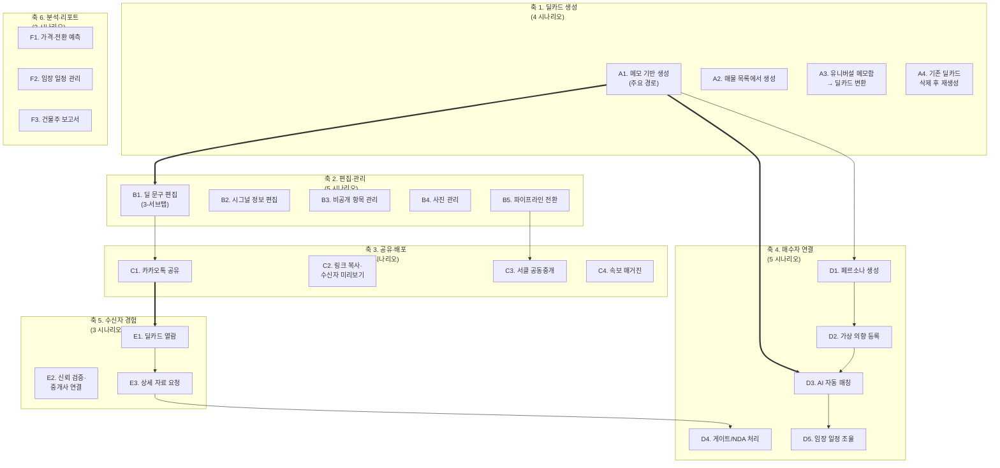
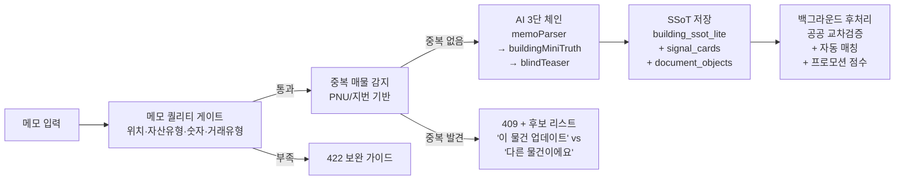
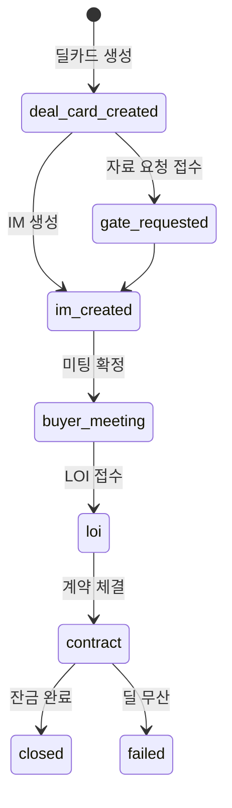
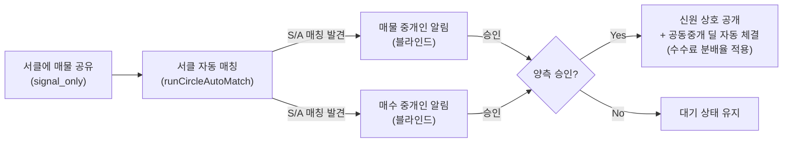
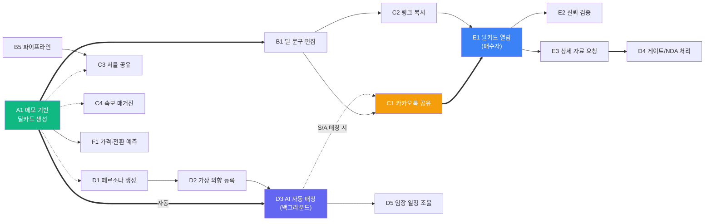

# 딜카드 활용 MECE 시나리오 맵 (최종)
> **범위**: 딜카드 생성 → 기본IM 생성 직전까지  
> **사용자**: 제이에스부동산중개(주) 소속 60대 꼬마빌딩 중개인  
> **원칙**: MECE (Mutually Exclusive, Collectively Exhaustive)  
> **기반**: 코드베이스 정밀 탐색 결과 반영

---

## 전체 시나리오 구조 (6축 × 24개)

---

# 축 1. 딜카드 생성 (Create)

> 딜카드가 시스템에 존재하지 않는 상태에서 최초로 만드는 모든 경로

## A1. 메모 기반 딜카드 생성 ⭐ 주요 경로

| 항목 | 내용 |
|:---|:---|
| **트리거** | 중개인이 매물 정보를 텍스트 메모로 입력 |
| **진입점** | `/broker/deal-card/new` (직접) · `/broker/buildings` 상단 "+ 새 딜카드 만들기" · FAB 버튼 · 홈 대시보드 |
| **API** | `POST /api/broker/deal-card/from-memo` |

**사용자 행동 (Step by Step)**:
1. 메모 입력 폼에 매물 정보 자유 작성 (최소 5자~최대 3,000자)
2. 사진 첨부 (선택)
3. "딜카드 생성" 버튼 클릭
4. 7단계 로딩 애니메이션 관찰 (3분 타임아웃)

**시스템 내부 파이프라인**:

**기대 결과**: 
- 딜카드 결과 페이지 도착 + 축하 모달 ("카톡 공유" / "서클 공유" / "임장 일정 잡기")
- 백그라운드에서 `runAutoMatch` 자동 실행

**엣지 케이스**:
| 상황 | 시스템 응답 |
|:---|:---|
| 메모가 5자 미만 | 작성 폼에서 클라이언트 차단 |
| 필수 슬롯 누락 (위치/가격) | 422 + 구체적 보완 가이드 ("가격 정보를 추가해주세요") |
| 동일 PNU 매물 존재 | 409 + "이 물건 업데이트" vs "다른 물건 — 새로 만들기" 선택지 |
| 3분 타임아웃 | 타임아웃 안내 + 재시도 버튼 |
| 비동기 모드 (`isAsync`) | jobId 발급 → 2초 폴링 → 완성 시 결과 페이지 |

## A2. 매물 목록에서 딜카드 생성

| 항목 | 내용 |
|:---|:---|
| **트리거** | 이미 등록된 매물이 있으나 딜카드가 아직 없는 경우 |
| **진입점** | `/broker/buildings` → 매물 카드 → "딜카드 만들기" |
| **차이점** | 기존 `building_ssot_lite` 데이터를 자동으로 메모 형태로 재구성 → A1과 동일 파이프라인 |
| **기대 결과** | 이미 존재하는 건물 정보를 활용하므로 AI 분석 품질 향상 |

## A3. 유니버설 메모함 → 딜카드 변환

| 항목 | 내용 |
|:---|:---|
| **트리거** | 유니버설 메모장(`/broker/memos`)에 미리 작성해둔 메모를 딜카드로 발전시킬 때 |
| **진입점** | `/broker/memos` → 메모 선택 → "딜카드로 변환" |
| **시스템 동작** | `sessionStorage.setItem("memo_transfer", text)` → `/broker/deal-card/new` 이동 → 폼에 자동 채움 |
| **차이점** | 메모 작성 시점과 딜카드 생성 시점이 분리됨 (비동기 워크플로우) |

## A4. 기존 딜카드 삭제 후 재생성

| 항목 | 내용 |
|:---|:---|
| **트리거** | AI 품질 불만족 → 전체 재작성 필요 |
| **진입점** | `/broker/deal-card/[id]` → ⋮ 메뉴 → "딜카드 삭제" |
| **시스템 동작** | `DELETE /api/broker/deal-card/[id]/delete` → `document_objects` + `signal_cards` + `deal_card_personas` 삭제 |
| **주의사항** | ⚠️ 관련 IM, 신호 카드, 페르소나가 **함께 삭제** (되돌릴 수 없음) |

---

# 축 2. 딜카드 편집·관리 (Edit & Manage)

> 생성된 딜카드의 콘텐츠와 상태를 수정하는 모든 행위

## B1. 딜 문구 편집 (3개 서브탭)

`DealCardEditor.tsx` — 인라인 실시간 편집 (debounced PATCH 자동 저장)

| 서브탭 | 편집 가능 필드 |
|:---|:---|
| **📌 딜 타이틀 & 핵심 포인트** | `title` (딜카드 메인 제목), `hookCopy` (한 줄 소구 카피), `dealPoints` (핵심 딜 포인트 배열, 추가/삭제/순서 변경), `structureChips` (구조 태그 칩), `vacancyLabel` (공실 상태), `curiosityHook` (호기심 유발 카피) |
| **💬 카카오톡 전송 문구** | `kakaoText` (카카오 채팅 공유 시 함께 전송되는 브리핑 전문, 실시간 글자 수 카운터) |
| **🖼️ OG 공유 메타** | `ogTitle` (링크 미리보기 제목), `ogDescription` (링크 미리보기 설명) |

**API**: `PATCH /api/broker/deal-card/[id]` (document body + markdown + signal card 원자적 갱신)

## B2. 시그널 정보 편집 (BuildingSignalEditor)

개요 탭 상단, 클릭 → 인라인 편집 → Enter 저장 / Esc 취소:

| 필드 | 예시 | AI 신뢰도 뱃지 |
|:---|:---|:---|
| `areaSignal` (권역) | 강남권, 역삼동, 성수동 | `ai_hypothesis` / `needs_verification` |
| `assetType` (자산 유형) | 근린생활시설, 오피스 | |
| `priceBand` (가격대) | 80억대, 120억대 | |
| `currentUseSignal` (현재 용도) | 사옥, 임대 운영 | |
| `fitSummary` (핵심 투자 포인트) | — | |
| `cautionSummary` (주의 사항) | — | |

## B3. 비공개 항목 관리 (Hidden Fields)

| 블라인드 처리 대상 (9대 항목) |
|:---|
| 정확한 주소 · 임차인명 · 호실별 임대료 · 매도자 사정 · 협상 메모 · 건물주 정보 · 매수자 정보 · 등기 상세 · 임대차 원문 |

수신자 화면(`/dc/[id]`)에서 해당 항목이 완전히 제거되어 매도자 보호

## B4. 사진 관리

| 항목 | 내용 |
|:---|:---|
| **위치** | 개요 탭 → 매물 사진 갤러리 |
| **기능** | `layers.photos`에 저장된 외관/내부 사진 가로 스크롤 뷰 |
| **용도** | 카카오 공유 · 수신자 화면 · IM 생성 시 자동 연동 |

## B5. 파이프라인 상태 전환 (DealCardPipelineContainer)

**체류 경고 시스템**:

| 단계 | 경고 기준 | 안내 메시지 |
|:---|:---:|:---|
| `deal_card_created` | 7일 | "Gate 요청을 진행해보세요" |
| `gate_requested` | 7일 | "매수자에게 연락해보세요" |
| `im_created` | 14일 | "미팅 일정을 잡아보세요" |
| `buyer_meeting` | 14일 | "LOI 의향을 확인해보세요" |
| `loi` | 21일 | "계약 진행 상황을 확인하세요" |
| `contract` | 30일 | "잔금 일정을 확인하세요" |

---

# 축 3. 딜카드 공유·배포 (Share & Distribute)

> 딜카드를 외부 매수자 또는 동료 중개인에게 전달하는 모든 행위

## C1. 카카오톡 공유

| 항목 | 내용 |
|:---|:---|
| **트리거** | 미리보기 카드 영역 → "카톡 공유" 버튼 |
| **시스템** | Kakao JS SDK 동적 로드 → `Kakao.Share.sendDefault({ objectType: 'feed' })` |
| **전송 내용** | OG 이미지(800×400, 중개인 이름 포함) + 딜 제목 + 브리핑 텍스트 + "딜카드 확인하기" 링크 |
| **폴백** | SDK 로드 실패 시 → 자동으로 "링크 복사" 모드 전환 |

## C2. 링크 복사 · 수신자 미리보기

| 항목 | 내용 |
|:---|:---|
| **링크 복사** | 클립보드에 `${origin}/dc/${buildingId}` 복사 → 토스트 알림 |
| **수신자 미리보기** | "수신자 화면" 버튼 → 스마트폰 디바이스 프레임 모달 (아이폰 노치/인디케이터 UI) 내에 iframe 렌더링 |

## C3. 서클 공동중개 공유

| 항목 | 내용 |
|:---|:---|
| **진입점** | ⋮ 메뉴 → "🤝 서클에 공유" / 생성 직후 축하 모달 |
| **사용자 행동** | `ShareToCircleSheet`에서 서클 선택 → 공유 |
| **프라이버시** | 초기 공개 수준 = `signal_only` (위치·가격 시그널만) |

**더블 블라인드 매칭 프로세스**:

## C4. 속보 매거진 발행

| 항목 | 내용 |
|:---|:---|
| **트리거** | 특급 매물을 매거진 형태로 긴급 발행 |
| **진입점** | ⋮ 메뉴 → "⚡ 속보 매거진 발행" |
| **시스템** | `SpecialEditionModal` → 매거진 생성 → 구독자에게 자동 발송 |

---

# 축 4. AI 매수자 매칭 (Match & Connect)

> 딜카드와 잠재 매수자를 AI로 연결하는 모든 행위 (중개인 관점)

## D1. 이상적 매수자 페르소나 생성

| 항목 | 내용 |
|:---|:---|
| **진입점** | 매수자 탭 → "이상적 매수자 페르소나 생성" |
| **API** | `POST /api/broker/ideal-buyer-persona` |
| **출력** | 3대 핵심 페르소나 (사옥형 🏢 / 투자형 📈 / 증여·가업승계형 🎁) |

**각 페르소나 카드 구성**:
| 항목 | 내용 |
|:---|:---|
| 매수자 유형 | 법인/개인/가족 오피스 등 |
| 매칭 적합도 | 85%, 72% 등 |
| 추정 예산 | 80억~100억 |
| 매입 동기 | "본사 이전 검토", "임대수익 포트폴리오 편입" |
| 핵심 요구조건 | 역세권, 주차 10대+, 전용률 55%+ |
| 발굴 경로 | "강남 상업용 중개 네트워크", "법인 세무사 채널" |
| 접근 전략 | 중개사가 이 페르소나에 어필하는 구체 화법 |

## D2. 가상 매수자 의향 등록

| 항목 | 내용 |
|:---|:---|
| **트리거** | D1에서 생성된 페르소나를 실제 매칭 대상으로 전환할 때 |
| **사용자 행동** | 페르소나 카드 → "가상 의향 등록" 버튼 |
| **시스템** | `personaToVirtualIntent` → `buyer_intent_lite` 테이블에 삽입 → 즉시 매칭 점수표 생성 |
| **의의** | 아직 실제 매수자를 만나지 않았어도 AI 매칭 시뮬레이션 가능 |

## D3. AI 자동 매칭 실행

| 항목 | 내용 |
|:---|:---|
| **트리거** | ① 딜카드 생성 직후 자동 실행 ② 하단 CTA "AI매칭" 클릭 ③ 신규 매수자 의향 등록 시 역방향 매칭 |
| **API** | `runAutoMatch(buildingId, brokerId)` (domain 함수) |

**3단계 매칭 엔진**:

| Stage | 내용 | 복잡도 |
|:---|:---|:---|
| **1. Hard Filter** | 가격 조건 (예산 120% 이내), 지역 계층 매칭, 자산 유형 호환성 | O(1) |
| **2. Semantic Similarity** | OpenAI `text-embedding-3-small` 코사인 유사도 | O(n) |
| **3. Purpose Ensemble** | 매수 목적(사옥/투자/증여/밸류애드)별 가중치 앙상블 → 최종 등급 | O(1) |

**최종 등급 체계**:
| 등급 | 점수 | 의미 |
|:---:|:---:|:---|
| **S** | 85+ | 최적 매치 — 즉시 연락 권장 |
| **A** | 70+ | 우수 매치 — 적극 검토 |
| **B** | 55+ | 보통 매치 — 선별적 접근 |
| **C** | <55 | 약한 매치 — 참고용 |

## D4. 게이트/NDA 자료 요청 처리

| 단계 | 매수자 행동 | 중개인 응답 |
|:---|:---|:---|
| **1. 접수** | 수신자 화면에서 "상세 자료 요청" | 게이트 인박스에 `submitted` 표시 |
| **2. 심사** | — | 요청자 이름/연락처 확인 → 승인/거부 |
| **3. NDA** (옵션) | `/nda/[buildingId]` 전자 서명 | NDA 완료 확인 |
| **4. 승인** | IM 열람 가능 | `📱 모바일 IM 링크 복사` → 전달 |

## D5. 임장 일정 조율

| 항목 | 내용 |
|:---|:---|
| **트리거** | S/A 등급 매수자 확보 후 현장 방문 초대 |
| **진입점** | 매칭 센터 → "바로 임장 잡기" / 분석 탭 `ScheduleSection` |
| **시스템** | `/broker/schedule?buildingId=[id]` → 슬롯 생성/관리 |

---

# 축 5. 수신자 경험 (Buyer Experience)

> 매수자가 `/dc/[id]` 링크를 통해 경험하는 모든 시나리오

## E1. 딜카드 열람

**매수자가 보는 화면 구성 (상→하)**:

| 순서 | 컴포넌트 | 내용 |
|:---:|:---|:---|
| 1 | `TeaserHeroHeader` | 아키타입 뱃지, 블라인드 권역, 밴딩 가격/수익률/면적, 타이틀 + 한 줄 카피, 포스처 히어로 타일 |
| 2 | 핵심 딜 포인트 | Top 3 핵심 투자 포인트 번호 매김 |
| 3 | `PostureWidget` | 투자 성격별 시뮬레이션 슬라이더 (수익형/사옥형/개발형) |
| 4 | `PublicPolicyBlock` | K-익명성 재식별 방지 검증 결과 |
| 5 | `CTALadder` | "모바일 IM 보기" / "PPTX 다운로드" / "상세 IM 신청" |
| 6 | 하단 플로팅 바 | 📞 전화 연결 + 📄 IM 보기 |

## E2. 신뢰 검증 · 중개사 연결

| 항목 | 내용 |
|:---|:---|
| **TrustLine 카드** | 담당 중개사 이름, 소속, 전문 분야, 응답 보장 시간, 누적 거래 건수, 공인중개사 뱃지 |
| **전화 연결** | `tel:` 링크로 즉시 통화 가능 |
| **법적 고지** | "본 자산은 매도자 요청으로 지번 및 소유자가 블라인드 처리되었습니다" |

## E3. 상세 자료 요청 (매수자 → 중개인)

| 항목 | 내용 |
|:---|:---|
| **NDA 필요 시** | `/nda/[buildingId]` → 전자 비밀유지각서 서명 |
| **NDA 불필요 시** | `GateRequestForm` → 성함/연락처/기업명 입력 → 게이트 요청 제출 |
| **중개인 측** | D4 시나리오에서 처리 |

---

# 축 6. 분석·의사결정 (Analyze & Decide)

> 딜카드 데이터를 기반으로 중개인의 의사결정을 돕는 모든 기능

## F1. AI 가격·전환 예측 (DealPredictionSection)

| 항목 | 내용 |
|:---|:---|
| **예측 거래가 밴드** | 실거래가 기반 AI 추정 저점~고점 + 신뢰도(%) |
| **딜 성사 확률** | 0~100% 게이지 (70%+ 녹색, 40%+ 노란색, 미만 붉은색) |
| **성사 기여 요인** | 긍정적 요인 3가지 |
| **리스크 요인** | 거래 저해 요인 2가지 |

## F2. 임장 일정 관리 (ScheduleSection)

| 항목 | 내용 |
|:---|:---|
| **표시** | 오픈 슬롯 수, 예약 대기/확정 건수 |
| **연계** | `/broker/schedule?buildingId=[id]` → 방문 가능 시간대 등록/관리 |

## F3. 건물주 보고서

| 항목 | 내용 |
|:---|:---|
| **트리거** | 매도자에게 시장 분석 보고서 제공 |
| **진입점** | 분석 탭 → "📊 건물주 보고서 이동" |
| **경로** | `/broker/buildings/[id]/owner-report` |

---

# MECE 검증 매트릭스

| 축 | 범위 (What) | 행위자 (Who) | 배타성 검증 |
|:---|:---|:---|:---|
| **축 1 (생성)** | 무 → 유 전환 | 중개인 | ✅ 축 2~6은 딜카드 존재 전제 |
| **축 2 (편집)** | 콘텐츠·상태 변경 | 중개인 | ✅ 내부 데이터 수정만 (외부 전달 아님) |
| **축 3 (공유)** | 외부 전달·배포 | 중개인 | ✅ 편집(축2)은 내부, 공유(축3)는 외부 |
| **축 4 (매칭)** | 매수자와 1:1 연결 | 중개인+AI | ✅ 공유(축3)는 불특정 배포, 매칭(축4)은 AI 기반 1:1 |
| **축 5 (수신자)** | 매수자 관점 경험 | 매수자 | ✅ 중개인 행위(축1~4)와 매수자 행위(축5) 분리 |
| **축 6 (분석)** | 조회·리포트 | 중개인 | ✅ 행동(축2~4)이 아닌 읽기 전용 |

**포괄성(Exhaustive) 검증**:
- 생성(A)·편집(B)·공유(C)·매칭(D)·열람(E)·분석(F) → 딜카드 라이프사이클의 모든 단계 포함 ✅
- 중개인 행위(축 1~4, 6) + 매수자 행위(축 5) → 모든 행위자 포함 ✅
- 기본IM 생성 이전 범위 내 모든 기능이 하나 이상의 시나리오에 매핑됨 ✅

---

## 시나리오 의존 관계 (상세)

**범례**: ==> 필수 선행 / --> 일반 선행 / -.-> 선택적 연결
