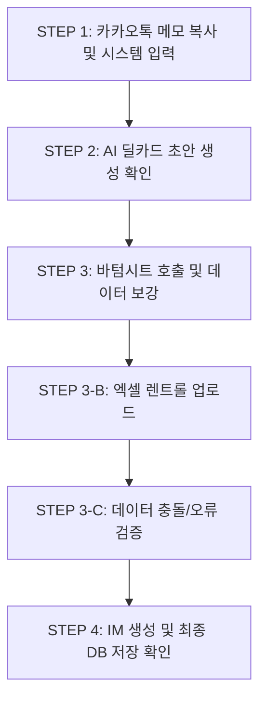

# CRE 딜카드 시스템 E2E 휴먼 테스트 가이드 (Part 1. 데이터 파이프라인 편)

**문서 버전:** v5.0
**작성 일자:** 2026-08-18
**연관 문서:** [Part 2. 시각적 무결성 검수 (human-e2e-part2-visual-inspection.md)](./human-e2e-part2-visual-inspection.md)

본 문서는 상업용 부동산 중개 실무(특히 100억 내외 꼬마빌딩)를 담당하시는 대표님 및 이사님들께서, 실제 업무 현장과 동일한 환경에서 AI 딜카드 시스템의 '데이터 입력 파이프라인'을 검증하기 위해 작성된 가이드입니다. 

---

## §1. 테스트 환경 및 준비

1. **테스트 브라우저:** 크롬(Chrome) 최신 버전 권장 (PC 환경)
2. **테스트 계정:** 중개사 프로필 사진, 소속(법인명), 연락처가 모두 등록된 테스트 계정으로 로그인
3. **테스트 준비물:** 
   - 평소 카카오톡으로 주고받으시는 형태의 '매물 메모' 텍스트
   - 렌트롤(임대내역) 엑셀 파일 샘플 (가이드 내 제공되는 5가지 포맷 다운로드 후 사용)

---

## §2. 데이터 입력 파이프라인 흐름도 (6단계)



---

## §3. STEP 1 메모 입력 검수 (5대 실무 테스트 케이스)

아래 5가지 실무 메모를 복사하여 딜카드 입력창에 붙여넣고 [딜카드 생성]을 클릭해주세요.

### [Case 1] 강남 역세권 신축급 (표준형)
> **카톡 원문:**
> 논현동 123-4번지, 매가 150억
> 대지 85평, 연면적 210평
> 지상 5층 / 지하 1층
> 보증금 7억 / 월세 4500만 / 관 500만
> 현재 올근생. 1층 약국, 2~3층 병원, 4~5층 사무실. 승강기 1대. 역세권 도보 3분.

| 점검 항목 | 결과 (정상/오류) |
| :--- | :---: |
| 메모 입력창에 정상적으로 붙여넣기가 되는가? | [ ] |
| 입력 후 로딩 화면(AI 분석 중)이 부드럽게 표시되는가? | [ ] |

### [Case 2] 서초 꼬마빌딩 (수익형/일부 공실)
> **카톡 원문:**
> 서초동 교대역 이면도로. 대 60평 건 150평
> 매매가 80억
> 보 3억 / 월 2500만. 수익률 4% 정도 나옴
> 1층 카페, 2층 미용실, 3층 학원, 4층 현재 공실, 5층 주택(근생 용도변경 예정)
> 주차 4대 가능.

| 점검 항목 | 결과 (정상/오류) |
| :--- | :---: |
| 공실 및 용도변경 예정 정보가 잘 인식되는가? | [ ] |

### [Case 3] 마포 사옥용 (명도조건)
> **카톡 원문:**
> 합정동 456번지 사옥용 추천
> 대지 120평, 연면적 350평
> 매매 200억
> 현재 전층 소유주 사용중. 잔금시 전체 명도 조건.
> 층고 4m, 노출콘크리트 인테리어.

| 점검 항목 | 결과 (정상/오류) |
| :--- | :---: |
| 명도 조건 및 사옥용 추천 정보가 반영되는가? | [ ] |

### [Case 4] 한남동 꼬마 (다중 층 병합)
> **카톡 원문:**
> 한남동 순천향대 인근. 120억.
> 지하2층~지상6층.
> B1~B2 스튜디오, 1층 부동산, 2~5층 메디컬, 6~7층(루프탑) 레스토랑.
> 보 5억, 월 3000.

| 점검 항목 | 결과 (정상/오류) |
| :--- | :---: |
| 복잡한 층수 및 병합 층 정보가 올바르게 분리/인식되는가? | [ ] |

### [Case 5] 데이터 누락/불완전 메모
> **카톡 원문:**
> 청담동 매매건 나옴. 180억.
> 역세권 대로변이고 수익률 좋음. 세부내역은 렌트롤 참고.

| 점검 항목 | 결과 (정상/오류) |
| :--- | :---: |
| 부족한 정보로도 기본 딜카드가 생성이 되며, 필수값 누락 안내가 뜨는가? | [ ] |

---

## §4. STEP 2 딜카드 생성 결과 검수

메모 입력 후 생성된 딜카드(요약 카드)를 확인합니다.

- [ ] 주소, 매매가, 보증금, 임대료 등 메모의 핵심 정보가 카드에 정확히 반영되었습니까?
- [ ] 건물 사진이 없어도 기본 임시 이미지가 깔끔하게 들어갑니까?
- [ ] **[결함 체크 ⚠️ Bug 7]** 하단 '담당중개사' 영역에 본인의 프로필 사진과 이름, 연락처가 정상적으로 노출됩니까? (빈칸으로 나오지 않는지 확인)

---

## §5. STEP 3 바텀시트 데이터 보강 검수

딜카드를 클릭하여 상세 수정 패널(바텀시트)을 엽니다.

### 5.1 주소 및 공적장부 연동
- [ ] 정확한 지번(예: 논현동 123-4) 입력 시, 대지면적/연면적/건폐율/용적률 등이 자동 표출됩니까?
- [ ] **[결함 체크 ⚠️ Bug 4]** 간혹 주소나 PNU(고유번호) 연동 실패 시, 무한 로딩이 돌지 않고 명확하게 "수기 입력 필요" 등의 알람이 표시됩니까?

### 5.2 데이터 등급(Grade) 산정 로직
- [ ] **[결함 체크 ⚠️ Bug 5]** 렌트롤이나 상세 면적 등 필수 정보가 누락되어 있음에도 데이터 등급이 'A등급'이나 'S등급'으로 과대 포장되어 나오지 않습니까? (누락 시 B나 C로 정상 하향되는지 확인)

### 5.3 UI / UX 편의성
- [ ] **[결함 체크 ⚠️ Bug 8]** 바텀시트 맨 하단에 '프리셋(미리작성된 문구) 드롭다운' 메뉴가 2개로 중복 표출되는 현상이 해결되었습니까?

---

## §6. STEP 3-B 엑셀 렌트롤 업로드 정밀 검수

**가장 중요한 검수 단계입니다.** 아래 5가지 형태의 엑셀 파일을 준비하여 각각 업로드해봅니다.

### [Test 1] 표준 포맷 (정상 작동 확인)
- **A열:** 층 / **B열:** 호실 / **C열:** 업종 / **D열:** 보증금 / **E열:** 임대료
- [ ] 데이터가 밀림 없이 각 칸에 정확히 맵핑되어 들어가는가?

### [Test 2] 비표준 포맷 (⚠️ Bug 1 검증: 첫 열 하드코딩 오류)
- **A열:** 카테고리라벨 / **B열:** 층수 / **C열:** 임차인
- [ ] 기존처럼 A열을 무조건 '층'으로 인식하여 오류를 뱉지 않고, 헤더명을 분석하여 '층' 데이터(B열)를 정상적으로 찾아냅니까?

### [Test 3] 다중 층 병합 데이터 (⚠️ Bug 3 검증: 병합 층수 유실 오류)
- 엑셀 내 층수 셀에 `B1-B2`, `6-7F`, `6-7층 메디컬에듀` 등으로 병합 표기된 데이터
- [ ] 업로드 후 시스템에서 '6층' 등으로 앞부분만 잘라먹지 않고, '6-7F', 'B1-B2' 등 원문 그대로 유지합니까?

### [Test 4] 금액 단위 혼용 데이터
- 어떤 행은 `30,000,000` (원 단위), 어떤 행은 `3,000` (만원 단위) 표기
- [ ] 딜카드 시스템이 만원 단위 기준으로 통일하여 일관되게 보여줍니까?

### [Test 5] 공실 데이터 처리
- 임차인/업종 칸이 비어있거나 '공실'로 표기된 행
- [ ] 정상적으로 '공실' 행으로 인식하여 임대료를 0 또는 예상 임대료로 맵핑합니까?

---

## §7. STEP 3-C 공실률·렌트롤 컨플릭트 검수

시스템의 논리적 충돌을 감지하는 기능입니다.

- [ ] **[결함 체크 ⚠️ Bug 6]** 바텀시트 상단 기본 정보에는 '만실'이라고 체크했는데, 업로드한 렌트롤(엑셀)에는 '2층 공실'이 있을 경우, 시스템이 이를 감지하여 경고창이나 오류 알림을 띄워줍니까? (충돌을 조용히 무시하면 안 됩니다)

---

## §8. STEP 4 IM 생성 및 데이터 저장 무결성 검수

모든 입력을 마치고 **[최종 IM 생성(저장)]** 버튼을 누릅니다.

### 8.1 데이터 무결성 검증 (⚠️ Bug 2)
- 이전에 보증금/임대료 필드명 오타(`deposit_manwon` → `deposit_krw`로 변경됨)로 인해, 기껏 입력한 렌트롤 금액이 DB에 0이나 Null로 날아가는 치명적 버그가 있었습니다.
- [ ] 저장 후 생성된 IM(웹 뷰어)을 열었을 때, **보증금 총액과 월 임대료 총액이 0원 처리되지 않고 엑셀 합계 그대로 정확히 나옵니까?**
- [ ] 새로고침(F5)을 해도 해당 금액이 날아가지 않고 유지됩니까? (DB 저장이 정상적으로 완료되었는지 검증)

---

## §9. 결함 리포트 양식 (이상이 있을 시 작성)

테스트 중 위 체크리스트에서 [X] 가 나오거나 다른 이상 현상 발견 시, 아래 양식을 복사하여 개발팀에 전달해 주십시오.

```text
■ 발견 일시: 2026-08-18 (오전/오후 00:00)
■ 테스트 환경: (PC/크롬 등)
■ 발생 단계: (예: STEP 3-B 엑셀 업로드 중)
■ 발생 현상:
(예: 다중 층 병합 엑셀을 올렸더니 6-7F가 6층으로만 나옵니다.)
■ 재현 방법 (어떻게 했을 때 발생했는지):
1. 카톡 메모 입력 후
2. Test 3 엑셀 파일을 업로드함
```

**수고하셨습니다. 데이터 입력 파이프라인 검증이 완료되었습니다.**
출력물 및 화면 배치의 시각적 검증을 위해서는 [Part 2. 시각적 무결성 검수 (human-e2e-part2-visual-inspection.md)](./human-e2e-part2-visual-inspection.md) 가이드를 진행해 주시기 바랍니다.
