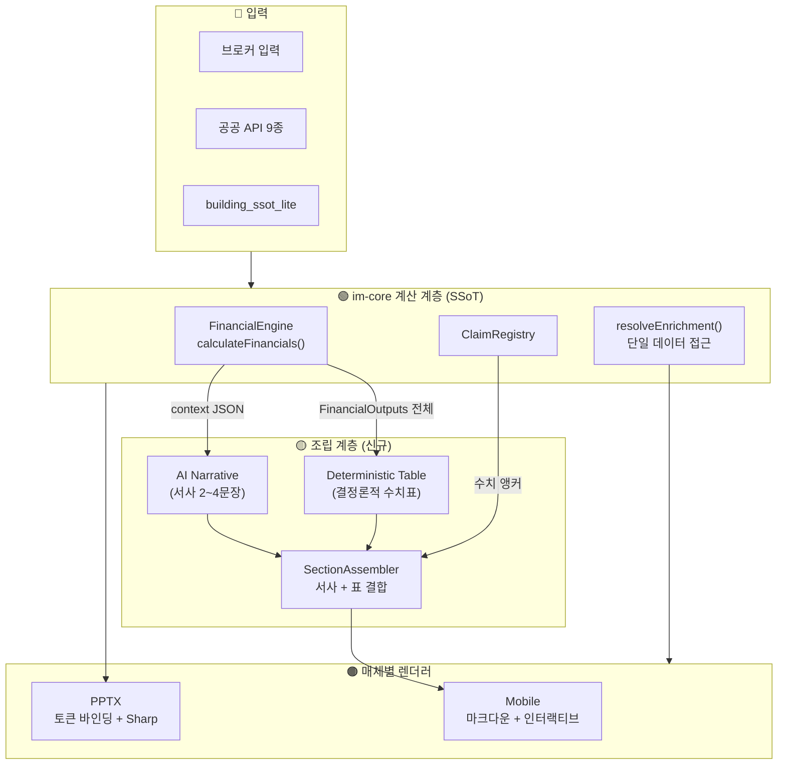
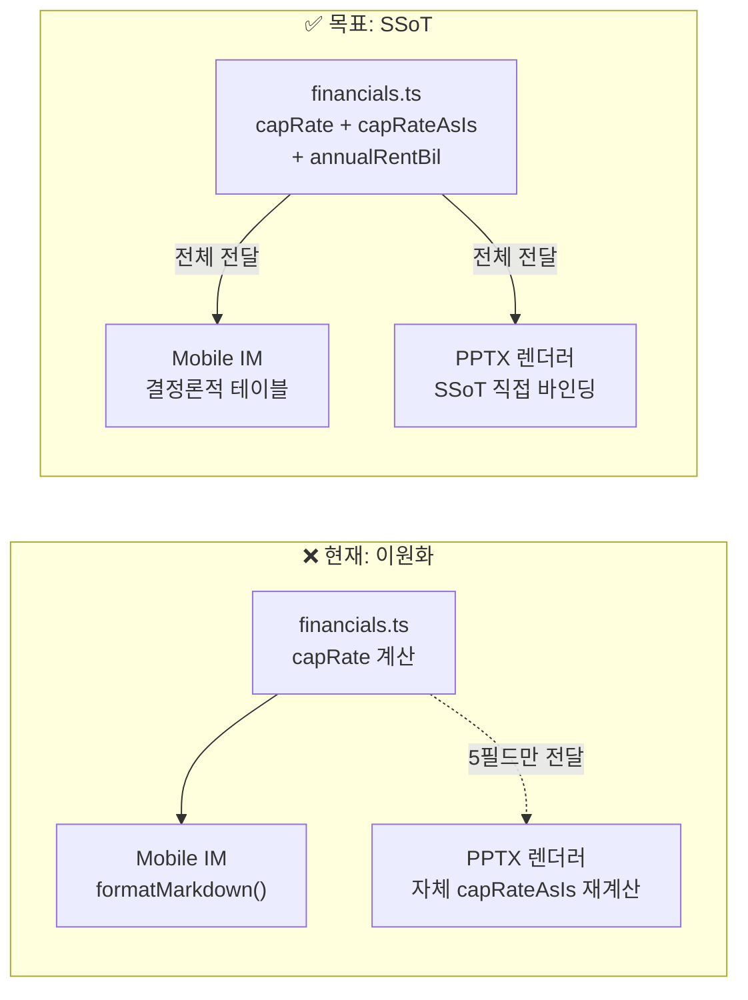

# IM 정합성 고도화 설계서 v2.0

> **작성일**: 2026-09-25  
> **목표**: 동일 데이터 → 정확한 수치 + 고품질 서사 → Mobile IM / PPTX IM 일관 생성  
> **원칙**: "하나의 수치, 하나의 출처, 매체별 표현"

---

## 아키텍처 목표 상태



---

## Phase 1: 데이터 경로 통합 (1주)

### 문제
`handler.ts`가 `body.external_data`(메타)와 `body.enrichment`(원본)를 이중 저장.  
소비자(fetch-im-data, pptx-renderer, approval-client)가 각각 다른 경로를 참조.

### 설계: `resolveEnrichment()` 헬퍼 도입

```typescript
// 신규 파일: src/domain/building/im-core/resolve-enrichment.ts

export interface ResolvedEnrichment {
  landUsePlan: LandUsePlanData | null;
  buildingRegister: BuildingRegisterData | null;
  locationPoi: LocationPoiData | null;
  comparableTransactions: ComparableTransaction[];
  cadastralMapImage: CadastralMapImage | null;
  // 메타데이터
  meta: {
    enrichedAt: string | null;
    hasPublicData: boolean;
    address: string | null;
    errors: { api: string; message: string }[];
  };
}

/**
 * 기존 문서(external_data에 원본) + 신규 문서(enrichment에 원본) 모두 호환.
 * Read-time 단일화 — DB 마이그레이션 불필요.
 */
export function resolveEnrichment(body: Record<string, any>): ResolvedEnrichment {
  const enrichment = body?.enrichment ?? {};
  const external = body?.external_data ?? {};

  return {
    landUsePlan: enrichment.landUsePlan ?? external.landUsePlan ?? null,
    buildingRegister: enrichment.buildingRegister ?? external.buildingRegister ?? null,
    locationPoi: enrichment.locationPoi ?? external.locationPoi ?? null,
    comparableTransactions: enrichment.comparableTransactions ?? external.comparableTransactions ?? [],
    cadastralMapImage: enrichment.cadastralMapImage ?? external.cadastralMapImage ?? null,
    meta: {
      enrichedAt: enrichment.enrichedAt ?? external.enrichedAt ?? null,
      hasPublicData: !!(enrichment.landUsePlan || enrichment.buildingRegister
                        || external.landUsePlan || external.buildingRegister),
      address: enrichment.address ?? external.address ?? null,
      errors: enrichment.errors ?? external.errors ?? [],
    },
  };
}
```

### 변경 대상 파일

| 파일 | 현재 | 변경 | 라인 |
|:---|:---|:---|:---|
| `handler.ts` | `body.external_data` + `body.enrichment` 이중 생성 | `body.enrichment` 단일 저장 + `body.enrichment.meta` | L691-717 |
| `fetch-im-data.ts` | `body.external_data?.landUsePlan` 등 직접 참조 | `resolveEnrichment(body)` 호출 | L297, L390-433 |
| `pptx-renderer.ts` | `body.external_data` + `body.enrichment` 각각 참조 | `resolveEnrichment(body)` 호출 | L151-190, L498 |
| `im-approval-client.tsx` | `content?.external_data` 참조 | `resolveEnrichment(content)` 호출 | L284 |
| `save-sections/route.ts` | 기존 구조 그대로 보존 | Lazy migration: `external_data` → `enrichment` 머지 후 삭제 | 쓰기 시점 |

### 하위 호환성

```typescript
// save-sections/route.ts 내 Lazy Migration 삽입
if (content.external_data && content.enrichment) {
  // 기존 external_data의 payload를 enrichment로 머지
  content.enrichment = {
    ...content.external_data,
    ...content.enrichment,
    meta: {
      enrichedAt: content.external_data.enrichedAt,
      hasPublicData: content.external_data.hasPublicData,
      errors: content.external_data.errors,
    },
  };
  delete content.external_data; // 이중 구조 제거
}
```

---

## Phase 2: 수치 SSoT 엔진 (1주)

### 문제
PPTX 렌더러(`pptx-renderer.ts` L723-778)가 `financials.ts`의 결과를 사용하지 않고 **독자 계산식**으로 Cap Rate를 재산출.  
Mobile IM은 `formatFinancialsMarkdown()` → AI context → LLM 재서술로 수치가 변형될 위험.

### 설계: FinancialOutputs 확장 + 전체 전달

#### 2-1. FinancialOutputs 인터페이스 확장

```typescript
// financials.ts — FinancialOutputs에 PPTX 바인딩용 필드 추가

export interface FinancialOutputs {
  // === 기존 필드 (Mobile IM 사용) ===
  annualNoi: { best: number; base: number; worst: number };
  capRate: { best: number; base: number; worst: number };
  irr5Year?: { best: number; base: number; worst: number };
  yieldOnCost: number;
  equityRequired: number;
  totalAcquisitionCostBil: number;
  totalDepositBil: number;
  loanAmountBil: number;
  leveragedYield?: number;
  wacc?: number;
  negativeLeverage?: boolean;
  pricePerSqm?: number;
  pricePerPyeong?: number;
  landValueRatio?: number;
  isBasicMode: boolean;

  // === 신규 필드 (PPTX 바인딩 통합) ===
  capRateAsIs: number | null;         // 임대수익 / (매매가 - 보증금) × 100
  capRateStabilized: number | null;   // 안정화 (공실 가정 복원)
  annualRentKrw: number;              // 연 임대수입 (원)
  annualRentBil: number;              // 연 임대수입 (억)
}
```

#### 2-2. IncomeFinancialStrategy에 capRateAsIs 계산 추가

```typescript
// financials.ts — IncomeFinancialStrategy.compute() 내부

// PPTX 바인딩용 As-Is Cap Rate (보증금 차감)
const denominator = purchasePriceKrw - depositKrw;
const capRateAsIs = (denominator > 0 && annualGross > 0)
  ? parseFloat(((annualGross / denominator) * 100).toFixed(2))
  : null;

const capRateStabilized = (vacancyRate > 0 && vacancyRate < 1 && denominator > 0)
  ? parseFloat(((annualGross * (1 + vacancyRate / (1 - vacancyRate)))
      / denominator * 100).toFixed(2))
  : null;

return {
  ...existingOutput,
  capRateAsIs,
  capRateStabilized,
  annualRentKrw: annualGross,
  annualRentBil: parseFloat((annualGross / 1_0000_0000).toFixed(2)),
};
```

#### 2-3. writer.ts — 전체 FinancialOutputs 보존

```typescript
// writer.ts L660 수정: 축소 매핑 → 전체 보존
financials: cachedFinancials
  ? { ...cachedFinancials, dcf10Year: undefined }
  : undefined,
```

#### 2-4. pptx-renderer.ts — 자체 계산 제거, SSoT 참조

```typescript
// pptx-renderer.ts L723-778 수정

// 기존: ssot_summary 원시 데이터로 자체 Cap Rate 재계산
// 신규: doc.body.financials SSoT 우선 참조
const fin = input.doc.body?.financials as FinancialOutputs | undefined;

dataMap['yieldFormula'] = {
  annualRent: fin?.annualRentBil
    ?? (annualRentFromSsot / 1_0000_0000),
  totalDeposit: fin?.totalDepositBil
    ?? (depositFromSsot / 1_0000_0000),
  askingPrice: askingPriceBil,
  vacancyPct: vacancyPct,
  capRateAsIs: fin?.capRateAsIs       // SSoT에서 직접
    ?? fallbackCapRateCalc(),          // 레거시 폴백
  capRateStabilized: fin?.capRateStabilized
    ?? fallbackStabilizedCalc(),
};
```

### 수치 흐름 비교 (Before → After)



---

## Phase 3: 섹션 조립식 아키텍처 (2주)

### 문제
LLM이 서사와 수치표를 동시에 생성 → 수치 환각 + 포맷 깨짐.  
`premium-template-engine.ts`의 서사/테이블이 하나의 문자열로 결합되어 분리 불가.

### 설계: 서사-수치 분리 조립

#### 3-1. 조립 아키텍처

```
┌─────────────────────────────────────────────────┐
│  generateSingleSection() — 조립식 리팩토링       │
│                                                  │
│  1. getTemplateTables(sectionType, data)          │
│     → 결정론적 마크다운 테이블 블록              │
│                                                  │
│  2. generateNarrative(sectionType, context)       │
│     → AI 서사 2~4문장 (표 생성 금지)             │
│     → 실패 시 getTemplateNarrative() 폴백         │
│                                                  │
│  3. SectionAssembler.assemble(narrative, tables)  │
│     → <!-- NARRATIVE_START/END -->               │
│     → <!-- TABLE_START/END -->                   │
│     → 최종 마크다운 결합                         │
└─────────────────────────────────────────────────┘
```

#### 3-2. premium-template-engine.ts 모듈화

```typescript
// 현재: generatePremiumTemplate() — 서사+표 단일 문자열 반환
// 개선: 2개 함수로 분리

/** 결정론적 서사 (AI 실패 시 폴백) */
export function getTemplateNarrative(
  sectionType: MobileIMSectionType,
  assetIdentity: AssetIdentity,
  marketLocation: MarketLocation,
  posture: string,
): string {
  switch (sectionType) {
    case "income_analysis":
      return `매매가 **${formatManwon(assetIdentity.askingPrice)}** 기준, `
        + `연 수익률(Cap Rate)은 ${capRate.base.toFixed(1)}% 수준입니다. `
        + `운영비 차감 후 실질 순수익(NOI)은 연간 약 ${formatBil(noi.base)}으로 추정됩니다.`;
    // ...각 case
  }
}

/** 결정론적 데이터 테이블 */
export function getTemplateTables(
  sectionType: MobileIMSectionType,
  financials: FinancialOutputs | null,
  externalData: ResolvedEnrichment,
  supplemental: MobileIMSupplementalInput,
): string {
  switch (sectionType) {
    case "income_analysis":
      return formatFinancialsMarkdown(financials); // 기존 함수 재사용
    case "lease_status":
      return formatRentRollTable(supplemental.floor_leases);
    case "land_detail":
      return formatLandUseTable(externalData.landUsePlan);
    case "building_spec":
      return formatBuildingSpecTable(externalData.buildingRegister, supplemental);
    default:
      return '';
  }
}
```

#### 3-3. 프롬프트 개선 (narrative-prompt.ts)

```typescript
// 시스템 프롬프트에 추가할 규칙

const TABLE_PROHIBITION_RULE = `
[🚨 표(Table) 생성 절대 금지]
마크다운 표(|...|)를 절대 생성하지 마세요. 수치 데이터 표는 시스템이 자동으로 
첨부합니다. 당신의 임무는 제공된 [사전 계산된 데이터]를 바탕으로 투자자가 
직관적으로 이해할 수 있는 분석적인 줄글(서사) 2~4문장만 작성하는 것입니다.

금지 예시: | 항목 | 수치 | 비고 |
허용 예시: 매매가 450억 원 기준 연 수익률(Cap Rate) 2.5% 수준으로, 
          연간 약 11.4억 원의 실질 순수익 창출이 가능합니다.
`;

// Few-shot 예시에서 표 삭제 — 서사만 유지
const GOLDEN_NARRATIVE_ONLY = {
  income: `매매가 450억 원 기준 연 수익률(Cap Rate) 2.5%~3.1% 수준을 보이며, 
운영비 차감 후 연간 약 11.4억 원의 실질 순수익(NOI) 창출이 가능합니다.
> 💡 강남권역 핵심 상업용 자산 — 현금흐름의 안정성과 토지 가치 상승을 동시에 겨냥합니다.`,
  // ...
};
```

#### 3-4. SectionAssembler

```typescript
// 신규: src/domain/building/mobile-im/section-assembler.ts

export class SectionAssembler {
  static assemble(narrative: string, tables: string): string {
    const parts: string[] = [];

    if (narrative.trim()) {
      parts.push(narrative.trim());
    }

    if (tables.trim()) {
      parts.push(tables.trim());
    }

    return parts.join('\n\n');
  }

  /** 매체별 분리 추출 (향후 PPTX/PDF 최적화용) */
  static extractNarrative(markdown: string): string {
    // NARRATIVE 마커가 있으면 추출, 없으면 테이블 이전 텍스트
    const tableStart = markdown.indexOf('| ');
    return tableStart > 0 ? markdown.slice(0, tableStart).trim() : markdown;
  }

  static extractTables(markdown: string): string {
    const lines = markdown.split('\n');
    return lines.filter(l => l.startsWith('|') || l.startsWith('> ⚠️')).join('\n');
  }
}
```

---

## Phase별 변경 파일 총정리

### Phase 1: 데이터 경로 통합

| # | 파일 | 작업 | 위험 |
|:---:|:---|:---|:---:|
| 1 | `im-core/resolve-enrichment.ts` | **신규** — 헬퍼 함수 | 🟢 |
| 2 | `handler.ts` L691-717 | `enrichment` 단일 저장 + `meta` 구조 | 🟡 |
| 3 | `fetch-im-data.ts` L297-433 | `resolveEnrichment()` 호출로 교체 | 🟡 |
| 4 | `pptx-renderer.ts` L151-190 | `resolveEnrichment()` 호출로 교체 | 🟡 |
| 5 | `im-approval-client.tsx` L284 | `resolveEnrichment()` 호출로 교체 | 🟢 |
| 6 | `save-sections/route.ts` | Lazy migration 로직 삽입 | 🟢 |

### Phase 2: 수치 SSoT 엔진

| # | 파일 | 작업 | 위험 |
|:---:|:---|:---|:---:|
| 7 | `financials.ts` L150 | `FinancialOutputs` 확장 (4필드) | 🟢 |
| 8 | `financials.ts` L290 | `capRateAsIs/Stabilized` 계산 추가 | 🟡 |
| 9 | `writer.ts` L660 | 축소 매핑 → 전체 보존 | 🟢 |
| 10 | `pptx-renderer.ts` L723-778 | 자체 계산 제거 → SSoT 참조 | 🟠 |

### Phase 3: 섹션 조립식 아키텍처

| # | 파일 | 작업 | 위험 |
|:---:|:---|:---|:---:|
| 11 | `section-assembler.ts` | **신규** — 조립 엔진 | 🟢 |
| 12 | `premium-template-engine.ts` | `getTemplateNarrative()` + `getTemplateTables()` 분리 | 🟠 |
| 13 | `im-section-generator.ts` L140-195 | 조립식 파이프라인으로 리팩토링 | 🟠 |
| 14 | `narrative-prompt.ts` | 표 생성 금지 규칙 + Few-shot 정리 | 🟡 |

---

## 검증 전략

### 회귀 테스트 (Phase별)

```
Phase 1 완료 후:
  ✅ 기존 골든 E2E 테스트 (d1-d7) 전수 통과
  ✅ 기존 DB 문서 (external_data only) 정상 조회 확인
  ✅ 신규 생성 문서 (enrichment only) 정상 조회 확인

Phase 2 완료 후:
  ✅ Mobile IM income_analysis 수치 = PPTX A23 수치 동일성 단언
  ✅ capRateAsIs 단위 테스트 (3가지 시나리오)
  ✅ PPTX 바이너리 4대 단언 (Poison Token, Mock Data, 회피 문구, 가격 밴드)

Phase 3 완료 후:
  ✅ AI 서사에 마크다운 표(|...|) 미포함 단언
  ✅ 결정론적 테이블 수치 = ClaimRegistry 수치 동일성 단언
  ✅ 5대 포스처 × 14 섹션 매트릭스 회귀 테스트
```

### 수치 정합성 CI 게이트 (신규)

```typescript
// 신규 테스트: src/tests/unit/cross-media-consistency.test.ts

describe('Cross-media numerical consistency', () => {
  it('Mobile capRate === PPTX capRateAsIs source', () => {
    const fin = calculateFinancials(testInput);
    // PPTX용 capRateAsIs가 financials.ts에서 계산됨을 확인
    expect(fin.capRateAsIs).toBeDefined();
    expect(fin.capRateAsIs).toBeCloseTo(
      fin.annualRentKrw / (askingPrice - deposit) * 100, 1
    );
  });

  it('writer.ts preserves full FinancialOutputs', () => {
    const output = generateMobileIM(testInput);
    expect(output.financials.capRateAsIs).toBeDefined();
    expect(output.financials.annualRentBil).toBeDefined();
  });
});
```

---

## 위험 완화

| 위험 | 완화 전략 |
|:---|:---|
| DB 기존 문서 깨짐 | `resolveEnrichment()` Read-time 호환 + Lazy migration |
| PPTX 렌더링 회귀 | PPTX 바이너리 4대 단언 통과 필수 |
| AI 서사 품질 저하 | Few-shot 예시 강화 + im-judge 3.0 게이트 유지 |
| 테이블 분리 시 레이아웃 깨짐 | `SectionAssembler.assemble()` 단위 테스트 |
