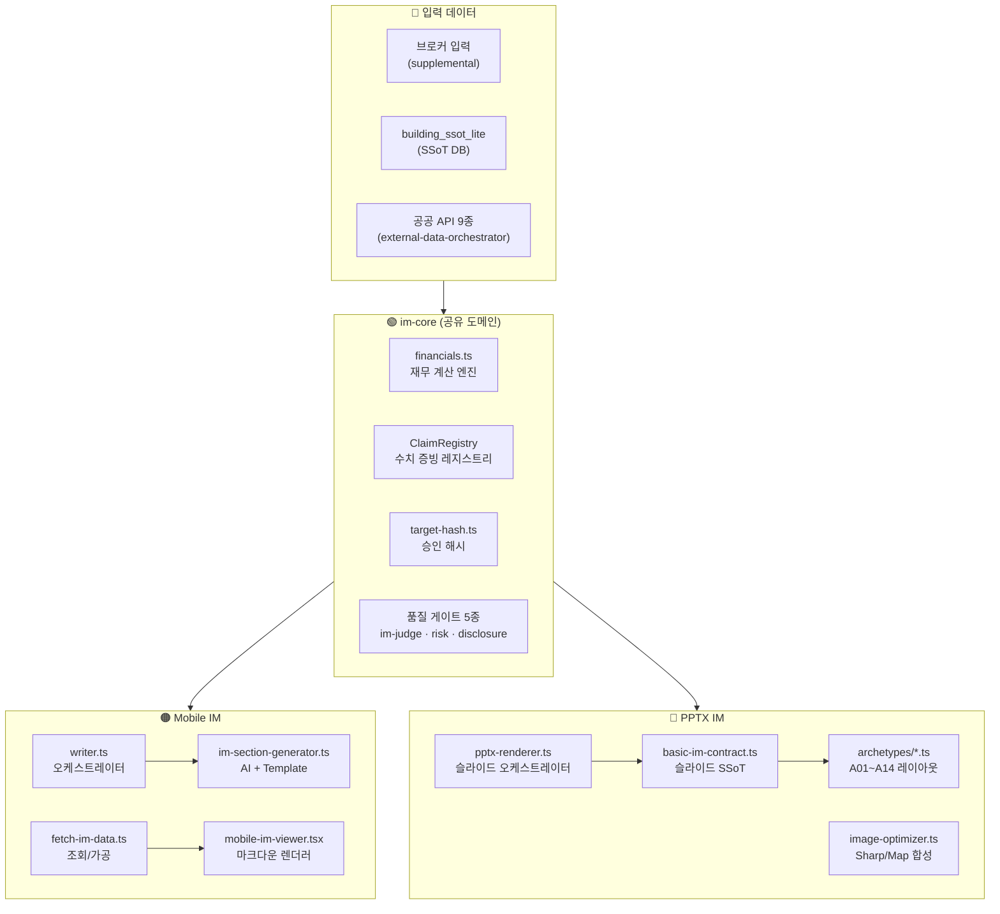
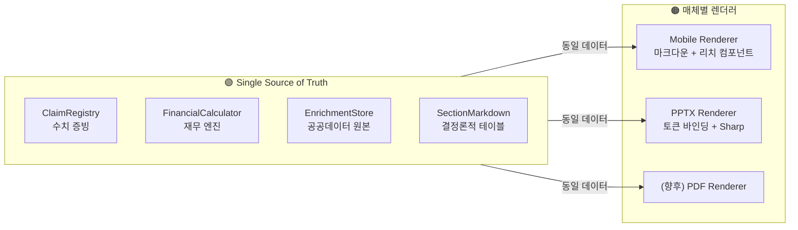

# IM 3계층 파이프라인 정밀 감사 보고서

> **감사일시**: 2026-09-25 20:22 KST  
> **범위**: im-core · Mobile IM Basic · PPTX IM Basic  
> **방법**: 3개 서브에이전트 병렬 코드베이스 탐색 → 교차 비교 분석

---

## 1. 3계층 아키텍처 개요



---

## 2. 데이터 소스 활용 비교 매트릭스

| 데이터 소스 | im-core | Mobile IM | PPTX IM | 정합성 |
|:---|:---:|:---:|:---:|:---:|
| **매매 희망가** (`asking_price_manwon`) | ✅ 계산 입력 | ✅ 마크다운 서술 | ✅ A01 표지 + A04 제원표 | ✅ 동일 |
| **월 임대료** (`monthly_rent_total_krw`) | ✅ NOI/Cap 계산 | ✅ 수익 테이블 | ✅ A23 수익률 수식 | ✅ 동일 |
| **층별 임대차** (`floor_leases`) | ✅ 공실률 계산 | ✅ 렌트롤 테이블 | ✅ A24 스태킹 플랜 | ⚠️ 경로 상이 |
| **건축물대장** (`buildingRegister`) | ✅ 면적/층수 | ✅ `body.enrichment` 참조 | ✅ `bindFromExternalData` 직접 참조 | ⚠️ 참조 경로 불일치 |
| **토지이용계획** (`landUsePlan`) | ✅ 용도지역 | ❌→✅ 필드 경로 수정됨 | ✅ A05 토지 제원표 | ⚠️ 수정 직후 |
| **공시지가** (`landPrice`) | ✅ 토지평당가 | ✅ 마크다운 서술 | ✅ A04 제원표 | ✅ 동일 |
| **실거래가** (`comparableTransactions`) | ✅ 비교 분석 | ✅ comparables 섹션 | ✅ A07 (Pro 전용) | ⚠️ Basic 제외 |
| **위치 POI** (`locationPoi`) | ✅ 역세권 판단 | ✅ 위치 섹션 서술 | ✅ A06 입지 다이어그램 | ✅ 동일 |
| **지적도** (`cadastralMapImage`) | — | ❌ 미구현 | ✅ A05 이미지 삽입 | ❌ PPTX만 |
| **카카오맵** (`coordinates`) | — | ⚠️ PhotoGallery만 | ✅ A06 Sharp 합성 | ⚠️ 매체별 상이 |
| **사진** (`photos`) | — | ✅ 갤러리 컴포넌트 | ✅ A14 그리드 레이아웃 | ✅ 동일 |
| **대출 시나리오** (`loan_amount_manwon`) | ✅ LTV/WACC 분기 | ✅ isBasicMode 게이팅 | ✅ Basic 제외 규칙 | ✅ 동일 |

---

## 3. 섹션 × 매체 생성/렌더링 비교

### 3-1. Mobile IM 섹션 매핑

| # | 섹션 (`section_type`) | 생성 방식 | 렌더링 컴포넌트 | PPTX 대응 |
|:---:|:---|:---|:---|:---|
| 1 | `investment_thesis` | AI 서사 | SectionCard(md) | A02 Summary |
| 2 | `buyer_persona_fit` | AI 서사 | SectionCard(md) | ❌ 없음 |
| 3 | `location_access` | AI + Template | SectionCard(md) | A06 Diagram |
| 4 | `building_spec` | AI + Template | SectionCard(md) | A04 Asymmetric |
| 5 | `land_detail` | AI + Template | SectionCard(md) | A05 토지정보 |
| 6 | `lease_status` | 정적 테이블 | SectionCard + StackingPlan | A24 Stacking |
| 7 | `income_analysis` | 정적 테이블 + AI | SectionCard(md) | A23 Formula |
| 8 | `risk_factors` | AI 서사 | SectionCard(md) | ❌ 없음 |
| 9 | `next_steps` | Template 고정 | SectionCard(md) | A10 Closing |
| 10 | `comparables` | Template/AI | SectionCard(md) | A07 (Pro만) |
| 11 | `checklist` | Template 고정 | SectionCard(md) | A10 내 면책 |
| 12 | `overview` | AI 서사 | SectionCard(md) | A04 개요 |
| 13 | `development_feasibility` | AI (개발형만) | SectionCard(md) | ❌ 없음 |
| 14 | `operating_analysis` | AI (운영형만) | SectionCard(md) | ❌ 없음 |

### 3-2. PPTX IM 슬라이드 매핑

| 슬라이드 | 아키타입 | 데이터 바인딩 | Mobile IM 대응 |
|:---|:---|:---|:---|
| A01 Cover | 표지 | `doc.title`, 매각가, 브로커 | Hero Card |
| A02 Summary | 요약 | `heroCard`, SSoT 지표 | `investment_thesis` |
| A04 물건개요 | Asymmetric | SSoT, 건축물대장, 사진 | `building_spec` + `overview` |
| A05 토지정보 | Asymmetric | 토지이용계획, 지적도 | `land_detail` |
| A06 입지정보 | Diagram | POI, 좌표, 지도이미지 | `location_access` |
| A24 렌트롤 | Stacking | `floor_leases` | `lease_status` |
| A23 수익률 | Formula | 임대료, Cap Rate | `income_analysis` |
| A14 사진 | Gallery | `photos` | PhotoGallery |
| A10 문의/유의 | Closing | 브로커, 면책조항 | `next_steps` + `checklist` |

---

## 4. 정합성 갭 분석 (7건)

| # | 갭 유형 | Mobile IM | PPTX IM | 위험도 | 근본 원인 |
|:---:|:---|:---|:---|:---:|:---|
| **G1** | 데이터 참조 경로 | `body.external_data` (메타만) | `body.enrichment` (원본) | 🔴 P0 | `handler.ts`에서 이중 저장 구조 |
| **G2** | 지적도 이미지 | ❌ 미구현 | ✅ Sharp 합성 | 🟡 P2 | `mobile-im-viewer`에 이미지 렌더러 없음 |
| **G3** | 카카오맵 렌더링 | PhotoGallery 첫 슬라이드만 | A06 서버사이드 합성+POI | 🟡 P2 | 모바일은 클라이언트 의존, PPTX는 서버 합성 |
| **G4** | 수치 생성 경로 | AI 서사 내 수치 (검증 어려움) | SSoT 직접 바인딩 (신뢰) | 🟠 P1 | Mobile은 LLM 의존, PPTX는 결정론적 |
| **G5** | 텍스트 예산 검증 | ❌ 없음 (스크롤 가능) | ✅ `validateTextBudgets` | 🟢 P3 | 매체 특성 차이 (허용) |
| **G6** | buyer_persona_fit | ✅ 전용 섹션 | ❌ 없음 | 🟢 P3 | 매체 최적화 (허용) |
| **G7** | 면책/Provenance | 마크다운 blockquote | 고정 법적 라벨 5종 | 🟠 P1 | 강도 차이 |

---

## 5. 품질 게이트 적용 비교

| 게이트 | im-core | Mobile IM | PPTX IM |
|:---|:---:|:---:|:---:|
| im-judge (LLM 품질 판정) | — | ✅ 3.0 미만 → 폴백 | ❌ AI 미사용 |
| CRE Quality Gate | — | ✅ High risk → 폴백 | ❌ |
| Risk Boundary Check | — | ✅ 금지어 치환 | ❌ |
| Disclosure Guard | — | ✅ PII 마스킹 | ❌ |
| Cross Validator | — | ✅ 섹션간 수치 검증 | ❌ |
| Publish Gates | ✅ 발행 차단 | ✅ | ✅ Grade D 차단 |
| Claim Validator | ✅ 수치 불변 | ✅ | ✅ |
| Text Budget Validator | — | ❌ | ✅ 오버플로우 차단 |
| Layout Validator | — | ❌ | ✅ 겹침 검증 |
| Approval Hash | ✅ 생성 | ✅ 검증 | ❌ 별도 해시 없음 |

---

## 6. 현 아키텍처의 핵심 문제점

### 🔴 P0: 데이터 이중 저장 구조 (G1)

```
handler.ts L691-717:
  body.external_data = { enrichedAt, hasPublicData, errors }  ← 메타데이터만
  body.enrichment    = { landUsePlan, buildingRegister, ... } ← 원본 데이터

PPTX: body.enrichment 직접 참조 → ✅ 정상
Mobile: body.external_data 참조 → ❌ 원본 없음 (이번 세션에 수정)
```

> **근본 원인**: 생성 시점에 PPTX용 데이터와 Mobile용 메타데이터를 **별도 경로**에 저장.  
> **해결 방안**: `body.enrichment` 단일 경로로 통합. `external_data`는 메타데이터 전용으로 역할 명확화.

### 🟠 P1: 수치 생성 경로 이원화 (G4)

```
Mobile IM:  calculateFinancials() → formatFinancialsMarkdown() 
            → AI 프롬프트 context로 전달 → LLM이 서사 생성 시 수치 재서술
            → 환각(Hallucination) 위험

PPTX IM:    calculateFinancials() → ClaimRegistry 
            → dataMap 토큰 바인딩 → 결정론적 슬라이드 삽입
            → 수치 안전
```

> **근본 원인**: Mobile IM은 "서사형" 콘텐츠를 위해 AI에 수치를 context로 전달하여 자연어 재서술을 요청. PPTX는 토큰 바인딩으로 수치를 직접 삽입.  
> **해결 방안**: Mobile IM의 **수치 테이블**은 `formatFinancialsMarkdown()`의 결정론적 마크다운을 직접 사용하고, **서사 본문**만 AI 생성.

---

## 7. 매체 최적화 아키텍처 제안

### 목표: 정합성 · 연계성 · 기술안정성



### 3단계 구현 로드맵

#### Phase 1: 데이터 경로 통합 (1주)
| 작업 | 파일 | 효과 |
|:---|:---|:---|
| `body.enrichment` 단일 경로 통합 | `handler.ts`, `fetch-im-data.ts` | G1 해소 |
| `ExternalDataSnapshot` 타입 = `LandUsePlanData` 직접 참조 | `types.ts` | 타입 불일치 해소 |
| `formatFinancialsMarkdown()` 결과를 DB에 캐시 | `handler.ts` | 수치 불변 보장 |

#### Phase 2: 렌더링 분리 계층 도입 (2주)
| 작업 | 파일 | 효과 |
|:---|:---|:---|
| `SectionDataProvider` 추상 계층 도입 | 새 파일 | Mobile/PPTX 동일 데이터 보장 |
| Mobile IM `location_access`에 지도 컴포넌트 삽입 | `mobile-im-viewer.tsx` | G2, G3 해소 |
| 면책 조항 강도 통일 (법적 라벨 5종 → 양 매체 동일) | `premium-template-engine.ts`, `basic-im-contract.ts` | G7 해소 |

#### Phase 3: 매체 최적화 (3주)
| 작업 | 설명 | 효과 |
|:---|:---|:---|
| Mobile 전용: 인터랙티브 차트 (DCF Heatmap, Leverage) | 스크롤+터치 인터랙션 | 모바일 UX 극대화 |
| PPTX 전용: 인쇄용 고해상도 + 워터마크 | Sharp 서버사이드 최적화 | 오프라인 PT 최적화 |
| 공유: Claim 기반 수치 일관성 자동 검증 CI | GitHub Actions | 회귀 방지 |

### 핵심 원칙

> [!IMPORTANT]
> **"하나의 수치, 하나의 출처, 매체별 표현"**
> 
> 1. **수치(Claim)**: im-core `ClaimRegistry`에서 1회 계산 → 양 매체 바인딩
> 2. **서사(Narrative)**: Mobile만 AI 생성 (PPTX는 토큰 바인딩)
> 3. **시각(Visual)**: 매체 특성에 맞게 독립 렌더링 (스크롤 vs 지면)
> 4. **검증(Gate)**: im-core 공유 게이트 + 매체별 추가 게이트

---

## 8. 결론

| 축 | 현재 | 목표 |
|:---|:---|:---|
| **정합성** | 데이터 이중 저장, 필드 경로 불일치 | 단일 enrichment 경로 + Claim 바인딩 |
| **연계성** | Mobile과 PPTX가 별도 데이터 소스 참조 | `SectionDataProvider` 공유 추상 계층 |
| **기술안정성** | AI 서사 내 수치 환각 위험 | 결정론적 테이블 + AI 서사 분리 |
| **매체 최적화** | 양 매체 동일한 마크다운 시도 | 매체별 렌더러 독립 (인터랙티브 vs 인쇄) |
