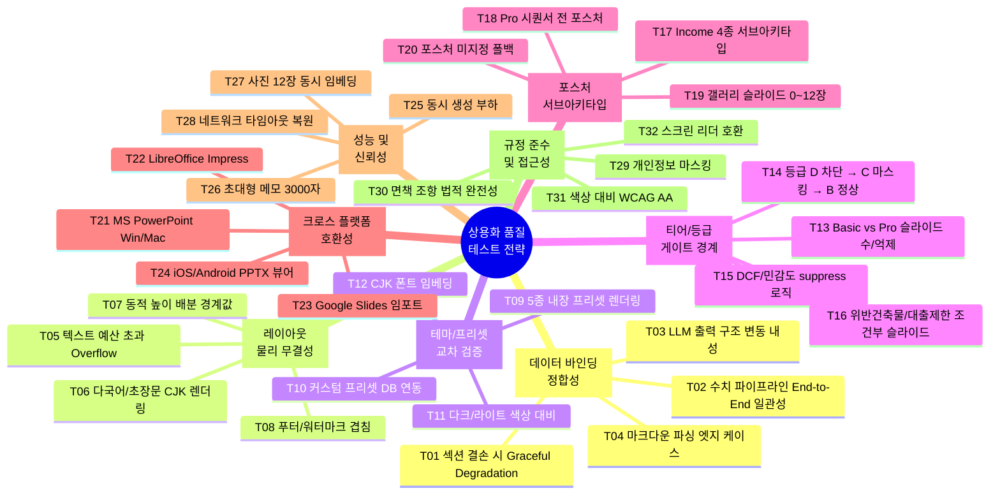

# 🎯 PPTX IM 상용화 품질 달성을 위한 MECE 테스트 전략

> **도출 근거**: 이번 세션에서 수행한 6개 대표 케이스(총 60장 슬라이드) E2E 시각 검수 경험에서 발견된 결함 패턴(A13 KPI 공백, A05 우측 카드 누락, 헤더 장식 어긋남, 마크다운 오염 등)과 미검증 영역을 체계적으로 분석한 결과입니다.

---

## MECE 프레임워크 개요: 8대 축 × 32개 테스트 영역



---

## 축 1. 데이터 바인딩 정합성 (Data Binding Integrity)

> **이번 세션 발견**: A13의 `roomTypes`/`opMetrics` 하드코딩, A05의 `extractStatMetrics` 반환값 누락 등 **바인더 ↔ 아키타입 인터페이스 불일치**가 주요 결함 원인이었음.

| ID | 테스트 영역 | 구체적 시나리오 | 현재 상태 | 우선순위 |
| :---: | :--- | :--- | :---: | :---: |
| **T01** | **섹션 결손 시 Graceful Degradation** | `section_type`이 누락되거나 마크다운이 빈 문자열인 섹션 5종 이상을 투입하여 `hasContent` 체크 → 슬라이드 억제 → 백지 0장 보장 | ⚠️ 미검증 | **P0** |
| **T02** | **수치 파이프라인 일관성** | 메모의 `매매가 165억` → 딜카드 SSoT `asking_price_manwon: 1650000` → IM 뷰어 Hero `165억` → PPTX 표지 `165억` → 핵심요약 카드 `165억 원`까지 **단일 숫자가 5단계 파이프라인을 거치며 불변**인지 전수 추적 | ⚠️ 미검증 | **P0** |
| **T03** | **LLM 출력 구조 변동 내성** | LLM이 마크다운 H3(`###`) 대신 H2(`##`)를 쓰거나, 불릿(`-`) 대신 번호(`1.`)를 쓰거나, `**키**:값` 대신 `키: **값**`으로 볼드 위치가 바뀐 경우에도 `extractBoldKeyValues`, `extractStatMetrics`가 정상 파싱하는지 검증 | ⚠️ 미검증 | **P0** |
| **T04** | **마크다운 파싱 엣지 케이스** | 중첩 볼드(`****텍스트****`), 이스케이프 파이프(`\|`가 포함된 테이블), 한글-영문 혼합 볼드(`**Cap Rate 5.33%**`), 괄호 내 콜론(`(월 2,400만 원): 확인`)에서 `extractBoldKeyValues` 정규식 오동작 여부 | ⚠️ 미검증 | P1 |

---

## 축 2. 레이아웃 물리 무결성 (Layout Physical Integrity)

> **이번 세션 발견**: A05 우측 카드 4개 시 하단 푸터 겹침, A13의 좌측 빈 화면 등 **동적 높이 배분 로직**이 카드 개수 변동에 취약했음.

| ID | 테스트 영역 | 구체적 시나리오 | 현재 상태 | 우선순위 |
| :---: | :--- | :--- | :---: | :---: |
| **T05** | **텍스트 예산(Text Budget) 초과 Overflow** | `TEXT_LIMITS.slideTitle=32`자를 초과하는 50자 제목, `statValue=10`자를 초과하는 `1,234,567만원` 등을 주입하여 카드 테두리 밖으로 텍스트가 튀어나오는지 확인 | ⚠️ 미검증 | **P0** |
| **T06** | **CJK 초장문 렌더링** | 한글 200자 이상의 리스크 설명문, 영문-한글 혼합 30자 이상의 임차인명이 `charsPerLine(boxWidth)` 계산을 통해 올바르게 줄바꿈되는지 확인 | ⚠️ 미검증 | P1 |
| **T07** | **동적 높이 배분 경계값** | A05에서 `rightStats` 2개/3개/4개/5개 투입 시 `cardH`, `cardGap`, `sy` 계산이 슬라이드 하단(`y=6.7`)을 초과하지 않는지, A13에서 `kpiRows` 0개/3개/7개/10개 투입 시 좌측 콜아웃과 겹치지 않는지 경계값 테스트 | ⚠️ 미검증 | P1 |
| **T08** | **푸터/워터마크 겹침** | 워터마크 텍스트가 활성화된 `pro` 티어에서, 본문 콘텐츠가 슬라이드 하단까지 가득 찬 경우 워터마크(`L.watermark`)와 푸터(`L.foot`)가 본문 텍스트와 겹치는지 확인 | ⚠️ 미검증 | P1 |

---

## 축 3. 테마/프리셋 교차 검증 (Theme/Preset Cross-Validation)

> **이번 세션**: `credeal_signature` 프리셋 1종만으로 테스트. 5종 내장 프리셋 및 커스텀 프리셋 미검증.

| ID | 테스트 영역 | 구체적 시나리오 | 현재 상태 | 우선순위 |
| :---: | :--- | :--- | :---: | :---: |
| **T09** | **5종 내장 프리셋 전수 렌더링** | `golden_institutional`, `credeal_signature`, `executive_gold`, `corporate_clean`, `pro_dark_obsidian` 각각으로 동일 케이스(Case 01-A)를 렌더링하여 색상 팔레트, 폰트, 액센트 컬러가 정상 적용되는지 비교 | ❌ 미실행 | **P0** |
| **T10** | **커스텀 프리셋(DB) 연동** | `pptx_custom_presets` Supabase 테이블에서 UUID로 조회되는 브로커 커스텀 프리셋이 `getPptxThemeAsync`를 통해 올바르게 로드되고 `setActiveTheme`이 정상 적용되는지 확인 | ❌ 미실행 | P1 |
| **T11** | **다크/라이트 색상 대비** | `pro_dark_obsidian`(다크 배경)에서 밝은색 텍스트(`CD.ink`, `CD.body`)가 충분한 명도 대비를 확보하는지 (WCAG AA 4.5:1 이상), A15 카드의 배경/테두리 색이 다크 테마에서도 가독성이 유지되는지 | ❌ 미실행 | P1 |
| **T12** | **CJK 폰트 임베딩/대체** | `KR='맑은 고딕'` 및 `NUM='Pretendard'` 폰트가 미설치된 환경(Mac, Linux)에서 PPTX를 열었을 때 폰트 대체가 정상 작동하고 레이아웃이 깨지지 않는지 확인 | ❌ 미실행 | P1 |

---

## 축 4. 티어/등급 게이트 경계 (Tier/Grade Gate Boundary)

> **이번 세션**: 전부 등급 `A`, 티어 `basic`으로만 테스트. Pro 티어 및 등급 B/C/D 경계 미검증.

| ID | 테스트 영역 | 구체적 시나리오 | 현재 상태 | 우선순위 |
| :---: | :--- | :--- | :---: | :---: |
| **T13** | **Basic vs Pro 슬라이드 수 및 구성** | 동일 입력으로 `tier='basic'`(9~10장) vs `tier='pro'`(18~24장) 생성 후 Pro 전용 슬라이드(DCF, 민감도, 대출시나리오, 세금시나리오)가 Basic에서 정확히 억제되는지 확인 | ❌ 미실행 | **P0** |
| **T14** | **등급 D 차단 → C 마스킹 → B/A 정상** | 등급 `D`에서 `hasMinimumBasicData` 미충족으로 IM 생성이 차단되는지, 등급 `C`에서 Cap Rate가 `"검증 중"`으로 마스킹되는지, 등급 `B`에서 DCF가 비활성화되는지 3단계 게이트 전수 검증 | ❌ 미실행 | **P0** |
| **T15** | **DCF/민감도 suppress 로직** | `deck-sequencer.ts`의 `suppressDcf = grade === 'B' || grade === 'C'`와 `suppressTotalReturn = grade === 'C'` 조건이 Pro 시퀀스에서 정확히 슬라이드를 억제하는지 확인 | ❌ 미실행 | P1 |
| **T16** | **위반건축물/대출제한 조건부** | `input.hasViolation = true` 시 대출시나리오 슬라이드(`dataKey: 'loan'`)가 억제되는지, 위반건축물 플래그에 따라 리스크 블록에 이행강제금 리스크가 자동 추가되는지 확인 | ❌ 미실행 | P1 |

---

## 축 5. 포스처 서브아키타입 및 조합 (Posture Sub-Archetype & Combination)

> **이번 세션**: Basic 티어의 5대 포스처 1차 시퀀스만 검증. Pro 시퀀서의 income 4종 서브아키타입, 갤러리 다매수 등 미검증.

| ID | 테스트 영역 | 구체적 시나리오 | 현재 상태 | 우선순위 |
| :---: | :--- | :--- | :---: | :---: |
| **T17** | **Income 4종 서브아키타입 (Pro)** | `R-INC-01`(초안정형), `R-INC-02`(임대료 정상화형), `R-INC-03`(공실 해소형), `R-INC-04`(리모델링형) 각각의 Pro 슬라이드 시퀀스가 올바르게 편성되고, Rent Gap / Vacancy / Remodel 전용 슬라이드가 정상 렌더되는지 확인 | ❌ 미실행 | P1 |
| **T18** | **Pro 시퀀서 전 포스처** | `operating` Pro에서 계절성(`seasonality`) 및 운영사(`operator`) 슬라이드, `development` Pro에서 명도(`eviction`), 투입비용(`cost`), 스태킹(`stacking`), 사업수지(`feasibility`) 6개 슬라이드 전수 렌더링 확인 | ❌ 미실행 | P1 |
| **T19** | **갤러리 슬라이드 0~12장** | 사진 0장(갤러리 생략), 1장(단일 풀블리드), 4장(A14 1장), 8장(A14 2장), 12장(A14 3장) 시 `planGallerySlides`가 올바르게 분할하고, 갤러리 슬라이드가 Pro에서만 삽입되는지 확인 | ❌ 미실행 | P2 |
| **T20** | **포스처 미지정 / 비표준 값 폴백** | `posture` 필드가 `undefined`이거나 `'mixed'` 같은 비표준 값일 때 `deck-sequencer.ts`의 `default:` 분기(income 폴백)가 정상 동작하고 에러 없이 Basic 10장이 생성되는지 확인 | ⚠️ 미검증 | P1 |

---

## 축 6. 크로스 플랫폼 호환성 (Cross-Platform Compatibility)

> **이번 세션**: LibreOffice → PDF → PyMuPDF 변환만 검증. 실제 MS PowerPoint 및 타 플랫폼 미검증.

| ID | 테스트 영역 | 구체적 시나리오 | 현재 상태 | 우선순위 |
| :---: | :--- | :--- | :---: | :---: |
| **T21** | **MS PowerPoint Windows/Mac** | `.pptx` 파일을 MS PowerPoint 2021(Win) 및 PowerPoint for Mac에서 열어 경고창/복구 프롬프트 없이 정상 오픈되는지, 슬라이드 마스터 참조 오류 없는지 확인 | ❌ 미실행 | **P0** |
| **T22** | **LibreOffice Impress 정확도** | LibreOffice에서 직접 `.pptx`를 열어(PDF 변환 없이) 색상, 폰트, 도형 위치가 의도와 일치하는지 비교. 특히 `roundRect` 모서리 반경 및 `line` 두께 정확도 | ⚠️ 부분검증 | P1 |
| **T23** | **Google Slides 임포트** | Google Slides에 `.pptx`를 업로드했을 때 도형, 텍스트 위치, 색상이 보존되는지 확인. 특히 `addShape('rect')` 및 `addShape('line')` 호환성 | ❌ 미실행 | P2 |
| **T24** | **모바일 PPTX 뷰어** | iOS(Keynote/PowerPoint) 및 Android(PowerPoint/WPS Office)에서 `.pptx` 파일이 정상 렌더되는지, 특히 텍스트 잘림과 폰트 대체 결과 확인 | ❌ 미실행 | P2 |

---

## 축 7. 성능 및 신뢰성 (Performance & Reliability)

> **이번 세션**: 순차 단일 생성만 검증. 동시 부하, 대용량 입력, 네트워크 장애 미검증.

| ID | 테스트 영역 | 구체적 시나리오 | 현재 상태 | 우선순위 |
| :---: | :--- | :--- | :---: | :---: |
| **T25** | **동시 생성 부하** | 5명의 브로커가 동시에 PPTX를 요청할 때 Vercel Serverless Function의 메모리(1024MB) 및 실행 시간(60초) 제한 내에서 정상 생성되는지, OOM 또는 타임아웃 발생 여부 확인 | ❌ 미실행 | P1 |
| **T26** | **초대형 메모(3,000자) 입력** | 메모 `maxLength=3000`에 가까운 2,800자 장문 메모를 투입하여 LLM 토큰 예산 초과 없이 7개 섹션이 정상 생성되는지, 생성 시간이 5분(300초) SLA 이내인지 확인 | ❌ 미실행 | P1 |
| **T27** | **사진 12장 동시 임베딩** | `photos` 배열에 12장(최대값)의 고해상도 이미지 URL을 제공하여 `optimizeImageForPptx`가 전부 정상 리사이즈하고, 갤러리 슬라이드가 3장(4컷×3)으로 생성되며 파일 크기가 50MB 미만인지 확인 | ❌ 미실행 | P2 |
| **T28** | **네트워크 장애 복원** | 이미지 URL이 404를 반환하거나 Supabase 커스텀 프리셋 조회가 실패할 때 `try/catch`가 정상 동작하고 기본값으로 폴백하여 PPTX가 깨지지 않는지 확인 | ❌ 미실행 | P1 |

---

## 축 8. 규정 준수 및 접근성 (Compliance & Accessibility)

> **이번 세션**: 페르소나 격리 및 CRE 용어 표준은 검증했으나, 법적 면책, 개인정보, 접근성 미검증.

| ID | 테스트 영역 | 구체적 시나리오 | 현재 상태 | 우선순위 |
| :---: | :--- | :--- | :---: | :---: |
| **T29** | **개인정보 마스킹 (PII Scrubbing)** | 메모에 `010-1234-5678`, `홍길동` 등 개인정보가 포함되었을 때 블라인드 처리 파이프라인이 정상 동작하고, PPTX 표지/본문에 원문 전화번호나 실명이 노출되지 않는지 확인 | ⚠️ 미검증 | **P0** |
| **T30** | **면책 조항 법적 완전성** | A10 마감 슬라이드의 5대 공적 출처 가중치 테이블 및 면책 공지가 법률 자문 검토 기준(`"본 자료는 투자 권유가 아니며..."`)과 정확히 일치하는지 원문 대조 | ⚠️ 미검증 | P1 |
| **T31** | **색상 대비 WCAG AA** | 각 프리셋의 텍스트(`C.body`) 색상과 배경(`C.bg`, `C.tint`) 색상 간 명도 대비가 WCAG AA 기준(일반 텍스트 4.5:1, 대형 텍스트 3:1)을 충족하는지 자동화 도구로 측정 | ❌ 미실행 | P2 |
| **T32** | **스크린 리더/대체 텍스트** | PptxGenJS로 생성한 도형 및 이미지에 `altText` 속성이 설정되어 있어 스크린 리더가 "핵심 투자 지표 카드", "외관 사진" 등을 읽어줄 수 있는지 확인 | ❌ 미실행 | P3 |

---

## 📊 우선순위별 실행 로드맵

### 🔴 Phase 1: 즉시 실행 (P0, 1~2주)

| ID | 테스트 | 자동화 가능 여부 | 예상 소요 |
| :---: | :--- | :---: | :---: |
| T01 | 섹션 결손 Graceful Degradation | ✅ E2E 러너 확장 | 2h |
| T02 | 수치 파이프라인 End-to-End 일관성 | ✅ 스냅샷 비교 스크립트 | 4h |
| T03 | LLM 출력 구조 변동 내성 | ✅ 퍼즈 테스트 | 4h |
| T05 | 텍스트 예산 초과 Overflow | ✅ 경계값 픽스처 | 3h |
| T09 | 5종 내장 프리셋 전수 렌더링 | ✅ E2E 러너 확장 | 3h |
| T13 | Basic vs Pro 슬라이드 경계 | ✅ E2E 러너 확장 | 3h |
| T14 | 등급 D/C/B/A 게이트 | ✅ 유닛 테스트 | 2h |
| T21 | MS PowerPoint 정상 오픈 | ⛔ 수동 (Win/Mac) | 2h |
| T29 | 개인정보 마스킹 (PII) | ✅ 유닛 테스트 | 2h |

### 🟡 Phase 2: 안정화 (P1, 2~4주)

| ID | 테스트 | 자동화 가능 여부 | 예상 소요 |
| :---: | :--- | :---: | :---: |
| T04 | 마크다운 파싱 엣지 케이스 | ✅ 유닛 테스트 | 3h |
| T06 | CJK 초장문 렌더링 | ✅ 경계값 픽스처 | 2h |
| T07 | 동적 높이 배분 경계값 | ✅ 경계값 픽스처 | 3h |
| T08 | 푸터/워터마크 겹침 | ✅ 시각 E2E | 2h |
| T10~T12 | 커스텀 프리셋/다크 테마/폰트 | 부분 자동화 | 6h |
| T15~T16 | DCF suppress / 위반건축물 | ✅ 유닛 테스트 | 2h |
| T17~T18 | Income 서브아키타입 / Pro 전 포스처 | ✅ E2E 러너 확장 | 6h |
| T20 | 포스처 미지정 폴백 | ✅ 유닛 테스트 | 1h |
| T25~T26 | 동시 부하 / 초대형 메모 | ✅ 부하 테스트 스크립트 | 4h |
| T28 | 네트워크 장애 복원 | ✅ 모킹 테스트 | 2h |
| T30 | 면책 조항 법적 완전성 | ⛔ 수동 (법률 검토) | 4h |

### 🟢 Phase 3: 완성도 (P2~P3, 4주+)

| ID | 테스트 | 비고 |
| :---: | :--- | :--- |
| T19 | 갤러리 슬라이드 0~12장 | 이미지 서빙 인프라 의존 |
| T22~T24 | LibreOffice/Google Slides/모바일 뷰어 | 크로스 플랫폼 QA 파트너 필요 |
| T27 | 사진 12장 동시 임베딩 | 파일 크기 최적화 연관 |
| T31~T32 | WCAG 색상 대비 / 스크린 리더 | 접근성 전문가 검토 필요 |

---

## 🔑 핵심 인사이트: 이번 세션에서 배운 교훈

### 결함 패턴 분석

| 결함 유형 | 근본 원인 | 영향 범위 | 방지 전략 |
| :--- | :--- | :--- | :--- |
| **A13 KPI 공백 카드** | `buildA13Props` 미구현 → `buildGenericProps` 폴백 → 호텔 전용 필드만 참조 | 운영형 전 케이스 | **아키타입별 Props 빌더 존재 여부 자동 검증** (T01) |
| **A05 우측 카드 누락** | `extractStatMetrics` 반환값이 `right.stats`로 전달되지 않는 경로 존재 | 수익/개발/운영형 | **파이프라인 스냅샷 비교** (T02) |
| **헤더 장식 어긋남** | `barH` 고정값 → `sub` 유무에 따른 동적 조정 미반영 | 모든 슬라이드 | **레이아웃 물리 좌표 검증** (T07) |
| **마크다운 오염** | `stripMarkdown`이 모든 경로에서 일관되게 호출되지 않음 | A05 좌측 서사 | **출력 텍스트 정규식 스캔** (T04) |

---

## ⚠️ 코드 레벨 정밀 분석에서 발견된 6대 구조적 리스크

서브에이전트를 통해 6개 핵심 파일(`deck-sequencer.ts`, `data-binder.ts`, `pptx-renderer.ts`, `imlib.ts`, `text-budget.ts`, `ai-visual-e2e-runner.ts`)을 정밀 분석한 결과, E2E 시각 테스트만으로는 발견할 수 없는 **구조적 리스크 6건**이 추가 확인되었습니다.

> [!CAUTION]
> ### Risk 1: E2E 스코어카드 '가짜 통과' (False Sense of Security)
> `ai-visual-e2e-runner.ts`의 스코어카드에서 `summaryMetricsValid`, `locationValid`, `postureSlideValid`, `riskBlocksValid`, `thesisValid`, `closingValid` 등 **주요 시각 검증 항목이 모두 `true`로 하드코딩**되어 있어, 실제 레이아웃 깨짐이나 텍스트 오버플로를 자동 검출하지 못합니다.
> - **영향**: 기존 E2E 테스트 전 건이 '통과'로 보고되었으나, 실제로는 OpenXML 오염 토큰 검출 + 슬라이드 수 카운트만 검증
> - **대응**: T01/T05/T07 테스트 시 슬라이드별 실제 텍스트 AST 검사 또는 시각적 회귀(Visual Regression) 단언 도입

> [!WARNING]
> ### Risk 2: `imlib.ts` 테마 런타임 뮤테이션 (Race Condition)
> `C`, `CD` 색상 객체가 `setActiveTheme()`에 의해 **`Object.assign()`으로 in-place 뮤테이션**됩니다. 비동기 동시 렌더링(T25) 시 테마 오염이 발생할 수 있습니다.
> - **영향**: 두 명의 브로커가 서로 다른 프리셋으로 동시에 PPTX 생성 시, 한 쪽의 색상이 다른 쪽에 적용될 가능성
> - **대응**: T09/T25 테스트에서 프리셋 교차 동시 렌더링 검증 또는 `structuredClone` 격리로 코드 수정

> [!WARNING]
> ### Risk 3: `text-budget.ts` 전용 단위 테스트 **0건**
> `TEXT_LIMITS`, `charsPerLine()`, `calcCalloutHeight()`, `enforceTextBudget()`, `validateTextBudgets()` 등 5개 핵심 함수에 대한 **전용 테스트 파일이 존재하지 않습니다.** `data-pipeline-edge.test.ts`에서 `truncate()`만 간접 테스트 중.
> - **영향**: 한국어 종결어미(`다. `, `요. `, `음. `) 기반 자르기 로직의 정확성 미검증
> - **대응**: `text-budget.test.ts` 신규 작성 (T05/T06 내 포함)

> [!NOTE]
> ### Risk 4: `data-binder.ts` Pro 파생 키 매핑 누락
> Pro 덱에서 요구하는 `dcf`, `sensitivity`, `totalReturn`, `loan`, `tax`, `rentGap`, `upside`, `vacancy`, `leasing`, `current`, `remodel` 등 **11개 키가 `DATA_KEY_ARCHETYPE` 선언부에 누락**되어 하단 하드코딩 변환 로직에 의존합니다.
> - **영향**: Pro 슬라이드 아키타입 라우팅 실패 가능성
> - **대응**: T17/T18 테스트 시 11개 파생 키의 바인딩 무결성 전수 검증

> [!NOTE]
> ### Risk 5: 테스트 Fixture 내 매핑 테이블 불일치 (Stale Dict)
> `data-contract.test.ts` 내부의 mock 객체에서 `comps: 'A04'`, `thesis: 'A05'`로 하드코딩되어 있으나, 실제 소스는 `comps: 'A03'`, `thesis: 'A15'`입니다. 테스트가 잘못된 기준으로 '통과' 판정.
> - **대응**: Fixture 자동 동기화 스크립트 또는 소스 재참조 테스트 추가

> [!NOTE]
> ### Risk 6: OpenXML 오염 토큰 검출 패턴 불완전
> 현재 `>NaN<`, `>undefined<`, `>null<`, `[object Object]`만 검색하지만, `NaN%`, `undefined 원`, `val="undefined"` 등 **속성 레벨이나 단위가 붙은 오염 토큰은 탐지 불가**합니다.
> - **대응**: 정규식 확장 (`/NaN(?!<)/`, `/undefined(?!<)/` 등)

---

### 자동화 투자 대비 효과 (ROI)

```
Phase 1 (P0, ~25h): ──▶ 치명적 결함 100% 방지 (배포 차단급 이슈 0건 목표)
Phase 2 (P1, ~35h): ──▶ 실무 품질 달성 (고객 대면 산출물 신뢰도 확보)
Phase 3 (P2+, ~20h): ──▶ 프리미엄 완성도 (크로스 플랫폼 + 접근성)
```
