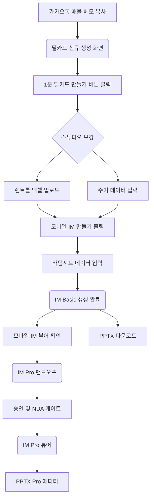

# 매각 딜카드 · IM 상용화 테스트 — 준비 가이드
> 대상: 제이에스부동산중개(주) 테스터
> 환경: Production (https://cre-dealcard.vercel.app)
> 범위: 매각 딜카드 → 모바일 IM Basic/Pro → PPTX Basic/Pro
> 테스트 방식: 화면 직접 조작 (API 호출 없음)

## 1. 테스트 범위 및 목적
이 가이드는 CREDEAL 플랫폼의 핵심 기능인 **매각(Sale) 딜카드와 IM(Investment Memorandum) 생성 파이프라인**을 검증하기 위한 준비 문서입니다.
- **포함 범위**: 매각 물건에 대한 딜카드 생성, 스튜디오 보강, IM Basic 및 Pro 생성, 모바일 뷰어 확인, PPTX 다운로드 및 편집
- **제외 범위**: 임대 딜카드, 펀딩, 매칭, 시장 인텔리전스 등
- **목적**: 5가지 투자 포스처(수익형, 자가사용형, 개발형, 운영형, 단기매매형)별 실제 매각 시나리오를 바탕으로 파이프라인 전 구간이 정상 작동하는지 확인합니다.
- **파이프라인 흐름**: 카톡 메모 입력 → 딜카드 생성 → 스튜디오 보강 → IM Basic 생성 → 모바일 뷰어 → PPTX 다운로드 → IM Pro 핸드오프 → Pro 뷰어 → PPTX Pro 에디터

## 2. 테스트 환경
- **프로덕션 URL**: [https://cre-dealcard.vercel.app](https://cre-dealcard.vercel.app)
- **PC 브라우저**: Chrome 120+ (필수), Safari 17+ (권장)
- **모바일 디바이스**: iPhone 15 (Safari) 또는 Galaxy S24 (Chrome)
- **PowerPoint 뷰어**: MS Office 또는 Google Slides
- **네트워크**: 안정적인 WiFi 환경

## 3. 테스트 계정
테스트를 위해 아래의 두 가지 계정이 제공됩니다.

| 역할 | 이메일 | 비밀번호 | 티어 | 용도 |
|:---|:---|:---|:---:|:---|
| 시니어 중개인 | broker-senior@credeal-test.com | Test!2026Sr | Pro | 전체 테스트 진행 |
| 신규 중개인 | broker-new@credeal-test.com | Test!2026New | Free | 티어별 제한 기능 확인 |

## 4. 로그인 방법
1. PC 또는 모바일 브라우저에서 [https://cre-dealcard.vercel.app](https://cre-dealcard.vercel.app)에 접속합니다.
2. 화면 중앙 또는 우측 상단의 **[로그인]** 버튼을 클릭합니다.
3. 이메일 입력란에 위의 테스트 계정(예: `broker-senior@credeal-test.com`)을 입력합니다.
4. 비밀번호 입력란에 비밀번호를 입력합니다.
5. **[로그인]** 버튼을 클릭합니다.
6. 로그인 성공 시 메인 대시보드 화면이 나타나는지 확인합니다. 📸 (로그인 완료 화면 캡처)

## 5. 엑셀(xlsx) 렌트롤 템플릿 다운로드
다중 임차인 데이터 입력 테스트(P1, P5)를 위해 렌트롤 엑셀 템플릿이 필요합니다.
1. 상단 메뉴에서 **[스튜디오]** → **[임대(Lease)]** 탭으로 이동합니다.
2. 화면 중앙 우측의 **[엑셀 템플릿 다운로드]** 버튼을 클릭합니다.
3. 내 컴퓨터에 `rentroll_template.xlsx` 파일이 다운로드되었는지 확인합니다.
4. 해당 엑셀 파일을 열어 미리 데이터 입력을 준비합니다.

## 6. 5개 포스처별 테스트 물건 소개
아래의 물건 데이터를 복사하여 테스트 시나리오에 활용하십시오.

### P1. 임대수익형 (income) — 당산동 근생빌딩 80억
- **설명**: 안정적인 임대 수익을 창출하는 상업용 부동산
- **가상 물건 요약**: 당산동 역세권, 안정적 수익이 나오는 6층 근생빌딩 (매가 80억)
- **메모 텍스트 (복사용)**:
```text
당산동5가 근생빌딩 대지 120평 연면적 450평 6층 엘리베이터 있음 2005년 준공
공실 1층만 비어있고 나머지 만실 월 수입 3200만원
1층 카페 보증금 3000만 월 180만, 2층 학원 보증금 5000만 월 250만
3-4층 사무실 보증금 각 3000만 월 200만, 5-6층 주거 보증금 각 2000만 월 150만
매도 호가 80억 협의 가능 급매
건물주 해외이민 계획으로 급매
```
- **렌트롤 데이터 (엑셀용)**:
| 층 | 용도 | 보증금 | 월세 | 상태 |
|:---|:---|:---|:---|:---|
| 1층 | 상가(카페) | 30,000,000 | 1,800,000 | 공실(예정) |
| 2층 | 학원 | 50,000,000 | 2,500,000 | 사용중 |
| 3층 | 사무실 | 30,000,000 | 2,000,000 | 사용중 |
| 4층 | 사무실 | 30,000,000 | 2,000,000 | 사용중 |
| 5층 | 주거 | 20,000,000 | 1,500,000 | 사용중 |
| 6층 | 주거 | 20,000,000 | 1,500,000 | 사용중 |
- **바텀시트 보충 데이터**: 월 임대료 `3200만`, 공실률 `16.7%`, 매도호가 `80억`

### P2. 자가사용형 (owner_occupied) — 서초동 사옥 200억
- **설명**: 매수자가 직접 사옥으로 사용할 목적으로 구매하는 부동산
- **가상 물건 요약**: 서초동 역세권, 사옥용으로 적합한 7층 빌딩 (매가 200억)
- **메모 텍스트 (복사용)**:
```text
서초구 서초동 사옥용 빌딩 매물
대지 300평 연면적 1200평 지하1층 지상7층 2015년 준공
현재 전층 단일 임차인(IT기업) 사용 중이나 2027년 3월 계약만료 예정
매도 호가 200억 네고 가능
역삼역 도보 5분 강남대로 접면
주차 25대 EV 2대
매수자가 직접 사옥으로 사용하길 원함
전층 인테리어 리모델링 필요
```
- **렌트롤 데이터**: 단일 임차인이므로 직접 입력 (엑셀 불필요)
- **바텀시트 보충 데이터**: 월 임대료 `0` (사옥전환), 매도호가 `200억`

### P3. 개발형 (development) — 합정동 개발용지 150억
- **설명**: 건물을 철거하고 신축할 목적으로 매매되는 토지 및 노후 건물
- **가상 물건 요약**: 합정동 역세권 노후 건물, 즉시 철거 및 개발 가능 용지 (매가 150억)
- **메모 텍스트 (복사용)**:
```text
마포구 합정동 개발용지 대지 250평 현재 노후 근생 2층 건물
1978년 준공 건물 노후 심각 철거 예정
용적률 법정 350% 현재 사용 120% 여유분 230%p
준주거지역 역세권(합정역 도보 3분)
매도 호가 150억
명도 완료 상태 즉시 착공 가능
인근 재개발 호재 마포로 일대 정비사업 진행 중
```
- **렌트롤 데이터**: 임차인 없음 (엑셀 불필요)
- **바텀시트 보충 데이터**: 공실률 `100%`, 매도호가 `150억`

### P4. 운영형 (operating) — 이천 물류센터 450억
- **설명**: 창고, 물류센터 등 특수 목적 및 전문 운영이 필요한 부동산
- **가상 물건 요약**: 이천 IC 인근, 장기 임대 완료된 대형 복합 물류센터 (매가 450억)
- **메모 텍스트 (복사용)**:
```text
경기도 이천시 마장면 물류센터 매물
대지 3000평 연면적 5500평 지하없음 지상3층 2020년 준공
냉동냉장 겸용 복합온도 물류센터
도크 12개 레벨러 8개 천장고 12m
현재 CJ대한통운 10년 장기계약 만실
월 임대수입 1억2000만원
매도 호가 450억
영동고속도로 이천IC 3km
```
- **렌트롤 데이터**: 단일 임차인 (엑셀 불필요)
- **바텀시트 보충 데이터**: 월 임대료 `1억2000만`, 공실률 `0%`, 매도호가 `450억`
- **물류 특화 입력**: 천장고 `12m`, 도크 `12`, 레벨러 `8`, 냉동냉장 겸용 체크, IC `3km`

### P5. 단기매매형 (trading) — 영등포 공실빌딩 55억
- **설명**: 리모델링이나 밸류애드를 통해 단기간에 가치를 높여 되팔 목적의 부동산
- **가상 물건 요약**: 영등포 역세권, 밸류애드 리모델링용 저평가 공실 빌딩 (매가 55억)
- **메모 텍스트 (복사용)**:
```text
영등포구 영등포동 구 사무용빌딩 대지 180평 연면적 700평
지하1층 지상6층 1998년 준공 건물 노후
현재 공실률 40% 임대 관리 부실
2-3층 사무실 임차 중 나머지 공실
월 수입 1500만원 불과
매도 호가 55억 급매 (감정가 대비 70% 수준)
용적률 법정 400% 현재 사용 280% 여유 120%p
리모델링 또는 밸류애드 후 재임대 가능
역세권 영등포역 도보 7분
```
- **렌트롤 데이터 (엑셀용)**:
| 층 | 용도 | 보증금 | 월세 | 상태 |
|:---|:---|:---|:---|:---|
| B1 | 창고 | - | - | 공실 |
| 1층 | 상가 | - | - | 공실 |
| 2층 | 사무실 | 50,000,000 | 7,500,000 | 사용중 |
| 3층 | 사무실 | 50,000,000 | 7,500,000 | 사용중 |
| 4층 | 사무실 | - | - | 공실 |
| 5층 | 사무실 | - | - | 공실 |
| 6층 | 사무실 | - | - | 공실 |
- **바텀시트 보충 데이터**: 월 임대료 `1500만`, 공실률 `40%`, 매도호가 `55억`

## 7. 테스트 흐름 다이어그램



## 8. 용어 설명
- **캡레이트 (Cap Rate, 자본환원율)**: 부동산의 순수익을 매매가격으로 나눈 비율. 투자 수익률을 평가하는 핵심 지표.
- **NOI (Net Operating Income, 순영업소득)**: 총 임대수입에서 영업경비를 제외한 순수 운영 수익.
- **환산보증금**: 보증금에 월세의 100배를 더한 금액. 임대차 보호 기준 및 시장 임대료 산정에 사용.
- **용적률 (FAR)**: 대지면적에 대한 건축물의 연면적(지상층) 비율. 개발 잠재력을 평가하는 기준.
- **블라인드 처리 (Blind)**: 보안 유지를 위해 건물명, 상세 주소, 임차인 이름 등을 가리는 처리 방식.

## 9. 스크린샷 캡처 & 저장 규칙
원활한 결과 확인을 위해 지정된 포인트에서 스크린샷을 남겨주세요.
- **파일 명명 규칙**: `P{번호}_{포스처명}_{단계}_{날짜}.png`
  - 예시: `P1_income_dealcard_20260811.png`
- **저장 위치**: 테스트 결과 폴더 내 `screenshots` 디렉토리에 일괄 저장합니다.
- **필수 캡처 포인트 (📸)**:
  1. 딜카드 생성 완료 화면 (CTA 3개 버튼 노출)
  2. 스튜디오 보강 후 IM 만들기 바텀시트 화면
  3. IM Basic 생성 후 모바일 뷰어 화면 (상단 요약)
  4. IM Pro 승인 후 뷰어 화면
  5. PPTX Pro 에디터 프리뷰 화면
