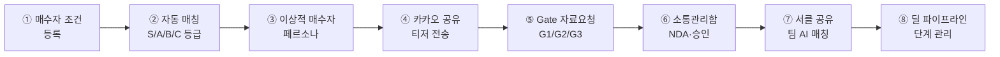

# 매각 딜카드 · IM 상용화 테스트 — 매칭 · 소통관리 실행 스크립트
> 대상: 제이에스부동산중개(주) 테스터
> 사전 준비: 01_테스트_준비_가이드.md + 02_매각딜카드_IM_테스트_스크립트.md 완료 필수
> 전제 조건: 02번 테스트로 P1(임대수익형) 딜카드가 최소 1건 생성된 상태
> 소요 시간: 약 2시간

## 테스트 범위 설명

본 테스트는 **매각-매수자 중심**의 매칭 및 소통관리(인박스) 파이프라인을 점검합니다:



---

## 1단계: 매수자 조건 등록 (약 10분)

**화면 위치:** 코크핏 또는 메뉴에서 `매수자 조건 등록` 접속 (`/broker/buyer-intents/new`)
중개인이 고객(매수자)이 원하는 건물의 조건을 메모 형태로 입력하면 AI가 분석하여 등록합니다.

**테스트용 복사-붙여넣기 데이터:**

**매수자 A: 수익형 매수자**
```text
영등포 당산 원룸 주변 근생 빌딩 찾고 있습니다
예산 50억~100억 연면적 300평 이상
만실 우선 캡레이트 4% 이상 희망
장기 보유 임대수익 목적
엘리베이터 있는 건물 선호
```

**매수자 B: 사옥 매수자**
```text
강남 서초 역삼 일대 사옥용 빌딩 급히 찾습니다
예산 150억~250억 대지 200평 이상
2027년 3월까지 입주 희망
주차 20대 이상 필수
전층 자가사용 예정
```

**매수자 C: 밸류애드 투자자**
```text
영등포 마포 매포 일대 공실 많은 저평가 빌딩 찾아요
예산 30억~60억 감정가 대비 80% 이하
공실률 30% 이상이어도 OK
리모델링 후 재임대 또는 매각 계획
단기 2년 이내 Exit 목표
```

**테스트 수행 단계:**
| 단계 | 화면 위치 | 조작 | 확인 사항 | 📸 | 결과 (Pass/Fail) |
|:---:|:---|:---|:---|:---:|:---:|
| 1-1 | 코크핏 또는 메뉴 | "매수자 조건 등록" 접속 | 페이지가 정상적으로 열리는지 확인 | | |
| 1-2 | 메모 입력칸 | **매수자 A** 메모 복사 후 붙여넣기 | 글자 수가 올바르게 표시되는지 확인 | | |
| 1-3 | 하단 버튼 | "매수 조건 등록" 버튼 클릭 | 로딩 화면이 나타나는지 확인 | | |
| 1-4 | 결과 화면 | 매수자 조건 상세 페이지로 이동됨 | 등록된 상세 내역 확인 | 📸 | |
| 1-5 | 파싱 검증 | 등록된 내역 확인 | 예산, 선호지역, 매수목적이 메모와 일치하게 자동 분류되었는지 확인 | | |

*※ 매수자 B, 매수자 C에 대해서도 위 1-1 ~ 1-5 단계를 반복해 주세요.*

---

## 2단계: 자동 매칭 확인 (약 10분)

**화면 위치:** `딜카드 상세` 화면 > 상단 **"🎯 매수자"** 탭
앞서 02번 테스트에서 만든 **P1(임대수익형) 딜카드**로 돌아가서 매수자가 잘 매칭되었는지 확인합니다.

**테스트 수행 단계:**
| 단계 | 화면 | 조작 | 확인 사항 | 📸 | 결과 |
|:---:|:---|:---|:---|:---:|:---:|
| 2-1 | 딜카드 상세 | 상단 탭에서 **"🎯 매수자"** 탭 클릭 | 매칭 결과 목록이 나타나는지 확인 | | |
| 2-2 | 매수자 탭 | 상단 "🧠 AI 매칭 분석 인사이트" 배너 확인 | 총 매칭 건수가 올바르게 표시되는지 확인 | 📸 | |
| 2-3 | 매칭 카드 목록 | S, A, B, C 등급별 카드 확인 | 각 매수자 카드에 등급, 점수, 매칭 이유가 표시되는지 확인 | 📸 | |
| 2-4 | 매칭 카드 상세 | 개별 매칭 카드 클릭하여 열기 | 매수자 유형, 예산, 선호지역, 상세 매칭 점수 확인 | | |

**세부 검증 항목:**
| # | 확인 항목 | 기대값 (AI 판단에 따라 다를 수 있으나 경향성 확인) | ✅ Pass | ❌ Fail | 비고 |
|:---:|:---|:---|:---:|:---:|:---|
| 2-A | 매수자 A 매칭 | 수익형 매수자와 P1(임대수익형) 딜카드는 목적이 같아 **S 또는 A 등급** | | | |
| 2-B | 매수자 B 매칭 | 사옥 매수자와 P1 딜카드는 지역/용도가 달라 **B 또는 C 등급** 예상 | | | |
| 2-C | 매수자 C 매칭 | 밸류애드 투자자는 예산/지역에 따라 **A~C 등급** 예상 | | | |
| 2-D | 매칭 이유 표시 | 각 매칭 카드에 "왜 이 등급이 나왔는지(reasoning)" 설명 텍스트가 있는지 | | | |
| 2-E | 매칭 0건일 때 | 매칭된 매수자가 없다면 "아직 매칭된 매수자가 없어요" 안내 및 버튼 유무 | | | |

---

## 3단계: 이상적 매수자 페르소나 AI 생성 (약 5분)

**화면 위치:** 딜카드 상세 > **"🎯 매수자"** 탭 또는 **"개요"** 탭 내부의 섹션

**테스트 수행 단계:**
| 단계 | 화면 | 조작 | 확인 사항 | 📸 | 결과 |
|:---:|:---|:---|:---|:---:|:---:|
| 3-1 | 딜카드 상세 | "이상적 매수자 페르소나" 영역 찾기 | 섹션이 존재하는지 확인 | | |
| 3-2 | 페르소나 영역 | **"페르소나 생성"** 버튼 클릭 | 5단계 진행 상태 로딩이 표시되는지 확인 | 📸 | |
| 3-3 | 로딩 중 | 잠시 대기 (약 30초 ~ 1분 소요) | 오류 없이 완료되는지 대기 | | |
| 3-4 | 완료 화면 | 생성된 결과 확인 | 가상의 매수자 페르소나 카드 3개가 표시됨 | 📸 | |

**세부 검증 항목:**
| # | 확인 항목 | 기대값 | ✅ Pass | ❌ Fail | 비고 |
|:---:|:---|:---|:---:|:---:|:---|
| 3-A | 페르소나 3종 | 소득형, 사옥형, 밸류애드 등 성격이 다른 3가지 투자자 프로필 생성 | | | |
| 3-B | 어필 메시지 | 각 페르소나에게 영업할 때 쓸 "맞춤형 어필 메시지" 표시 여부 | | | |
| 3-C | 중개인 액션 플랜 | 중개인이 어떻게 접근하면 좋을지 전략(액션 플랜) 표시 여부 | | | |
| 3-D | 가중치 프로필 | 지역, 예산, 수익률 등 매칭 시 중요하게 볼 가중치 시각화 유무 | | | |

---

## 4단계: 카카오 공유 & 티저 전송 (약 5분)

**화면 위치:** 딜카드 상세 화면 우측 또는 하단의 **공유하기 영역**

**테스트 수행 단계:**
| 단계 | 화면 | 조작 | 확인 사항 | 📸 | 결과 |
|:---:|:---|:---|:---|:---:|:---:|
| 4-1 | 딜카드 상세 | **"🟡 카톡으로 전송"** 버튼 클릭 | PC/모바일 카카오톡 앱이 열리거나 링크가 복사됨 | | |
| 4-2 | 카카오톡 | 내게 쓰기 또는 동료에게 전송 | 딜카드 링크가 포함된 메시지 전송 성공 | | |
| 4-3 | 딜카드 상세 | 카카오 공유 옆 **"✏️ 수정"** 버튼 클릭 | 전송 문구를 수정할 수 있는 창(모달) 열림 | 📸 | |
| 4-4 | 수정 창(모달) | 내용 일부 수정 후 **"수정 완료"** 클릭 | 수정한 내용이 잘 저장되는지 확인 | | |
| 4-5 | 딜카드 상세 | **"📸 1페이지 티저 이미지 다운로드"** 클릭 | PNG 형태의 이미지 파일이 PC에 저장됨 | 📸 | |
| 4-6 | 파일 확인 | 다운받은 이미지 파일 열어보기 | 보안(블라인드) 처리된 티저 이미지 내용 확인 | | |

**세부 검증 항목:**
| # | 확인 항목 | ✅ Pass | ❌ Fail | 비고 |
|:---:|:---|:---:|:---:|:---|
| 4-A | 문구 길이 | 카카오 공유 문구가 지나치게 길지 않고 적절한지 (200자 내외) | | | |
| 4-B | 정보 보안 (PII) | 카카오 문구에 **정확한 지번 주소나 임차인 이름이 없는지** (보안 필수) | | | |
| 4-C | 문구 수정 기능 | 문구 수정 후 다시 전송해볼 때 수정한 내용으로 전달되는지 | | | |
| 4-D | 이미지 보안 (PII) | 티저 이미지에도 지번 주소나 실명이 가려져 있는지 (블라인드 여부) | | | |
| 4-E | 이미지 품질 | 이미지가 깨지지 않고 글씨가 잘 보이는 적절한 해상도인지 | | | |

---

## 5단계: Gate 자료 요청 (매수자 고객 시점, 약 10분)

**화면 위치:** 카카오톡으로 공유받은 **공개 딜카드 링크** 접속 화면 (고객이 보는 화면)

**테스트 수행 단계:**
| 단계 | 화면 | 조작 | 확인 사항 | 📸 | 결과 |
|:---:|:---|:---|:---|:---:|:---:|
| 5-1 | 고객 화면 | 공유받은 링크 클릭하여 접속 | 중개인 화면이 아닌 외부용 딜카드 페이지 표시 | 📸 | |
| 5-2 | 공개 딜카드 | 전체 내용 훑어보기 | 상세 주소, 임차인 정보(PII)가 안 보이는지 확인 | | |
| 5-3 | 하단 버튼 | **"자료 요청"** 또는 **"Gate Request"** 클릭 | 연락처를 남길 수 있는 요청 양식 창 뜸 | | |
| 5-4 | 레벨 선택(G1) | **G1 "등록 관심"** 선택 | G1 배지와 함께 "중개인 연결 요청" 입력칸 표시 | | |
| 5-5 | 정보 입력 | 이름: `테스트 매수자`, 연락처: `010-1234-5678` 입력 | 글씨가 잘 써지는지 확인 | | |
| 5-6 | 폼 제출 | **"요청 보내기"** 버튼 클릭 | "성공적으로 요청되었습니다" 메시지 확인 | 📸 | |
| 5-7 | 레벨 선택(G2) | 다시 자료요청 버튼 클릭 후 **G2 "임대상세 요약 요청"** 제출 | 동일하게 제출 성공 확인 | | |
| 5-8 | 레벨 선택(G3) | 다시 자료요청 버튼 클릭 후 **G3 "투자 자료 요청"** 제출 | 동일하게 제출 성공 확인 | 📸 | |

---

## 6단계: 소통관리함 — 인박스 (중개인 시점, 약 15분)

고객이 남긴 3건의 자료 요청(G1, G2, G3)을 중개인이 확인하고 처리하는 테스트입니다.

### 6-A. 딜카드 내부의 인박스 확인
| 단계 | 화면 | 조작 | 확인 사항 | 📸 | 결과 |
|:---:|:---|:---|:---|:---:|:---:|
| 6-1 | 딜카드 상세(개요 탭) | 화면 중간의 **"📥 자료 요청 인박스"** 찾기 | 방금 고객이 남긴 3건(G1, G2, G3)이 목록에 보임 | 📸 | |
| 6-2 | G1 요청 카드 | G1 요청 카드 살펴보기 | 고객명, 연락처와 함께 상태가 "submitted(제출됨)" 인지 | | |
| 6-3 | G1 처리 | **"NDA 서명 요청 보내기"** 버튼 클릭 | 상태가 "broker_review(검토중)" 등으로 바뀌는지 | | |
| 6-4 | G1 처리 | **"🔗 서명 링크 복사"** 버튼 클릭 | '클립보드에 복사되었습니다' 토스트 알림 확인 | | |
| 6-5 | G1 완료 | **"서명 확인 완료 (수동)"** 버튼 클릭 | 상태가 "approved(승인됨)"으로 변경됨 | 📸 | |
| 6-6 | G1 완료 | **"📱 모바일 IM 링크 복사"** 버튼 클릭 | IM 주소가 복사되었다는 알림 확인 | | |
| 6-7 | G2 처리 | G2 요청 카드에서 6-3 ~ 6-6 동일 반복 | G2도 동일하게 승인 처리 성공 | | |
| 6-8 | G3 거절 | G3 요청 카드에서 **"거절"** 버튼 클릭 | 상태가 "rejected(거절됨)"으로 즉시 변경됨 | | |

### 6-B. 전체 소통관리함(중앙 인박스) 확인
| 단계 | 화면 | 조작 | 확인 사항 | 📸 | 결과 |
|:---:|:---|:---|:---|:---:|:---:|
| 6-9 | 하단 네비게이션 | **"알림"** 또는 **"인박스"** 메뉴 클릭 | 전체 `/broker/inbox` 화면으로 이동 | | |
| 6-10 | 목록 확인 | 리스트 훑어보기 | 방금 처리한 요청과 알림들이 모두 모여 있는지 | 📸 | |
| 6-11 | 탭 필터 | 상단 탭(예: 전체/승인대기/완료) 번갈아 클릭 | 탭에 맞게 목록이 잘 필터링 되어 보이는지 | | |
| 6-12 | 상세 보기 | 목록 중 하나를 클릭 | 우측이나 모달로 요청자 상세 정보와 처리 내역 보임 | | |
| 6-13 | 퀵 처리 | 인박스 화면 내부에서 바로 승인/거절 조작 | 인박스에서도 버튼이 정상 작동하는지 확인 | | |
| 6-14 | 새로고침 | 브라우저(F5) 새로고침 | 방금 승인/거절 변경한 상태가 날아가지 않고 유지되는지| | |

---

## 7단계: 서클 공유 & 팀 AI 매칭 (약 5분)

**화면 위치:** 딜카드 상세 화면의 **"🤝 신뢰 서클 동료에게 보내기"** 또는 공유 버튼

| 단계 | 화면 | 조작 | 확인 사항 | 📸 | 결과 |
|:---:|:---|:---|:---|:---:|:---:|
| 7-1 | 딜카드 상세 | **"🤝 신뢰 서클 동료에게 보내기"** 버튼 클릭 | 하단에서 서클 선택 창(바텀시트)이 올라옴 | 📸 | |
| 7-2 | 서클 목록 | 목록 확인 | 내가 가입한 서클명, 이모지, 멤버수가 표시됨 | | |
| 7-3 | 공유 실행 | 서클 체크박스 1개 이상 선택 후 "보내기" 클릭 | 성공 메시지(토스트)가 나타나는지 확인 | | |

---

## 8단계: 딜 파이프라인 단계 관리 (약 5분)

**화면 위치:** 딜카드 상세 페이지 최상단의 **파이프라인 상태바(PipelineStatusBar)**

| 단계 | 화면 | 조작 | 확인 사항 | 📸 | 결과 |
|:---:|:---|:---|:---|:---:|:---:|
| 8-1 | 상단 상태바 | 상태바 위치 확인 | 현재 이 딜이 어느 단계인지, 며칠째 머물고 있는지 표시됨 | 📸 | |
| 8-2 | 시각 효과 | 단계 목록 확인 (생성→매칭→연락→협상→종료 등) | 현재 단계에 불이 들어와(하이라이트) 있는지 | | |
| 8-3 | 단계 변경 | 다음 단계 버튼이 있다면 클릭해보기 | 다음 단계로 시각적 전환이 이루어지는지 | | |

---

## 종합 결과 기록표

테스트를 진행하시면서 아래 표에 결과를 O, X 로 체크해 주세요.

| Phase | 테스트 항목 | 기대 결과 | ✅ Pass | ❌ Fail | 비고 |
|:---:|:---|:---|:---:|:---:|:---|
| 1 | 매수자 A 조건 등록 | 상세 페이지로 넘어가며 등록 성공 | | | |
| 1 | 매수자 B 조건 등록 | 등록 성공 | | | |
| 1 | 매수자 C 조건 등록 | 등록 성공 | | | |
| 1 | 예산/지역/목적 자동 파싱 | 메모 내용과 일치하게 정확히 자동 분류됨 | | | |
| 2 | P1딜카드에 매칭 결과 표시 | S, A, B, C 등급별 카드 표시됨 | | | |
| 2 | 매칭 등급 합리성 | 수익형 매수자와 임대수익형 빌딩은 S 또는 A | | | |
| 2 | 매칭 이유 텍스트 | 한국어로 자연스럽게 왜 매칭됐는지 설명됨 | | | |
| 3 | 페르소나 3종 생성 | 소득형, 사옥형 등 다양한 투자자 프로필 | | | |
| 3 | 어필 메시지 표시 | 각 페르소나에 맞는 영업 멘트 제공됨 | | | |
| 4 | 카카오 전송 | 카카오톡 공유 정상 작동 | | | |
| 4 | 카카오 문구 수정 | 수정한 내용이 공유 시 반영됨 | | | |
| 4 | 티저 이미지 다운로드 | PNG 파일로 내 PC/폰에 정상 저장됨 | | | |
| 4 | **PII 미포함 (카카오+이미지)** | **[매우 중요]** 주소, 임차인 이름 절대 미노출 | | | |
| 5 | 공개 딜카드(고객용) 확인 | **[매우 중요]** 주소 등 민감정보 미노출 | | | |
| 5 | G1 요청 제출 | "성공" 메시지 확인 | | | |
| 5 | G2 요청 제출 | "성공" 메시지 확인 | | | |
| 5 | G3 요청 제출 | "성공" 메시지 확인 | | | |
| 6 | 인박스에 요청 3건 표시 | 방금 남긴 G1, G2, G3 모두 보임 | | | |
| 6 | NDA 서명 요청 플로우 | 서명 링크 클립보드 복사 성공 | | | |
| 6 | 승인 → IM 링크 전달 | 모바일 IM 링크 클립보드 복사 성공 | | | |
| 6 | 거절 버튼 동작 | 상태가 "거절됨"으로 바뀜 | | | |
| 6 | 중앙 인박스(`/broker/inbox`) | 모든 요청이 중앙 인박스에도 보임 | | | |
| 6 | 인박스 탭 필터 | 탭 클릭 시 리스트가 정상 필터링됨 | | | |
| 7 | 서클 공유 시트 표시 | 하단에서 내 서클 목록 창이 올라옴 | | | |
| 7 | 서클 보내기 성공 | 전송 후 성공 메시지 확인 | | | |
| 8 | 파이프라인 상태바 | 현재 단계와 체류일수 표시됨 | | | |

---

## 합격 기준

| 기준 항목 | 임계값 / 요구사항 |
|:---|:---:|
| Phase별 합격률 | 총 8개 Phase 각각 **70% 이상 Pass** |
| **PII 데이터 안전성** | **100% 필수** (카카오 공유, 티저 이미지, 공개 딜카드 모두 민감정보가 없어야 함) |
| P0(치명적) 결함 | **0건 필수** |
| 전체 합격 판정 | 모든 Phase 합격 + PII 보안 100% + 치명적 결함 0건 |

---

## 🐛 결함 보고 템플릿

테스트 중 에러나 이상한 점을 발견하시면 아래 양식에 맞춰 작성해 주세요. (03_평가기준 문서 양식과 동일)

```markdown
- **결함 ID:** (예: BUG-04-01)
- **발견 위치:** (예: 6단계 딜카드 인박스)
- **재현 단계 (어떻게 했더니 버그가 났나요?):**
  1. G3 자료요청을 남겼음
  2. 인박스에서 '거절' 버튼을 눌렀음
- **기대 결과:** 상태가 '거절됨'으로 바뀌어야 함
- **실제 결과:** 버튼을 눌러도 반응이 없고 화면이 멈춤
- **심각도:** (P0 치명적 / P1 높음 / P2 보통 / P3 낮음)
- **증빙:** (스크린샷 첨부 권장)
```
