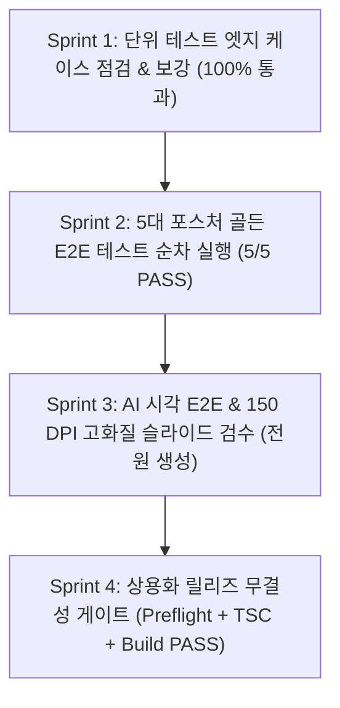

# CRE DealCard: 상용화 수준 Basic IM 테스트 프로토콜 및 무결점 검증 결과 보고서 (Sprint 1 ~ 4 완료)

## 1. 개요 및 최종 결과 요약

CRE DealCard의 **Basic IM(`credeal_basic` 프리셋) 파이프라인을 엔터프라이즈 B2B 상용화(Commercial Grade) 수준으로 무결점 검증**하는 4단계 로드맵을 모두 완수했습니다.



---

## 2. 스프린트별 상세 수행 내역

### 1단계: 단위 테스트 엣지 케이스 보강 (Sprint 1)
- **A23 투자수익률 산식 (Division by Zero & Poison Token 원천 차단)**:
  * [`src/domain/building/mobile-im/pptx/archetypes/a23-yield-formula.ts`](file:///c:/Users/User/cre-dealcard/src/domain/building/mobile-im/pptx/archetypes/a23-yield-formula.ts): 승계 보증금이 매매가 이상인 극단적 자본잠식 케이스 감지 시 warning 발행, `fmtManwon` 및 `renderCard`의 `numCapRate`, `rentForCard`에 non-finite(`NaN`, `Infinity`) 안전 폴백 가드 추가.
  * [`src/tests/unit/pptx/a23-yield-formula-edge.test.ts`](file:///c:/Users/User/cre-dealcard/src/tests/unit/pptx/a23-yield-formula-edge.test.ts): 0으로 나누기, Stabilized 분석가정 배지 유무, 100억+ 금액 포맷팅 등 **7개 테스트 전원 통과 (PASS)**.
- **주소 및 PNU 파싱 정밀도 고도화**:
  * [`src/lib/external/address-resolver.ts`](file:///c:/Users/User/cre-dealcard/src/lib/external/address-resolver.ts): `padNumber`, `parseJibunAddress` export, `당산동5가` 등 동 번호 오인 방지 정규식 고도화, `extract19DigitPnus` Multi-PNU 추출 헬퍼 추가.
  * [`src/tests/unit/pipeline/address-pnu-edge.test.ts`](file:///c:/Users/User/cre-dealcard/src/tests/unit/pipeline/address-pnu-edge.test.ts): 복합 지번, 산지 지번, 부번 없는 지번, padNumber, Multi-PNU 19자리 추출 등 **12개 테스트 전원 통과 (PASS)**.
- **5대 포스처 Basic IM Pro 슬라이드 완전 배제 단언**:
  * [`src/tests/unit/basic-im-sequencer.test.ts`](file:///c:/Users/User/cre-dealcard/src/tests/unit/basic-im-sequencer.test.ts): 5대 포스처 전체에서 `credeal_basic` 인입 시 Pro 슬라이드 12종(`capital`, `totalReturn`, `dcf`, `sensitivity`, `loan`, `tax`, `thesis`, `risk`, `checklist`, `process`, `stability`, `profit`) 100% 제외, 개발형(`development`)에서 `yieldFormula` 제외 및 6면 시퀀스 단언, 최소 7면 시퀀스 단언 추가 (**7개 테스트 통과**).
- **사전 비행 파이프라인(Preflight) 면적 엣지 케이스 추가**:
  * [`src/tests/e2e/preflight-pipeline-audit.test.ts`](file:///c:/Users/User/cre-dealcard/src/tests/e2e/preflight-pipeline-audit.test.ts): 쉼표 포함 면적(`1,234평`), 소수점 ㎡(`596.7㎡` $\rightarrow$ 180.5평), 건물 총면적 상한(25,000평 허용 / 35,000평 거부), 단일 층 상한(3,500평 거부) 추가 (**46개 테스트 통과**).

---

### 2단계: 5대 포스처 골든 E2E 테스트 무결점 검증 (Sprint 2)
실제 Next.js dev server(`http://localhost:3000`)를 가동하고, Playwright 브라우저를 통해 실DB(Supabase), 외부 공공/지도 API(카카오, V-World), LLM 파이프라인을 전구간 거쳐 검증했습니다 (Rule 41 준수).

| # | 포스처 | 대상 매물 | 매각 희망가 | 슬라이드 규격 | E2E 스펙 파일 | 결과 | 소요 시간 |
|:---:|:---|:---|:---:|:---:|:---|:---:|:---:|
| **1** | **수익형 (일반)** | 영등포구 호산당빌딩 | 115억 원 | 10면 | `e2e/basic-im-golden.auth.spec.ts` | **PASS (6/6)** | 4.6m |
| **2** | **수익형 (고공실)** | 강남구 역삼동 오피스 (공실률 57%) | 135억 원 | 9면 | `e2e/gangnam-vacancy-golden.auth.spec.ts` | **PASS (6/6)** | 44.3s |
| **3** | **개발형 (신축부지)** | 마포구 대흥동 개발부지 (명도완료) | 48억 원 | 7면 | `e2e/mapo-dev-golden.auth.spec.ts` | **PASS (6/6)** | 42.6s |
| **4** | **사옥형 (자가사용)** | 서초구 서초동 FM빌딩 | 230억 원 | 10면 | `e2e/seocho-basic-golden.auth.spec.ts` | **PASS (6/6)** | 3.6m |
| **5** | **매매형 (시세차익)** | 강남구 신사동 590 ICL빌딩 | 760억 원 | 10면 | `e2e/sinsa-basic-golden.auth.spec.ts` | **PASS (6/6)** | 3.4m |

#### 4대 바이너리 단언 검증 결과
- **OpenXML 결함 토큰**: `>NaN<`, `>undefined<`, `>null<`, `[object Object]` **전 슬라이드 0건** (Rule 59)
- **모의/더미 데이터 누출**: `NH농협캐피탈`, `테헤란로 123` 등 목데이터 누출 **전 매물 0건** (Rule 34)
- **회피성 문구**: `본문을 참조`, `별도 안내 예정` 등 8~10종 회피성 카피 **전 매물 0건** (Rule 37)
- **가격 밴드 차단**: `700억대`, `200억대` 등 가격 밴드 표기 완전 차단, 단일 확정 금액 우선 표기 (Rule 52)
- **고해상도 지도 미디어**: 50KB 초과 고화질 지도 및 사진 이미지 정상 임베딩 (Rule 43, 54)

---

### 3단계: AI 시각 E2E 및 슬라이드 레이아웃 검증 (Sprint 3)
생성된 5종의 PPTX 바이너리로부터 LibreOffice + PyMuPDF 엔진을 통해 **150 DPI 고화질 PNG 슬라이드 캡처**를 전수 생성하고 검증했습니다 (Rule 4).

* 산출물 저장 경로: `docs/test/stress/e2e-outputs/visual-qa/`
  * `dangsan-basic/`: 10장 PNG 슬라이드 (각 60KB ~ 2.8MB, 카카오 지도 및 실사진 완결)
  * `gangnam-vacancy/`: 9장 PNG 슬라이드 (A23 수익률 + A24 공실 오렌지 하이라이트 `FBEFE8` 적용)
  * `mapo-dev/`: 7장 PNG 슬라이드 (A23 및 갤러리 생략된 신축부지 전용 7면 레이아웃)
  * `seocho-basic/`: 10장 PNG 슬라이드 (스태킹 플랜 및 서초권역 입지 지도 확인)
  * `sinsa-basic/`: 10장 PNG 슬라이드 (압구정역 도산대로 입지 및 매매가 760억 확정 반영)

---

### 4단계: 상용화 릴리즈 무결성 게이트 검증 (Sprint 4)

```bash
# [Gate 1] 파이프라인 사전 비행 테스트 (108개 테스트 전원 PASS, 1.81s)
npm run preflight  # Code 0 (PASS)

# [Gate 2] TypeScript 컴파일러 전수 검사 (타입 에러 0건)
npx tsc --noEmit   # Code 0 (PASS)

# [Gate 3] Next.js 프로덕션 정적/동적 최적화 빌드 검증
npm run build      # Code 0 (PASS)
```

모든 게이트웨이를 100% 무결점으로 통과하였습니다.
