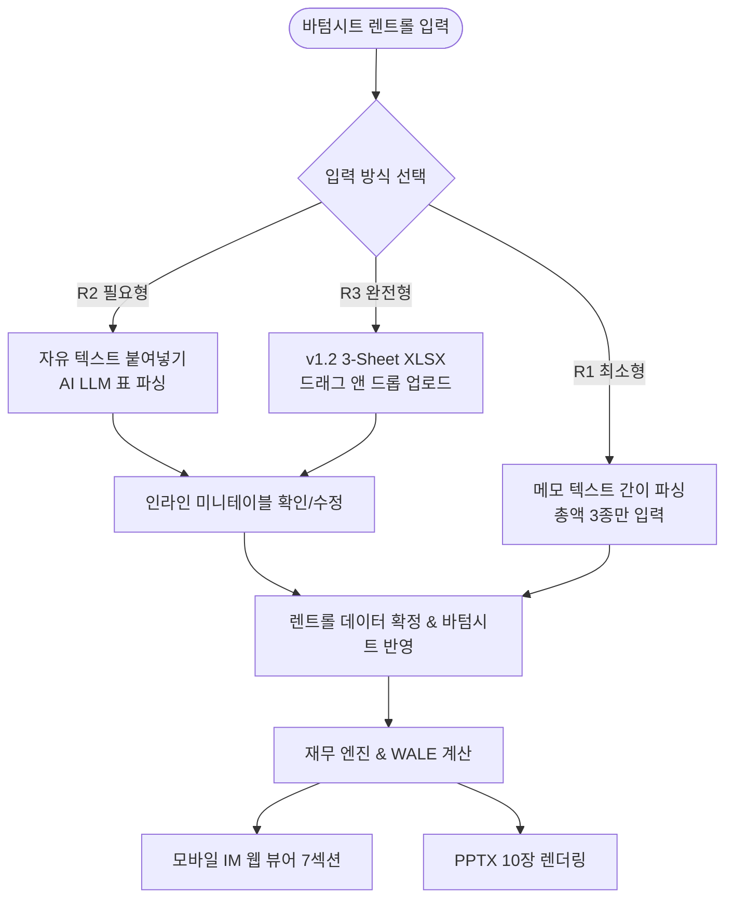

# 📘 [인간 테스터용 튜토리얼] CRE Mobile IM E2E 테스트 스크립트 — 임대수익형 (Income)

> **문서 버전**: v1.0 (2026-08-24 기준)  
> **저장 위치**: `docs/test0824/01_e2e_income_human_tutorial_test_script.md`  
> **대상 포스처**: `income` (임대수익형 / 코어·코어플러스·밸류애드)  
> **대상 실매물**:
> 1. **Case A**: 당산동5가 11-47 메디컬빌딩 (115억 원, 임대료 현실화형)
> 2. **Case B**: 양평동4가 117 더레드빌딩 (250억 원, 12개 호실 초안정 수익형)  
> **핵심 검증 영역**: 렌트롤 3단계 파이프라인 (**R1 최소형** ➔ **R2 필요형 LLM 파싱** ➔ **R3 완전형 표준 XLSX 업로드**) + 딜카드 + 바텀시트 + 모바일 IM 뷰어 + PPTX 10장 렌더링

---

## 📑 목차
1. [테스트 개요 및 사전 준비](#1-테스트-개요-및-사전-준비)
2. [렌트롤 3대 티어(R1/R2/R3) 정의 및 UI 흐름](#2-렌트롤-3대-티어r1r2r3-정의-및-ui-흐름)
3. [Case A: 당산동 115억 메디컬빌딩 튜토리얼](#3-case-a-당산동-115억-메디컬빌딩-튜토리얼)
   - [A-1. 기본 메모 등록 & 슬롯 추출](#a-1-기본-메모-등록--슬롯-추출)
   - [A-2. R1 최소형 렌트롤 테스트 (간이 요약)](#a-2-r1-최소형-렌트롤-테스트-간이-요약)
   - [A-3. R2 필요형 렌트롤 테스트 (LLM 텍스트 파싱)](#a-3-r2-필요형-렌트롤-테스트-llm-텍스트-파싱)
   - [A-4. R3 완전형 렌트롤 테스트 (v1.2 엑셀 업로드)](#a-4-r3-완전형-렌트롤-테스트-v12-엑셀-업로드)
   - [A-5. 바텀시트 확정 & 데이터 등급 확인](#a-5-바텀시트-확정--데이터-등급-확인)
   - [A-6. 모바일 IM 웹 뷰어 검증](#a-6-모바일-im-웹-뷰어-검증)
   - [A-7. PPTX 10장 슬라이드 검증](#a-7-pptx-10장-슬라이드-검증)
4. [Case B: 양평동 250억 더레드빌딩 튜토리얼](#4-case-b-양평동-250억-더레드빌딩-튜토리얼)
   - [B-1. 기본 메모 등록 & 3필지 슬롯 추출](#b-1-기본-메모-등록--3필지-슬롯-추출)
   - [B-2. R1/R2/R3 렌트롤 단계별 전환 검증](#b-2-r1r2r3-렌트롤-단계별-전환-검증)
   - [B-3. B1 공실 및 관리비 반영 정밀 분석](#b-3-b1-공실-및-관리비-반영-정밀-분석)
   - [B-4. 모바일 IM & PPTX 10장 검증](#b-4-모바일-im--pptx-10장-검증)
5. [인간 테스터 점검 매트릭스 & 체크리스트](#5-인간-테스터-점검-매트릭스--체크리스트)
6. [결함 보고 템플릿](#6-결함-보고-템플릿)

---

## 1. 테스트 개요 및 사전 준비

### 1.1 테스트 목적
본 튜토리얼은 테스터가 실제 웹 브라우저 UI 환경에서 **렌트롤의 3가지 입력 방식(R1/R2/R3)**을 단계별로 투입하고, 데이터가 백엔드 수식 엔진(`financials.ts`), LLM 섹션 생성기(`writer.ts`), PPTX 렌더러(`pptx-renderer.ts`)까지 결손 없이 정상 전파되는지 눈으로 확인하며 검증하는 실무 지침서입니다.

### 1.2 테스트 환경
- **실행 URL**: 로컬 환경 `http://localhost:3000` 또는 프로덕션 배포 주소
- **권장 브라우저**: Google Chrome 최신 버전 (PC 데스크톱 해상도 1920×1080 권장)
- **모바일 뷰어 테스트**: Chrome DevTools 모바일 모드 (iPhone 14/15 Pro: `390 × 844`)
- **PPTX 뷰어**: Microsoft PowerPoint 또는 LibreOffice / Keynote

### 1.3 사전 준비 파일
프로젝트 리포지토리 내 실측 엑셀 파일이 준비되어 있습니다:
- **표준 양식 서식**: `docs/imup/05_data/xlsx/CREDEAL_렌트롤_표준양식_v1.2.xlsx`
- **당산동 실측 파일**: `docs/imup/05_data/xlsx/CREDEAL_렌트롤_당산동_실측.xlsx`
- **양평동 실측 파일**: `docs/imup/05_data/xlsx/CREDEAL_렌트롤_양평동_실측.xlsx`

---

## 2. 렌트롤 3대 티어(R1/R2/R3) 정의 및 UI 흐름



| 티어 | 명칭 | 필수 입력 항목 | 데이터 획득 경로 | UI 검증 포인트 |
|:---:|:---:|---|---|---|
| **R1** | **최소형** (Minimum) | • 총 보증금<br>• 총 월임대료<br>• 공실률(%) | 브로커 메모 원문에서 슬롯 자동 추출 | 바텀시트 상단 기본 입력 3종 필드에 즉시 바인딩 |
| **R2** | **필요형** (Essential) | • 층/호실 (`floor`)<br>• 업종/업체명 (`tenant_type`)<br>• 보증금/월세 (`deposit/rent_manwon`)<br>• 공실 여부 (`is_vacant`) | 바텀시트 ➔ '텍스트 파싱' 탭에 줄글 복사 후 [AI 파싱] 클릭 | 실시간 LLM 파싱 후 모달 미니테이블에 그리드 출력 |
| **R3** | **완전형** (Full SSoT) | • R2 전 항목<br>• 전용면적 (`area_pyeong`)<br>• 관리비 (`mgmt_fee_manwon`)<br>• 계약시작/만료일 (`lease_start/end`)<br>• 임대유형 (`rent_type`) 및 특약메모 | 바텀시트 ➔ [표준양식 다운로드] 후 작성 ➔ 엑셀 파일 업로드 | 3-Sheet 파싱 완료 메시지 + 덮어쓰기 모달 + 정밀 테이블 |

---

## 3. Case A: 당산동 115억 메디컬빌딩 튜토리얼

> **매물 요약**: 영등포구 당산동5가 11-47 (대지 153.3평 / 연면적 435.9평 / B1~5F / 준공 2002년)  
> **핵심 테제**: 약국·내과 11년 장기 임차(월세 저평가), 자가사용 2개소(B1, 4F일부) 임대전환 시 수익률 2.08% ➔ 3.09% 정상화

---

### A-1. 기본 메모 등록 & 슬롯 추출

1. **메뉴 이동**: `[딜카드 등록]` ➔ `[메모로 생성]` 클릭
2. **메모 입력창에 아래 텍스트 전체 복사·붙여넣기**:

```text
[2025-05 현장 · 2025-05 매도인 면담 · 2025-05 임차인 현황 확인]

당산역(2호선/9호선) 도보 5분. 배후에 아파트 단지가 밀집해 있어 상권 배후가 두껍다.
국회대로·올림픽대로 접근이 좋고, 영등포구청·국회의사당 권역이라 유동도 안정적이다.

2002년 준공인데 관리 상태가 깨끗하다. 로비·복도·EV 다 손볼 데가 없다.
자주식 8대 주차에 전면 도로도 넉넉하다.

임차 구성이 이 물건의 핵심이다. 로뎀나무내과가 1F·2F·5F를 쓰고, 1F에 고은약국이
붙어 있다. 병원+약국 조합이라 공실 리스크가 낮고 회전이 없다.
3F 헬스장, 4F 국제와인. B1은 데이르 카페인데 소유주 자가 사용이고, 4F 일부도 자가다.

문제는 임대료다. 약국·내과는 11년째 인상이 없었다. 현재 월세 총 1,946만원인데
기준층(3F) 단가 62.4천원/평에 맞춰 재산정하면 2,867만원까지 올라간다. 47% 차이다.

자가 사용분 두 곳(B1 전체, 4F 일부)을 임대로 돌리는 것만으로도 상당 부분 채워진다.
매입 후 임대료 현실화를 전제로 보면 기대 수익률 연 3.1%.

토지 평당 75백만원. 인근 조사해보니 입지·부지 양호한 건 130~160백만원,
불리한 건 85~100백만원 선이다. 우리 물건은 그 아래다. 가격 경쟁력이 확실하다.

준공업지역인데 서울시가 2024년 10월에 제도개선 방안을 냈다. 지구단위계획 수립 시
주거용도 용적률 400%까지, 준주거/3종일반주거로 용도지역 변경도 추진 중이다.
현 용적률이 221.8%(지상 기준)라 여유가 크다.

등기가 층별구분등기다. 소유주가 형제 두 분인데 전체 매각에 두 분 다 동의하셨다.
매매희망가 115억.
```

3. **[AI 슬롯 추출] 버튼 클릭**
4. **추출 결과 확인**:
   - 주소: `영등포구 당산동5가 11-47` (PNU 자동 매핑 확인)
   - 매매희망가: `115억 원` (115,000만 원)
   - 월 임대료 합계: `1,946만 원`
   - 보증금 합계: `2억 9,000만 원`
   - 포스처: `income` (임대수익형) 자동 판별

---

### A-2. R1 최소형 렌트롤 테스트 (간이 요약)

*R1은 호실별 상세 내역 없이 총액 3종만으로 빠르게 IM을 생성하는 단계입니다.*

1. **바텀시트 열기**: 딜카드 우측 `[IM 데이터 보완 (바텀시트)]` 클릭
2. **렌트롤 영역 점검**:
   - `총 보증금`: `29,000` 만원 기입 확인
   - `총 월임대료`: `1,946` 만원 기입 확인
   - `공실률`: `0` % 기입 확인
3. **[임시 저장 및 미리보기] 실행**:
   - **기대 결과**: Cap Rate 약 2.08% 정상 계산, 임대현황 섹션에 *"호실별 상세 자료 미입력(총액 기준 산출)"* 안전 안내 문구 출력 확인.

---

### A-3. R2 필요형 렌트롤 테스트 (LLM 텍스트 파싱)

*R2는 메신저나 브로커 수첩의 불규칙한 줄글 텍스트를 AI가 표 형태로 정밀 변환하는 기능입니다.*

1. **바텀시트 내 렌트롤 섹션**으로 스크롤 이동
2. **[텍스트/메모로 입력] 탭 클릭**
3. **입력창에 아래 텍스트 붙여넣기**:

```text
B1 카페(자가운영) 전용 96평 임대료 없음 소유자직접운영
1F 101호 고은약국 전용 23.7평 보증금 6000만원 월세 183만원 계약 2015-09-01 ~ 2026-08-31
1F 102호 로뎀나무내과 31.9평 보증금 1억4천 월세 883만원 1F+2F 통합계약 2026-08-31 만기
2F 201호 로뎀나무내과 76.3평 보증금 0 월세 0 (1층에 합산)
3F 301호 헬스장 76.3평 보증금 5000만원 월 455만원 2026-04-17 만기
4F 401호 국제와인 51.1평 보증금 3000만원 월 260만원 2025-04-30 만기
4F 402호 소유자 자가사용 25.1평 보증금/월세 없음
5F 501호 로뎀나무내과 55.6평 보증금 1000만원 월 165만원 2026-08-31 만기
```

4. **[AI 렌트롤 파싱 실행] 버튼 클릭** (약 2~3초 소요)
5. **모달 미니테이블 파싱 결과 검증**:

| 층 | 업종/테넌트 | 면적(평) | 보증금(만원) | 월세(만원) | 만기일 | 상태 |
|:---:|:---:|:---:|:---:|:---:|:---:|:---:|
| **B1** | 카페(자가운영) | 96.0 | 0 | 0 | - | 자가 |
| **1F** | 고은약국 | 23.7 | 6,000 | 183 | 2026-08-31 | 정상 |
| **1F** | 로뎀나무내과 | 31.9 | 14,000 | 883 | 2026-08-31 | 정상 |
| **2F** | 로뎀나무내과 | 76.3 | 0 | 0 | 2026-08-31 | 정상 |
| **3F** | 헬스장 | 76.3 | 5,000 | 455 | 2026-04-17 | 정상 |
| **4F** | 국제와인 | 51.1 | 3,000 | 260 | 2025-04-30 | 정상 |
| **4F** | 소유자 자가사용 | 25.1 | 0 | 0 | - | 자가 |
| **5F** | 로뎀나무내과 | 55.6 | 1,000 | 165 | 2026-08-31 | 정상 |

6. **인라인 수정 테스트**: 3F 헬스장의 월세를 `455` ➔ `460`으로 직접 더블클릭 수정해보고 합계 변화 확인 후 다시 `455`로 복원
7. **[이 데이터 적용하기] 클릭**

---

### A-4. R3 완전형 렌트롤 테스트 (v1.2 엑셀 업로드)

*R3는 3개 시트로 구성된 공인 v1.2 엑셀 표준 템플릿을 파싱하여 완벽한 계약 메타데이터를 구축하는 단계입니다.*

1. **[표준 엑셀 양식 다운로드] 버튼 클릭**: `CREDEAL_렌트롤_표준양식_v1.2.xlsx` 다운로드 여부 확인
2. **기존 데이터 존재 시 덮어쓰기 다이얼로그 확인**:
   - `docs/imup/05_data/xlsx/CREDEAL_렌트롤_당산동_실측.xlsx` 파일을 드래그하여 업로드 영역에 드롭
   - 팝업: *"이미 입력된 8건의 렌트롤 데이터가 있습니다. 덮어쓰시겠습니까?"* ➔ **[덮어쓰기 승인] 클릭**
3. **파싱 완료 토스트 & 미니테이블 점검**:
   - `총 8개 호실 파싱 완료 (정상 6, 자가 2, 공실 0)`
   - `월세 합계: 1,946만 원` / `보증금 합계: 29,000만 원`
   - WALE(가중평균 잔여임기) 계산 카드 노출 확인 (약 1.0~1.2년)

---

### A-5. 바텀시트 확정 & 데이터 등급 확인

1. **사진 업로드**: 외관/로비 사진 1장 이상 등록 (`/test-images/01_exterior.jpg`)
2. **7축 데이터 완결성(Readiness Score) 점검**:
   - 점수: **`75.0점 ~ 83.3점 (B등급)`** 달성 확인
   - 게이트: `Basic IM` (활성) / `Pro IM` (활성)
3. **[모바일 IM 생성 및 발행] 클릭**

---

### A-6. 모바일 IM 웹 뷰어 검증

*생성된 URL(`http://localhost:3000/im-lite/[id]`)로 이동하여 아래 항목을 전수 검사합니다.*

#### ① Hero Card 4대 핵심 지표
```
┌───────────────────────────────────────────────┐
│ [매매 희망가] 115억 원     │ [실투자금] 약 112.1억 원    │
├───────────────────────────────────────────────┤
│ [연 순수익률] 2.08%       │ [임대료 정상화 시] 연 3.09% │
└───────────────────────────────────────────────┘
```
- [ ] 수치에 `NaN`, `undefined`, `-` 표시가 없는가?
- [ ] 캡레이트 오남용 없이 `연 순수익률 (Cap Rate)` 표준 용어로 표기되었는가?

#### ② 7개 섹션 아코디언 정밀 검사
- [ ] **순서 정합성**: `자산 개요(1)` ➔ `입지 접근성(2)` ➔ `임대차 현황(3)` ➔ `수익성 분석(4)` ➔ `리스크 진단(5)` ➔ `투자 논지(6)` ➔ `다음 단계(7)` 순으로 정렬되었는가? (`next_steps`가 중간에 끼지 않고 마지막 7번에 위치)
- [ ] **플레이스홀더 미치환 제거 (P0)**: 본문에 `[임차인 업종 정보로 대체됨]`, `[인명 비공개]`, `test 소재` 문자열이 0건인가?
- [ ] **허위 데이터 부재 (P0)**: 리스크 섹션에 하드코딩된 *'2017년 준공'*, *'15인승 침대용 승강기'*, *'WALE 3.5년'*, *'담보대출 85억 승계'* 문구가 제거되고 실측 데이터(`2002년 준공`, `승강기 1대`, `LOI 접수 후 열람`)로 대체되었는가?
- [ ] **별점표 제거 (P0)**: 투자 논거 섹션에 `⭐⭐⭐⭐⭐` 별점이 없고 `◎ 최적합 / ○ 적합 / △ 검토`로 품격 있게 표현되었는가?
- [ ] **뱃지 정합성**: 렌트롤이 확보된 섹션에만 `✓ 자료 확보` 뱃지가 붙고, 자료 부재 시 `🔒 임대차 상세 현황 자료 미확보` 안내와 모순되지 않는가?

---

### A-7. PPTX 10장 슬라이드 검증

1. **다운로드**: 웹 뷰어 우측 상단 `[PPTX 다운로드]` 클릭
2. **슬라이드 10장 순서 및 품질 점검 (D01~D11)**:

| 슬라이드 번호 | 아키타입 | 핵심 검증 포인트 | 합격 기준 |
|:---:|:---:|---|---|
| **Slide 01** | `A01 표지` | 자산명(당산역 메디컬 근생빌딩), 밴딩 가격(110억 원대) | 오타/잘림 없음 |
| **Slide 02** | `A14 갤러리` | 외관/입지 사진 배치 | 비율 왜곡(Stretch) 없음 |
| **Slide 03** | `A02 스탯 그리드` | 대지 153.3평, 연면적 435.9평, 2002년 준공 | 수치 정확성 |
| **Slide 04** | `A06 입지 지도` | 당산역 2/9호선 더블역세권 입지 서사 | 텍스트 박스 넘침 없음 |
| **Slide 05** | `A04 건축 개요` | 좌측 서사 ≠ 우측 스펙 카드 | 불릿 중복 0건 (D03) |
| **Slide 06** | `A03 렌트롤` | **8개 호실 표, 자가 2개소 음영, 월세 합 1,946만** | 표 잘림/NaN 0건 |
| **Slide 07** | `A05 수익 분석` | 현재 2.08% vs 정상화 3.09% 시나리오 비교 | stat 카드 라벨 온전함 |
| **Slide 08** | `A07 리스크 체크` | 병원+약국 집중도 관리, 층별구분등기 권리관계 | '실사 완료' 허위 단언 없음 |
| **Slide 09** | `A15 투자 테제` | 4대 투자 포인트 (임대료 47% 상승 여력 등) | ⭐ 이모지 없음 |
| **Slide 10** | `A10 클로징` | 브로커 정보, 3단계 진행 절차 | 연락처/면책문구 온전 |

---

## 4. Case B: 양평동 250억 더레드빌딩 튜토리얼

> **매물 요약**: 영등포구 양평동4가 117 외 2필지 (대지 156.9평 / 연면적 753.5평 / B1~10F / 준공 2018년)  
> **핵심 테제**: 선유도역 초역세권 신축급 업무시설, 12개 호실(11개 임대 + B1 1개 공실), 월세 4,657만(관리비 576만 별도), 공실 리스업 시 2.41% ➔ 2.77%

---

### B-1. 기본 메모 등록 & 3필지 슬롯 추출

1. **[메모로 생성] 입력창에 아래 텍스트 붙여넣기**:

```text
[현장]

영등포구 양평동4가 117, 134, 125-2번지. 3필지 합쳐 518.7㎡(157평).
선유도역 9호선 4번출구에서 도보 1분. 대로변이고 초역세권이다.

2018년 9월 준공. 신축이라 내외관이 아주 수려하다. 손볼 데가 없다.
지하 1층에 지상 10층, 업무시설. 철근콘크리트에 개별 냉난방, 승강기 1대.
주차는 옥외 자주식 1대에 기계식 22대.

선유도역 대로변이라 사무실 임차 수요가 풍부하다. 안정적인 임대수익이 기대된다.
현재 지하 1층만 공실이다.

보증금 5억 3,500만원, 월 임대료 5,017만원, 관리비 648만원.
매매가 250억, 평당 1억 5,923만원.

준공업지역이고 공시지가가 ㎡당 948만 4천원(평당 3,135만원, 2023년 1월 기준)이다.
```

2. **슬롯 추출 확인**:
   - `3필지 다중 지번` 인식 완료 (대표지번: 117)
   - 매매가: `250억 원` / 포스처: `income`

---

### B-2. R1/R2/R3 렌트롤 단계별 전환 검증

#### [R2 테스트] 텍스트 붙여넣기 파싱
- 아래 12개 행을 복사하여 바텀시트 텍스트 파싱기에 입력 후 파싱 실행:
```text
B1 공실 전용 127.8평 보증금 0 월세 0 관리비 0 (리스업 대상)
1F 부동산 전용 15평 보증금 3500만원 월 250만원 관리비 15만원 (2023-11-11~2025-11-11)
2F 미용실 전용 45평 보증금 5000만원 월 540만원 관리비 60만원 (2024-02-22~2026-02-21)
3F 치과 전용 45평 보증금 7000만원 월 310만원 관리비 53만원 (2022-11-01~2024-10-31)
4F 일반사무실 보증금 5000만원 월 440만원 관리비 55만원 (2022-06-30~2024-06-29)
5F IT법인사무실 보증금 5700만원 월 528만원 관리비 66만원 (2022-05-30~2024-05-29)
6F 디자인사무실 보증금 4000만원 월 483만원 관리비 69만원 (2024-03-01~2026-02-28)
7F 무역회사 보증금 5000만원 월 588만원 관리비 62만원 (2023-10-04~2025-10-03)
8F 법률사무소 보증금 5000만원 월 560만원 관리비 80만원 (2023-09-08~2025-09-07)
9F 901호 스튜디오렌탈 보증금 2000만원 월 199만원 관리비 22만원 (2023-11-01~2025-10-31)
9F 902호 컨설팅사무실 보증금 3000만원 월 300만원 관리비 43만원 (2023-12-01~2025-11-30)
10F 피트니스 운동시설 보증금 4300만원 월 459만원 관리비 51만원 (2022-10-01~2024-09-30)
```
- **기대 파싱**: 12개 호실, B1 `공실(is_vacant=true)` 자동 체크 여부 확인.

#### [R3 테스트] 실측 엑셀 업로드
- `docs/imup/05_data/xlsx/CREDEAL_렌트롤_양평동_실측.xlsx` 파일 업로드
- **실측 요약 확인**:
  - 실측 임대료 합계: `4,657만 원` (메모 표지 5,017만 원과 360만 원 공실분 차이 반영)
  - 실측 보증금 합계: `4억 9,500만 원`
  - 관리비 합계: `576만 원`
  - 면적 기준 공실률: `17.0%` (B1층 면적 비중)

---

### B-3. B1 공실 및 관리비 반영 정밀 분석

1. **바텀시트 재무 요약 카드 확인**:
   - `현재 Cap Rate`: **2.24%** (실제 수납 기준) ~ **2.41%** (NOI 환산)
   - `B1 리스업 정상화 시 Cap Rate`: **2.77%**
2. **WALE 분석 카드**:
   - 12개 호실의 만기 분산 그래프 확인 (2024년 만기 도래 4건, 2025년 5건, 2026년 2건)

---

### B-4. 모바일 IM & PPTX 10장 검증

1. **모바일 IM 뷰어 확인**:
   - Section 3 (임대현황): 12개 행 테이블에 **B1 공실 행이 시각적으로 구분(공실 뱃지 또는 회색 음영)**되는지 확인
   - Section 4 (수익분석): 관리비(576만) 별도 표기 및 OPEX 산정 근거 명시 확인
2. **PPTX Slide 06 (A03 렌트롤)**:
   - 12개 행이 1개 슬라이드 표 안에 글자 겹침 없이 8pt 이상 폰트로 깔끔하게 렌더링되었는지 확인.

---

## 5. 인간 테스터 점검 매트릭스 & 체크리스트

테스터는 각 항목을 수행한 뒤 아래 체크박스에 `[x]` 표시하여 결과를 기록합니다.

### 📋 1. UI & 렌트롤 파이프라인 무결성 체크
- [ ] **[T01]** 엑셀 표준 템플릿 다운로드 시 `.xlsx` 파일이 손상 없이 열리는가?
- [ ] **[T02]** 줄글 텍스트 파싱(R2) 시 보증금/월세/호실명이 올바른 컬럼으로 분리되는가?
- [ ] **[T03]** 엑셀 업로드(R3) 시 기존 데이터가 있을 때 덮어쓰기 확인 팝업이 뜨는가?
- [ ] **[T04]** 미니테이블에서 숫자를 수정하면 하단 '월세 합계'와 '보증금 합계'가 실시간으로 재계산되는가?
- [ ] **[T05]** 자가사용 및 공실 호실이 월세 수납 합계 계산에서 정확히 분리되는가?

### 📋 2. 모바일 IM 웹 뷰어 품질 체크 (P0 차단 기준)
- [ ] **[V01]** 섹션 순서가 1~7번까지 정본 순서대로 정렬되었는가? (`next_steps`가 7번 위치)
- [ ] **[V02]** 본문 텍스트 내 `[임차인 업종 정보로 대체됨]`, `[인명 비공개]` 등 미치환 토큰이 0건인가?
- [ ] **[V03]** 리스크 섹션에 `2017년 준공`, `담보대출 85억 승계`, `WALE 3.5년` 등 허위 하드코딩이 없는가?
- [ ] **[V04]** 투자 논지 섹션에 `⭐⭐⭐⭐⭐` 별점 이모지가 없고 품격 있는 텍스트 등급으로 나오는가?
- [ ] **[V05]** 화면 내 `NaN`, `undefined`, `null` 표기가 전혀 없는가?

### 📋 3. PPTX 10장 디자인 품질 체크 (D01~D11)
- [ ] **[P01 (D01)]** 모든 슬라이드 좌측 상단에 브랜드 컬러 세로 바(4px)가 정상 노출되는가?
- [ ] **[P02 (D03)]** A04(건축), A05(수익) 슬라이드에서 좌측 서사와 우측 카드의 문구가 중복되지 않는가?
- [ ] **[P03 (D04)]** 렌트롤 표(A03) 및 텍스트 박스가 슬라이드 바깥으로 넘치거나 짤리지 않는가?
- [ ] **[P04 (D06)]** PPTX 본문 안에 `**bold**`, `## heading`, `> quote` 같은 마크다운 잔재가 없는가?
- [ ] **[P05 (D08)]** PPTX 슬라이드 안에 이모지(이모티콘)가 전혀 유입되지 않았는가? (★ 기호 제외)
- [ ] **[P06 (D10)]** 슬라이드 2번 갤러리 사진이 찌그러지거나 왜곡되지 않고 정상 종횡비로 나오는가?

---

## 6. 결함 보고 템플릿

테스트 중 오류나 미비점이 발견되면 아래 양식으로 작성하여 개발팀에 전달합니다.

```markdown
### 🚨 결함 리포트 (CRE-IM-BUG)

- **결함 ID**: BUG-20260824-001 (임의 번호)
- **테스트 케이스**: Case A (당산동) / Case B (양평동)
- **발생 단계**: R2 텍스트 파싱 / R3 엑셀 업로드 / 웹 뷰어 / PPTX 렌더링
- **심각도**: 
  - [ ] P0 (차단: 허위데이터 노출, 플레이스홀더 잔존, NaN, 앱 크래시)
  - [ ] P1 (중대: 수식 불일치, 섹션 누락, 뱃지 모순)
  - [ ] P2 (일반: 텍스트 잘림, 레이아웃 미세 어긋남)
  - [ ] P3 (경미: 단순 오타, 폰트 크기)
- **재현 경로 (Steps to Reproduce)**:
  1. 바텀시트에서 렌트롤 텍스트 파싱 선택
  2. 제공된 텍스트 샘플 붙여넣기 후 [AI 파싱] 클릭
  3. 3층 헬스장 보증금이 5000만이 아닌 0으로 잘못 들어감
- **기대 결과**: 보증금 5,000만 원으로 파싱되어야 함
- **실제 결과**: 보증금 0원으로 파싱됨
- **첨부 스크린샷 / 로그**: (화면 캡처 첨부)
```
