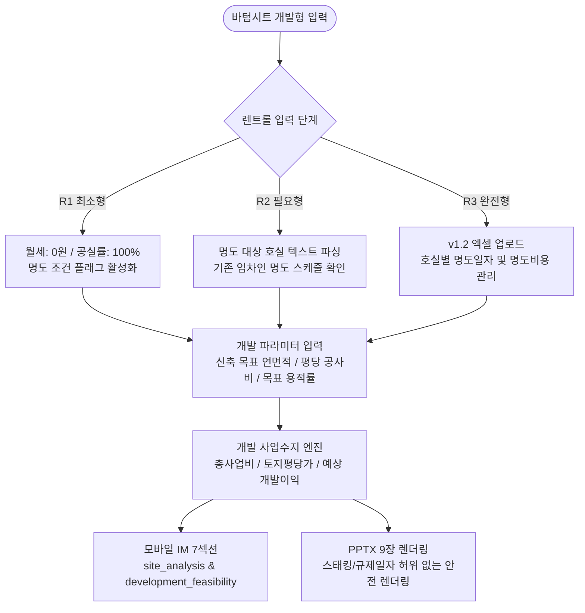

# 📘 [인간 테스터용 튜토리얼] CRE Mobile IM E2E 테스트 스크립트 — 신축개발형 (Development)

> **문서 버전**: v1.0 (2026-08-24 기준)  
> **저장 위치**: `docs/test0824/02_e2e_development_human_tutorial_test_script.md`  
> **대상 포스처**: `development` (신축 개발형 / 토지개발 / 리모델링 증축)  
> **대상 실매물**:
> 1. **Case A**: 서초구 잠원동 26-14 두원빌딩 (242.27억 원, 2필지 11개 호실 명도 후 신축)
> 2. **Case B**: 경기도 구리시 수택동 419-19 나대지 (89억 원, 3필지 197평 나대지 삼면접도 복합개발)  
> **핵심 검증 영역**: 개발형 렌트롤 처리(명도 조건 / 나대지 0건) + 사업수지(총사업비·공사비·개발이익률) + 모바일 IM 7섹션(렌트롤 억제 & 부지/수지 활성화) + PPTX 9장 렌더링

---

## 📑 목차
1. [개발형 포스처 테스트 개요 및 핵심 원칙](#1-개발형-포스처-테스트-개요-및-핵심-원칙)
2. [개발형 렌트롤(R1/R2/R3) 및 사업수지 데이터 연동 흐름](#2-개발형-렌트롤r1r2r3-및-사업수지-데이터-연동-흐름)
3. [Case A: 잠원동 242억 두원빌딩 튜토리얼](#3-case-a-잠원동-242억-두원빌딩-튜토리얼-명도-후-신축)
   - [A-1. 기본 메모 등록 & 2필지 슬롯 추출](#a-1-기본-메모-등록--2필지-슬롯-추출)
   - [A-2. R1/R2/R3 렌트롤 입력: 명도 조건과 기존 임차인 현황](#a-2-r1r2r3-렌트롤-입력-명도-조건과-기존-임차인-현황)
   - [A-3. 개발 파라미터 입력 (목표 연면적·공사비·용적률)](#a-3-개발-파라미터-입력-목표-연면적공사비용적률)
   - [A-4. 바텀시트 확정 & 데이터 등급 확인](#a-4-바텀시트-확정--데이터-등급-확인)
   - [A-5. 모바일 IM 웹 뷰어 검증 (부지분석 & 사업수지 섹션)](#a-5-모바일-im-웹-뷰어-검증-부지분석--사업수지-섹션)
   - [A-6. PPTX 9장 슬라이드 검증](#a-6-pptx-9장-슬라이드-검증)
4. [Case B: 수택동 89억 나대지 튜토리얼](#4-case-b-수택동-89억-나대지-튜토리얼-3필지-나대지-개발)
   - [B-1. 기본 메모 등록 & 나대지 슬롯 추출](#b-1-기본-메모-등록--나대지-슬롯-추출)
   - [B-2. 나대지 렌트롤 0건 & 건축물대장 미적용 검증](#b-2-나대지-렌트롤-0건--건축물대장-미적용-검증)
   - [B-3. 지구단위계획 및 공사비 750만 사업수지 검증](#b-3-지구단위계획-및-공사비-750만-사업수지-검증)
   - [B-4. 모바일 IM & PPTX 9장 검증](#b-4-모바일-im--pptx-9장-검증)
5. [인간 테스터 점검 매트릭스 & 체크리스트](#5-인간-테스터-점검-매트릭스--체크리스트)
6. [결함 보고 템플릿](#6-결함-보고-템플릿)

---

## 1. 개발형 포스처 테스트 개요 및 핵심 원칙

### 1.1 핵심 검증 관점
1. **포스처 카탈로그 정합성 (Section Suppression & Emphasis)**
   - `development` 포스처에서는 기존의 `lease_status`(임대차 현황), `income_analysis`(임대수익 분석) 섹션이 **억제(Suppressed)**되어야 합니다.
   - 대신 `site_analysis`(부지 및 개발 여건 분석), `development_feasibility`(신축 개발 사업수지 분석)가 **강조 활성화**되어야 합니다.
2. **명도 조건 시 Rent=0 처리 무결성 (Zero Division 방어)**
   - 명도 조건 매물이거나 나대지 매물에서 `monthlyRentKrw = 0`일 때, 시스템이 Cap Rate 계산에서 `NaN` 또는 `Infinity`를 뿜지 않고 개발 지표(토지 평당가, 개발이익률, 총사업비)로 온전히 전환되는지 검증합니다.
3. **허위 하드코딩 완전 배제 (P0)**
   - 개발 사업수지에서 근거 없이 *"예상 개발 이익률 15%~25%"*, *"공사비 1,200만/평"* 등 가상 수치가 하드코딩되지 않고 테스터가 입력한 실측값(잠원동 650/750만, 수택동 750만)에 기반하여 동적 산출되는지 검증합니다.

---

## 2. 개발형 렌트롤(R1/R2/R3) 및 사업수지 데이터 연동 흐름



---

## 3. Case A: 잠원동 242억 두원빌딩 튜토리얼 (명도 후 신축)

> **매물 요약**: 서초구 잠원동 26-14 외 1필지 (대지 186.36평 / 연면적 363평 / B1~5F / 준공 1990년)  
> **핵심 테제**: 신사역(4분)·논현역(7분) 강남대로 이면 코너, 싸리재 소공원 전면, 전층 매도인 명도 조건 확정가, B1~6F 신축 시 용적률 249% 한시적 상향

---

### A-1. 기본 메모 등록 & 2필지 슬롯 추출

1. **메뉴 이동**: `[딜카드 등록]` ➔ `[메모로 생성]` 클릭
2. **메모 입력창에 아래 텍스트 붙여넣기**:

```text
[2026-04-12 현장]

강남대로 바로 이면. 신사역 4분, 논현역 7분 걸어서 재봤고 실제로 그 정도 나온다.
간장게장 골목이 바로 옆이라 주말에도 사람이 끊이지 않는 자리. 업무·상업·주거가
섞여 있어서 주 7일 상권이라고 봐도 된다.

이면 교차 골목 코너부고 바로 앞에 싸리재 소공원(약 377평)이 있다. 이게 크다.
공원 쪽으로 전면이 열려 있어서 시인성이 좋고, 신축하면 저층부 F&B 집객이 확실히
달라질 자리다.

건물은 1990년 준공이라 많이 낡았다. 승강기가 기존 남자화장실 자리에 소형으로
끼워 넣은 거라 2층부터만 운행하고 4~5인 타면 꽉 찬다. 주차리프트는 지금 안 쓰고
있는데 돌리려면 용량·크기 증설이 사실상 필요하다. 공간 효율이 나쁘다.
→ 리모델링보다 신축이 맞는 물건.

임차인이 여럿 있는데 매도인이 명도해서 넘기는 조건이라 매수자가 신축 부담 없이
들어올 수 있다. 이게 이 물건의 제일 큰 장점.

가격은 토지 평당 1.3억. 반경 150m 안에서 강남대로 배후 일면부가 1.7~2.3억,
안쪽 이면부가 1.1~1.6억 나오는데 본 자산은 일면부 성격인데도 이면부 하단 가격이다.
명도비까지 포함된 확정가라 실질적으로는 더 싸다고 봐야 한다.

호재 두 개 — 경부고속도로 지하화 논의, 위례-신사선 예타 통과. 둘 다 확정 단계는
아니지만 방향은 잡혔다.

신축은 지하1~지상6층으로 근생·의원·업무 복합으로 보고 있다. 서울시 소규모 건축물
한시적 용적률 상향 대상이라 250% 미만으로 잡으면 된다.
매매희망가 242억 2,680만원.
```

3. **[AI 슬롯 추출] 버튼 클릭**
4. **추출 결과 확인**:
   - 주소: `서초구 잠원동 26-14` (2필지 인식 확인)
   - 매매희망가: `242억 2,680만 원` (24,226,800,000원 정밀 파싱)
   - 포스처: `development` (신축 개발형 자동 인식)
   - 토지 평당가: 약 `1.3억 원/평`

---

### A-2. R1/R2/R3 렌트롤 입력: 명도 조건과 기존 임차인 현황

#### [R1 최소형 테스트]
- 바텀시트 렌트롤 항목에서:
  - `월 임대료`: `0` (매도인 명도 조건)
  - `공실률`: `100`% (신축 명도 예정)
  - `명도 상태`: `매도인 책임 명도` 선택

#### [R2 필요형 테스트] 텍스트 파싱 (명도 대상 기존 임차 목록)
- 바텀시트 ➔ '텍스트 파싱' 탭에 기존 임차인 현황 붙여넣기:
```text
B1 유흥주점 전용 60평 보증금 3000만 월세 250만 (명도 합의 진행중)
1F 101호 F&B음식점 전용 28평 보증금 5000만 월세 350만 (명도 확약서 징구)
1F 102호 카페 전용 15평 보증금 3000만 월세 200만 (명도 확약)
2F 당구장 전용 55평 보증금 3000만 월세 220만 (명도 완료)
3F 엔터사무실 전용 55평 보증금 4000만 월세 280만 (만기 퇴거 예정)
4F 디자인스튜디오 전용 55평 보증금 3000만 월세 230만 (명도 확약)
5F IT사무실 전용 55평 보증금 3000만 월세 240만 (명도 확약)
```
- [AI 파싱 실행] ➔ 7개 호실이 '명도 대상 임차인 목록'으로 파싱되어 미니테이블에 출력되는지 확인.

#### [R3 완전형 테스트] 엑셀 업로드
- `docs/imup/07_reference/input_xlsx/INPUT_정밀_잠원동두원빌딩.xlsx` 업로드
- 기존 임차 현황 11건 및 명도비 15.1억원이 매매가에 포함된 구조 확인.

---

### A-3. 개발 파라미터 입력 (목표 연면적·공사비·용적률)

바텀시트 하단 **[신축 개발 기획 파라미터]** 섹션에 아래 값을 입력합니다:
- `신축 목표 연면적`: `600` 평 (약 1,983㎡)
- `평당 예상 공사비`: `750` 만원/평
- `목표 용적률`: `249` % (소규모 건축물 한시적 상향 기준 250% 미만)
- `예상 총공사비`: `45억 원` (600평 × 750만원 자동 계산 확인)
- `총 사업비`: 약 `287.3억 원` (토지비 242.3억 + 공사비 45억)

---

### A-4. 바텀시트 확정 & 데이터 등급 확인

1. **Readiness Score 검증**:
   - 점수: **`78.0점 ~ 84.5점 (B등급)`**
   - 개발형 Pro IM 생성 버튼 활성화 확인
2. **[모바일 IM 생성 및 발행] 클릭**

---

### A-5. 모바일 IM 웹 뷰어 검증 (부지분석 & 사업수지 섹션)

#### ① Hero Card 4대 개발 지표
```
┌───────────────────────────────────────────────┐
│ [매매 희망가] 242.3억 원   │ [총 사업비] 약 287.3억 원   │
├───────────────────────────────────────────────┤
│ [용도지역] 제2종일반주거   │ [목표 용적률] 249% (한시상향)│
└───────────────────────────────────────────────┘
```
- [ ] 임대수익형의 'Cap Rate 0%'나 'Infinity'가 노출되지 않고 개발형 4대 지표가 깔끔히 표시되는가?

#### ② 7개 섹션 정합성 검사 (Development 전용 카탈로그)
1. **01_property_overview (자산 개요)**: 대지 186.4평, 1990년 준공, 명도 후 신축 개요
2. **02_location_access (입지 분석)**: 신사역 4분, 논현역 7분, 싸리재 소공원 377평 전면
3. **03_site_analysis (부지 및 건축 여건)**: 코너 필지 삼면/이면 접도, 2필지 통합 개발
4. **04_development_feasibility (신축 사업수지)**: 신축 연면적 600평, 공사비 45억, 총사업비 287억
5. **05_risk_check (리스크 진단)**: 명도 일정 리스크, 인허가 한시 규제 기한 확인 (허위 85억 대출 없음!)
6. **06_investment_thesis (투자 논거)**: 강남대로 이면 1.3억 토지 경쟁력, 사옥/메디컬 복합 신축 밸류 (별점 없음!)
7. **07_next_steps (다음 단계)**: 신축 기본설계 검토 및 LOI 접수 안내 (마지막 7번에 위치)

- [ ] **억제 검증**: `lease_status`와 `income_analysis`가 뷰어에 나타나지 않고 `site_analysis`, `development_feasibility`로 완벽히 대체되었는가?
- [ ] **플레이스홀더 미치환 0건**: `[임차인 업종 정보로 대체됨]`, `test 소재` 등이 없는가?

---

### A-6. PPTX 9장 슬라이드 검증

1. **다운로드**: 웹 뷰어에서 PPTX 다운로드 (`development` 포스처는 9장)
2. **슬라이드별 검증**:
   - **Slide 01 (Cover)**: 잠원동 242억 원대, 개발형 프리셋
   - **Slide 03 (Stat Grid)**: 토지 평당 1.3억, 대지 186.4평, 목표 연면적 600평
   - **Slide 05 (Site Analysis)**: 소공원 전면 개방성 및 신축 접근성
   - **Slide 06 (Feasibility)**: 총사업비 287억, 공사비 750만/평 표기
   - **Slide 07 (Risk Check)**: '실사 완료' 등 허위 단언 없음

---

## 4. Case B: 수택동 89억 나대지 튜토리얼 (3필지 나대지 개발)

> **매물 요약**: 경기도 구리시 수택동 419-19 외 2필지 (대지 196.98평 / 연면적 0평 / 나대지)  
> **핵심 테제**: 구리역(8호선·경의중앙선) 도보 5분, 상업지역 삼면 접도(12m·6m·4m), 건물 없는 순수 나대지, 상가·오피스텔·업무 복합개발 추천

---

### B-1. 기본 메모 등록 & 나대지 슬롯 추출

1. **[메모로 생성] 입력창에 아래 텍스트 붙여넣기**:

```text
경기도 구리시 수택동 419-19, 419-12, 419-96번지 나대지.
3필지 합쳐 651.2㎡(196.98평). 건물 없이 바로 개발 가능하다.
구리역 380m 도보 5분. 경의중앙선에 8호선 별내선이 들어와 이용객 하루 3만.
도로가 12m·6m·4m 세 면 접한다. 삼면 접도라 건축 자유도가 높다.
도시지역 상업지역. 매매가 89억, 평당 4,500만원.
저층 상가·중층 오피스텔·상층 업무 복합개발을 추천한다.

주의: 매도자는 용적률 최대 1,260%를 주장하나, 이는 지구단위계획 수립(약 18개월
소요 및 기부채납 조건)이 전제되어야 함.
개발규모 연면적 2,500평 이상 시 교통영향평가 대상(약 6개월 추가 소요).
공사비는 평당 750만 예상.

[인근 실거래 비교]
1. 인근 142평, 61억 (평당 4,296만)
2. 인근 188평, 88억 (평당 4,681만)
3. 인근 221평, 95억 (평당 4,299만)
본 물건은 평당 4,518만으로 적정 시세임.
```

2. **슬롯 추출 확인**:
   - `address`: 구리시 수택동 419-19 (3필지 인식)
   - `askingPrice`: 8,900,000,000원 (89억)
   - `landAreaSqm`: 651.2㎡ (196.98평)
   - `buildYear`: `null` (나대지) / `totalGrossAreaSqm`: `0` (건물 없음)

---

### B-2. 나대지 렌트롤 0건 & 건축물대장 미적용 검증

- **바텀시트 확인**:
  - 기존 건물 정보(준공년도, 층수, 승강기, 주차 등)가 `N/A (나대지)`로 올바르게 비활성화되는지 확인.
  - 렌트롤 테이블에 `임차인 없음 (나대지)` 상태가 표시되는지 확인.

---

### B-3. 지구단위계획 및 공사비 750만 사업수지 검증

1. **개발 기획 필드 확인**:
   - `목표 연면적`: `2,500` 평
   - `평당 공사비`: `750` 만원
   - `예상 공사비`: `187.5억 원` (2,500평 × 750만 원)
   - `목표 용적률`: `800` % (상업지역 기준)
2. **리스크 섹션 확인**:
   - 매도자의 1,260% 주장에 대해 *"지구단위계획 수립 및 기부채납 전제 필요(18개월 소요)"*가 명확히 경고 문구로 출력되는지 확인.

---

### B-4. 모바일 IM & PPTX 9장 검증

1. **모바일 IM 뷰어**:
   - Section 1 (자산개요): 연면적 0㎡, 나대지로 정상 표기
   - Section 4 (사업수지): 토지 89억 + 공사비 187.5억 = 총 276.5억 규모 복합개발 프로젝트 수지표 검증
2. **PPTX 9장 검증**:
   - 건물 사진 대신 '부지 현장/지적도/위성사진'이 갤러리에 배치되었는지 확인.

---

## 5. 인간 테스터 점검 매트릭스 & 체크리스트

### 📋 1. 개발형 포스처 전용 파이프라인 체크
- [ ] **[D-T01]** 명도 조건 또는 나대지 매물에서 `월임대료=0` 입력 시 Cap Rate 대신 개발 지표가 정상 계산되는가?
- [ ] **[D-T02]** 다중 필지(잠원동 2필지, 수택동 3필지) 지번이 정상 병합 추출되는가?
- [ ] **[D-T03]** 목표 연면적과 평당 공사비 입력 시 '총 공사비'가 실시간 자동 계산되는가?
- [ ] **[D-T04]** 렌트롤 섹션이 억제되고 부지분석(`site_analysis`)과 사업수지(`development_feasibility`)가 활성화되는가?

### 📋 2. 모바일 IM & PPTX 품질 체크 (D01~D11 & P0)
- [ ] **[D-V01]** 섹션 순서가 1~7번까지 정본 순서대로 정렬되었는가? (`next_steps`가 7번 위치)
- [ ] **[D-V02]** 본문에 `[임차인 업종 정보로 대체됨]`, `test 소재` 등 미치환 플레이스홀더가 0건인가?
- [ ] **[D-V03]** 나대지 매물에서 '2017년 준공', '승강기 15인승' 등의 건물 보일러플레이트가 유입되지 않았는가?
- [ ] **[D-P01]** PPTX 9장 렌더링 시 슬라이드 넘침(Overflow)이나 텍스트 겹침이 없는가?
- [ ] **[D-P02]** A17 신축 분양 아키타입에서 허위 스태킹 플랜(업무 120평, 클리닉 180평 등)이 나타나지 않는가?

---

## 6. 결함 보고 템플릿

```markdown
### 🚨 개발형 결함 리포트 (DEV-IM-BUG)

- **결함 ID**: DEV-20260824-001
- **테스트 케이스**: Case A (잠원동) / Case B (수택동)
- **발생 단계**: 딜카드 슬롯 추출 / 바텀시트 개발기획 입력 / 모바일 IM 뷰어 / PPTX 렌더링
- **심각도**: P0 (차단) / P1 (중대) / P2 (일반) / P3 (경미)
- **재현 경로**:
  1. 잠원동 메모 입력 후 development 포스처 선택
  2. 모바일 IM 생성 시 lease_status 섹션이 여전히 노출됨
- **기대 결과**: lease_status는 억제되고 site_analysis가 출력되어야 함
- **실제 결과**: lease_status 섹션이 공실 100% 잠금 상태로 노출됨
- **첨부 스크린샷 / 로그**: (화면 캡처 첨부)
```
