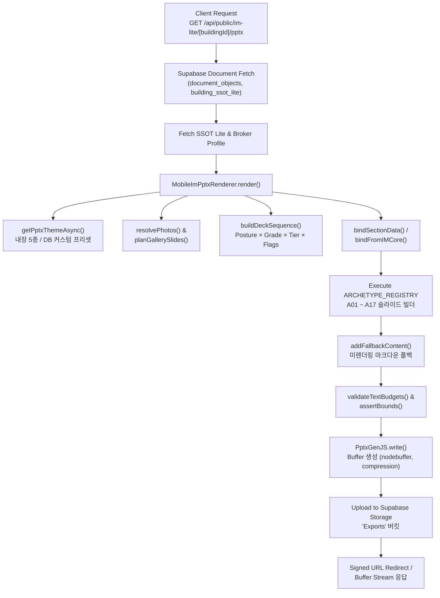

# 📊 CREDEAL PPTX IM 작성 방법론 · 아키텍처 · 섹션 구성 정밀 감사 보고서

> **문서 ID**: `DOC-TEST0824-PPTX-METHODOLOGY`  
> **생성 일시**: 2026-08-24 19:40 (KST)  
> **감사 대상**: `src/domain/building/mobile-im/pptx/` 전체 파이프라인  
> **감사 범위**: PPTX 생성 기술 스택, 파이프라인 아키텍처, 17개 아키타입 슬라이드, 섹션 구성, 덱 시퀀싱 로직, 데이터 바인딩, 품질 게이트, 디자인 시스템

---

## 📑 목차

1. [기술 스택 (Technology Stack)](#1-기술-스택)
2. [전체 파이프라인 아키텍처 (Pipeline Architecture)](#2-전체-파이프라인-아키텍처)
3. [파일 인벤토리 (File Inventory)](#3-파일-인벤토리)
4. [핵심 모듈 상세 (Core Module Details)](#4-핵심-모듈-상세)
5. [17개 아키타입 슬라이드 카탈로그 (Archetype Catalog A01–A17)](#5-17개-아키타입-슬라이드-카탈로그)
6. [덱 시퀀싱 로직 (Deck Sequencing Logic)](#6-덱-시퀀싱-로직)
7. [데이터 바인딩 파이프라인 (Data Binding Pipeline)](#7-데이터-바인딩-파이프라인)
8. [디자인 시스템 & 레이아웃 규격 (Design System)](#8-디자인-시스템--레이아웃-규격)
9. [품질 보증 체계 (Quality Assurance)](#9-품질-보증-체계)

---

## 1. 기술 스택

| 구분 | 도구 / 라이브러리 | 버전 | 역할 |
|---|---|---|---|
| **프레젠테이션 엔진** | `pptxgenjs` | v4.0.1 | 프로그래밍 방식 PPTX 생성, `LAYOUT_WIDE` (13.333" × 7.5", 16:9 와이드스크린) |
| **이미지 처리** | `sharp` | v0.33.5 | 서버사이드 WebP/PNG → JPEG 압축, 1280px 다운샘플링, OSM 타일 합성, SVG 오버레이 래스터화 |
| **아카이브 / 검증** | `jszip` / `adm-zip` | v3.10.1 / v0.6.0 | PPTX 바이너리 언팩, XML 파싱 (시각적 QA 테스트용) |
| **AI / LLM 클라이언트** | Vercel AI SDK (`ai`) + OpenAI SDK | v6.0.208 / v6.37.0 | `gpt-5.6-terra` / `gpt-4o` 모델, 섹션 내러티브 생성 |
| **데이터베이스 / 스토리지** | Supabase (`@supabase/supabase-js`) | v2.105.4 | `building_ssot_lite`, `document_objects`, `pptx_custom_presets`, Storage `Exports` 버킷 |
| **프레임워크** | Next.js | v16.2.6 | Node.js 런타임, Vercel Pro (`maxDuration = 300`), API Route 기반 서버리스 |
| **지도 API** | Kakao Maps Static API / OpenStreetMap | - | 정적 지도 이미지 생성 및 POI 마커 오버레이 |

---

## 2. 전체 파이프라인 아키텍처



### 2.1 API 엔드포인트 구성

| 엔드포인트 | 메서드 | 용도 | 인증 |
|---|---|---|---|
| `/api/public/im-lite/[buildingId]/pptx` | `GET` | Basic/Pro PPTX 다운로드, Storage 업로드 후 Signed URL 리다이렉트 | Public (문서 접근 검증) |
| `/api/public/im-pro/[grantId]/pptx` | `GET` | Pro 검증 다운로드 (워터마크, NDA 체크, 접근 제한, 감사 로그) | Grant 기반 인증 |
| `/api/broker/pptx-preset` | `GET` / `POST` | 프리셋 목록 조회 / 커스텀 프리셋 생성 | Broker 인증 |
| `/api/broker/pptx-preset/[id]` | `GET` / `PUT` / `DELETE` | 개별 프리셋 CRUD & 사용 횟수 카운터 | Broker 인증 |

---

## 3. 파일 인벤토리

### 3.1 핵심 오케스트레이션 계층

| 파일 경로 | 역할 |
|---|---|
| [`pptx-renderer.ts`](file:///c:/Users/User/cre-dealcard/src/domain/building/mobile-im/pptx/pptx-renderer.ts) | **메인 오케스트레이터** — `MobileImPptxRenderer` 클래스. 테마 격리, 덱 시퀀싱, 데이터 바인딩, 슬라이드 생성 루프, 폴백, 워터마크, 버퍼 생성 총괄 |
| [`deck-sequencer.ts`](file:///c:/Users/User/cre-dealcard/src/domain/building/mobile-im/pptx/deck-sequencer.ts) | **덱 시퀀서** — Posture × Grade × Tier × Income Archetype × 특수 플래그 기반 동적 슬라이드 시퀀스 결정 |
| [`data-binder.ts`](file:///c:/Users/User/cre-dealcard/src/domain/building/mobile-im/pptx/data-binder.ts) | **데이터 바인더** — 마크다운 파싱(`bindSectionData`) 또는 IMCore 직접 바인딩(`bindFromIMCore`) 이중 모드 |
| [`imlib.ts`](file:///c:/Users/User/cre-dealcard/src/domain/building/mobile-im/pptx/imlib.ts) | **컴포넌트 라이브러리** — 기하, 색상, 타이포, 슬라이드 프리미티브 (`light`, `dark`, `head`, `foot`, `stat`, `rows`, `table`, `callout`, `chip`, `card`, `waterfall`, `stack`, `locmap`, `watermark`, `withThemeIsolation`) |
| [`pptx-theme.ts`](file:///c:/Users/User/cre-dealcard/src/domain/building/mobile-im/pptx/pptx-theme.ts) | **테마 & 프리셋** — 5개 내장 프리셋, DB 커스텀 프리셋 로더(`getPptxThemeAsync`), WCAG AA 대비비 검증기 |

### 3.2 품질 · 안전 · 유틸리티 계층

| 파일 경로 | 역할 |
|---|---|
| [`gallery-planner.ts`](file:///c:/Users/User/cre-dealcard/src/domain/building/mobile-im/pptx/gallery-planner.ts) | **갤러리 플래너** — 1~12장 사진 → 1~4개 슬라이드, 6종 레이아웃 토폴로지 자동 결정 |
| [`text-budget.ts`](file:///c:/Users/User/cre-dealcard/src/domain/building/mobile-im/pptx/text-budget.ts) | **텍스트 예산** — CJK 글자 수 제한, 한국어 문장 경계 절단(`enforceTextBudget`), 인쇄 경계 검증(`assertBounds`) |
| [`basis-enforcer.ts`](file:///c:/Users/User/cre-dealcard/src/domain/building/mobile-im/pptx/basis-enforcer.ts) | **재무 기준 강제** — Cap Rate 기준(Basis) 라벨링, GOP/NOI 페어링 검증, FAR 계산, 임대료 상한 |
| [`provenance-mapper.ts`](file:///c:/Users/User/cre-dealcard/src/domain/building/mobile-im/pptx/provenance-mapper.ts) | **출처 매퍼** — 5단계 법적 출처 등급 (`pub`공부, `exp`전문가, `sel`매도인, `brk`중개인, `ai`AI추정) |
| [`utils/image-optimizer.ts`](file:///c:/Users/User/cre-dealcard/src/domain/building/mobile-im/pptx/utils/image-optimizer.ts) | **이미지 최적화** — Sharp 기반 JPEG 75%/1280px, 카카오/OSM 정적 지도 합성, POI SVG 오버레이 |
| [`utils/html-parser.ts`](file:///c:/Users/User/cre-dealcard/src/domain/building/mobile-im/pptx/utils/html-parser.ts) | **HTML/MD 파서** — 마크다운 테이블 추출, KRW 컴팩트 포맷터 |

### 3.3 아키타입 빌더 (17개)

| 파일 | 아키타입 | 슬라이드명 |
|---|:---:|---|
| [`a01-cover.ts`](file:///c:/Users/User/cre-dealcard/src/domain/building/mobile-im/pptx/archetypes/a01-cover.ts) | A01 | 표지 (Cover) |
| [`a02-stat-grid.ts`](file:///c:/Users/User/cre-dealcard/src/domain/building/mobile-im/pptx/archetypes/a02-stat-grid.ts) | A02 | 핵심 지표 요약 (Stat Grid) |
| [`a03-large-table.ts`](file:///c:/Users/User/cre-dealcard/src/domain/building/mobile-im/pptx/archetypes/a03-large-table.ts) | A03 | 대형 테이블 (렌트롤 / 비교사례) |
| [`a04-asymmetric-7-5.ts`](file:///c:/Users/User/cre-dealcard/src/domain/building/mobile-im/pptx/archetypes/a04-asymmetric-7-5.ts) | A04 | 비대칭 7:5 레이아웃 (건물/토지/사용계획) |
| [`a05-asymmetric-7-4.ts`](file:///c:/Users/User/cre-dealcard/src/domain/building/mobile-im/pptx/archetypes/a05-asymmetric-7-4.ts) | A05 | 비대칭 7:4 레이아웃 (수익/KPI/가치제안) |
| [`a06-diagram.ts`](file:///c:/Users/User/cre-dealcard/src/domain/building/mobile-im/pptx/archetypes/a06-diagram.ts) | A06 | 입지 다이어그램 (Location Map) |
| [`a07-three-block.ts`](file:///c:/Users/User/cre-dealcard/src/domain/building/mobile-im/pptx/archetypes/a07-three-block.ts) | A07 | 3블록 리스크 (Due Diligence) |
| [`a08-dual-table.ts`](file:///c:/Users/User/cre-dealcard/src/domain/building/mobile-im/pptx/archetypes/a08-dual-table.ts) | A08 | 이중 테이블 비교 (Dual Table) |
| [`a09-process.ts`](file:///c:/Users/User/cre-dealcard/src/domain/building/mobile-im/pptx/archetypes/a09-process.ts) | A09 | 진행 절차 (Process) |
| [`a10-closing.ts`](file:///c:/Users/User/cre-dealcard/src/domain/building/mobile-im/pptx/archetypes/a10-closing.ts) | A10 | 마감 & 면책 (Closing) |
| [`a11-room-spec.ts`](file:///c:/Users/User/cre-dealcard/src/domain/building/mobile-im/pptx/archetypes/a11-room-spec.ts) | A11 | 호실 사양 (Room Spec) |
| [`a12-ownership.ts`](file:///c:/Users/User/cre-dealcard/src/domain/building/mobile-im/pptx/archetypes/a12-ownership.ts) | A12 | 소유 구조 (Ownership) |
| [`a13-operating.ts`](file:///c:/Users/User/cre-dealcard/src/domain/building/mobile-im/pptx/archetypes/a13-operating.ts) | A13 | 운영 KPI (Operating) |
| [`a14-gallery.ts`](file:///c:/Users/User/cre-dealcard/src/domain/building/mobile-im/pptx/archetypes/a14-gallery.ts) | A14 | 사진 갤러리 (Gallery) |
| [`a15-thesis.ts`](file:///c:/Users/User/cre-dealcard/src/domain/building/mobile-im/pptx/archetypes/a15-thesis.ts) | A15 | 투자 논거 (Thesis) |
| [`a16-investment-structure.ts`](file:///c:/Users/User/cre-dealcard/src/domain/building/mobile-im/pptx/archetypes/a16-investment-structure.ts) | A16 | 자본 구조 (Investment Structure) |
| [`a17-pre-completion-marketing.ts`](file:///c:/Users/User/cre-dealcard/src/domain/building/mobile-im/pptx/archetypes/a17-pre-completion-marketing.ts) | A17 | 준공전 마케팅 (Pre-completion) |

### 3.4 상위 도메인 계층 (콘텐츠 생성)

| 파일 경로 | 역할 |
|---|---|
| [`writer.ts`](file:///c:/Users/User/cre-dealcard/src/domain/building/mobile-im/writer.ts) | **4단계 위상 병렬 생성 오케스트레이터** — 섹션 의존관계 기반 병렬 실행 |
| [`im-context-builder.ts`](file:///c:/Users/User/cre-dealcard/src/domain/building/mobile-im/im-context-builder.ts) | SSoT Lite 정규화, 재무 전처리, RAG 컨텍스트 빌더 |
| [`im-section-generator.ts`](file:///c:/Users/User/cre-dealcard/src/domain/building/mobile-im/im-section-generator.ts) | AI LLM 섹션 생성기 + 품질 게이트 + 결정적 템플릿 폴백 |
| [`section-catalog.ts`](file:///c:/Users/User/cre-dealcard/src/domain/building/mobile-im/section-catalog.ts) | 5개 투자 포스처 × 7개 섹션 카탈로그 |
| [`archetype-registry.ts`](file:///c:/Users/User/cre-dealcard/src/domain/building/mobile-im/archetype-registry.ts) | Income 아키타입(R-INC-01~04) & 비소득 아키타입 자동 추천 엔진 |
| [`narrative-prompt.ts`](file:///c:/Users/User/cre-dealcard/src/domain/building/mobile-im/narrative-prompt.ts) | 한국어 CRE 시스템 프롬프트, B2B/B2C 용어 정규화, 페르소나 격리 |
| [`posture-prompts.ts`](file:///c:/Users/User/cre-dealcard/src/domain/building/mobile-im/posture-prompts.ts) | 5개 포스처별 프롬프트 오버레이 |

---

## 4. 핵심 모듈 상세

### 4.1 MobileImPptxRenderer (오케스트레이터)

```typescript
// 핵심 실행 흐름 (pptx-renderer.ts L263~L588)
class MobileImPptxRenderer {
  async render(input: MobileImPptxInput): Promise<MobileImPptxOutput> {
    // 0. D등급 + Pro 조합 차단
    // 1. PptxGenJS 인스턴스 생성 (LAYOUT_WIDE)
    // 2. 비동기 테마 로딩 (getPptxThemeAsync)
    // 3. withThemeIsolation()으로 스레드 안전 테마 격리
    // 4. resolvePhotos() + planGallerySlides() — 사진 분석 & 갤러리 기획
    // 5. buildDeckSequence() — 슬라이드 시퀀스 결정
    // 6. bindSectionData() / bindFromIMCore() — 데이터 바인딩
    // 7. ARCHETYPE_REGISTRY 순회 → 슬라이드 생성
    // 8. addFallbackContent() — 미렌더링 콘텐츠 폴백
    // 9. validateTextBudgets() — 텍스트 예산 검증
    // 10. PptxGenJS.write() → Buffer 출력
  }
}
```

**주요 입력 인터페이스 (`MobileImPptxInput`)**:

| 필드 | 타입 | 설명 |
|---|---|---|
| `buildingId` | `string` | 대상 건물 ID |
| `tier` | `'basic' \| 'pro'` | 기본 / 프로 티어 |
| `preset` | `string?` | 프리셋 ID (내장 5종 또는 UUID 커스텀) |
| `posture` | `InvestmentPosture?` | 투자 포스처 (`income`, `owner_occupied`, `development`, `operating`, `trading`) |
| `grade` | `'A' \| 'B' \| 'C' \| 'D'?` | 데이터 품질 등급 |
| `incomeArchetype` | `'R-INC-01' ~ 'R-INC-04'?` | 소득형 하위 아키타입 |
| `hasViolation` | `boolean?` | 위반건축물 여부 |
| `hasJointCollateral` | `boolean?` | 공동담보 설정 여부 |
| `doc` | `{ title, body, sections }` | IM 문서 데이터 |
| `building` | `{ area_signal, asset_type, price_band, ... }` | 건물 메타데이터 |
| `broker` | `{ display_name, company_name, phone, ... }` | 중개사 정보 |
| `watermark` | `{ requesterName, phoneLast4, timestamp }?` | Pro 전용 워터마크 |
| `provenance` | `Record<string, ProvenanceKind>?` | 데이터 출처 등급 맵 |
| `logoUrl` | `string?` | 중개법인 로고 URL |

### 4.2 Writer (4단계 위상 병렬 콘텐츠 생성)

| 단계 | 실행 모드 | 섹션 | 의존성 |
|---|---|---|---|
| **Stage 1** | 병렬 (동시성 4) | `property_overview`, `location_access`, `lease_status`, `next_steps`, `site_analysis`, `occupancy_fit`, `operation_overview`, `market_position` | 없음 (독립) |
| **Stage 2** | 순차 | `income_analysis`, `development_feasibility`, `gop_analysis`, `cost_comparison`, `comparable_analysis` | Stage 1 완료 필요 |
| **Stage 3** | 순차 | `risk_check` | Stage 1~2 완료 필요 |
| **Stage 4** | 순차 | `investment_thesis` | 전 단계 완료 필요 |

### 4.3 LLM 프롬프트 아키텍처

- **시스템 프롬프트 코어** (`MOBILE_IM_NARRATIVE_CORE`):
  - 2~4문장 서사 스타일, 결론 선행(So What?) 원칙
  - 수익률 보장 표현 금지 ("100% 보장" 등)
  - B2B/B2C 용어 프로파일 (원어 → 표준 용어 전환)
  - **페르소나 격리 원칙**: 생성 텍스트에 페르소나 라벨 직접 노출 절대 금지

- **포스처별 오버레이** (`POSTURE_OVERLAYS`):

| 포스처 | LLM 강조 지시 사항 |
|---|---|
| `income` | 순자기자본(Net Equity), 월 현금흐름, 토지가액비율 강조 |
| `owner_occupied` | 10년 임차 vs 매입 비교, 세무 감가상각, 사옥 브랜딩권 |
| `development` | 잔여 용적률, 평당 건축비, 개발 마진 |
| `operating` | GOP 마진, RevPAR/ADR, 운영사 계약 조건 |
| `trading` | 비교사례 할인율, 시장 유동성, 2~3년 플립 출구 IRR |

---

## 5. 17개 아키타입 슬라이드 카탈로그

### A01 — Cover (표지)

| 항목 | 사양 |
|---|---|
| **배경** | Dark (프리셋별 5종 커버 스타일) |
| **레이아웃** | 전체 캔버스 다크 배경 + 커버 스타일별 기하학적 장식 |
| **콘텐츠** | CRE DEAL 워드마크 (10pt brass), `INVESTMENT MEMORANDUM` 키커, 건물 타이틀 (40pt bold), 자산유형 부제목 (14pt), 매각가 하이라이트 박스 (22pt), 중개사 정보, 법인 로고, 커버 히어로 이미지 |
| **커버 스타일 5종** | `institutional_masses` (3개 기하 블록), `split` (좌우 50:50 분할), `hero_dark` (전면 다크 + 골드 상하선), `corporate_card` (플로팅 카드), `obsidian_glow` (동심원 그라디언트) |
| **데이터 키** | `cover` → `data.title`, `data.subtitle`, `data.priceBand`, `data.tags`, `data.coverImageUrl`, `data.logoUrl` |

### A02 — Stat Grid (핵심 지표 요약)

| 항목 | 사양 |
|---|---|
| **배경** | Light |
| **레이아웃** | 리드 문장 (15pt bold) + brass 수평선 + 2~4열 KPI 카드 그리드 + 3개 투자 하이라이트 카드 |
| **KPI 카드 규격** | 높이 1.4", 동적 폰트 사이징 (≤6자: 25pt, ≤12자: 18pt, ≤20자: 14pt, 이상: 11pt) |
| **하이라이트** | 번호 배지 (`01`, `02`, `03`), brass 악센트, 11.5pt 한국어 텍스트 |
| **데이터 키** | `summary` → `data.leadSentence`, `data.metrics[]`, `data.heroCard`, `data.keyPoints[]` |

### A03 — Large Table (대형 테이블)

| 항목 | 사양 |
|---|---|
| **배경** | Light |
| **레이아웃** | 전폭 구조화 데이터 테이블 (최대 12행, 자동 페이지네이션) + 각주 + 신호등 리스크 콜아웃 |
| **테이블 스타일** | 교대 행 배경 (`C.bg`/`C.tint`), 헤더 bold, 셀 45자 절단, 스마트 컬럼 너비 가중치 (`computeSmartColumnWidths`) |
| **용도** | 렌트롤(`rentRoll`), 비교거래사례(`comps`), 임차현황 |
| **빈 데이터 폴백** | 실사 체크리스트 & 수익률 분석 주의사항 2열 카드 |

### A04 — Asymmetric 7:5 (비대칭 좌우분할)

| 항목 | 사양 |
|---|---|
| **배경** | Light |
| **레이아웃** | 좌측 7.5" (속성 행, 14pt) + 수직 brass 분할선 + 우측 4.2" (외관 사진 또는 콜아웃 카드) |
| **좌측 콘텐츠** | `L.rows()` — 주소, 대지면적, 연면적, 층수, 준공연도, 용도지역, 주차 등 건물/토지 물리적 제원 |
| **우측 콘텐츠** | 외관 사진 (Sharp 최적화, cover 사이징, h=3.20") + 하이라이트 콜아웃 (h=1.55"). 사진 없으면 2단 평가/실사 콜아웃 카드 |
| **용도** | `building`, `land`, `plan`, `stability`, `vacancy`, `current`, `value`, `operator`, `turnover`, `price`, `marketPosition` |

### A05 — Asymmetric 7:4 (KPI + 가치제안)

| 항목 | 사양 |
|---|---|
| **배경** | Light |
| **레이아웃** | 상단: 3열 KPI 카드 그리드 (최대 2행 6카드) + 하단: 전폭 또는 2열 투자 가치제안 콜아웃 배너 |
| **KPI 카드 Row 1** | h=1.30", 22pt 값 폰트, 자동 라벨 사이징 (9.5→8.5→8.0pt, CRE 전문용어 보호) |
| **KPI 카드 Row 2** | h=1.15", 18pt 값 폰트 |
| **가치제안** | 리드 내러티브 추출, AI 면책 문구 제거, h≤1.40" |
| **용도** | `profit`, `rentGap`, `upside`, `leasing`, `remodel`, `feasibility`, `revenue`, `seasonality`, `scale`, `dcf`, `sensitivity`, `totalReturn`, `trend` |

### A06 — Diagram (입지 지도)

| 항목 | 사양 |
|---|---|
| **배경** | Light |
| **레이아웃** | 좌측 5.6" 지도 패널 + 우측 6.1" 입지 속성 열 |
| **지도 우선순위** | 1순위: 카카오 Static Map (`fetchKakaoMapImage`), 2순위: OSM 타일 합성 + Mercator POI SVG 오버레이, 3순위: `L.locmap` 시맨틱 플레이스홀더 |
| **우측** | `L.rows()` 입지 속성 (역 거리, 도로폭, 상권, 유동인구, 13pt) + 핵심 입지 콜아웃 |
| **데이터 키** | `location` → `data.coordinates`, `data.mapImageUrl`, `data.poiSpots[]` |

### A07 — Three Block (리스크 3블록)

| 항목 | 사양 |
|---|---|
| **배경** | Light 또는 Dark |
| **레이아웃** | 3개 균등 수평 카드 (w≈3.84", h=4.00") + 전폭 하단 고지 바 |
| **3 필러** | ① 법적·용도 규제 (위반건축물, 지구단위계획, 도로접면), ② 임대차·명도 리스크 (상임법 10년 갱신권, 대항력, 명도 합의), ③ 물리·시설 상태 (승강기/주차장 정기검사, 누수/균열, 수전/정화조) |
| **카드 구조** | 상단 brass 악센트 바(0.05"), 카테고리 헤더(13.5pt bold brass), 상태 배지(12.5pt bold), 불릿 포인트(hung indent) |
| **공동담보 경고** | `hasJointCollateral` 시 자동 주입 |

### A08 — Dual Table (이중 테이블)

| 항목 | 사양 |
|---|---|
| **배경** | Light |
| **레이아웃** | 좌 7.3" (2개 적층 테이블) + 우 4.5" (2개 콜아웃 카드) |
| **용도** | `vsLease` (자가 vs 임차), `cost` (투입비용), `tax` (세금), `loan` (대출 시나리오) |

### A09 — Process (진행 절차)

| 항목 | 사양 |
|---|---|
| **배경** | Light |
| **레이아웃** | 3~4개 수평 프로세스 카드 + brass 번호 원형(ø0.48") + 연결 화살표 |
| **기본 3단계** | 01 관심 표명 → 02 NDA 체결 → 03 현장 실사 |

### A10 — Closing (마감 & 면책)

| 항목 | 사양 |
|---|---|
| **배경** | Dark |
| **레이아웃** | 상단 3단계 프로세스 바 + 좌측 출처등급(Provenance) 레전드 + 우측 법적 면책 카드 + 하단 브로커 로고 푸터 |
| **Provenance 5등급** | `✓공부확인`(1.00), `★전문가검증`(0.95), `▲매도인고지`(0.65), `●중개인입력`(0.60), `◇AI추정·가정`(0.30) |

### A11 — Room Spec (호실 사양)

| 항목 | 사양 |
|---|---|
| **레이아웃** | 좌 7.1" 호실 테이블(10pt) + 우 4.6" 2×2 미니 통계 그리드 + 위반 경고 |

### A12 — Ownership (소유 구조)

| 항목 | 사양 |
|---|---|
| **레이아웃** | 좌 7.1" 소유권 테이블(등기, 지분, 근저당) + 우 4.6" 3개 콜아웃 카드 |

### A13 — Operating KPI (운영 지표)

| 항목 | 사양 |
|---|---|
| **레이아웃** | 좌 7.3" KPI 행(RevPAR, ADR, 가동률, GOP 마진) + 좌하단 안정성 콜아웃 + 우 4.1" 3개 수직 통계 카드 |

### A14 — Gallery (사진 갤러리)

| 항목 | 사양 |
|---|---|
| **레이아웃** | `gallery-planner.ts` 기반 동적 멀티 레이아웃 엔진 |
| **6종 토폴로지** | `FULL_WIDE`(1장: 12.1"×5.15"), `DUAL_LANDSCAPE`(2장 좌우), `DUAL_PORTRAIT`(2장 세로), `ONE_LARGE_TWO_SMALL_H`(3장: 좌60%+우40%×2), `ONE_LARGE_TWO_SMALL_V`(3장: 상+하2), `GRID_2X2`(4장: 2×2) |
| **오버레이** | 카테고리 배지(좌상단 반투명 필), 캡션 바(하단 40% 투명도 밴드) |
| **최대** | 12장 사진 → 4개 갤러리 슬라이드 |

### A15 — Thesis (투자 논거)

| 항목 | 사양 |
|---|---|
| **레이아웃** | 1×3 또는 2×2 필러 카드 그리드 + 선택적 벤치마크 테이블 + 전폭 종합가치제안 리본 배너 |
| **필러 카드** | brass 상/좌 악센트, 번호 배지(`01`~`04`), 14~15pt bold 제목, 12pt 설명 |
| **Takeaway 리본** | brass 틴트 컨테이너(`C.brassT`), "종합 가치 제안" 배지 + 결론 문장 |

### A16 — Investment Structure (자본 구조)

| 항목 | 사양 |
|---|---|
| **레이아웃** | 2개 균등 열(w=5.91", h=4.80") |
| **좌측** | 총 취득비용 구성: 매매가(A), 취득세(4.6%), 중개수수료(0.9%), 총비용, 보증금승계(-), 선순위대출(-), 순자기자본 |
| **우측** | LTV 레버리지 시나리오 테이블 (무차입 0%, 보수적 40%, 표준 50%) + 역레버리지 경고 배너 (grossYield < loanRate 시 amber 경고) |

### A17 — Pre-completion Marketing (준공전 마케팅)

| 항목 | 사양 |
|---|---|
| **레이아웃** | 2개 균등 열(w=5.91", h=4.80") |
| **좌측** | 층별 스태킹 플랜 테이블 (층, 추천 용도, 전용면적, 타깃 테넌트) |
| **우측** | 개발 메트릭 행 + 규제 완화 기한 카운트다운 배지 (`⏳ 한시적 용적률 완화 기한: YYYY-MM-DD (잔여 N일)`) |

---

## 6. 덱 시퀀싱 로직

### 6.1 시퀀스 결정 변수

슬라이드 시퀀스는 `buildDeckSequence()` 함수에서 다음 5개 변수의 조합으로 결정됩니다:

1. **투자 포스처** (`income` / `owner_occupied` / `development` / `operating` / `trading`)
2. **데이터 품질 등급** (`A` / `B` / `C` / `D`)
3. **IM 티어** (`basic` / `pro`)
4. **소득 아키타입** (`R-INC-01` 초안정형 / `R-INC-02` 임대료갭형 / `R-INC-03` 공실해소형 / `R-INC-04` 리모델링형)
5. **특수 플래그** (`hasViolation`, `hasJointCollateral`, `hasPhotos`)

### 6.2 등급별 슬라이드 구성

#### D등급 (최소 3~5 슬라이드)

```
A01 Cover → [A14 Gallery] → A02 Summary → A09 Process → A10 Closing
```

#### B/C등급 (컴팩트 7~13 슬라이드)

```
A01 Cover → [A14 Gallery] → A02 Summary → A06 Location
  → 포스처별 본문 2~3 슬라이드
  → A07 Risk → A15 Thesis → A09 Process → A10 Closing
```

#### A등급 (풀 기관투자 덱, 최대 24 슬라이드)

```
A01 Cover → [A14 Gallery] → A02 Summary → A06 Location → A04 Land → A04 Building
  → 포스처별 심층 본문 4~6 슬라이드
  → A등급 전용 재무 모델링:
    - A05 DCF 분석
    - A05 민감도 분석
    - A05 총수익률
    - A08 대출 시나리오 (위반건축물 시 억제)
    - A08 세금 시나리오
  → A15 Thesis → A07 Risk → A09 Process → A10 Closing
```

### 6.3 포스처별 본문 슬라이드 배열 (A등급)

| 포스처 | 소득 아키타입 | 본문 시퀀스 |
|---|---|---|
| **income** | `R-INC-01` 초안정형 | A03 렌트롤 → A04 안정성 → A05 수익구조 → A16 자본구조 → A03 비교사례 |
| **income** | `R-INC-02` 임대료갭형 | A03 렌트롤 → A05 임대료갭 → A05 인상경로 → A16 자본구조 → A03 비교사례 |
| **income** | `R-INC-03` 공실해소형 | A03 렌트롤 → A04 공실분석 → A05 임차유치 → A16 자본구조 → A03 비교사례 |
| **income** | `R-INC-04` 리모델링형 | A03 렌트롤 → A04 현황 → A05 리모델링 → A16 자본구조 → A03 비교사례 |
| **owner_occupied** | - | A04 사용계획 → A08 자가비교 → A06 통근 → A04 자산가치 |
| **development** | - | A04 토지상세 → A05 신축규모 → A04 명도 → A08 투입비용 → A17 스태킹 → A05 사업수지 |
| **operating** | - | A13 운영KPI → A05 매출 → A05 계절성 → A04 운영사 |
| **trading** | - | A03 비교사례 → A05 거래동향 → A04 회전율 → A04 가격 |

### 6.4 조건부 억제 & 우아한 퇴행 규칙

1. **D등급 + Pro 차단**: `grade === 'D' && tier === 'pro'` 시 렌더링 에러 (데이터 보강 필요)
2. **위반건축물 억제**: `hasViolation === true` → 대출 시나리오(A08) 슬라이드 자동 억제
3. **공동담보 경고**: `hasJointCollateral === true` → A07 Risk에 경고 블록 자동 주입
4. **데이터 충분성 검사**: 빈 데이터 페이로드 슬라이드 자동 억제 (경고 로그 기록)
5. **24페이지 하드캡**: 시퀀스가 24장 초과 시 중간 슬라이드 트리밍 (Risk/Closing 반드시 보존)

---

## 7. 데이터 바인딩 파이프라인

### 7.1 이중 바인딩 아키텍처

| 경로 | 함수 | 입력 | 사용 조건 |
|---|---|---|---|
| **레거시 마크다운** | `bindSectionData()` | `doc.sections[]` 마크다운 문자열 | 기본값 (`RENDER_PATH !== 'imcore'`) |
| **IMCore 직접** | `bindFromIMCore()` | 정형화된 `IMCore` 도메인 엔티티 | `RENDER_PATH === 'imcore'` 환경변수 설정 시 |

### 7.2 마크다운 파싱 세부 기능

| 함수 | 역할 |
|---|---|
| `parseMarkdownTable()` | 마크다운 테이블 → 2D 문자열 배열 추출 |
| `mergeRentRollTables()` | 동일 헤더 멀티 테이블 병합 |
| `extractStatMetrics()` | 볼드 키-값 메트릭 추출 → `{label, value, unit, sub}` |
| `extractCallouts()` | 블록인용(`>`) → 콜아웃 객체, 감성 자동 감지 (`good`, `warn`, `bad`, `info`, `brass`) |
| `sanitizePersona()` | 내부 페르소나 프롬프트/연령 참조 제거 |

### 7.3 섹션 타입 → 데이터 키 매핑

| 섹션 타입 | 주 데이터 키 | 파생 데이터 키 |
|---|---|---|
| `property_overview` | `building` (A04) | `land` (A04), `summary` (A02) |
| `location_access` | `location` (A06) | - |
| `lease_status` | `rentRoll` (A03) | `stability` (A04) |
| `income_analysis` | `profit` (A05) | `capital` (A16), `dcf` (A05), `sensitivity` (A05), `loan` (A08), `tax` (A08) |
| `risk_check` | `risk` (A07) | - |
| `investment_thesis` | `thesis` (A15) | - |
| `next_steps` | `process` (A09) | - |

---

## 8. 디자인 시스템 & 레이아웃 규격

### 8.1 캔버스 & 포지셔닝 상수

| 상수 | 값 | 단위 | 설명 |
|---|---|---|---|
| `W` | 13.333 | inches | 캔버스 폭 (`LAYOUT_WIDE` 16:9) |
| `H` | 7.500 | inches | 캔버스 높이 |
| `M` | 0.620 | inches | 좌우 마진 |
| `CW` | 12.093 | inches | 콘텐츠 폭 ($W - 2M$) |
| 인쇄 안전영역 | 12.713 × 6.75 | inches | `assertBounds` 최대 허용 범위 |

### 8.2 타이포그래피

| 역할 | 폰트 | 크기 범위 | 비고 |
|---|---|---|---|
| 한국어 본문 (`KR`) | `Pretendard` / `맑은 고딕` | 9.5~15pt | 포스처별 본문 |
| 한국어 제목 (`TITLE_KR`) | `Pretendard` / `Noto Serif KR` | 14~40pt | Executive 프리셋은 세리프 |
| 숫자·라틴 (`NUM`) | `Arial` | 10~25pt | KPI 카드 수치 |

### 8.3 텍스트 예산 (TEXT_LIMITS)

| 요소 | 최대 글자 수 | 비고 |
|---|---|---|
| `slideTitle` | 32 | 슬라이드 제목 |
| `kicker` | 35 | 상단 영문 키커 |
| `subTitle` | 50 | 부제목 |
| `leadSentence` | 100 | 리드 문장 |
| `statLabel` | 18 | KPI 라벨 (동적 폰트 축소) |
| `statValue` | 10 | KPI 수치 |
| `note` | 140 | 각주 |

### 8.4 테마 격리 (`withThemeIsolation`)

Node.js 서버 환경에서 동시 요청 시 전역 색상 상수(`C`, `CD`, `KR`, `TITLE_KR`) 간 간섭을 방지하기 위해, 모든 슬라이드 실행을 `withThemeIsolation(theme, async () => { ... })` 래퍼로 감싸 `finally` 블록에서 기본값을 복원합니다.

---

## 9. 품질 보증 체계

### 9.1 아키텍처적 강점

1. **엄격한 분리**: 내러티브 생성(`im-section-generator.ts`) ↔ 구조 시퀀싱(`deck-sequencer.ts`) ↔ 시각 프리미티브(`imlib.ts`) ↔ 레이아웃 조합(A01~A17 archetypes) 완전 분리
2. **우아한 퇴행**: AI 섹션 실패 또는 데이터 부재 시, 구조화된 결정적 테이블/KPI 카드/법적 체크리스트로 폴백 — 덱 생성 중단 없음
3. **WCAG AA 접근성**: 5개 프리셋 모두 대비비 자동 검증 (`validatePresetAccessibility`)
4. **인쇄 경계 검사**: `assertBounds`로 12.713" × 6.75" 안전영역 초과 방지
5. **반할루시네이션**: CJK 텍스트 예산 계산기, 컴플라이언스 기준 강제기(Cap Rate/FAR 법적 정확성)
6. **성능**: Sharp 인메모리 버퍼 처리 (base64 오버헤드 회피), 4개 동시성 레인 병렬 생성, 평균 24장 덱 8MB 이내

### 9.2 감사 결과 무결성

| 검증 항목 | 상태 | 비고 |
|---|---|---|
| CRE 용어 표준 준수 | ✅ | `basis-enforcer.ts`에서 Cap Rate, GOP, FAR 표기 강제 |
| 페르소나 격리 | ✅ | `sanitizePersona()`로 생성 텍스트 내 페르소나 라벨 제거 |
| 좌/우 비중복 렌더링 | ✅ | A04/A05에서 좌측=거시 컨텍스트/제원, 우측=사진/핵심 지표 콜아웃 분리 |
| AI 시각 E2E 테스트 | ✅ | `src/tests/e2e/ai-visual-e2e-runner.ts` 150DPI PNG 캡처 검증 |

---

*본 문서는 `src/domain/building/mobile-im/pptx/` 디렉토리 전체 31개 파일의 소스코드 정밀 감사를 통해 작성된 기술 분석 보고서입니다.*
