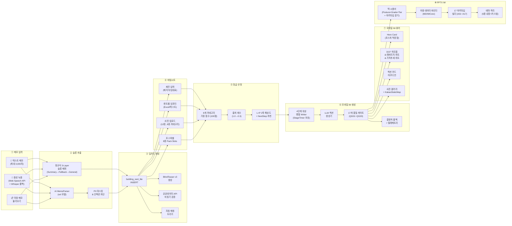
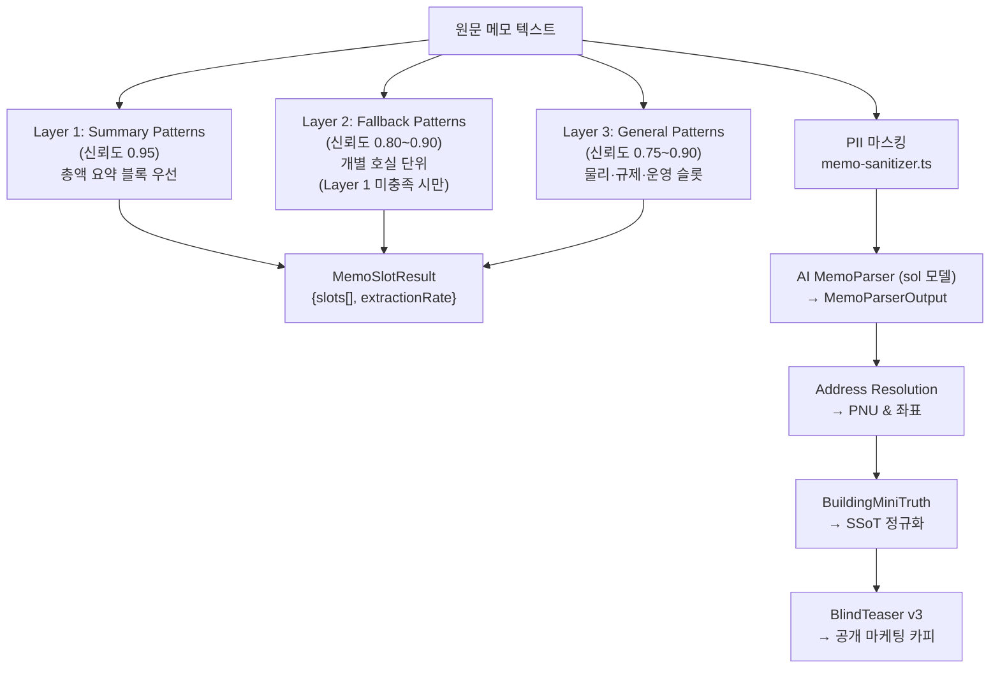
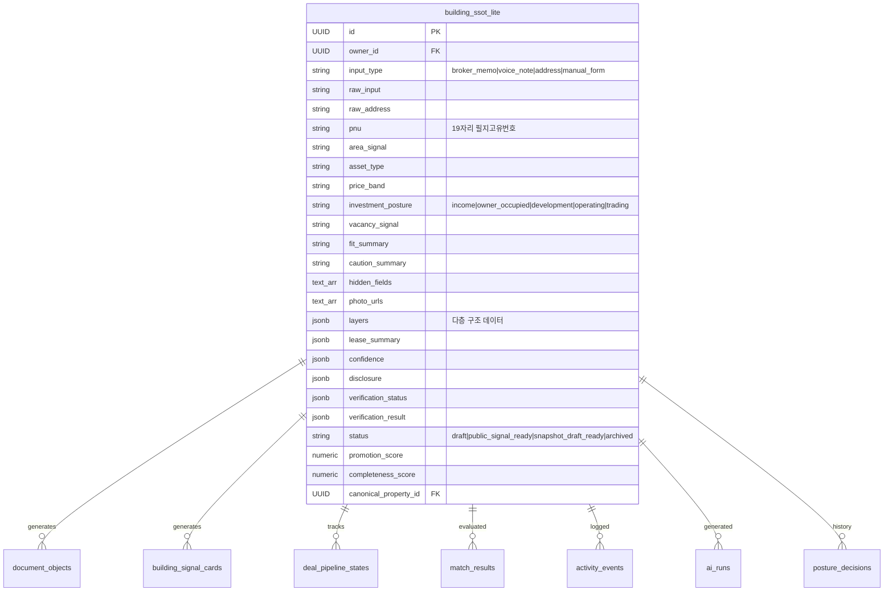
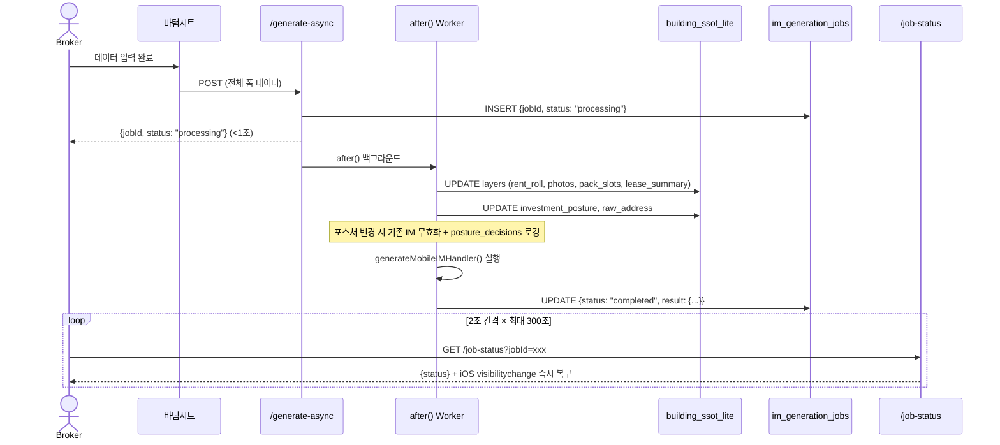

# 📋 CREDEAL 메모→딜카드→바텀시트→모바일IM→PPTX IM 파이프라인 기능 명세서

> **문서 ID**: `DOC-TEST0825-PIPELINE-SPEC-v2`  
> **생성 일시**: 2026-08-25 20:45 (KST)  
> **감사 대상**: 메모 입력 → 슬롯 추출 → 딜카드 생성 → 바텀시트 데이터 입력 → 등급 산정 → 모바일 IM 생성 → PPTX IM 렌더링 전체 파이프라인  
> **감사 범위**: 50+ 소스 파일, API 엔드포인트, Supabase 테이블, AI 에이전트 체인, 품질 게이트  
> **코드베이스 버전**: 2026-08-25 최신 (대폭 업그레이드 후 재감사)

---

## 📑 목차

1. [파이프라인 총괄 아키텍처](#1-파이프라인-총괄-아키텍처)
2. [Stage 1: 메모 입력 & 슬롯 추출](#2-stage-1-메모-입력--슬롯-추출)
3. [Stage 2: 딜카드 생성 & SSoT 데이터 모델](#3-stage-2-딜카드-생성--ssot-데이터-모델)
4. [Stage 3: 바텀시트 IM 데이터 입력](#4-stage-3-바텀시트-im-데이터-입력)
5. [Stage 4: 데이터 품질 등급 시스템](#5-stage-4-데이터-품질-등급-시스템)
6. [Stage 5: 모바일 IM 콘텐츠 생성](#6-stage-5-모바일-im-콘텐츠-생성)
7. [Stage 6: 모바일 IM 웹 뷰어 렌더링](#7-stage-6-모바일-im-웹-뷰어-렌더링)
8. [Stage 7: PPTX IM 렌더링 & 내보내기](#8-stage-7-pptx-im-렌더링--내보내기)
9. [전체 파일 인벤토리](#9-전체-파일-인벤토리)

---

## 1. 파이프라인 총괄 아키텍처



### 1.1 기술 스택 요약

| 계층 | 기술 | 역할 |
|---|---|---|
| 프레임워크 | Next.js (Vercel Pro, `maxDuration=300`) | 서버리스 API, `after()` 백그라운드, RSC |
| AI / LLM | Vercel AI SDK — `sol`(MemoParser), `gpt-5.6-terra`/`claude-sonnet-4-5`(섹션 생성) | 메모 파싱, 콘텐츠 생성, 품질 심사 |
| 데이터베이스 | Supabase (PostgreSQL + Storage + Vector) | SSoT, 프리셋, 이미지, 벡터 검색 |
| 프레젠테이션 | `pptxgenjs` v4.0.1 | PPTX 슬라이드 프로그래밍 생성 |
| 이미지 처리 | `sharp` v0.33.5 | JPEG 최적화, OSM 타일 합성, 지도 |
| 음성 인식 | Web Speech API (`ko-KR`) + Whisper 폴백 | 한국어 음성 → 텍스트 |

---

## 2. Stage 1: 메모 입력 & 슬롯 추출

### 2.1 입력 채널 3종

| 채널 | 컴포넌트 | 주요 기능 |
|---|---|---|
| **텍스트 메모** | `deal-card/new/page.tsx` | 최대 3,000자, 5단계 프로그레시브 로딩, 120s 타임아웃, 품질 게이트(422) & 중복 감지(409) |
| **음성 녹음** | `VoiceRecorder.tsx` | Web Speech API(한국어) + MediaRecorder→Whisper 폴백, 실시간 중간/최종 텍스트 |
| **저장 메모** | `UniversalMemoFAB.tsx` + `MemoImportModal` | 대시보드 FAB, 메모 보관함, 유형 필터링, 1-Click 딜카드 전환 |

### 2.2 하이브리드 3-Tier 슬롯 추출 전략



> [!IMPORTANT]
> **Layer 1 → Layer 2 계층적 우선순위**: Layer 1의 `보증금 총액 18억` 같은 총액 패턴이 Layer 2의 개별 `스타벅스 보증금 5억`보다 항상 우선합니다. 이는 호실별 임대료가 건물 전체 수치를 덮어쓰는 것을 방지합니다.

### 2.3 추출 슬롯 전체 목록 (24개)

| 슬롯명 | 타입 | 추출원 | 설명 |
|---|---|---|---|
| `address` / `exactAddressCandidate` | `string` | Regex + LLM | 도로명/지번 주소 |
| `region` / `areaSignal` | `string` | Regex + LLM + 온톨로지 | 정규화된 CRE 시장 권역 |
| `assetType` | `enum` (17종) | Regex + LLM | 근생빌딩, 사무용빌딩, 물류센터 등 |
| `investmentPosture` | `enum` (5종) | LLM | `income` / `owner_occupied` / `development` / `operating` / `trading` |
| `askingPriceKrw` | `number` (원) | Regex + LLM | 매각 희망가 |
| `monthlyRentKrw` | `number` (원) | Regex + LLM | 월 임대수입 총액 |
| `totalDepositKrw` | `number` (원) | Regex + LLM | 보증금 총액 |
| `loanAmountKrw` | `number` (원) | Regex + LLM | 대출 잔액 |
| `totalFloorAreaPyung` | `number` (평) | Regex + LLM | 연면적 |
| `landAreaPyung` | `number` (평) | Regex + LLM | 대지면적 |
| `buildYear` | `number` | Regex | 준공연도 |
| `floorsAboveGround` / `Underground` | `number` | Regex | 층수 (지상/지하) |
| `vacancyRatePct` | `number` (%) | Regex + LLM | 공실률 |
| `capRatePct` | `number` (%) | Regex + 역산 | 연 순수익률 |
| `roomCount` / `adrManwon` / `occupancyRatePct` / `gopMarginPct` | `number` | Regex + LLM | 운영(호텔) 지표 |
| `farPct` / `bcrPct` / `constructionCostManwon` | `number` | Regex + LLM | 개발 지표 |
| `pricePerPyeongManwon` / `holdingPeriodYears` | `number` | Regex + LLM | 매매 지표 |
| `monthlyRevenueKrw` | `number` (원) | Regex + LLM | 월 매출 |

### 2.4 PII 마스킹 체계

| 민감정보 유형 | 마스킹 토큰 | 패턴 |
|---|---|---|
| 주민등록번호 | `[RRN_A]` | `\d{6}-?[1-4]\d{6}` |
| 이메일 | `[EMAIL_A]` | 표준 이메일 패턴 |
| 전화번호 | `[PHONE_A]` | 모바일, 유선, VoIP, 15xx 대표번호 |
| 건물 번호·도로명 상세 | `[ADDR_DETAIL_A]` | `\d{1,4}-\d{1,4}`, 번지, [로길] |
| 소유주 이름 | `[OWNER_A]` | 소유주/건물주/매도인 + 인명 |
| 임차인 사명 | `[TENANT_A]` | 임차인/세입자/입주사 + 상호 |
| 건물 고유명 | `[BLDG_NAME_A]` | 타워/빌딩/센터/플라자 (꼬마빌딩 등 자산유형 제외) |

### 2.5 AI 에이전트 체인 (4단계)

| 단계 | 에이전트 | 모델 | 출력 |
|---|---|---|---|
| Step 1 | `MemoParser` | `sol` | `MemoParserOutput` — 40+ 구조화 슬롯 + 5개 포스처 시그널 서브오브젝트 |
| Step 1.5 | `resolveAddress` | 주소 API | PNU(19자리), 좌표(lat/lng) |
| Step 2 | `BuildingMiniTruth` | `sol` | SSoT 포맷 + `resolveAreaSignal` + `derivePriceBand` |
| Step 3 | `BlindTeaser` v3 | `sol` | 공개 카드: `hookCopy`, `curiosityHook`, `kakaoOgTitle`, `structureChips`, `boundaryNote` |

> [!TIP]
> **Anti-Fragility**: MemoParser와 BuildingMiniTruth 모두 Zod 유효성 검사 실패 시 수동 필드 복구 폴백을 갖추고 있어, LLM 출력의 구조적 편차에 강건합니다.

---

## 3. Stage 2: 딜카드 생성 & SSoT 데이터 모델

### 3.1 딜카드 생성 API 플로우

```
POST /api/broker/deal-card/from-memo
  ├── 1. requireBroker(req)                  → 브로커 인증
  ├── 2. validateMemoQuality(memo)           → CRE 시그널 ≥ 1개 필수 (422)
  ├── 3. sanitizeComplianceText(memo)        → 준법 텍스트 + 콜드모드 가드
  ├── 4. checkDuplicateBeforeCreation()      → PNU/지번 중복 (409)
  ├── 5. brokerDealCardFromMemo()            → 4단계 AI 체인 실행
  │       ├── runBrokerDealCard (AI)
  │       ├── geocodeAddress → 좌표·PNU
  │       ├── building_ssot_lite INSERT
  │       ├── building_signal_cards INSERT
  │       ├── document_objects INSERT (blind_teaser)
  │       ├── ai_runs 로깅 (토큰 사용량, 지연)
  │       ├── deal_casepacks 생성
  │       └── deal_pipeline_states 초기화
  ├── 6. classifyDealArchetype()             → 아키타입 분류
  ├── 7. validateAssetConstraints()          → 자산 제약 검증
  ├── 8. after(() => runAutoMatch())         → 비동기 매수자 자동 매칭
  ├── 9. after(() => verifyAgainstPublicData()) → 비동기 공공데이터 교차검증
  └── 10. after(() => linkBuildingToCanonicalProperty()) → 정식 부동산 연결
```

### 3.2 SSoT 핵심 데이터 모델 (`building_ssot_lite`)



#### `layers` JSONB 구조

| 레이어 키 | 주요 필드 | 용도 |
|---|---|---|
| `layers.finance` | `asking_price_krw`, `asking_price_manwon`, `monthly_rent_krw`, `monthly_rent_manwon`, `total_deposit_krw`, `loan_amount_krw` | 재무 핵심 지표 |
| `layers.lease_summary` | `total_deposit_krw`, `monthly_rent_krw`, `mgmt_fee_total_manwon` | 임대차 요약 |
| `layers.location` | `address`, `raw_address`, `pnu`, `coordinates: {lat, lng}` | 위치 정보 |
| `layers.photos` | `Array<{url, type, label}>` | 건물 사진 |
| `layers.building_register` | `approval_date`, `completion_era`, `total_floors`, `floors_above_ground` | 공공 API 검증 |
| `layers.land_use_plan` | `zoning` | 용도지역 |
| `layers.rent_roll` | `Array<FloorLease>` | 호실별 임대차 |
| `layers.financial_assumptions` | `opex_ratio_pct`, `vacancy_reserve_pct` | 재무 가정치 |
| `layers.pack_slots` | `PhysicalSpec`, `HospitalitySpec`, `DevelopmentPlan`, `VacatePlan`, `PermitRisk`, `OccupancyPlan`, `SectionalSpec`, `ResidentialSpec` | **8종 포스처별 Pack Slots** |

### 3.3 SSoT 어댑터 (`ssot-adapter.ts`)

| 함수 | 역할 |
|---|---|
| `buildAttrsFromSsotLite(building)` | 플랫 컬럼 + layers JSONB → 정규화 attrs 객체 |
| `buildProvenanceFromSsotLite(building)` | 필드별 출처 매핑 (`public_api`/`broker`/`ai_estimated`) |
| `readWithMigration(buildingId)` | `assets` 테이블 우선 → 미존재 시 SSoT에서 레이지 마이그레이션 |
| `loadPageOrder(posture)` | `im.pages.yaml`에서 포스처별 슬라이드 렌더링 순서 로드 |

### 3.4 딜카드 페이지 구조

```
BrokerDealCardResultPage (Server Component)
├── Top Navigation (Back + DealCardActionsMenu)
├── Top Message Header (Blind Badge, Title, Privacy Notice)
├── LiveDealCardPreviewCard (카카오 OG 미리보기)
├── DealCardEditor (인라인 실시간 편집: Title, Summary, Bullets, 카카오, OG, Chips)
├── DealCardTabs (4탭):
│   ├── Tab 1: 개요
│   │   ├── DealCardPipelineContainer (상태 머신 파이프라인 스테퍼)
│   │   ├── Photo Gallery (수평 스크롤)
│   │   ├── BuildingSignalEditor (인라인 편집 + 신뢰도)
│   │   ├── Caution Points Card
│   │   └── Hidden Fields Card
│   ├── Tab 2: IM
│   │   ├── ImManagementPanel (등급·점수·생성/재생성·프리셋·내보내기)
│   │   └── Boundary Note
│   ├── Tab 3: 매수자
│   │   ├── IdealBuyerPersonaSection
│   │   ├── MatchedBuyersSection
│   │   └── GateRequestsInbox
│   └── Tab 4: 분석
│       ├── DealPredictionSection (AI 확률·속도 예측)
│       ├── ScheduleSection
│       └── Owner Report Link
└── Sticky Bottom CTA Bar:
    ├── KakaoShareButton
    ├── CreateMobileImButton → 바텀시트
    ├── AiMatchCtaButton
    └── BrokerBottomNav
```

---

## 4. Stage 3: 바텀시트 IM 데이터 입력

### 4.1 컴포넌트 아키텍처

- **렌더링**: React Portal → `document.body`
- **티어**: `basic` (필수 재무+사진) / `pro` (상세 렌트롤, 비교거래, Pack Slots)
- **동적 필수 필드 (`computedMissingFields`)**:
  - 공통: `investmentPosture`, `address`/`pnu`, `askingPrice`
  - `income`: + `monthlyRent`, `totalDeposit`
  - `owner_occupied`: + `occHeadcount`, `occDesiredFloors`
  - `development`: + `devTargetUse`, `devTargetScalePyung`
  - `operating`: + `roomCount`, `averageDailyRate`
  - `trading`: + `acquisitionPriceManwon`

### 4.2 입력 섹션 & 필드 전체 목록

| 섹션 | 주요 필드 | 타입 |
|---|---|---|
| **포스처 선택** | 5종 + AI 추천 칩 + 조합 검증 | `PostureSelector` |
| **소재지** | 주소 검색, PNU 자동 해석 | `string` |
| **재무** | 월 임대료, 보증금, 관리비, 매각가, Cap Rate 역산기, 대출 상태/금액, 비임대 부가수입(6종), 유사 실거래가 | `number` (만원) |
| **임대** | 공실률 (프리셋 + 커스텀), 렌트롤 임포터 | `%`, `RentRollImporter` |
| **사진** | 12장, 8종 카테고리, 히어로/외관 선택, 캡션 | `image-compressor.ts` |
| **필지** | 다중 필지 PNU, 지목, 면적, 지분율, 공시지가 | `ParcelSection` |
| **개발형** | 목표용도/규모/분양가/공사비/시공/명도/인허가 | `DevelopmentSpecSection` |
| **자가사용** | 입주인원/1인당면적/희망층/현 임차료 | `OwnerOccupiedSpecSection` |
| **구분소유** | 소유자수/관리단/마스터리스/지분율 | `SectionalSpecSection` |
| **주거사양** | 세대수/전세/월세/보증금/위반건축 | `ResidentialSpecSection` |
| **매매이력** | 취득일/취득가/보유기간/10년 양도횟수/매도 동기 | `HoldingHistorySection` |
| **운영실적** | 객실수/ADR/OCC/GOP/단위/운영모델/면허/연매출/연GOP | `OperatingPerfSection` |
| **물류사양** | 천장고/주간/바닥하중/전기/도크/레벨러/차량/적재/냉장/접근/소방/스프링클러/사무실/IC | `LogisticsSection` |
| **중개코멘트** | 한줄 코멘트 | `brokerHighlight` |

### 4.3 렌트롤 임포터 (`rent-roll-importer.tsx`)

| 모드 | 처리 |
|---|---|
| **Excel/CSV** | `xlsx` 라이브러리, 다중 헤더 행 감지, '렌트롤' 시트 우선, 원↔만원 자동 감지 (≥100,000 → 만원 변환), 미니 편집 테이블 |
| **자연어 텍스트** | `/api/broker/rent-roll/parse-text` AI 파싱 |

### 4.4 데이터 플로우: 바텀시트 → IM 생성 → SSoT 역동기화



---

## 5. Stage 4: 데이터 품질 등급 시스템

### 5.1 등급 엔진 (`grade-engine.ts`)

100점 만점, 8개 가중 카테고리:

| 카테고리 | 가중치 | 핵심 슬롯 |
|---|:---:|---|
| `lease_roll` | **25%** | `rentRoll`, `grossAnnualIncomeKrw` |
| `building_basic` | **15%** | `totalFloorAreaPyung`, `approvalDate`, `evictionStatus` |
| `land_parcel` | **15%** | `pnu`, `address`, `landAreaPyung`, `officialLandPricePerSqm` |
| `financial_input` | **15%** | `askingPriceKrw`, `loanAmountKrw` |
| `zoning` | **10%** | `zoningRegion`, `farHeadroomPp` |
| `title_encumbrance` | **10%** | `titleEncumbrance` |
| `road_access` | **5%** | `roadContactType` |
| `market_comp` | **5%** | `marketCompPerPyung` |

### 5.2 출처 품질 계수

| 출처 | 계수 |
|---|:---:|
| `public_data` (건축물대장/토지이용계획 API) | **1.00** |
| `expert_verified` (전문가/평가사 실사) | **0.95** |
| `seller_declared` (소유주 확인) | **0.65** |
| `broker_input` (중개사 수동 입력) | **0.60** |
| `ai_inferred` / `assumed` (AI 추론) | **0.30** |

### 5.3 등급 기준 & L×P 2축 해상도

| 등급 | 점수 | 핵심 요건 | 해금 기능 |
|---|:---:|---|---|
| **A** | ≥ 75% | 고수준 커버리지 + **income/operating은 구조화 렌트롤 필수** (미충족 시 B캡) | 풀 DCF, IRR, 민감도, 총수익률, Pro IM |
| **B** | 40%~74% | 핵심 입력 충족 | 표준 IM & PPTX. DCF 억제 |
| **C/D** | < 40% | 기본 메모/가설 | DCF + 총수익 억제. D는 발행 차단 |

> [!IMPORTANT]
> **L×P 2축 해상도 (E-4)**: Property 축(P0~P3: 토지·건물·용도·도로·등기)과 Lead 축(L0~L3: 포스처별 슬롯)을 교차 평가합니다. `NextStep` 추천은 누락 카테고리의 `scoreGain / effortMinutes` ROI를 시뮬레이션하여 최고 레버리지 입력 필드를 제안합니다.

---

## 6. Stage 5: 모바일 IM 콘텐츠 생성

### 6.1 비동기 생성 파이프라인

```
POST /api/broker/im-lite/generate-async
  → after() 백그라운드 실행
    → generateMobileIMHandler()
      → validateCombination()           // 온톨로지 조합 게이트
      → readWithMigration()             // SSoT Lite 로딩
      → computeDataGrade()              // 등급 산정 & DCF 게이팅
      → enrichBuildingData()            // 공공데이터 보강 (PNU → 주소 → 지역 → 랜드마크)
      → generateMobileIM()              // 4단계 Writer
        → Stage 1 (병렬): 독립 섹션
        → Stage 2 (순차): 재무/특화 섹션
        → Stage 3 (순차): 리스크
        → Stage 4 (순차): 투자 논거
      → runPublishGates()               // 17개 품질 게이트 (QG01~QG20)
      → runCrossValidation()            // 수치 교차 검증
      → indexIMSections()               // RAG 인덱싱
      → sanitizeComplianceText()        // 준법 소독 (전 섹션)
      → persistDocument()               // document_objects 저장
      → persistLeaseUnits()             // SSoT 역동기화
```

### 6.2 5 포스처 × 11 섹션 매트릭스

| # | 섹션 유형 | `income` | `owner_occ` | `dev` | `operating` | `trading` |
|---|---|:---:|:---:|:---:|:---:|:---:|
| 1 | `property_overview` | ✅ | ✅ | ✅ | ✅ | ✅ |
| 2 | `location_access` | ✅ | ✅ | ✅ | ✅ | ✅ |
| 3 | `title_rights` | ✅ | ✅ | ✅ | ✅ | ✅ |
| 4 | `land_detail` | ✅ | ✅ | ✅ | ✅ | ✅ |
| 5 | 포스처 전용 1 | `lease_status` | `occupancy_fit` | `site_analysis` | `operation_overview` | `market_position` |
| 6 | 포스처 전용 2 | `income_analysis` | `cost_comparison` | `dev_feasibility` | `gop_analysis` | `comparable_analysis` |
| 7 | `risk_check` | ✅ | ✅ | ✅ | ✅ | ✅ |
| 8 | `checklist` | ✅ | ✅ | ✅ | ✅ | ✅ |
| 9 | `comparables` | ✅ | ✅ | ✅ | ✅ | ✅ |
| 10 | `investment_thesis` | ✅ | ✅ | ✅ | ✅ | ✅ |
| 11 | `next_steps` | ✅ | ✅ | ✅ | ✅ | ✅ |

### 6.3 Writer 보호 타이머

| 타이머 | 시간 | 동작 |
|---|:---:|---|
| Soft Limit | 90s | 경고 로깅 |
| Hard Limit | 105s | 빠른 템플릿 폴백 전환 |
| Kill Limit | 120s | 즉시 종료 |

### 6.4 재무 엔진 (5 포스처 전략)

| 포스처 | 전략 클래스 | 핵심 계산 |
|---|---|---|
| `income` | `IncomeFinancialStrategy` | 3-시나리오 NOI, Cap Rate, 5Y IRR, 취득원가 분해, 역레버리지 감지 |
| `development` | `DevelopmentFinancialStrategy` | 평당 토지가, 건축비(1,200만원/평 기준), 개발 이익률, 규제 완화 카운트다운 |
| `operating` | `OperatingFinancialStrategy` | GOP, GOP Cap Rate, ADR, OCC, RevPAR |
| `owner_occupied` | `OwnerOccupiedFinancialStrategy` | 가상 임차비 vs 부채 상환, 연간 절감액, 손익분기 연수 |
| `trading` | `TradingFinancialStrategy` | 평당가, 시세 할인율, 자본이득, HPR% |

---

## 7. Stage 6: 모바일 IM 웹 뷰어 렌더링

### 7.1 뷰어 컴포넌트 트리

```
MobileIMViewer (Client Component)
├── Warning Banners (Draft, D/C/B 등급 게이팅)
├── Sticky Top Bar (IM Library, Share, Section Progress Dots)
├── Hero Header (배지, 블라인드명, 등급 배지, 부제목)
├── HeroCard (포스처 적응형 2×2 Metric Grid + 3 Key Points + Key Risk + 10Y NPV)
├── PhotoGallery (수평 스냅 스크롤 + Lightbox + KakaoStaticMap 3×3 타일)
├── SectionCard List (아코디언, Provenance 태그)
│   ├── [Income 후] DCFHeatmap (3×3 매트릭스, 할인율×Exit Cap)
│   ├── [Income 후] LeverageChart (SVG 도넛: 자기자본/보증금/대출)
│   ├── [Income 후] PriceTrendChart (SVG 라인: 비교사례 ㎡ 가격 추세)
│   ├── [3번째 섹션 후] Mid-stream CTA (1-tap 관심 표명)
│   └── [마지막 섹션 후] End-stream CTA (Private IM 요청 + 브로커 직접 통화)
├── FlatProfileCard (브로커 아바타, 전문분야, 활성 딜, 매거진 링크)
├── IMInquiryBottomSheet (Private IM 리드 캡처 모달)
├── Disclaimer & Protected Fields Card
└── FloatingActionBar (브로커/매수자 모드, 카카오, PPTX 프리셋, PDF)
```

### 7.2 HeroCard 포스처별 메트릭 그리드

| 포스처 | 셀 1 | 셀 2 | 셀 3 | 셀 4 |
|---|---|---|---|---|
| `income` | 매각 희망가 | 순자기자본 | Gross Yield | ROE (레버리지) |
| `development` | 평당 토지가 | 용도지역 | 목표 매출 | 개발 이익률 |
| `owner_occupied` | 연면적 | 매각 희망가 | 순자기자본 | 연간 임차 절감 |
| `operating` | GOP 마진 | ADR | OCC | RevPAR |
| `trading` | 평당가 | 시세 할인율 | 목표 매각가 | HPR |

### 7.3 인터랙티브 차트

| 차트 | 기술 | 조건 |
|---|---|---|
| **DCF Heatmap** | 3×3 매트릭스: WACC ±1%p × Exit Cap ±50bp | Income A등급 전용 |
| **Leverage Donut** | Zero-dep SVG, `strokeDasharray` 애니메이션 | Income 전체 |
| **Price Trend** | SVG 미니 라인차트, 비교사례 ㎡ 가격 vs 대상 | 비교사례 존재 시 |

---

## 8. Stage 7: PPTX IM 렌더링 & 내보내기

### 8.1 PPTX 렌더링 파이프라인

```
MobileImPptxRenderer.render(input)
  → getPptxThemeAsync(presetId)        // 3-Tier 프리셋 로딩
  → withThemeIsolation(theme, ...)     // 스레드 안전 테마 격리
  → resolvePhotos() + planGallerySlides()  // 사진 분석 & 갤러리 기획
  → buildDeckSequence(posture, grade, tier, incomeArchetype)
  → bindSectionData() / bindFromIMCore()   // 이중 데이터 바인딩
  → ARCHETYPE_REGISTRY[A01~A17]       // 아키타입 빌더 실행
  → addFallbackContent()              // 미렌더링 폴백
  → validateTextBudgets()             // 텍스트 예산 검증
  → PptxGenJS.write() → Buffer       // PPTX 바이너리 생성
```

### 8.2 덱 시퀀서 매트릭스 (Posture × Grade × Tier × Archetype)

| 등급 | 슬라이드 수 | 핵심 시퀀스 |
|---|:---:|---|
| **D (Basic)** | 3~5 | Cover → [Gallery] → Summary → Process → Closing |
| **B/C (Basic)** | 7~11 | Cover → [Gallery] → Summary → Location → 포스처 본문(3) → Risk → Thesis → Process → Closing |
| **A (Pro)** | 최대 24 | Cover → [Gallery] → Summary → Location → Land → Building → **포스처·아키타입 분기(4~6)** → DCF → 민감도 → 총수익 → 대출 → 세금 → Thesis → Risk → Process → Closing |

**Pro A등급 Income 아키타입 분기**:

| 아키타입 | 분기 시퀀스 |
|---|---|
| R-INC-01 (안정형) | RentRoll → Stability → Profit → Capital → Comps |
| R-INC-02 (갭 투자형) | RentRoll → RentGap → Upside → Capital → Comps |
| R-INC-03 (공실 해소형) | RentRoll → Vacancy → Leasing → Capital → Comps |
| R-INC-04 (리모델링형) | RentRoll → Current → Remodel → Capital → Comps |

### 8.3 17개 아키타입 슬라이드 요약

| 코드 | 슬라이드명 | 레이아웃 | 핵심 콘텐츠 |
|---|---|---|---|
| A01 | 표지 | 전면 다크 | 5종 커버 스타일, 40pt 타이틀, 매각가 하이라이트 박스 |
| A02 | 핵심 지표 | 라이트 | 2~4열 KPI 카드 + 3개 투자 하이라이트 |
| A03 | 대형 테이블 | 라이트 | 렌트롤/비교사례, 스마트 컬럼, 최대 12행, 2열 콜아웃 |
| A04 | 비대칭 7:5 | 라이트 | 좌7.5" 제원 행 + brass 수직선 + 우4.2" 사진/콜아웃 |
| A05 | 비대칭 7:4 | 라이트 | 3열 KPI 그리드 + 가치제안 콜아웃 |
| A06 | 입지 지도 | 라이트 | 좌5.6" 지도(Kakao/OSM 5종 POI) + 우6.1" 입지 속성 |
| A07 | 리스크 3블록 | 라이트/다크 | 3열 리스크 카드 + 하단 고지 바 |
| A08 | 이중 테이블 | 라이트 | 좌7.3" 2개 테이블 + 우4.5" 콜아웃 |
| A09 | 진행 절차 | 라이트 | 3~4단계 프로세스 카드 + 화살표 |
| A10 | 마감 | 다크 | 프로세스 리본 + 5등급 Provenance + 면책 + 로고 |
| A11 | 호실 사양 | 라이트 | 호실 테이블 + 2×2 통계 + 위반 경고 |
| A12 | 소유 구조 | 라이트 | 소유권 테이블 + 콜아웃 |
| A13 | 운영 KPI | 라이트 | KPI 행 + brass 수직선 + 통계 카드 |
| A14 | 사진 갤러리 | 라이트 | 6종 토폴로지(FULL/DUAL/1+2/2×2), 최대 4슬라이드 |
| A15 | 투자 논거 | 라이트 | 1×3/2×2 필러 + 벤치마크 + Takeaway 리본 |
| A16 | 자본 구조 | 라이트/다크 | 취득비용 7행 + LTV 0/40/50% 시나리오 + 역레버리지 경고 |
| A17 | 준공전 마케팅 | 라이트/다크 | 스태킹 플랜 + 개발 메트릭 + 규제 완화 카운트다운 |

### 8.4 프리셋 시스템 (5종 내장 + 커스텀 DB)

| 프리셋 | 악센트 | 커버 스타일 | 레이아웃 | 타이틀 폰트 |
|---|---|---|---|---|
| `golden_institutional` | `#B98A2E` | 기하 블록 | classic | Pretendard |
| `credeal_signature` | `#6B8E00` | 좌우 분할 | modern | Pretendard |
| `executive_gold` | `#B8862D` | 히어로 다크 | executive | Noto Serif KR |
| `corporate_clean` | `#059669` | 플로팅 카드 | minimal | Pretendard |
| `pro_dark_obsidian` | `#0284A8` | 글로우 | dramatic | Pretendard |

---

## 9. 전체 파일 인벤토리

### 9.1 메모 & 슬롯 추출 (10개 파일)

| 파일 | 역할 |
|---|---|
| `src/app/(broker)/broker/deal-card/new/page.tsx` | 딜카드 생성 페이지 |
| `src/components/memo/UniversalMemoFAB.tsx` | 범용 메모 FAB |
| `src/components/memo/VoiceRecorder.tsx` | 음성 녹음기 |
| `src/components/memo/MemoResultSheet.tsx` | 분류 결과 시트 |
| `src/domain/building/memo-slot-mapper.ts` | 3-Layer 정규식 슬롯 매퍼 |
| `src/ai/agents/memo-router-agent.ts` | 메모 라우터 (LLM + 규칙 듀얼) |
| `src/ai/sanitizer/memo-sanitizer.ts` | PII 마스킹 + 인젝션 탐지 |
| `src/ai/agents/broker-deal-card.ts` | 4단계 AI 에이전트 체인 |
| `src/ai/schemas/broker-deal-card.ts` | Zod 스키마 (MemoParser, BlindTeaser v3) |
| `src/ai/prompts/broker-deal-card.ts` | 시스템 프롬프트 (MemoParser, MiniTruth, BlindTeaser) |

### 9.2 딜카드 & SSoT (6개 파일)

| 파일 | 역할 |
|---|---|
| `src/app/api/broker/deal-card/from-memo/route.ts` | 딜카드 생성 API |
| `src/domain/building/broker-deal-card.ts` | 도메인 오케스트레이터 |
| `src/domain/building/building-dedup.ts` | PNU/지번 중복 검사 |
| `src/app/(broker)/broker/deal-card/[id]/page.tsx` | 딜카드 관리 페이지 |
| `src/lib/ssot-adapter.ts` | SSoT 어댑터 (attrs 변환, 마이그레이션, YAML 로딩) |
| `src/domain/asset/grade-engine.ts` | 등급 엔진 (L×P 2축) |

### 9.3 바텀시트 & IM 생성 (16개 파일)

| 파일 | 역할 |
|---|---|
| `src/app/(broker)/broker/deal-card/[id]/im-data-bottom-sheet.tsx` | 바텀시트 (8종 Pack Slots) |
| `src/components/broker/rent-roll-importer.tsx` | 렌트롤 임포터 |
| `src/lib/image-compressor.ts` | 이미지 압축 (Canvas, 1920px, 0.82) |
| `src/app/api/broker/im-lite/generate-async/route.ts` | 비동기 생성 API |
| `src/app/api/broker/im-lite/generate/handler.ts` | 생성 핸들러 |
| `src/domain/building/mobile-im/writer.ts` | 4단계 Writer (StageTimer) |
| `src/domain/building/mobile-im/im-section-generator.ts` | 10단계 섹션 생성기 |
| `src/domain/building/mobile-im/im-context-builder.ts` | 컨텍스트 빌더 |
| `src/domain/building/mobile-im/section-catalog.ts` | 5 포스처 × 11 섹션 카탈로그 |
| `src/domain/building/mobile-im/archetype-registry.ts` | 9개 아키타입 (R-INC×4 + OO/DEV/OP/TR) |
| `src/domain/building/mobile-im/narrative-prompt.ts` | 시스템 프롬프트 코어 |
| `src/domain/building/mobile-im/posture-prompts.ts` | 포스처 오버레이 |
| `src/domain/building/mobile-im/quality-gates-v02.ts` | 17개 발행 게이트 (QG01~QG20) |
| `src/domain/building/mobile-im/cre-quality-gate.ts` | 6종 CRE 의미 위반 검사 |
| `src/domain/building/mobile-im/im-judge.ts` | LLM-as-Judge 5차원 |
| `src/domain/building/mobile-im/cross-validator.ts` | 수치 교차 검증 (5개 포스처별 규칙) |

### 9.4 재무 엔진 (3개 파일)

| 파일 | 역할 |
|---|---|
| `src/domain/building/mobile-im/financials.ts` | 5 포스처 재무 전략 패턴 |
| `src/domain/building/mobile-im/net-cash-flow-calculator.ts` | 3-Line 순현금흐름 + 원금 안전판 |
| `src/domain/building/mobile-im/dcf-sensitivity.ts` | 10Y DCF, 뉴턴-랩슨 IRR, 3×3 민감도, WACC |

### 9.5 모바일 IM 웹 뷰어 (6개 파일)

| 파일 | 역할 |
|---|---|
| `src/app/(public)/im-lite/[buildingId]/page.tsx` | 서버 컴포넌트 |
| `src/app/(public)/im-lite/[buildingId]/mobile-im-viewer.tsx` | 클라이언트 뷰어 |
| `src/app/(public)/im-lite/[buildingId]/hero-card.tsx` | 포스처 적응형 히어로 카드 |
| `src/app/(public)/im-lite/[buildingId]/dcf-heatmap.tsx` | DCF 3×3 히트맵 |
| `src/app/(public)/im-lite/[buildingId]/leverage-chart.tsx` | SVG 레버리지 도넛 |
| `src/app/(public)/im-lite/[buildingId]/price-trend-chart.tsx` | SVG 가격 추세 라인 |

### 9.6 PPTX IM 렌더링 (28개 파일)

| 파일 | 역할 |
|---|---|
| `pptx-renderer.ts` (591행) | 메인 렌더러 (테마 격리 + 워터마크) |
| `deck-sequencer.ts` (232행) | 덱 시퀀서 (Posture×Grade×Tier×Archetype) |
| `data-binder.ts` (1,657행) | 이중 데이터 바인더 + sanitizePersona |
| `imlib.ts` (1,245행) | 21개 컴포넌트 프리미티브 (5종 레이아웃 스타일) |
| `pptx-theme.ts` (413행) | 5종 프리셋 + 커스텀 DB + WCAG 검증 |
| `gallery-planner.ts` (244행) | v0.6.0 갤러리 플래너 |
| `text-budget.ts` (123행) | 텍스트 예산 (12개 제한) |
| `basis-enforcer.ts` (58행) | 재무 기준 강제 (FAR, Cap Rate, GOP, 상임법) |
| `provenance-mapper.ts` (41행) | 5등급 출처 + weakest-link |
| `image-optimizer.ts` (429행) | Sharp 최적화, 3-Tier 지도 생성기 |
| `html-parser.ts` (67행) | HTML 파서, `formatKrwCompact` |
| `archetypes/a01~a17*.ts` (17개) | 17개 아키타입 빌더 |

---

*본 문서는 2026-08-25 코드베이스 대폭 업그레이드 후 전체 파이프라인 50+ 소스 파일을 처음부터 재감사하여 작성된 기능 명세서입니다.*
