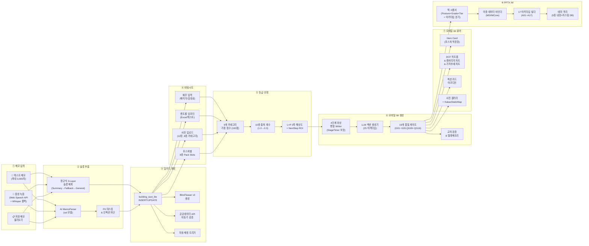
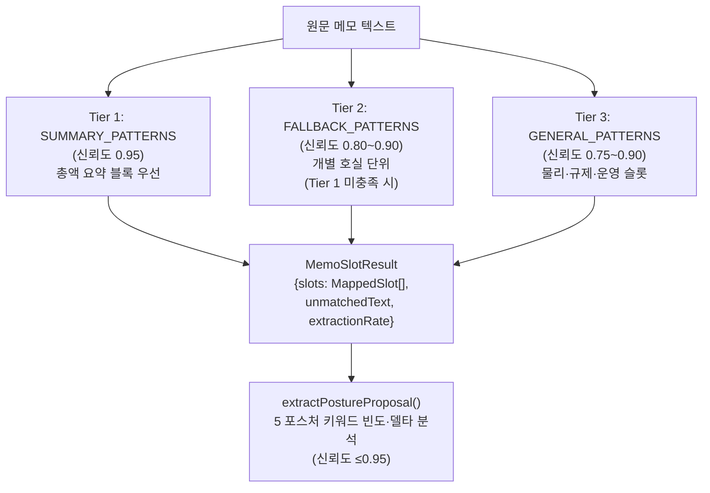
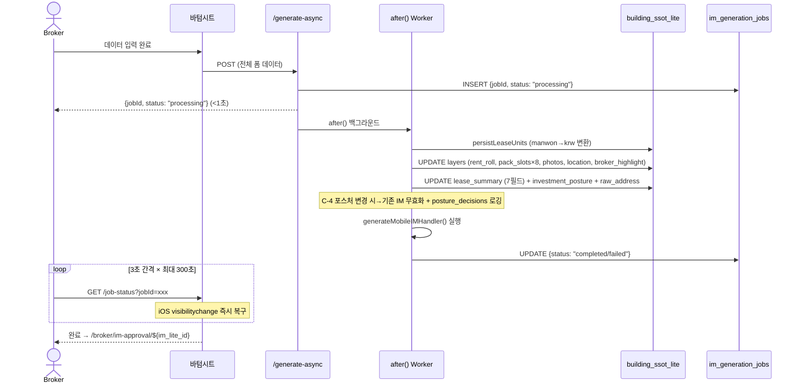

# 📋 CREDEAL 메모→딜카드→바텀시트→모바일IM→PPTX IM 파이프라인 기능 명세서

> **문서 ID**: `DOC-TEST0825-PIPELINE-SPEC-v3`  
> **생성 일시**: 2026-08-26 07:25 (KST)  
> **감사 대상**: 메모 입력 → 슬롯 추출 → 딜카드 생성 → 바텀시트 → 등급 산정 → 모바일 IM → PPTX IM 전체 파이프라인  
> **감사 범위**: 60+ 소스 파일 완전 재감사 (2026-08-26 코드베이스 기준)

---

## 📑 목차

1. [파이프라인 총괄 아키텍처](#1-파이프라인-총괄-아키텍처)
2. [Stage 1: 메모 입력 & 슬롯 추출](#2-stage-1-메모-입력--슬롯-추출)
3. [Stage 2: 딜카드 생성 & SSoT 데이터 모델](#3-stage-2-딜카드-생성--ssot-데이터-모델)
4. [Stage 3: 바텀시트 IM 데이터 입력](#4-stage-3-바텀시트-im-데이터-입력)
5. [Stage 4: 데이터 품질 등급 시스템](#5-stage-4-데이터-품질-등급-시스템)
6. [Stage 5: 모바일 IM 콘텐츠 생성](#6-stage-5-모바일-im-콘텐츠-생성)
7. [Stage 6: 모바일 IM 웹 뷰어 렌더링](#7-stage-6-모바일-im-웹-뷰어-렌더링)
8. [Stage 7: PPTX IM 렌더링 & 내보내기](#8-stage-7-pptx-im-렌더링--내보내기)
9. [전체 파일 인벤토리](#9-전체-파일-인벤토리)

---

## 1. 파이프라인 총괄 아키텍처



### 1.1 기술 스택

| 계층 | 기술 | 역할 |
|---|---|---|
| 프레임워크 | Next.js (Vercel Pro, `maxDuration=300`) | 서버리스 API, `after()` 백그라운드, RSC |
| AI / LLM | Vercel AI SDK — `sol`(MemoParser), `luna`(Router), `gpt-5.6-terra`/`claude-sonnet-4-5`(섹션) | 메모 파싱, 분류, 콘텐츠 생성, 품질 심사 |
| 데이터베이스 | Supabase (PostgreSQL + Storage + Vector) | SSoT, 프리셋, 이미지, 벡터 검색 |
| 프레젠테이션 | `pptxgenjs` v4.0.1 | PPTX 슬라이드 프로그래밍 생성 |
| 이미지 | `sharp` v0.33.5, Canvas API | JPEG 최적화, OSM 타일 합성, 클라이언트 압축 |
| 음성 인식 | Web Speech API (`ko-KR`) + MediaRecorder→Whisper | 한국어 음성 → 텍스트 |

---

## 2. Stage 1: 메모 입력 & 슬롯 추출

### 2.1 입력 채널 3종

| 채널 | 컴포넌트 | 주요 기능 |
|---|---|---|
| **텍스트 메모** | `deal-card/new/page.tsx` | 최대 3,000자, 5단계 프로그레시브 로딩, 120s AbortController, 품질 게이트(422), 중복 감지(409), 가드레일 위반 알림 |
| **음성 녹음** | `VoiceRecorder.tsx` | **이중 STT**: Web Speech API(`ko-KR`, continuous) 우선 → 미지원 시 MediaRecorder WebM → `/api/broker/memo/voice` 폴백 |
| **저장 메모** | `UniversalMemoFAB.tsx` + `MemoImportModal` | FAB (bottom:100px, z:45, amber 그라데이션, animate-ping), 4-모드 시트 (select→text→voice→result), `MemoResultSheet` |

**딜카드 생성 페이지 상태 관리**:
- `memo`, `isLoading`, `loadingStep` (0~4), `error`, `handoffSuccess`, `createdBuildingId`, `showShareSheet`, `showMemoModal`, `duplicateCandidates: DuplicateCandidateUI[]`, `showDuplicateDialog`, `abortController`

### 2.2 하이브리드 3-Tier 슬롯 추출 (`memo-slot-mapper.ts`)



**Tier별 대표 패턴**:

| Tier | 슬롯 | 정규식 (축약) | 신뢰도 |
|---|---|---|:---:|
| **1** | `totalDepositKrw` | `보증금\s*총액\|총\s*보증금\|전세금\s*총액` + 억/만/원 | 0.95 |
| **1** | `monthlyRentKrw` | `월\s*임대수입\s*총액\|월세\s*총액\|월\s*차임\s*합계` | 0.95 |
| **1** | `askingPriceKrw` | `매매가\|매각가\|희망가\|매가` | 0.95 |
| **2** | `monthlyRentKrw` | `월세\|월임대료\|월차임` (호실 단위) | 0.80 |
| **2** | `totalDepositKrw` | `보증금\|전세금` (호실 단위) | 0.80 |
| **3** | 기타 22개 | 면적(평/㎡/py), 층수, 대출, 공실률, Cap Rate, ADR, OCC 등 | 0.75~0.90 |

> [!IMPORTANT]
> **Tier 1 → Tier 2 우선순위**: 총액 패턴이 호실별 패턴보다 항상 우선. 한국어 단위 변환: 억=1×10⁸원, 만=1×10⁴원, ㎡=0.3025평.

### 2.3 추출 슬롯 전체 목록 (24개)

| 슬롯명 | 타입 | 설명 |
|---|---|---|
| `address` / `exactAddressCandidate` | `string` | 도로명/지번 주소 |
| `region` / `areaSignal` | `string` | CRE 온톨로지 시장 권역 |
| `assetType` | `enum` (17종) | 근생빌딩, 사무용빌딩, 물류센터 등 |
| `investmentPosture` | `enum` (5종) | `income` / `owner_occupied` / `development` / `operating` / `trading` |
| `askingPriceKrw` / `monthlyRentKrw` / `totalDepositKrw` / `loanAmountKrw` | `number` (원) | 재무 핵심 |
| `totalFloorAreaPyung` / `landAreaPyung` | `number` (평) | 면적 |
| `buildYear` / `floorsAboveGround` / `floorsUnderGround` | `number` | 건물 기본 |
| `vacancyRatePct` / `capRatePct` | `number` (%) | 투자 지표 |
| `roomCount` / `adrManwon` / `occupancyRatePct` / `gopMarginPct` | `number` | 운영 지표 |
| `farPct` / `bcrPct` / `constructionCostManwon` | `number` | 개발 지표 |
| `pricePerPyeongManwon` / `holdingPeriodYears` / `monthlyRevenueKrw` | `number` | 매매/매출 |

### 2.4 PII 마스킹 (`memo-sanitizer.ts`)

| 민감정보 유형 | 마스킹 토큰 | 패턴 |
|---|---|---|
| 주민등록번호 | `[RRN_A]` | `\d{6}-?[1-4]\d{6}` |
| 이메일 | `[EMAIL_A]` | 표준 이메일 |
| 전화번호 | `[PHONE_A]` | `01[0-9]`, `02`, `0[3-6]`, `070`, `15xx`, `16xx`, `18xx` |
| 건물 번호·도로명 상세 | `[ADDR_DETAIL_A]` | `\d{1,4}-\d{1,4}`, 번지, [로길] |
| 소유주 이름 | `[OWNER_A]` | 소유주/건물주/매도인 + 한글 2~4자 |
| 임차인 사명 | `[TENANT_A]` | 임차인/세입자/입주사 + 상호 |
| 건물 고유명 | `[BLDG_NAME_A]` | 타워/빌딩/센터/플라자 (자산유형명 세이프리스트 제외) |

**보안**: 11개 프롬프트 인젝션 패턴 탐지 (`ignore previous instructions`, `새로운 지침`, `<|im_start|>` 등). 인젝션 탐지 시 → 빈 텍스트 반환 + `injectionDetected: true`.

### 2.5 듀얼 엔진 메모 분류기 (`memo-router-agent.ts`)

| 분류 유형 | 규칙 기반 신뢰도 | LLM 보정 |
|---|---|---|
| `schedule_event` (임장/미팅/답사) | 0.95 | — |
| `buyer_condition` (매수의향/예산/사옥수요) | 0.90 | — |
| `new_deal` (매물 키워드 ≥2 + 포스처 추론) | 0.95 | 자동 보정: LLM이 `general_note` → 규칙 > 0.8 시 오버라이드 |
| `update_building` (추가확인/정보수정/월세올랐) | 0.80 | — |
| `general_note` (폴백) | 0.50 | — |

> [!TIP]
> **Anti-Fragility**: LLM 에러/타임아웃 → 규칙 기반 분류기로 완전 폴백. MemoParser 등 Zod 파싱 실패 → 수동 필드 복구.

### 2.6 AI 에이전트 체인 (`broker-deal-card.ts`)

| 단계 | 에이전트 | 모델 | 출력 |
|---|---|---|---|
| Step 1 | `MemoParser` | `sol` | `MemoParserOutput` — 40+ 슬롯, 5개 포스처 시그널 (`hospitalitySignals`, `developmentSignals`, `tradingSignals`, `ownerOccupiedSignals`), `detectedSensitiveFields` |
| Step 1.5 | `resolveAddress` | 주소 API | PNU(19자리), 좌표(lat/lng) |
| Step 2 | `BuildingMiniTruth` | `sol` | SSoT 정규화 + `resolveAreaSignal` + `derivePriceBand` |
| Step 3 | `BlindTeaser` v3 | `sol` | `hookCopy`, `curiosityHook`, `kakaoOgTitle`, `kakaoOgDescription`, `structureChips`(max 4), `regionLabel`, `assetTypeLabel`, `vacancyLabel`, `boundaryNote` |
| Step 4 | `Guardrails` | — | `rewriteUnsafeText()` — 모든 공개 필드 소독 |

---

## 3. Stage 2: 딜카드 생성 & SSoT 데이터 모델

### 3.1 딜카드 생성 API 플로우 (`POST /api/broker/deal-card/from-memo`, `maxDuration=120`)

```
1. requireBroker(req)                      → 브로커 인증
2. validateMemoQuality(memo)               → CRE 시그널 ≥ 1개 (422 MEMO_QUALITY_INSUFFICIENT)
3. sanitizeComplianceText + extractSlotsFromMemo
4. validateColdModePitchGuard              → 콜드모드 가드
5. checkDuplicateBeforeCreation()          → P0 Pre-AI 중복 (409 DUPLICATE_BUILDING_DETECTED)
6. brokerDealCardFromMemo()                → 14단계 도메인 오케스트레이션:
   ├── runBrokerDealCard (4단계 AI 체인)
   ├── geocodeAddress → 좌표
   ├── layers 빌드 (coordinates, location, pnu, photos)
   ├── 정규식 슬롯 + 포스처 프로포절 추출
   ├── 재무 정밀값 계산 → layers.finance + layers.lease_summary
   ├── building_ssot_lite INSERT/UPDATE (SupabaseBuildingRepository)
   ├── building_signal_cards INSERT (public_blind | internal_only)
   ├── ai_runs 로깅 (토큰 사용량, 지연)
   ├── document_objects INSERT (blind_teaser)
   ├── 4개 activity_events 발행
   ├── deal_casepacks 추출 (extractDealCardCasePack)
   ├── deal_pipeline_states 초기화 (stage: "deal_card_created")
   ├── promotion_score 계산
   └── fire-and-forget: verifyAgainstPublicData + linkBuildingToCanonicalProperty
7. classifyDealArchetype()                 → 아키타입 분류
8. validateAssetConstraints()              → 자산 제약 검증
9. after(() => runAutoMatch())             → 비동기 매수자 자동 매칭
```

### 3.2 SSoT 핵심 데이터 모델 (`building_ssot_lite`)

| 컬럼 | 타입 | 설명 |
|---|---|---|
| `id` | UUID PK | 건물 고유 식별자 |
| `owner_id` | UUID FK | 브로커 ID |
| `input_type` | enum | `broker_memo\|voice_note\|address\|manual_form` |
| `raw_input` / `raw_address` | text | 원본 메모 / 주소 |
| `pnu` | char(19) | 필지고유번호 |
| `area_signal` / `asset_type` / `price_band` | string | 온톨로지 분류 |
| `investment_posture` | enum(5) | `income\|owner_occupied\|development\|operating\|trading` |
| `layers` | JSONB | 다층 구조 데이터 (§3.3 참조) |
| `lease_summary` | JSONB | 임대차 요약 |
| `confidence` / `disclosure` | JSONB | 신뢰도 / 공시사항 |
| `verification_status` / `verification_result` | JSONB | 공공데이터 검증 |
| `status` | enum | `draft\|public_signal_ready\|snapshot_draft_ready\|archived` |
| `promotion_score` / `completeness_score` | numeric | 프로모션/완성도 점수 |
| `canonical_property_id` | UUID FK | 정식 부동산 연결 |

### 3.3 `layers` JSONB 구조

| 레이어 | 주요 필드 |
|---|---|
| `layers.finance` | `asking_price_krw/manwon`, `monthly_rent_krw/manwon`, `total_deposit_krw`, `loan_amount_krw` |
| `layers.lease_summary` | `total_deposit_krw`, `monthly_rent_krw`, `mgmt_fee_total_manwon`, `vacancy_pct`, `loan_status` |
| `layers.location` | `address`, `raw_address`, `pnu`, `coordinates: {lat, lng}` |
| `layers.photos` | `Array<{url, type, label}>` |
| `layers.building_register` | `approval_date`, `completion_era`, `total_floors` |
| `layers.land_use_plan` | `zoning` |
| `layers.rent_roll` | `Array<FloorLease>` |
| `layers.financial_assumptions` | `opex_ratio_pct`, `vacancy_reserve_pct` |
| `layers.broker_highlight` | 중개 코멘트 |
| `layers.pack_slots` | **8종**: `PhysicalSpec`, `HospitalitySpec`, `DevelopmentPlan`, `VacatePlan`, `PermitRisk`, `OccupancyPlan`, `SectionalSpec`, `ResidentialSpec` |

### 3.4 SSoT 어댑터 (`ssot-adapter.ts`) — 10개 함수

| 함수 | 역할 |
|---|---|
| `buildAttrsFromSsotLite(building)` | 플랫 컬럼 + layers → 정규화 attrs (필수/확장/아키타입/재무/Pack Slots/Phase A 복구) |
| `buildProvenanceFromSsotLite(building)` | 필드별 출처 매핑 |
| `buildFinancialInputsFromSsotLite(building)` | 구조화 재무 요약 |
| `parsePriceBand(priceBand)` | 한국어 가격 문자열 → KRW 정수 (조/억/만/원) |
| `buildAssetFromSsotLite(row)` | → `Asset` 엔티티 |
| `buildDealFromSsotLite(row)` | → `Deal` 엔티티 |
| `buildLeaseUnitsFromSsotLite(row, assetId)` | → `LeaseUnit[]` |
| `readWithMigration(buildingId)` | Read-through 캐시 + 레이지 마이그레이션 |
| `readManyWithMigration(buildingIds)` | 배치 마이그레이션 |
| `loadPageOrder(posture)` | `im.pages.yaml` → 포스처별 슬라이드 순서 |

### 3.5 딜카드 페이지 컴포넌트 트리

```
BrokerDealCardResultPage (Server Component)
├── generateMetadata() → 동적 OG (/api/og/deal/${id})
├── readWithMigration(id) + building_ssot_lite 폴백
├── computeDataGrade(gradeAttrs, gradeProvenance)
├── Header (Back + DealCardActionsMenu)
├── LiveDealCardPreviewCard (카카오 OG 미리보기)
├── DealCardEditor (실시간 인라인 편집)
├── DealCardTabs (4탭):
│   ├── 개요: Pipeline, Photos, SignalEditor, Caution, Hidden
│   ├── IM: ImManagementPanel, Boundary Note
│   ├── 매수자: IdealBuyer, MatchedBuyers, GateRequests
│   └── 분석: DealPrediction, Schedule, Owner Report
└── Sticky Bottom CTA: Kakao Share + CreateMobileIM + AiMatch + BrokerNav
```

---

## 4. Stage 3: 바텀시트 IM 데이터 입력

### 4.1 컴포넌트 아키텍처

- **렌더링**: React Portal → `document.body`, 85vh
- **티어**: `basic` (필수 재무+사진) / `pro` (상세 렌트롤, 비교거래, Pack Slots)
- **동적 필수 필드 (`computedMissingFields`)**:
  - 공통: `investmentPosture`, `address`/`pnu`, `askingPrice`
  - `income`: + `monthlyRent`, `totalDeposit`
  - `owner_occupied`: + `occHeadcount`, `occDesiredFloors`
  - `development`: + `devTargetUse`, `devTargetScalePyung`
  - `operating`: + `roomCount`, `averageDailyRate`
  - `trading`: + `acquisitionPriceManwon`

### 4.2 입력 섹션 & 필드 전체 목록

| 섹션 | 주요 필드 |
|---|---|
| **포스처 선택** | 5종 + AI 추천 칩 + `validateCombination()` 온톨로지 검증 |
| **소재지** | 주소 검색 → `/api/public/address`, PNU 자동 해석 |
| **재무** | 월 임대료, 보증금, 관리비, 매각가 (만원), Cap Rate 역산기, 대출 상태(confirmed/no_loan/unknown)/금액 |
| **부가수입 (6종)** | `telecom`(통신), `parking`(주차), `signage`(간판), `rooftop_solar`(태양광), `ev_charging`(전기차), `other`(기타) |
| **비교거래** | `manualComps[]`: 주소, 거래금액, 면적, 거래년/월, 용도, 메모 |
| **임대** | 공실률 (0%만실/~10%/~20%/커스텀) + 메모 충돌 감지, 렌트롤 임포터 |
| **사진** | 12장, 8종 카테고리 (exterior/lobby/interior/parking/rooftop/entrance/mechanical/floor_plan), 히어로★/외관🏢 선택, 순차 압축 업로드 |
| **필지** | 다중 필지: PNU, 지목, 면적, 지분율, 공시지가 |
| **호텔/숙박** | 객실수, ADR, OCC, GOP 마진 |
| **운영실적** | 단위(room/seat/table/bed), 단위수, 운영모델, 면허양도, 연매출, 연GOP |
| **개발** | 목표용도/규모/분양가/공사비, 명도(책임/세입자수/비용/기간), 인허가(상태/기간) |
| **자가사용** | 입주인원, 1인당면적, 희망층, 현 임차료 |
| **구분소유** | 소유자수, 관리단, 마스터리스, 공동담보, 지분율, 일괄매입 |
| **주거** | 세대수, 전세/월세 세대수, 전세보증금, 위반건축 |
| **매매이력** | 취득일, 취득가, 보유기간, 10년 양도횟수, 매도 동기 |
| **물류** | 천장고, 주간, 바닥하중, 전기, 도크/레벨러수, 최대차량톤, 적재면적, 냉장(면적/타입), 차량접근, 소방, 스프링클러, 사무실(유무/면적), IC(이름/거리) |
| **중개코멘트** | 한줄 브로커 하이라이트 |

### 4.3 렌트롤 임포터 (`rent-roll-importer.tsx`)

| 모드 | 처리 |
|---|---|
| **Excel/CSV** | `xlsx` 파싱, 상위 10행 헤더 탐지 (`층/호실/면적/보증금/월세/rent/deposit`), 퍼지 매핑, 만원/원 자동 감지 (≥100,000→만원 변환), Excel 날짜 시리얼 처리, 빈 임차인=공실 플래그 |
| **자연어** | `POST /api/broker/rent-roll/parse-text` AI 파싱 |
| **편집** | 미니 테이블 인라인 편집 + 자동 합계 재계산 |
| **템플릿** | `/CREDEAL_rentroll_template_v1.2.xlsx` 다운로드 |

### 4.4 데이터 플로우: 바텀시트 → 생성 → SSoT 역동기화



---

## 5. Stage 4: 데이터 품질 등급 시스템

### 5.1 등급 엔진 (`grade-engine.ts`)

100점 만점, **9개 가중 카테고리** (`NEW_WEIGHTS`):

| 카테고리 | 가중치 | 핵심 슬롯 |
|---|:---:|---|
| `lease_roll` | **25** | `rentRoll`, `grossAnnualIncomeKrw` |
| `building_basic` | **15** | `totalFloorAreaPyung`, `approvalDate`, `evictionStatus` |
| `land_parcel` | **15** | `pnu`, `address`, `landAreaPyung`, `officialLandPricePerSqm` |
| `financial_input` | **15** | `askingPriceKrw`, `loanAmountKrw` |
| `zoning` | **10** | `zoningRegion`, `farHeadroomPp` |
| `title_encumbrance` | **10** | `titleEncumbrance` |
| `pack` | **10** | 포스처별 Pack Slots |
| `road_access` | **5** | `roadContactType` |
| `market_comp` | **5** | `marketCompPerPyung` |

### 5.2 출처 품질 계수 (10종)

| 출처 | 계수 | 설명 |
|---|:---:|---|
| `registry` | **1.00** | 등기부 원본 |
| `public_api` | **0.95** | 건축물대장/토지이용계획 API |
| `broker_aug` | **0.90** | 브로커 보강 (검증 동반) |
| `expert` | **0.90** | 전문가/평가사 |
| `ledger` | **0.90** | 원장/대장 원본 |
| `seller` | **0.65** | 매도인 고지 |
| `broker` | **0.60** | 중개사 수동 입력 |
| `derived` | **0.40** | 파생 계산값 |
| `ai_inferred` | **0.30** | AI 추론 |
| `assumed` | **0.30** | 가정값 |

### 5.3 L×P 2축 해상도 매트릭스

**P축 (Property Resolution)**: `land_parcel`, `building_basic`, `zoning`, `road_access`, `title_encumbrance`  
**L축 (Lead Resolution)**: 포스처별 차등

| 포스처 | L축 슬롯 |
|---|---|
| `income` | `lease_roll`, `financial_input` |
| `operating` | `operating_performance`, `hospitality_spec`, `financial_input` |
| `development` | `development_plan`, `vacate_plan`, `permit_risk` |
| `owner_occupied` | `occupancy_plan`, `physical_spec` |
| `trading` | `market_comp`, `holding_history` |

```
gradeMatrix(L, P):
  L=R0 || P=P0 → D
  L≥R2 && P≥P2 → A
  L≥R1 && P≥P2 → B
  L≥R1 && P=P1 → C
  else → D
```

**Income/Operating 특별 가드**: 구조화 렌트롤 미제출 시 A→B 캡.

| 등급 | 해금 기능 |
|---|---|
| **A** (≥75%) | 풀 DCF, IRR, 민감도, 총수익률, Pro IM |
| **B** (40~74%) | 표준 IM & PPTX, DCF 억제 |
| **C** (<40%) | 기본 IM, DCF+총수익 억제 |
| **D** | 발행 차단 |

---

## 6. Stage 5: 모바일 IM 콘텐츠 생성

### 6.1 비동기 생성 파이프라인

```
POST /api/broker/im-lite/generate-async (maxDuration=300)
  → after() 백그라운드:
    → generateMobileIMHandler()
      → validateCombination()           // 온톨로지 조합 게이트
      → readWithMigration()             // SSoT Lite 로딩
      → Readiness Score (100점: 주소25+면적10+매각가20+임대료20+사진10+공실5)
      → computeDataGrade()              // 등급 산정 + DCF 게이팅
      → hasMinimumBasicData()           // 포스처별 필수 데이터
      → NOI/Cap Rate 산출 + 재무 건전성 (Cap Rate <2% or >15% 경고)
      → enrichBuildingData()            // 공공데이터 (PNU→주소→랜드마크 폴백)
      → manualComps 병합               // → comparableTransactions
      → generateMobileIM()              // 4단계 Writer
      → sanitizeComplianceText()        // 전 섹션 준법 소독
      → Grade C 마스킹                  // Cap Rate → "검증 중"
      → getIMDisclaimers('basic')       // 면책 조항 섹션 추가
      → CRE 타이틀/OG 메타 생성
      → document_objects 저장
```

### 6.2 포스처별 섹션 매트릭스

| 섹션 | `income` (12) | `owner_occ` (9) | `dev` (10) | `operating` (10) | `trading` (8) |
|---|:---:|:---:|:---:|:---:|:---:|
| `property_overview` | ✅ | ✅ | ✅ | ✅ | ✅ |
| `location_access` | ✅ | ✅ | ✅ | ✅ | ✅ |
| `title_rights` | ✅ | ✅ | ✅ | ✅ | ✅ |
| `land_detail` | ✅ | — | ✅ | ✅ | — |
| `lease_status` ⭐ | ✅ | — | — | — | — |
| `income_analysis` ⭐ | ✅ | — | — | — | — |
| `occupancy_fit` ⭐ | — | ✅ | — | — | — |
| `cost_comparison` ⭐ | — | ✅ | — | — | — |
| `site_analysis` ⭐ | — | — | ✅ | — | — |
| `development_feasibility` ⭐ | — | — | ✅ | — | — |
| `operation_overview` ⭐ | — | — | — | ✅ | — |
| `gop_analysis` ⭐ | — | — | — | ✅ | — |
| `market_position` ⭐ | — | — | — | — | ✅ |
| `comparable_analysis` ⭐ | — | — | — | — | ✅ |
| `risk_check` | ✅ | ✅ | ✅ | ✅ | ✅ |
| `comparables` | ✅ | — | — | — | — |
| `investment_thesis` | ✅ | ✅ | ✅ | ✅ | — |
| `checklist` | ✅ | ✅ | ✅ | ✅ | ✅ |
| `next_steps` | ✅ | ✅ | ✅ | ✅ | ✅ |
| `closing` | ✅ | — | — | — | — |

> [!NOTE]
> ⭐ 강조 섹션 = **2× 토큰 예산**. 포스처별 억제(`suppress`) 섹션은 해당 포스처에서 생성되지 않습니다.

### 6.3 4단계 Writer 아키텍처 (`writer.ts`)

| 단계 | 실행 모드 | 생성 내용 |
|---|---|---|
| **Stage 1** | `Promise.allSettled` 병렬 | 독립 섹션 (property_overview, location_access 등) |
| **Stage 2** | 순차 | 재무/특화 섹션 (income_analysis, dev_feasibility 등) |
| **Stage 3** | 순차 | `risk_check` |
| **Stage 4** | 순차 | `investment_thesis` |

**StageTimer 보호**: Soft 90s (경고) → Hard 105s (빠른 폴백) → Kill 120s (미확인 섹션 폐기 + timeout 경고)

**후처리**: 품질 게이트 → 교차 검증 → RAG 인덱싱 → 가드레일 토큰 자연어화 → YAML 기반 정렬 → HeroCard+Photos 조립

### 6.4 25개 투자 아키타입 시스템 (`archetype-registry.ts`)

| 포스처 | 아키타입 (수) | 코드 |
|---|:---:|---|
| `income` | **9** | R-INC-01(안정형), R-INC-02(가치상승여력), R-INC-03(개발준비), R-INC-04(임대료정상화), R-INC-05(공실해소), R-INC-06(리모델링), R-INC-07(저평가코너), R-INC-08(자주식주차사옥), R-INC-09(복합수익전환) |
| `owner_occupied` | **4** | R-OWN-01(본사이전), R-OWN-02(통합이전), R-OWN-03(브랜딩랜드마크), R-OWN-04(임대겸용사옥) |
| `development` | **4** | R-DEV-01(용적률활용), R-DEV-02(합필개발), R-DEV-03(용도전환), R-DEV-04(철거신축) |
| `operating` | **4** | R-OPR-01(운영안정), R-OPR-02(운영사교체), R-OPR-03(시설리노베이션), R-OPR-04(라이선스인수) |
| `trading` | **4** | R-TRD-01(시세차익), R-TRD-02(급매물선취), R-TRD-03(갭투자전매), R-TRD-04(환금성우선) |

### 6.5 재무 엔진 (5 전략 패턴)

| 포스처 | 전략 | 핵심 계산 |
|---|---|---|
| `income` | `IncomeFinancialStrategy` | 3-시나리오 NOI, Cap Rate, 5Y IRR, WACC, DCF, 취득원가 분해(매매가+취득세4.6%+중개0.9%), **역레버리지 자동 감지** |
| `development` | `DevelopmentFinancialStrategy` | 평당 토지가, 건축비(1,200만/평), 총사업비, 개발 이익률, **규제 만료 추적 (2028-05-18)** |
| `operating` | `OperatingFinancialStrategy` | GOP, GOP Cap Rate, ADR, OCC, RevPAR |
| `owner_occupied` | `OwnerOccupiedFinancialStrategy` | 가상 임차비 vs 부채상환, 10Y 자가/임차 절감, 손익분기 연수 |
| `trading` | `TradingFinancialStrategy` | 평당가, 시세 할인율, 자본이득, HPR% |

---

## 7. Stage 6: 모바일 IM 웹 뷰어 렌더링

### 7.1 컴포넌트 트리

```
MobileIMViewer (Client Component)
├── Warning Banners (Draft, D/C/B 등급 경고)
├── Sticky Top Bar (IM Library, Share, Section Progress Dots + IntersectionObserver dwell)
├── Hero Header (배지, 블라인드명, 등급 배지, 부제목)
├── HeroCard (포스처 적응형 2×2 Metric Grid + 3 Key Points + Key Risk + 10Y NPV)
├── PhotoGallery (수평 snap-scroll + Lightbox + KakaoStaticMap 3×3 + Kakao/Naver 1-tap)
├── SectionCard List (아코디언, Provenance 배지: 공부확인/중개인입력/AI추정/전문가검증)
│   ├── [Income 후] DCFHeatmap (3×3: WACC×Exit Cap) + LeverageChart (SVG 도넛)
│   ├── [3번째 후] Mid-stream CTA (관심 표명)
│   └── [마지막 후] End-stream CTA (Private IM 요청 + 브로커 통화)
├── FlatProfileCard (브로커 아바타, 전문분야, 활성 딜, 매거진)
├── IMInquiryBottomSheet (Private IM 리드 캡처)
├── Disclaimer & Protected Fields Card
└── FloatingActionBar
    ├── 브로커 모드: Kakao Share SDK, PPTX 6종 프리셋, PDF, 링크 복사
    └── 매수자 모드: 직접 통화, 상담 리드폼, PDF, PPTX, 공유
```

### 7.2 HeroCard 포스처별 2×2 메트릭

| 포스처 | 셀 1 | 셀 2 | 셀 3 | 셀 4 |
|---|---|---|---|---|
| `income` | 매각 희망가 | 실투자금(내 돈) | 연 수익률 (Gross) | ROE |
| `development` | 토지 평당가 | 용도지역 | 토지/매각 희망가 | 개발이익률 |
| `owner_occupied` | 건축 연면적 | 매각 희망가 | 자기자본 소요 | 자가/임차 절감액 |
| `operating` | GOP 마진 | ADR | OCC | RevPAR |
| `trading` | 평당 매매가 | 시세 할인율 | 매각 희망가 | HPR |

---

## 8. Stage 7: PPTX IM 렌더링 & 내보내기

### 8.1 PPTX 렌더러 파이프라인 (591행)

```
MobileImPptxRenderer.render(input)
  → Pro + D등급 → 차단
  → PptxGenJS(LAYOUT_WIDE 13.333"×7.5")
  → getPptxThemeAsync(presetId)        // 3-Tier: 내장→DB커스텀→golden 폴백
  → withThemeIsolation(theme)          // 동시 요청 전역 토큰 보호
  → resolvePhotos() + planGallerySlides()
  → buildDeckSequence()               // Posture×Grade×Tier→SlideSpec[]
  → bindFromIMCore(core) || bindSectionData(doc, building)  // 이중 바인딩
  → ARCHETYPE_REGISTRY[A01~A17]       // 아키타입 빌더 루프
  → addFallbackContent()              // 미렌더링 MD 폴백
  → validateTextBudgets()             // 텍스트 예산 검증
  → PptxGenJS.write() → Buffer
```

### 8.2 덱 시퀀서 매트릭스

| 등급 | 티어 | 슬라이드 수 | 시퀀스 요약 |
|---|---|:---:|---|
| **D** | Any | **0** | 발행 차단 |
| **B/C** | Basic | 7~11 | A01→A14→A02→A06→포스처 본문(3)→A04 Title→A07→A12→A15→A09→A10 |
| **A** | Pro | ≤16 (권장) | 전체 시퀀스 (아키타입 분기 포함) |

**예산 상한 (D29 m-8)**: 16페이지 권장. 초과 시 closing/risk/checklist/process/thesis 보존하며 트림.

### 8.3 17개 아키타입 요약

| 코드 | 슬라이드명 | 레이아웃 | 핵심 |
|---|---|---|---|
| A01 | 표지 | 전면 다크 (5종 스타일) | 40pt 타이틀, 매각가 박스, 로고, 브로커 정보 |
| A02 | 핵심 지표 | 라이트 | 2~4열 KPI + 3개 투자 하이라이트 |
| A03 | 대형 테이블 | 라이트 | 렌트롤/비교사례, 스마트 컬럼, 12행 페이지네이션 |
| A04 | 비대칭 7:5 | 라이트 | 좌7.5" 제원 + brass 수직선 + 우4.2" 사진/콜아웃 |
| A05 | 비대칭 7:4 | 라이트 | 3열 KPI + 가치제안 콜아웃 |
| A06 | 입지 지도 | 라이트 | 좌5.6" 지도(3-Tier: Kakao→OSM→SVG) + 우6.1" 입지 |
| A07 | 리스크 3블록 | 라이트/다크 | 3열 카드 + 공동담보 경고 주입 + 하단 고지 |
| A08 | 이중 테이블 | 라이트 | 좌7.3" 2개 테이블 + 우4.5" 콜아웃 |
| A09 | 진행 절차 | 라이트 | 3~4단계 + brass 원형 배지 + 화살표 |
| A10 | 마감 | 다크 | 3단계 리본 + 5등급 Provenance + 면책 + 로고 |
| A11 | 호실 사양 | 라이트 | 호실 테이블 + 2×2 통계 + 위반 경고 |
| A12 | 소유/체크리스트 | 라이트 | 소유권 테이블 + 3개 콜아웃 |
| A13 | 운영 KPI | 라이트 | KPI 행 + brass 수직선 + 3개 stat 카드 |
| A14 | 사진 갤러리 | 라이트 | 6종 토폴로지, 최대 4슬라이드 × 4장 |
| A15 | 투자 논거 | 라이트 | 1×3/2×2 필러 + 벤치마크 + Takeaway 리본 |
| A16 | 자본 구조 | 라이트/다크 | 취득비용 7행 + LTV 0/40/50% + 역레버리지 경고 |
| A17 | 준공전 마케팅 | 라이트/다크 | 스태킹 플랜 + 개발 메트릭 + 규제 만료 카운트다운 |

### 8.4 프리셋 5종 + 커스텀 DB

| 프리셋 | 악센트 | 커버 | 레이아웃 | 폰트 |
|---|---|---|---|---|
| `golden_institutional` | `#B98A2E` | masses | classic | Pretendard |
| `credeal_signature` | `#6B8E00` | split | modern | Pretendard |
| `executive_gold` | `#B8862D` | hero_dark | executive | Noto Serif KR |
| `corporate_clean` | `#059669` | corporate_card | minimal | Pretendard |
| `pro_dark_obsidian` | `#0284A8` | obsidian_glow | dramatic | Pretendard |

**WCAG AA 검증**: body vs bg ≥ 4.5:1, ink vs bg ≥ 4.5:1, accent vs bg ≥ 3.0:1, darkBody vs darkCard ≥ 3.0:1.

---

## 9. 전체 파일 인벤토리

### 9.1 메모 & 슬롯 추출 (10파일)

| 파일 | 역할 |
|---|---|
| `deal-card/new/page.tsx` | 딜카드 생성 페이지 (5단계 로딩, 중복 처리, 가드레일) |
| `UniversalMemoFAB.tsx` | 범용 메모 FAB (4-모드 시트) |
| `VoiceRecorder.tsx` | 이중 STT 음성 녹음기 |
| `MemoResultSheet.tsx` | 분류 결과 시트 |
| `memo-slot-mapper.ts` | 3-Tier 정규식 슬롯 매퍼 + 포스처 프로포절 |
| `memo-router-agent.ts` | 듀얼 엔진 메모 분류기 (luna LLM + 규칙) |
| `memo-sanitizer.ts` | PII 마스킹 (7종) + 인젝션 탐지 (11패턴) |
| `broker-deal-card.ts` (ai/agents) | 4단계 AI 에이전트 체인 |
| `broker-deal-card.ts` (ai/schemas) | Zod 스키마 (MemoParser, BlindTeaser v3) |
| `broker-deal-card.ts` (ai/prompts) | 시스템 프롬프트 |

### 9.2 딜카드 & SSoT (7파일)

| 파일 | 역할 |
|---|---|
| `from-memo/route.ts` | 딜카드 생성 API (maxDuration=120) |
| `broker-deal-card.ts` (domain) | 14단계 도메인 오케스트레이터 |
| `building-dedup.ts` | P0 Pre-AI 중복 검사 |
| `deal-card/[id]/page.tsx` | 딜카드 관리 페이지 (4탭) |
| `ssot-adapter.ts` | SSoT 어댑터 (10개 함수, 레이지 마이그레이션) |
| `grade-engine.ts` | 등급 엔진 (L×P 2축, 9카테고리, 10종 출처) |
| `im.pages.yaml` | 포스처별 섹션 순서 정의 |

### 9.3 바텀시트 (3파일)

| 파일 | 역할 |
|---|---|
| `im-data-bottom-sheet.tsx` | 바텀시트 (8종 Pack Slots, 6종 부가수입, 물류 15필드) |
| `rent-roll-importer.tsx` | 렌트롤 임포터 (Excel/AI 파싱) |
| `image-compressor.ts` | 클라이언트 Canvas 압축 (1920px, 0.82, 순차 업로드) |

### 9.4 모바일 IM 생성 (20+파일)

| 파일 | 역할 |
|---|---|
| `generate-async/route.ts` | 비동기 생성 API (maxDuration=300, SSoT 역동기화) |
| `generate/handler.ts` | 생성 핸들러 (14단계) |
| `im-management-panel.tsx` | 브로커 관리 패널 (폴링, iOS, 프리셋, 내보내기) |
| `writer.ts` | 4단계 Writer (StageTimer, 텔레메트리) |
| `section-catalog.ts` | 5 포스처 × 8~12 섹션 매트릭스 |
| `im-section-generator.ts` | 16단계 Per-Section 파이프라인 |
| `im-context-builder.ts` | 컨텍스트 빌더 (정규화, 이상치, RAG) |
| `archetype-registry.ts` | **25개 아키타입** + `suggestArchetype` + `postureChangeImpact` |
| `narrative-prompt.ts` | 시스템 프롬프트 (13개 규칙, 2개 용어집) |
| `posture-prompts.ts` | 포스처 오버레이 (5 포스처 × 3 섹션) |
| `quality-gates-v02.ts` | **19개 발행 게이트** (G01~G20 + QG09~QG16) |
| `cre-quality-gate.ts` | 6종 CRE 의미 위반 검사 |
| `im-judge.ts` | LLM-as-Judge 5차원 (확률적 실행: needs_check 100%/inferred 30%/confirmed 10%) |
| `cross-validator.ts` | 수치 교차 검증 (포스처별 공식 검증) |
| `stage-plans.ts` | 4단계 위상 실행 계획 |
| `stage-timer.ts` | 글로벌 타이머 예산 (90/105/120s) |
| `numerical-anchors.ts` | 불변 앵커 스토어 + 충돌 감지 |
| `telemetry.ts` | 파이프라인 메트릭 (4-way 결과 분류) |
| `section-renderers/` | 결정적 렌더러 3종 (comparables, land-detail, title-rights) |
| `render/apply-mask.ts` | IMCore 마스킹 엔진 (Public/Full) |

### 9.5 재무 엔진 (3파일)

| 파일 | 역할 |
|---|---|
| `financials.ts` | 5 포스처 재무 전략 패턴 + 규제 만료 추적 |
| `net-cash-flow-calculator.ts` | 3-Line 순현금흐름 + 원금 안전판 |
| `dcf-sensitivity.ts` | 10Y DCF, Newton-Raphson IRR(150회), 3×3 민감도, WACC |

### 9.6 웹 뷰어 (7+파일)

| 파일 | 역할 |
|---|---|
| `page.tsx` | 서버 컴포넌트 (RSC, OG 메타) |
| `fetch-im-data.ts` | Supabase 직접 패치 + 지오코딩 + 브로커 통계 |
| `mobile-im-viewer.tsx` | 클라이언트 뷰어 (FAB, CTA, 마크다운, dwell 추적) |
| `hero-card.tsx` | 포스처 적응형 2×2 + 3 Key Points |
| `dcf-heatmap.tsx` | 3×3 DCF 히트맵 |
| `leverage-chart.tsx` | SVG 도넛 (자기자본/보증금/대출) |
| `price-trend-chart.tsx` | SVG 라인 (비교사례 가격 추세) |

### 9.7 PPTX IM 렌더링 (29파일)

| 파일 | 역할 |
|---|---|
| `pptx-renderer.ts` (591행) | 메인 렌더러 (테마 격리, 폴백, 텍스트 예산) |
| `deck-sequencer.ts` (232행) | 덱 시퀀서 (D등급 차단, 16페이지 예산) |
| `data-binder.ts` (1,657행) | 이중 바인더 (MD/IMCore, CRE 용어, 페르소나 격리) |
| `imlib.ts` (1,245행) | 21개 컴포넌트 (5종 레이아웃, 동적 폰트) |
| `pptx-theme.ts` (413행) | 5종 프리셋 + 커스텀 DB + WCAG AA |
| `gallery-planner.ts` (244행) | 6종 토폴로지, 포스처별 그룹, 4슬라이드 배칭 |
| `text-budget.ts` (123행) | 12개 텍스트 제한 + CJK 0.19"/char + assertBounds |
| `basis-enforcer.ts` (58행) | FAR/Cap Rate/GOP/상임법/임대료 상한 강제 |
| `provenance-mapper.ts` (41행) | **9종 출처 가중치** + getWeakestLink |
| `image-optimizer.ts` (429행) | Sharp 180DPI + 3-Tier 지도 (Kakao/OSM/SVG) |
| `html-parser.ts` (67행) | HTML/MD 파서 + formatKrwCompact |
| `archetypes/a01~a17` (17파일) | 17개 아키타입 빌더 |

---

*본 문서는 2026-08-26 코드베이스 전체 재감사 결과입니다. 이전 v2 대비 주요 변경: 25개 아키타입(9→25), 19개 QG(17→19), 10종 출처 계수(5→10), 9개 등급 카테고리(8→9), 결정적 섹션 렌더러 3종, 불변 앵커 스토어, IMCore 마스킹 엔진, 듀얼 STT, P0 Pre-AI 중복 검사 등.*
