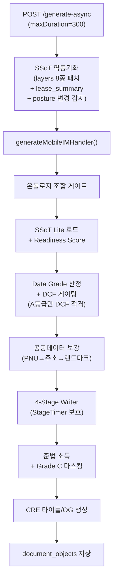
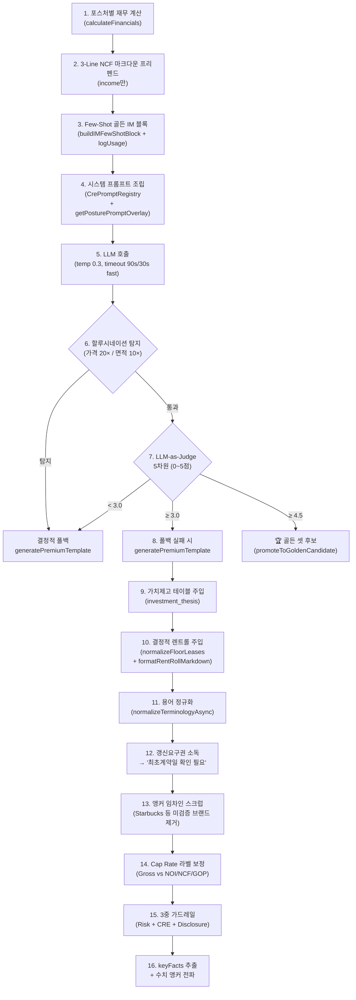

# 📱 CREDEAL 모바일 IM 섹션 콘텐츠 생성 & 렌더링 스펙

> **문서 ID**: `DOC-TEST0825-MOBILE-IM-SPEC-v3`  
> **생성 일시**: 2026-08-26 07:30 (KST)  
> **감사 대상**: `src/domain/building/mobile-im/` 전체 + `src/app/(public)/im-lite/` 웹 뷰어  
> **코드베이스 버전**: 2026-08-26 최신 (전체 재감사)

---

## 📑 목차

1. [콘텐츠 생성 파이프라인 개요](#1-콘텐츠-생성-파이프라인-개요)
2. [4단계 위상 병렬 Writer](#2-4단계-위상-병렬-writer)
3. [섹션 카탈로그 & 포스처 시스템](#3-섹션-카탈로그--포스처-시스템)
4. [Per-Section 생성 파이프라인 (16단계)](#4-per-section-생성-파이프라인)
5. [프롬프트 아키텍처](#5-프롬프트-아키텍처)
6. [품질 게이트 & 안전장치](#6-품질-게이트--안전장치)
7. [컨텍스트 빌더](#7-컨텍스트-빌더)
8. [25개 투자 아키타입 시스템](#8-25개-투자-아키타입-시스템)
9. [재무 엔진](#9-재무-엔진)
10. [웹 뷰어 렌더링 상세](#10-웹-뷰어-렌더링-상세)
11. [보조 모듈 인벤토리](#11-보조-모듈-인벤토리)

---

## 1. 콘텐츠 생성 파이프라인 개요



---

## 2. 4단계 위상 병렬 Writer

### 2.1 Writer 아키텍처 (`writer.ts`)

```
buildIMContext(input)
       │
       ▼
NumericalAnchors 초기화 (immutable store + 충돌 감지)
       │
       ▼
StageTimer 시작 (Soft: 90s, Hard: 105s, Kill: 120s)
       │
       ▼
getActiveStagePlan(posture) → 4-Stage 실행 계획
  ├── Stage 1: 독립 섹션 (Promise.allSettled 병렬)
  ├── Stage 2: 재무/특화 섹션 (순차)
  ├── Stage 3: 리스크 (순차)
  └── Stage 4: 투자 논거 (순차)
       │
       ▼
runPublishGates() → 19개 게이트 검증
       │
       ▼
runCrossValidation() → 포스처별 수치 교차 검증
       │
       ▼
indexIMSections() → RAG 벡터 인덱싱
       │
       ▼
humanizeGuardrailTokensForView() → 플레이스홀더 자연어화
       │
       ▼
loadPageOrder(posture) → YAML 기반 정렬
       │
       ▼
HeroCard + Photos 조립
       │
       ▼
텔레메트리 기록 (4-way: completed/intended_block/input_missing/system_error)
```

### 2.2 StageTimer 보호 매커니즘 (`stage-timer.ts`)

| 타이머 | 시간 | 동작 |
|---|:---:|---|
| **Soft Limit** | 90s | 텔레메트리 경고 |
| **Hard Limit** | 105s | `shouldForceRender()` = true → 잔여 섹션 빠른 템플릿 폴백 |
| **Kill Limit** | 120s | `shouldDiscard()` = true → 미확인(`needs_check`) 섹션 폐기 + timeout 경고 섹션 삽입 |

### 2.3 단계별 실행 계획 (`stage-plans.ts`)

| 단계 | `income` | `development` | `operating` | `owner_occupied` | `trading` |
|---|---|---|---|---|---|
| **1 (병렬)** | property_overview, location_access, lease_status, next_steps | property_overview, location_access, next_steps | property_overview, location_access, next_steps | property_overview, location_access, next_steps | property_overview, location_access, next_steps |
| **2 (순차)** | income_analysis | site_analysis, dev_feasibility | operation_overview, gop_analysis | occupancy_fit, cost_comparison | market_position, comparable_analysis |
| **3 (순차)** | risk_check | risk_check | risk_check | risk_check | risk_check |
| **4 (순차)** | investment_thesis | investment_thesis | investment_thesis | investment_thesis | — |

---

## 3. 섹션 카탈로그 & 포스처 시스템

### 3.1 포스처별 섹션 배정

| 섹션 | `income` (12) | `owner_occ` (9) | `dev` (10) | `operating` (10) | `trading` (8) | 강조 |
|---|:---:|:---:|:---:|:---:|:---:|---|
| `property_overview` | ✅ | ✅ | ✅ | ✅ | ✅ | |
| `location_access` | ✅ | ✅ | ✅ | ✅ | ✅ | |
| `title_rights` | ✅ | ✅ | ✅ | ✅ | ✅ | |
| `land_detail` | ✅ | — | ✅ | ✅ | — | |
| `lease_status` | ✅ | — | — | — | — | ⭐ income |
| `income_analysis` | ✅ | — | — | — | — | ⭐ income |
| `occupancy_fit` | — | ✅ | — | — | — | ⭐ oo |
| `cost_comparison` | — | ✅ | — | — | — | ⭐ oo |
| `site_analysis` | — | — | ✅ | — | — | ⭐ dev |
| `development_feasibility` | — | — | ✅ | — | — | ⭐ dev |
| `operation_overview` | — | — | — | ✅ | — | ⭐ op |
| `gop_analysis` | — | — | — | ✅ | — | ⭐ op |
| `market_position` | — | — | — | — | ✅ | ⭐ trading |
| `comparable_analysis` | — | — | — | — | ✅ | ⭐ trading |
| `risk_check` | ✅ | ✅ | ✅ | ✅ | ✅ | |
| `comparables` | ✅ | — | — | — | — | |
| `investment_thesis` | ✅ | ✅ | ✅ | ✅ | — | |
| `checklist` | ✅ | ✅ | ✅ | ✅ | ✅ | ⭐ all |
| `next_steps` | ✅ | ✅ | ✅ | ✅ | ✅ | |
| `closing` | ✅ | — | — | — | — | |

> [!NOTE]
> ⭐ 강조 = **2× 토큰 예산**. Suppress 된 섹션은 해당 포스처에서 생성 자체가 차단됩니다.

### 3.2 결정적 섹션 렌더러 (`section-renderers/`)

| 렌더러 | 역할 |
|---|---|
| `comparables-renderer.ts` | 비교사례 테이블 + 할인율 계산 (AI 의존 없음) |
| `land-detail-renderer.ts` | 필지 테이블, 용도지역, 잔여 용적률, 제외 면적 계산 |
| `title-rights-renderer.ts` | 소유 구조 + 등기 부담 요약 |

---

## 4. Per-Section 생성 파이프라인 (16단계)

### 4.1 `generateSingleSection()` 내부 플로우



### 4.2 LLM-as-Judge 5차원 (`im-judge.ts`)

| 차원 | 가중치 | 평가 |
|---|:---:|---|
| `factual_accuracy` | 0.25 | SSoT 수치 일치, 허위 |
| `financial_soundness` | 0.20 | Cap Rate/NOI/LTV 정확성 |
| `regulatory_compliance` | 0.25 | 한국 부동산 법규 |
| `investor_value` | 0.15 | 투자 인사이트 |
| `data_grounding` | 0.15 | 공공 데이터/실측 근거 |

**확률적 실행**: `needs_check` → 100%, `inferred` → 30%, `confirmed` → 10%.

---

## 5. 프롬프트 아키텍처

### 5.1 3계층 구조

```
┌──────────────────────────────────────────────────┐
│  NARRATIVE CORE (MOBILE_IM_NARRATIVE_CORE)       │
│  • CRE 투자 전략가 페르소나                       │
│  • 13개 엄격한 작성 규칙                          │
│  • 결론 선행 (So What?)                           │
│  • 페르소나 격리 (연령/성별/계층 절대 불가)        │
├──────────────────────────────────────────────────┤
│  POSTURE LEXICONS (B2B/B2C 용어 표준화)          │
│  • 연 순수익률(Cap Rate) / 순영업수익(NOI)        │
│  • 실질 영업이익(GOP) / 인테리어 지원금(TI)       │
│  • 사옥 단독 명칭 표기(간판 설치권)               │
├──────────────────────────────────────────────────┤
│  POSTURE OVERLAYS (5 포스처 × 3 섹션)             │
│  • income: 실투자금, 월 순수익, 토지 지분 가치    │
│  • owner_occupied: 전용률, 간판, 10년 임차/자가   │
│  • development: 잔여 용적률, PF LTV 60%          │
│  • operating: ADR, RevPAR, 위탁운영              │
│  • trading: 권역 평단가, 12개월 실거래 3건        │
└──────────────────────────────────────────────────┘
```

### 5.2 유저 프롬프트 조립 (`buildNarrativeUserPrompt`)

| 구성 요소 | 내용 |
|---|---|
| 섹션 미션 | 해당 섹션의 생성 목표 |
| SSoT Lite JSON | 건물 물리/재무/위치 정규화 |
| 공공 데이터 | 건축물대장, 토지이용계획, 공시지가 |
| 사전 계산 재무 | 포스처별 전략 엔진 마크다운 |
| 수치 앵커 | 이전 섹션 keyFacts |
| RAG 법률/시장 | Supabase 벡터 검색 (Top-Level 1회) |
| Few-Shot 골든 IM | 우수 품질 IM 블록 |
| Pack Slots | 8종 전문 데이터 |
| 시장 지표 | `MarketIndicators` |
| 아키타입 | 감지된 아키타입 코드 |

---

## 6. 품질 게이트 & 안전장치

### 6.1 19개 발행 게이트 (`quality-gates-v02.ts`)

#### Publish Gates (Block)

| 코드 | 검사 | 차단 조건 |
|---|---|---|
| G01 | 매각가 | `salePrice ≤ 0` |
| G02 | 면적 | `area ≤ 0 ∧ effectiveLandArea ≤ 0` |
| G03 | 주소 | 누락 |
| G04 | 등급 | `grade === 'D'` |
| G05 | 수치 교차 | `crossValidationPassed !== true` |
| G06 | 할루시네이션 | `hasHallucination !== false` |
| G07 | PII | `piiRemoved !== true` |
| G08 | 위험 표현 | 확정수익, 투자보증 |
| G10 | 온톨로지 | 3축 분류 미확정 |
| **G17** | **렌트롤 전량** | **BL-2 보장 실패** |
| **G18** | **면 간 수치** | **교차 불일치** |
| **G20** | **이미지 PII** | **미승인** |

#### Quality Gates (Warn)

| 코드 | 검사 | 경고 조건 |
|---|---|---|
| QG09 | IM Judge | `score < 3.0` |
| QG11 | DCF 등급 | 적격성 미달 |
| QG12 | Cap Rate 기준 | 산출 기반 미명시 |
| QG13 | 상가임대차보호법 | 미확정 |
| QG14 | 갱신요구권 | 미검증 |
| QG15 | 복합용도 법령 | 미확정 |
| QG16 | 위반건축물 | 미확인 |

### 6.2 CRE 의미 위반 검사 (6종)

| # | 위반 유형 | 설명 |
|---|---|---|
| 1 | `investment_guarantee` | 수익 보장, 투자 추천 |
| 2 | `fabricated_data` | 미검증 수치 창작 |
| 3 | `legal_assertion` | 법적 효력 단정 |
| 4 | `misleading_comparison` | 근거 없는 비교 |
| 5 | `ungrounded_market_claim` | 무근거 시장 주장 |
| 6 | `price_opinion_prohibition` | 주관적 가격 평가 |

**Fail-Open**: LLM 실패 → `passed: true` + `autoDisclaimerRequired: true`.  
**화이트리스트**: 표준 입지 용어, 조건문, 인용 데이터는 면제.

### 6.3 교차 검증 (`cross-validator.ts`)

| 검증 | 임계값 | 심각도 |
|---|---|---|
| 공실률 섹션 간 불일치 | > 10%p | `critical` |
| 연면적 섹션 간 불일치 | > 20% | `critical` |
| `income`: 서사 Cap Rate vs 엔진 | > 0.5%p | `critical` |
| `income`: 서사 NOI vs 엔진 | > 15% | `warning` |
| `development`: 총사업비 불일치 | > 15% | `critical` |
| `operating`: ADR×OCC ≠ RevPAR | > 5% | `critical` |
| `trading`: 평당가 불일치 | > 10% | `warning` |

---

## 7. 컨텍스트 빌더

### 7.1 `buildIMContext()` 처리 (`im-context-builder.ts`)

| 단계 | 함수 | 역할 |
|---|---|---|
| 1 | `normalizeSsotLite()` | DB → `assetIdentity`, `physicalFact`, `marketLocation`, `buyerFit` |
| 2 | `buildProvenanceMap()` | 필드별 출처 매핑 |
| 3 | `parsePriceBandKrw()` | 한국어 가격대 → 중간값 ("80억대"→85억) |
| 4 | `detectHallucination()` | 가격 20× / 면적 10× 이탈 탐지 |
| 5 | `computeValueAddScenarios()` | 가치제고 시나리오 |
| 6 | `NumericalAnchors` | 핵심 수치 잠금 (불변 스토어 + 충돌 감지) |
| 7 | `generateRAGContext()` | Supabase 벡터 검색 (Top-Level 1회) |
| 8 | `deepNormalizeStringsAsync()` | 전체 객체 문자열 정규화 |

---

## 8. 25개 투자 아키타입 시스템

### 8.1 Income 포스처 (9개)

| 코드 | 이름 | 트리거 |
|---|---|---|
| `R-INC-01` | 임대 안정형 | 신축(≤10년), 임대료 상한, 확장 미미 |
| `R-INC-02` | 가치 상승 여력형 | 임대료 시세 대비 상승 잠재 |
| `R-INC-03` | 개발 준비형 | 임대 수익 + 장기 개발 잠재 |
| `R-INC-04` | 임대료 정상화형 | 시세 대비 저임대 |
| `R-INC-05` | 공실 해소형 | 공실률 > 15% |
| `R-INC-06` | 리모델링형 | 건물 연식 > 20년 |
| `R-INC-07` | 저평가 코너 | 시세 대비 저평가 |
| `R-INC-08` | 자주식 주차 사옥 | 자주식 주차 + 사옥 전환 가능 |
| `R-INC-09` | 복합 수익 전환형 | 복합 용도 수익 모델 전환 |

### 8.2 Owner-Occupied 포스처 (4개)

| 코드 | 이름 | 트리거 |
|---|---|---|
| `R-OWN-01` | 본사 이전형 | 단일 법인 본사 이전 |
| `R-OWN-02` | 통합 이전형 | 복수 사업장 통합 |
| `R-OWN-03` | 브랜딩 랜드마크형 | 기업 브랜딩 목적 랜드마크 |
| `R-OWN-04` | 임대 겸용 사옥형 | 자가+임대 혼합 |

### 8.3 Development 포스처 (4개)

| 코드 | 이름 | 트리거 |
|---|---|---|
| `R-DEV-01` | 용적률 활용 개발형 | 잔여 FAR > 30% |
| `R-DEV-02` | 합필 개발형 | 인접 필지 합필 |
| `R-DEV-03` | 용도 전환형 | 용도 변경 가능 |
| `R-DEV-04` | 철거 신축형 | 철거 후 신축 |

### 8.4 Operating 포스처 (4개)

| 코드 | 이름 | 트리거 |
|---|---|---|
| `R-OPR-01` | 운영 수익 안정형 | 안정적 GOP |
| `R-OPR-02` | 운영사 교체 기회형 | 운영사 교체로 수익 증대 |
| `R-OPR-03` | 시설 리노베이션형 | 시설 업그레이드 필요 |
| `R-OPR-04` | 라이선스 인수형 | 면허/라이선스 양도 포함 |

### 8.5 Trading 포스처 (4개)

| 코드 | 이름 | 트리거 |
|---|---|---|
| `R-TRD-01` | 시세 차익형 | 시세 대비 할인 매입 |
| `R-TRD-02` | 급매물 선취형 | 급매 기회 |
| `R-TRD-03` | 갭투자 전매형 | 전세 갭 활용 |
| `R-TRD-04` | 환금성 우선형 | 유동성 높은 자산 |

### 8.6 자동 감지 & 포스처 변경 영향

- **`suggestArchetype(dealFacts)`**: `vacancyPct`, `buildingAge`, `rentGapPct`, `farRemainder`, 포스처 분석 → primary + secondary 아키타입 추천
- **`postureChangeImpact(from, to, filledSlots)`**: 슬롯 재작업률 계산 (High 60% / Med 30% / Low 10%)

---

## 9. 재무 엔진

### 9.1 5 전략 패턴 (`financials.ts`)

| 포스처 | 핵심 계산 |
|---|---|
| `income` | 3-시나리오 NOI(Best/Base/Worst), Cap Rate, 5Y IRR, WACC, 취득원가(매매가+취득세4.6%+중개0.9%), **역레버리지 자동 감지** (`negativeLeverage`, `negativeLeverageWarning`) |
| `development` | 평당 토지가, 건축비(1,200만/평), 총사업비, 개발이익률, 토지비율, **규제 만료 추적 (2028-05-18)** |
| `operating` | 연간 GOP, GOP 마진%, GOP Cap Rate, ADR, OCC, RevPAR |
| `owner_occupied` | 연간 임차 절감, 10Y 자가/임차 비교, 손익분기 연수, 평당 월 점유비용 |
| `trading` | 평당 매각가, 시세 할인율, 자본이득, HPR% |

### 9.2 3-Line 순현금흐름 (`net-cash-flow-calculator.ts`)

| 라인 | 공식 |
|---|---|
| ① 실투자금(내 돈) | 매매가 − 대출금 − 보증금 |
| ② 월 순수익 | 월 임대료 − 월 대출이자 |
| ③ 자기자본수익률 | (연 순수익 / 실투자금) × 100 |
| **원금 안전판** | 공시지가 기준 토지 지분 가치 비중(%) |

### 9.3 DCF & 민감도 (`dcf-sensitivity.ts`)

| 기능 | 상세 |
|---|---|
| 10Y DCF | Terminal Value = Period NOI / Exit Cap Rate (10년차) |
| IRR | Newton-Raphson 근사 (최대 150 반복) |
| 3×3 민감도 | 임대료 성장률 (−1%, 0%, +1%) × 할인율 (−1%, 0%, +1%) |
| WACC | $(E_r \times r_e) + (D_r \times r_d \times (1 - t))$, $t = 0.22$ |

---

## 10. 웹 뷰어 렌더링 상세

### 10.1 서버 & 클라이언트

| 항목 | 값 |
|---|---|
| **경로** | `/im-lite/[buildingId]` |
| **서버** | `page.tsx` (RSC, force-dynamic, `fetchIMData` Supabase 직접) |
| **메타** | 동적 OG (`/api/og/deal/${buildingId}?type=im`) |
| **클라이언트** | `<MobileIMViewer />` |

### 10.2 컴포넌트 트리

```
MobileIMViewer
├── Warning Banners (Draft/Grade 경고)
├── Sticky Top Bar (IM Library, Share, Progress Dots + dwell sendBeacon)
├── Hero Header (배지, 블라인드명, 등급, 부제목)
├── HeroCard (2×2 Metric + 3 Points + Risk + NPV + Readiness)
├── PhotoGallery (snap-scroll + Lightbox + 카테고리 배지 + KakaoStaticMap)
├── SectionCard (아코디언 + Provenance 4종 배지)
│   ├── [Income 후] DCFHeatmap (3×3) + LeverageChart (SVG 도넛)
│   ├── [3번째 후] Mid-stream CTA
│   └── [마지막 후] End-stream CTA (Private IM + 브로커 통화)
├── FlatProfileCard (아바타, 전문분야, 딜수, 매거진)
├── IMInquiryBottomSheet (리드 캡처)
├── Disclaimer & Protected Fields
└── FloatingActionBar
    ├── 브로커: Kakao Share SDK, PPTX 6종 프리셋, PDF, 링크 복사
    └── 매수자: 직접 통화, 상담 폼, PDF, PPTX, 공유
```

### 10.3 HeroCard 포스처별 2×2

| 포스처 | 셀 1 | 셀 2 | 셀 3 | 셀 4 |
|---|---|---|---|---|
| `income` | 매각 희망가 | 실투자금(내 돈) | 연 수익률 (Gross) | ROE |
| `development` | 토지 평당가 | 용도지역 | 토지/매각 희망가 | 개발이익률 |
| `owner_occupied` | 건축 연면적 | 매각 희망가 | 자기자본 소요 | 자가/임차 절감 |
| `operating` | GOP 마진 | ADR | OCC | RevPAR |
| `trading` | 평당 매매가 | 시세 할인율 | 매각 희망가 | HPR |

### 10.4 인터랙티브 차트

| 차트 | 기술 | 조건 |
|---|---|---|
| **DCF Heatmap** | 3×3 WACC×Exit Cap, Emerald/Rose/Amber 컬러 | Income A등급, non-basic |
| **Leverage Donut** | SVG, strokeDasharray 애니메이션 | Income 전체 |
| **Price Trend** | SVG 미니 라인, 비교사례 ㎡가 vs 대상 | 비교사례 존재 |

### 10.5 IM 관리 패널 (`im-management-panel.tsx`)

| 기능 | 상세 |
|---|---|
| 비동기 폴링 | 2초 간격, 5-상태 (idle→analyzing→writing→validating→complete/error) |
| iOS Safari | `visibilitychange` 즉시 상태 확인 |
| 프리셋 | 5종 내장 + `/api/broker/pptx-preset` 커스텀 |
| 내보내기 | PDF (`/export`) + PPTX (`/pptx`) 다운로드 |
| 등급 비교 | A/B/C 차이 InfoCard |

---

## 11. 보조 모듈 인벤토리

| 모듈 | 파일 | 역할 |
|---|---|---|
| **스테이지 플랜** | `stage-plans.ts` | 4단계 위상 실행 계획 (포스처별) |
| **스테이지 타이머** | `stage-timer.ts` | 글로벌 타이머 (90/105/120s) |
| **수치 앵커** | `numerical-anchors.ts` | 불변 앵커 스토어 + 충돌 감지 |
| **텔레메트리** | `telemetry.ts` | 파이프라인 메트릭 + 4-way 결과 분류 |
| **IM 데이터 패치** | `fetch-im-data.ts` | Supabase 직접 + 지오코딩 + 브로커 통계 + 매거진 |
| **IMCore 마스킹** | `render/apply-mask.ts` | Public/Full 레벨 마스킹 엔진 |
| **비교사례 렌더러** | `section-renderers/comparables-renderer.ts` | 결정적 비교 분석 |
| **토지 상세 렌더러** | `section-renderers/land-detail-renderer.ts` | 필지/용도/잔여 용적률 |
| **권리 렌더러** | `section-renderers/title-rights-renderer.ts` | 소유 구조/등기 부담 |

---

*본 문서는 2026-08-26 코드베이스 전체 재감사 결과입니다. v2 대비 주요 변경: 25개 아키타입(9→25), 19개 QG(G17/G18/G20 신규), 결정적 섹션 렌더러 3종, stage-plans/stage-timer/numerical-anchors 별도 모듈화, IMCore 마스킹 엔진, 포스처별 섹션 수 정밀 확인(income 12/oo 9/dev 10/op 10/trading 8), Judge 확률적 실행, 4-way 텔레메트리 분류.*
