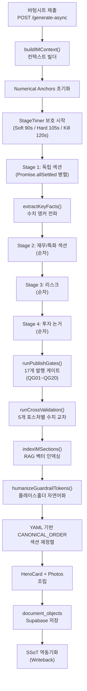
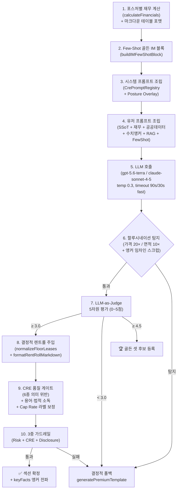

# 📱 CREDEAL 모바일 IM 섹션 콘텐츠 생성 & 렌더링 스펙

> **문서 ID**: `DOC-TEST0825-MOBILE-IM-SPEC-v2`  
> **생성 일시**: 2026-08-25 20:50 (KST)  
> **감사 대상**: `src/domain/building/mobile-im/` 전체 + `src/app/(public)/im-lite/` 웹 뷰어  
> **코드베이스 버전**: 2026-08-25 최신 (대폭 업그레이드 후 재감사)

---

## 📑 목차

1. [콘텐츠 생성 파이프라인 개요](#1-콘텐츠-생성-파이프라인-개요)
2. [4단계 위상 병렬 Writer](#2-4단계-위상-병렬-writer)
3. [섹션 카탈로그 & 포스처 시스템](#3-섹션-카탈로그--포스처-시스템)
4. [Per-Section 생성 파이프라인](#4-per-section-생성-파이프라인)
5. [프롬프트 아키텍처](#5-프롬프트-아키텍처)
6. [품질 게이트 & 안전장치](#6-품질-게이트--안전장치)
7. [컨텍스트 빌더](#7-컨텍스트-빌더)
8. [투자 아키타입 시스템](#8-투자-아키타입-시스템)
9. [재무 엔진](#9-재무-엔진)
10. [웹 뷰어 렌더링 상세](#10-웹-뷰어-렌더링-상세)
11. [Writer 출력 포맷](#11-writer-출력-포맷)

---

## 1. 콘텐츠 생성 파이프라인 개요



---

## 2. 4단계 위상 병렬 Writer

### 2.1 단계별 실행 구조 (포스처별 차이 포함)

| 단계 | 실행 모드 | `income` 섹션 | `development` 섹션 | `operating` 섹션 | `owner_occupied` 섹션 | `trading` 섹션 |
|---|---|---|---|---|---|---|
| **Stage 1** | `Promise.allSettled` | `property_overview`, `location_access`, `lease_status`, `next_steps` | `property_overview`, `location_access`, `next_steps` | `property_overview`, `location_access`, `next_steps` | `property_overview`, `location_access`, `next_steps` | `property_overview`, `location_access`, `next_steps` |
| **Stage 2** | 순차 | `income_analysis` | `site_analysis`, `dev_feasibility` | `operation_overview`, `gop_analysis` | `occupancy_fit`, `cost_comparison` | `market_position`, `comparable_analysis` |
| **Stage 3** | 순차 | `risk_check` | `risk_check` | `risk_check` | `risk_check` | `risk_check` |
| **Stage 4** | 순차 | `investment_thesis` | `investment_thesis` | `investment_thesis` | `investment_thesis` | `investment_thesis` |

### 2.2 StageTimer 보호 매커니즘

| 타이머 | 시간 | 동작 |
|---|:---:|---|
| **Soft Limit** | 90s | 텔레메트리 경고 로깅 |
| **Hard Limit** | 105s | 미완료 섹션 → 빠른 결정적 템플릿 폴백 |
| **Kill Limit** | 120s | 즉시 종료, 완료된 섹션만 반환 |

### 2.3 텔레메트리 수집

섹션별 fire-and-forget 텔레메트리: `latencyMs`, `inputTokens`, `outputTokens`, `stageName`, `model`, `fallbackUsed`.

### 2.4 출력 정렬

생성 순서와 무관하게, `loadPageOrder(posture)`가 반환하는 YAML 기반 CANONICAL_ORDER에 따라 최종 섹션 배열이 정렬됩니다.

---

## 3. 섹션 카탈로그 & 포스처 시스템

### 3.1 5개 포스처 × 11개 섹션 매트릭스

| # | 섹션 유형 | `income` | `owner_occ` | `dev` | `operating` | `trading` | 강조 |
|---|---|:---:|:---:|:---:|:---:|:---:|---|
| 1 | `property_overview` | ✅ | ✅ | ✅ | ✅ | ✅ | |
| 2 | `location_access` | ✅ | ✅ | ✅ | ✅ | ✅ | |
| 3 | `title_rights` | ✅ | ✅ | ✅ | ✅ | ✅ | |
| 4 | `land_detail` | ✅ | ✅ | ✅ | ✅ | ✅ | |
| 5a | `lease_status` | ✅ | - | - | - | - | ⭐ (income) |
| 5b | `occupancy_fit` | - | ✅ | - | - | - | ⭐ (oo) |
| 5c | `site_analysis` | - | - | ✅ | - | - | ⭐ (dev) |
| 5d | `operation_overview` | - | - | - | ✅ | - | ⭐ (op) |
| 5e | `market_position` | - | - | - | - | ✅ | ⭐ (trading) |
| 6a | `income_analysis` | ✅ | - | - | - | - | ⭐ (income) |
| 6b | `cost_comparison` | - | ✅ | - | - | - | ⭐ (oo) |
| 6c | `development_feasibility` | - | - | ✅ | - | - | ⭐ (dev) |
| 6d | `gop_analysis` | - | - | - | ✅ | - | ⭐ (op) |
| 6e | `comparable_analysis` | - | - | - | - | ✅ | ⭐ (trading) |
| 7 | `risk_check` | ✅ | ✅ | ✅ | ✅ | ✅ | |
| 8 | `checklist` | ✅ | ✅ | ✅ | ✅ | ✅ | ⭐ (전 포스처) |
| 9 | `comparables` | ✅ | ✅ | ✅ | ✅ | ✅ | |
| 10 | `investment_thesis` | ✅ | ✅ | ✅ | ✅ | ✅ | |
| 11 | `next_steps` | ✅ | ✅ | ✅ | ✅ | ✅ | |

> [!NOTE]
> 강조(⭐) 섹션은 **2× 토큰 예산**이 할당되며, 더 상세한 분석이 생성됩니다.

---

## 4. Per-Section 생성 파이프라인

### 4.1 10단계 실행 플로우



### 4.2 LLM 설정

| 항목 | 값 |
|---|---|
| **기본 모델** | `gpt-5.6-terra` / `claude-sonnet-4-5` |
| **Temperature** | `0.3` (금융 보고서용 저랜덤성) |
| **Max Tokens** | 섹션별 동적 (강조 섹션 2× 예산) |
| **Timeout** | 90s (일반), 30s (fast mode) |
| **System Prompt** | `CrePromptRegistry` → 활성 프롬프트 + `getPosturePromptOverlay` |

### 4.3 LLM-as-Judge 5차원 평가 (`im-judge.ts`)

| 차원 | 가중치 | 평가 기준 |
|---|:---:|---|
| `factual_accuracy` (fa) | 0.25 | SSoT 수치와 일치, 허위 사실 |
| `financial_soundness` (fs) | 0.20 | Cap Rate·NOI·LTV 계산 정확성, 역레버리지 경고 |
| `regulatory_compliance` (rc) | 0.25 | 한국 부동산 법규 준수 (상임법, 건축법) |
| `investor_value` (iv) | 0.15 | 투자 의사결정에 유용한 인사이트 |
| `data_grounding` (dg) | 0.15 | 공공 데이터/실측 기반 근거 제시 |

**분기**: < 3.0 → 결정적 폴백 / ≥ 3.0 → 통과 / ≥ 4.5 → 골든 셋 후보

---

## 5. 프롬프트 아키텍처

### 5.1 3계층 시스템 프롬프트 구조

```
┌──────────────────────────────────────────────────┐
│  NARRATIVE CORE (CrePromptRegistry)               │
│  • CRE 투자 전략가 페르소나                         │
│  • 2~4 문장 서사 규칙, 결론 선행 (So What?)          │
│  • "100% 보장" 등 수익률 보증 금지                  │
│  • 페르소나 격리 (연령/성별/계층 언급 절대 금지)     │
├──────────────────────────────────────────────────┤
│  POSTURE LEXICONS (용어 표준화)                    │
│  • 연 순수익률(Cap Rate) / 순영업수익(NOI)          │
│  • 실질 영업이익(GOP)                              │
│  • 인테리어 지원금(TI) / 렌트프리(무상임대)         │
│  • 사옥 단독 명칭 표기(간판 설치권)                 │
├──────────────────────────────────────────────────┤
│  POSTURE OVERLAYS (포스처별 분석 강조 지시)         │
│  • income: Net Equity + 월 현금흐름 + 3-Line        │
│  • owner_occupied: 10년 임차 vs 매입 BEP             │
│  • development: 잔여 용적률 + 평당 건축비 + 규제 만료 │
│  • operating: GOP 마진 + RevPAR/ADR + 시즌 패턴     │
│  • trading: 비교사례 할인율 + 플립 IRR + HPR         │
└──────────────────────────────────────────────────┘
```

### 5.2 유저 프롬프트 구성

| 구성 요소 | 내용 |
|---|---|
| 섹션 미션 | 해당 섹션의 생성 목표 정의 |
| SSoT Lite JSON | 건물 물리/재무/위치 정규화 데이터 |
| 공공 등기부 데이터 | 건축물대장, 토지이용계획, 공시지가 |
| 사전 계산 재무 테이블 | 포스처별 전략 엔진 결과 마크다운 |
| 수치 앵커 | 이전 섹션에서 추출된 핵심 수치 (keyFacts) |
| RAG 법률/시장 컨텍스트 | Supabase 벡터 검색 기반 지역 시세/판례 |
| Few-Shot 골든 IM 예시 | 우수 품질 IM 블록 샘플 |
| Pack Slots 데이터 | 포스처별 전문 데이터 (물류/호텔/개발/명도/인허가/자가사용/구분소유/주거) |

---

## 6. 품질 게이트 & 안전장치

### 6.1 17개 발행 게이트 (QG01~QG20)

#### 차단(Block) 게이트

| 코드 | 검사 대상 | 차단 조건 |
|---|---|---|
| QG01 | 매각가 존재 | `salePrice ≤ 0` |
| QG02 | 면적 존재 | `area ≤ 0 ∧ effectiveLandArea ≤ 0` |
| QG03 | 주소 존재 | 주소 누락 |
| QG04 | 데이터 등급 | 등급 `D` |
| QG05 | 수치 교차검증 | Critical 불일치 |
| QG06 | 할루시네이션 | Critical 할루시네이션 1건 이상 |
| QG07 | PII 잔존 | 개인정보 미마스킹 |
| QG08 | 위험 표현 | 확정수익, 투자보증, 비인가 금융 |
| QG10 | 온톨로지 분류 | 3축 분류 미확인 |

#### 경고(Warn) 게이트

| 코드 | 검사 대상 | 경고 조건 |
|---|---|---|
| QG09 | IM Judge 점수 | < 3.0 |
| QG11 | DCF 등급 | DCF 적격성 미달 |
| QG12 | Cap Rate 기준 | 산출 기반(NOI/NCF/GOP) 미명시 |
| QG13 | 상가임대차보호법 | 상임법 적용 여부 미평가 |
| QG14 | 갱신요구권 | 최초 계약일 미검증 |
| QG15 | 복합용도 법정 분류 | 복합용도 건물 법적 분류 미확인 |
| QG16 | 위반건축물 | 위반건축물 이력 미점검 |
| QG20 | 사진 PII | 간판/임차인명 노출 수동 확인 |

### 6.2 CRE 품질 게이트 (`cre-quality-gate.ts`) — 6종 의미 위반

| # | 위반 유형 | 예시 |
|---|---|---|
| 1 | `investment_guarantee` | "수익률 보장", "안전한 투자" |
| 2 | `fabricated_data` | 검증 없는 시세, 조작 수치 |
| 3 | `legal_assertion` | "법적 하자 없음", "분쟁 가능성 제로" |
| 4 | `misleading_comparison` | 근거 없는 비교사례 |
| 5 | `ungrounded_market_claim` | 출처 없는 시장 전망 |
| 6 | `price_opinion_prohibition` | "적정가", "지금이 매수 적기" |

> [!NOTE]
> **Fail-Open 전략**: CRE Quality Gate LLM 호출 실패 시 `passed: true` + `autoDisclaimerRequired: true`로 안전 통과합니다.

### 6.3 교차 검증기 (`cross-validator.ts`) — 5개 포스처별 규칙

| 포스처 | 검증 규칙 | 임계값 |
|---|---|---|
| 공통 | 공실률 섹션 간 불일치 | > 10%p → `critical` |
| 공통 | 연면적 섹션 간 불일치 | > 20% → `critical` |
| `income` | 서사 Cap Rate vs 엔진 계산 | > 0.5%p → `critical` |
| `income` | 서사 NOI vs 엔진 계산 | > 15% → `warning` |
| `development` | 총사업비 섹션 간 불일치 | > 15% → `critical` |
| `operating` | RevPAR 공식 (ADR×OCC) 불일치 | > 5% → `critical` |
| `trading` | 평당가 섹션 간 불일치 | > 10% → `warning` |

---

## 7. 컨텍스트 빌더

### 7.1 `buildIMContext()` 처리 플로우

| 단계 | 함수 | 입력 → 출력 |
|---|---|---|
| 1 | `normalizeSsotLite()` | DB 컬럼 + layers → `assetIdentity`, `physicalFact`, `marketLocation`, `buyerFit` |
| 2 | `buildProvenanceMap()` | 필드별 출처 매핑 (`public_api` / `broker` / `ai_estimated`) |
| 3 | `parsePriceBandKrw()` | 한국어 가격대 문자열 → 중간값 (예: "80억대"→85억, "70~85억"→77.5억) |
| 4 | `detectHallucination()` | 가격 20× / 면적 10× 이탈 탐지 |
| 5 | `computeValueAddScenarios()` | 가치제고 시나리오 (리모델링, 임대료, 공실 흡수) |
| 6 | `numericalAnchors` | 핵심 수치 잠금: `totalAreaSqm`, `vacancyPct`, `monthlyRentKrw`, `capRateBase`, `buildingAge` |
| 7 | `generateRAGContext()` | Supabase 벡터 검색 → 지역 시세/판례/규제 (Top-Level에서 1회) |
| 8 | `CrePromptRegistry` | 활성 시스템 프롬프트 버전 + 포스처 오버레이 선택 |

---

## 8. 투자 아키타입 시스템

### 8.1 9개 아키타입 카탈로그

| 코드 | 이름 | 포스처 | 톤 | 트리거 |
|---|---|---|---|---|
| `R-INC-01` | 안정형 (Stable) | `income` | `predictability` | 신축(≤10년) ∧ 임대료 상한 ∧ 확장 여지 미미 |
| `R-INC-02` | 갭 투자형 (Rent Gap) | `income` | `opportunity` | 현 임대료 ≥ 시세 15% 미만 |
| `R-INC-03` | 공실 해소형 (Turnaround) | `income` | `turnaround` | 공실률 > 15% |
| `R-INC-04` | 리모델링형 (Renovation) | `income` | `renovation` | 건물 연식 > 20년 |
| `OO-01` | 사옥 이전형 | `owner_occupied` | `relocation` | 자가사용 의향 |
| `DEV-01` | 개발 사업형 | `development` | `development` | 잔여 용적률 > 30% |
| `OP-01` | 운영 수익형 | `operating` | `operation` | 운영 시설 |
| `TR-01` | 시세 차익형 | `trading` | `trading` | 트레이딩 목적 |

### 8.2 자동 감지 로직 (`suggestArchetype`)

```typescript
// 비소득 포스처 우선 판별
if (posture === 'owner_occupied') return { primary: 'OO-01' };
if (posture === 'development')    return { primary: 'DEV-01' };
if (posture === 'operating')      return { primary: 'OP-01' };
if (posture === 'trading')        return { primary: 'TR-01' };

// Income 포스처 우선순위 사다리
if (vacancyPct >= 15)                    return { primary: 'R-INC-03' };
if (buildingAge >= 20)                   return { primary: 'R-INC-04' };
if (rentGapPct && rentGapPct >= 15)      return { primary: 'R-INC-02' };
return { primary: 'R-INC-01' };  // 기본: 안정형
```

### 8.3 포스처 변경 영향 매트릭스 (`postureChangeImpact`)

| 전환 | 슬롯 재작업률 | 영향도 |
|---|:---:|---|
| income ↔ development/operating | **60%** | High |
| income ↔ trading | **30%** | Medium |
| owner_occupied ↔ trading | **30%** | Medium |
| income ↔ owner_occupied | **10%** | Low |

---

## 9. 재무 엔진

### 9.1 5개 포스처별 전략 패턴 (`financials.ts`)

| 포스처 | 전략 클래스 | 핵심 계산 |
|---|---|---|
| `income` | `IncomeFinancialStrategy` | 3-시나리오 NOI (Best/Base/Worst), Cap Rate, 5Y IRR, 취득원가 분해(매매가+취득세4.6%+중개0.9%), 순자기자본, **역레버리지 자동 감지** (대출이자율 > 총수익률) |
| `development` | `DevelopmentFinancialStrategy` | 평당 토지가, 평당 건축비(1,200만원 기준), 5% 예비비, 총사업비, 분양수입, 개발 이익률, 규제 만료 카운트다운 |
| `operating` | `OperatingFinancialStrategy` | GOP(기본 35% 마진), GOP Cap Rate, ADR, OCC, RevPAR (= ADR × OCC) |
| `owner_occupied` | `OwnerOccupiedFinancialStrategy` | 가상 임차비 vs 부채 상환, 연간 절감액, 손익분기 연수(= 자기자본 / 연간 절감), 평당 월 점유비용 |
| `trading` | `TradingFinancialStrategy` | 평당가, 시세 할인율(vs 비교사례), 목표 자본이득, HPR(%) |

### 9.2 3-Line 순현금흐름 계산기

| 라인 | 공식 |
|---|---|
| ① 실투자금(내 돈) | 매매가 − 대출금 − 보증금 |
| ② 월 순수익 | 월 임대료 − 월 대출이자 |
| ③ 자기자본수익률 | (연 순수익 / 실투자금) × 100 |

**부가**: 원금 안전판 = 공시지가 × 토지면적 / 매각가 (토지가액 대비 원금 보호율)

### 9.3 DCF & 민감도 엔진

| 기능 | 상세 |
|---|---|
| **10년 DCF** | Terminal Value = Period NOI / Exit Cap Rate (10년차) |
| **IRR** | Newton-Raphson 근사 (최대 150 반복) |
| **3×3 민감도 매트릭스** | 임대료 성장률 (−1%, Base, +1%) × 할인율 (−1%, Base, +1%) |
| **WACC** | $\text{WACC} = (E_r \times r_e) + (D_r \times r_d \times (1 - t))$ |

---

## 10. 웹 뷰어 렌더링 상세

### 10.1 라우트 & 서버 렌더링

| 항목 | 값 |
|---|---|
| **경로** | `/im-lite/[buildingId]` |
| **서버 컴포넌트** | `page.tsx` — `fetchIMData()` (Supabase 직접 + Geocoding + Broker Stats) |
| **메타데이터** | OG Tags, 동적 `title`/`description` 생성 |
| **클라이언트 컴포넌트** | `<MobileIMViewer />` |

### 10.2 컴포넌트 트리 상세

```
MobileIMViewer
├── Warning Banners (Draft, D/C/B 등급 경고)
├── Sticky Top Bar
│   ├── "IM 보관함" 뒤로가기
│   ├── "📄 IM Lite" 배지
│   ├── ShareButton (Web Share / Clipboard)
│   └── Section Progress Dots (IntersectionObserver)
├── Hero Header
│   ├── Badges (자산유형, 권역, 규모)
│   ├── Building Name (블라인드 <h1>)
│   ├── Verification & Quality Badges
│   └── Subtitle
├── HeroCard (포스처 적응형)
│   ├── 2×2 Dynamic Metric Grid
│   ├── 3 Key Investment Points (번호 카드)
│   ├── Key Risk Box
│   ├── 10Y NPV Badge
│   └── SSoT Readiness Bar
├── PhotoGallery
│   ├── 수평 스냅 스크롤 (CSS scroll-snap-type)
│   ├── 지도 슬라이드 (KakaoStaticMap 3×3 서브픽셀 타일)
│   ├── 네이버/카카오 지도 1-tap 네비게이션
│   ├── Lightbox (전체화면 터치 스와이프)
│   └── 최대 12장 + 1장 지도
├── SectionCard List (아코디언)
│   ├── MarkdownRenderer (경량 커스텀, 외부 라이브러리 없음)
│   ├── DCFHeatmap (3×3 컬러코드: Emerald/Rose/Amber)
│   ├── LeverageChart (SVG 도넛, strokeDasharray 애니메이션)
│   ├── PriceTrendChart (SVG 라인, 비교사례 ㎡ 가격 vs 대상)
│   ├── Mid-stream CTA (3번째 섹션 후: 관심 표명)
│   └── End-stream CTA (마지막: Private IM 요청 + 브로커 통화)
├── FlatProfileCard (브로커 아바타, 전문분야, 활성 딜, 매거진)
├── IMInquiryBottomSheet (리드 캡처 모달)
├── Disclaimer & Protected Fields Card
└── FloatingActionBar
    ├── 브로커 모드 vs 매수자 뷰 전환
    ├── 카카오톡 공유
    ├── PPTX 프리셋 메뉴 (5종 내장 + 커스텀)
    └── PDF 다운로드
```

### 10.3 마크다운 → HTML 변환 체계

| 컴포넌트 | 처리 대상 | 변환 방식 |
|---|---|---|
| `MarkdownRenderer` | `##` 헤더, `>` 인용, `- ` 불릿, `1. ` 번호, `\|` 테이블 | 라인 분할 → 패턴 매칭 → React 요소 |
| `TableFromLines` | 마크다운 테이블 라인 | 반응형 `<table>` + 셀 포맷팅 |
| `InlineMarkdown` | `**bold**`, `*italic*`, ``, `[text](url)` | 인라인 HTML 변환 |
| `sanitizeHtml` | `<script>`, `on*`, `javascript:` | 화이트리스트 태그만 허용 |

### 10.4 브로커 관리 패널 (`im-management-panel.tsx`)

| 기능 | 상세 |
|---|---|
| **비동기 폴링** | 2초 간격, `generationStatus`: idle→analyzing→writing→validating→complete/error |
| **iOS Safari 복구** | `visibilitychange` 리스너, 앱 전환 복귀 시 즉시 상태 확인 |
| **PPTX 프리셋 선택** | 5종 내장 + 커스텀 브로커 프리셋 |
| **내보내기** | PDF / PPTX, `/api/public/im-lite/${buildingId}/${format}?tier=${tier}&preset=${preset}` |

---

## 11. Writer 출력 포맷

### 11.1 `MobileIMWriterOutput`

```typescript
export interface MobileIMWriterOutput {
  sections: MobileIMSection[];          // 11개 섹션
  boundary_note: string;                // 법적 경계 면책
  generated_at: string;                 // ISO 8601
  ai_used: boolean;
  heroCard?: HeroCardData;              // 포스처 적응형
  photos?: PhotoEntry[];
  dcf10Year?: Record<string, unknown>;  // A등급 전용
  financials?: {
    equityRequired: number | null;
    totalDepositBil: number | null;
    loanAmountBil: number | null;
    leveragedYield: number | null;
    wacc: number | null;
    negativeLeverage?: boolean;
  };
  dataCompleteness?: Record<string, number>;
  publishBlocked?: boolean;
  publishBlockReasons?: string[];
}
```

---

## 핵심 파일 인벤토리

| 계층 | 파일 | 역할 | 주요 변경사항 (v2) |
|---|---|---|---|
| **트리거** | `generate-async/route.ts` | 비동기 생성 API | 포스처 변경 무효화, posture_decisions 로깅 |
| **핸들러** | `generate/handler.ts` | 생성 핸들러 | 온톨로지 조합 게이트, 8종 Pack Slots 수용 |
| **Writer** | `writer.ts` | 4단계 위상 병렬 | **StageTimer 보호**, YAML 정렬, 텔레메트리 |
| **섹션** | `im-section-generator.ts` | 10단계 생성기 | Cap Rate 라벨 보정, fast mode 30s |
| **카탈로그** | `section-catalog.ts` | 5×11 매트릭스 | **11개 섹션 (title_rights, land_detail, checklist, comparables 추가)** |
| **프롬프트** | `narrative-prompt.ts` + `posture-prompts.ts` | 3계층 프롬프트 | CrePromptRegistry 전환 |
| **컨텍스트** | `im-context-builder.ts` | SSoT 정규화 | Top-level RAG 단일 호출 |
| **아키타입** | `archetype-registry.ts` | 9개 아키타입 | **postureChangeImpact 매트릭스** |
| **품질** | `quality-gates-v02.ts` | 17개 게이트 | **QG13~QG16 법률 게이트, QG20 사진 PII** |
| | `cre-quality-gate.ts` | 6종 의미 위반 | `price_opinion_prohibition` 추가 |
| | `im-judge.ts` | 5차원 Judge | 골든 셋 자동 프로모션 |
| | `cross-validator.ts` | 수치 교차 | **5개 포스처별 분화 규칙** |
| **재무** | `financials.ts` | 5 전략 패턴 | **역레버리지 자동 감지, 규제 만료 카운트다운** |
| | `net-cash-flow-calculator.ts` | 3-Line + 원금 안전판 | 토지가액 안전판 |
| | `dcf-sensitivity.ts` | DCF + IRR + WACC | Newton-Raphson 150 반복 |
| **뷰어** | `mobile-im-viewer.tsx` | 클라이언트 뷰어 | **PriceTrendChart, Naver/Kakao 네비게이션** |
| | `hero-card.tsx` | 포스처 적응형 | 5 포스처 × 4셀 메트릭 그리드 |
| | `dcf-heatmap.tsx` | DCF 3×3 | Emerald/Rose/Amber 컬러코드 |
| | `leverage-chart.tsx` | SVG 도넛 | strokeDasharray 애니메이션 |
| | `price-trend-chart.tsx` | SVG 라인차트 | **신규**: 비교사례 가격 추세 |

---

*본 문서는 2026-08-25 코드베이스 대폭 업그레이드 후 모바일 IM 콘텐츠 생성 파이프라인 및 웹 뷰어 렌더링 체계를 처음부터 재감사하여 작성된 기술 규격서입니다.*
