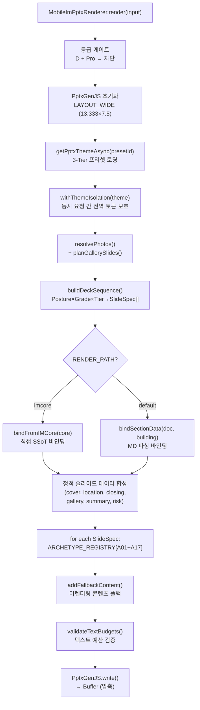

# 📊 CREDEAL PPTX IM 섹션 콘텐츠 생성 & 렌더링 스펙

> **문서 ID**: `DOC-TEST0825-PPTX-IM-SPEC-v2`  
> **생성 일시**: 2026-08-25 20:53 (KST)  
> **감사 대상**: `src/domain/building/mobile-im/pptx/` 전체 렌더링 파이프라인 (28개 파일)  
> **코드베이스 버전**: 2026-08-25 최신 (대폭 업그레이드 후 재감사)

---

## 📑 목차

1. [PPTX 렌더러 & 오케스트레이션](#1-pptx-렌더러--오케스트레이션)
2. [데이터 바인딩 엔진](#2-데이터-바인딩-엔진)
3. [imlib 컴포넌트 라이브러리](#3-imlib-컴포넌트-라이브러리)
4. [17개 아키타입 렌더링 상세 스펙 (A01~A17)](#4-17개-아키타입-렌더링-상세-스펙)
5. [덱 시퀀서 상세](#5-덱-시퀀서-상세)
6. [갤러리 플래너](#6-갤러리-플래너)
7. [텍스트 예산 & 바운드 시스템](#7-텍스트-예산--바운드-시스템)
8. [테마 & 프리셋 시스템](#8-테마--프리셋-시스템)
9. [유틸리티 모듈](#9-유틸리티-모듈)

---

## 1. PPTX 렌더러 & 오케스트레이션

### 1.1 렌더링 파이프라인 (`pptx-renderer.ts`, 591행)



### 1.2 핵심 인터페이스

```typescript
export type PptxTier = 'basic' | 'pro';

export interface MobileImPptxInput {
  buildingId: string;
  tier: PptxTier;
  preset?: string;                          // 프리셋 ID 또는 커스텀 UUID
  posture?: InvestmentPosture;
  grade?: 'A' | 'B' | 'C' | 'D';
  incomeArchetype?: 'R-INC-01' | 'R-INC-02' | 'R-INC-03' | 'R-INC-04';
  hasViolation?: boolean;                   // 위반건축물 → 대출 슬라이드 억제
  hasJointCollateral?: boolean;             // 공동담보 → 리스크 경고 주입
  doc: { title?; body; sections? };
  building?: { area_signal?; asset_type?; price_band?; owner_id? };
  broker?: { display_name?; company_name?; phone?; specialty? };
  watermark?: { requesterName; phoneLast4; timestamp };
  provenance?: Record<string, ProvenanceKind>;
  supabase?: SupabaseClient;
  logoUrl?: string;
  core?: IMCore;                            // imcore 직접 바인딩용
}

export interface MobileImPptxOutput {
  buffer: Buffer;
  slideCount: number;
  fileSizeBytes: number;
  generatedAt: string;
  warnings: string[];
}
```

### 1.3 폴백 파이프라인 (`addFallbackContent`)

아키타입이 콘텐츠를 미렌더링한 경우, 잔여 마크다운을 분석하여:
- 마크다운 테이블 → brass 스타일 테이블
- 헤더 블록 → 스타일링된 제목
- 불릿 포인트 → 들여쓰기 목록
- 인용(blockquote) → 콜아웃 박스
- 본문 → 표준 단락

---

## 2. 데이터 바인딩 엔진

### 2.1 이중 바인딩 모드

| 모드 | 함수 | 사용 조건 | 장점 |
|---|---|---|---|
| **마크다운 파싱** | `bindSectionData(doc, building)` | 기본 경로 | LLM 출력 유연 수용 |
| **IMCore 직접** | `bindFromIMCore(core: IMCore)` | `RENDER_PATH === 'imcore'` | 파싱 드리프트 0% |

### 2.2 섹션 유형 → 데이터 키 → 아키타입 전체 매핑

| 섹션 유형 | 주 데이터 키 | 아키타입 | 파생 데이터 키 → 아키타입 |
|---|---|---|---|
| `property_overview` | `building` | A04 | `summary`→A02, `land`→A04 |
| `location_access` | `location` | A06 | — |
| `lease_status` | `rentRoll` | A03 | `stability`→A04, `vacancy`→A04, `current`→A04 |
| `income_analysis` | `profit` | A05 | `capital`→A16, `dcf`→A05, `sensitivity`→A05, `loan`→A08, `tax`→A08, `rentGap`→A05, `upside`→A05, `leasing`→A05, `remodel`→A05, `comps`→A03 |
| `risk_check` | `risk` | A07 | — |
| `investment_thesis` | `thesis` | A15 | — |
| `next_steps` | `process` | A09 | — |
| `occupancy_fit` | `plan` | A04 | `commute`→A06 |
| `cost_comparison` | `vsLease` | A08 | `value`→A04 |
| `site_analysis` | `landDetail` | A04 | `scale`→A05, `eviction`→A04 |
| `development_feasibility` | `feasibility` | A05 | `cost`→A08, `stacking`→A17 |
| `operation_overview` | `kpi` | A13 | `operator`→A04 |
| `gop_analysis` | `revenue` | A05 | `seasonality`→A05 |
| `market_position` | `marketPosition` | A04 | `turnover`→A04 |
| `comparable_analysis` | `comps` | A03 | `trend`→A05, `price`→A04 |

### 2.3 `bindSectionData()` 처리 단계

```
1. 섹션 순회 → SECTION_TYPE_TO_DATA_KEY로 주 키 해석
2. sanitizePersona(markdown) 클렌징:
   • NaN/null/undefined + 단위 → "--"
   • 시스템 메시지 제거
   • 이모지 → 카테고리 태그 (🚇→[교통], 🏢→[건물] 등 15종)
   • 페르소나 언급 제거 ("60대 자산가를 위한" 등)
   • 가드레일 토큰 정상화 ("[인명 비공개]"→"담당자")
   • 갱신요구권 할루시네이션 보정
3. stripMarkdown() + CRE 용어 표준화:
   • 네이밍 라이츠 → 사옥 단독 명칭 표기(간판 설치권)
   • 브랜딩 라이츠 → 기업 단독 브랜딩
   • 추정 표현 제거, 중복 단어 제거
4. parseMarkdownTable() + extractMetrics()
5. transformForArchetype() — 아키타입별 빌더 호출
6. 파생 섹션 확장 (income_analysis → capital/dcf/sensitivity/loan/tax 등)
```

### 2.4 `bindFromIMCore()` 주요 직접 바인딩

| 데이터 키 | 아키타입 | 직접 바인딩 내용 |
|---|---|---|
| `summary` | A02 | 매각가 (억), Gross Yield, 순자기자본, 리드 문장 자동 생성 |
| `building` | A04 | 소재지/대지/연면적/층수/준공/용도지역/건폐율·용적률/주차/승강기/도로/하자 |
| `rentRoll` | A03 | 7열: 호실, 업종, 면적, 보증금, 월세, 관리비, 만기 |
| `profit` | A05 | 취득원가, 순자기자본, KPI stats |
| `capital` | A16 | equityBreakdown, LTV 0/40/50% 시나리오, **역레버리지 자동 감지** (`대출이자율 > Gross Yield`) |
| `stacking` | A17 | 개발 메트릭, 규제 만료/카운트다운 |
| `risk` | A07 | `deficiencies` → ThreeBlock (심각도, 권고 조치) |
| `thesis` | A15 | 3필러 자동 생성 (입지·수요, 수익성·현금흐름, 자산가치 상승) |

---

## 3. imlib 컴포넌트 라이브러리

### 3.1 캔버스 상수 & 기하

| 상수 | 값 | 단위 | 설명 |
|---|---|---|---|
| `W` | 13.333 | " | 캔버스 폭 (LAYOUT_WIDE 16:9) |
| `H` | 7.500 | " | 캔버스 높이 |
| `M` | 0.620 | " | 좌우 마진 |
| `CW` | 12.093 | " | 콘텐츠 폭 (W − 2M) |

```
col(n, gap) = (CW - gap × (n-1)) / n     // 컬럼 폭
colX(i, w, gap) = M + i × (w + gap)       // i번째 컬럼 x좌표
```

### 3.2 5종 레이아웃 스타일별 헤더 (`L.head`) 변형

| 스타일 | 번호 장식 | 제목 | 특징 |
|---|---|---|---|
| `classic` | Brass 원형(ø0.42") 흰색 번호 | 23pt bold, x=M+0.62 | 전통적 |
| `modern` | 좌측 수직 brass 바(w=0.05,h=0.62~0.86) | 22pt bold, x=M+0.20 | 역동적, 인라인 키커 |
| `executive` | 중앙 정렬, 상하 gold 헤어라인 | 26pt bold Noto Serif | 격조 높은 임원용 |
| `minimal` | 번호만(10pt), 원형 없음 | 21pt bold, 짧은 언더라인(2.5",1.5pt) | 미니멀 |
| `dramatic` | 전폭 다크 스트립(W×1.0"), 좌 brass 블록(0.12") | 28pt brass 번호, 24pt bold 흰색 | 드라마틱 |

### 3.3 전체 컴포넌트 목록 (21개)

| 함수 | 파라미터 | 좌표 / 규격 | 설명 |
|---|---|---|---|
| `col(n, gap)` | 정수, 인치 | — | 컬럼 폭 계산 |
| `colX(i, w, gap)` | 정수, 인치 | — | i번째 x좌표 |
| `light(pres)` | PptxGenJS | (0,0,13.333,7.5) fill `C.bg` | 라이트 슬라이드 |
| `dark(pres)` | PptxGenJS | (0,0,13.333,7.5) fill `C.ink` | 다크 슬라이드 |
| `head(s,num,kicker,title,sub?)` | — | y≈0.50~1.10 | 라이트 헤더 (5종 스타일) |
| `headD(s,num,kicker,title,sub?)` | — | y≈0.50~1.10 | 다크 헤더 (5종 스타일) |
| `foot(s,page,docno,onDark?)` | — | 하단 영역 | 푸터 (5종 스타일) |
| `watermark(s,text,onDark?)` | — | (1.5,2.5,10,2.5) | 36pt -30° 85% 투명 |
| `sub(s,x,y,w,text,onDark?)` | — | h=0.26 | 11pt bold 소제목 |
| `note(s,x,y,w,text,onDark?)` | — | h=0.42 | 7.8pt 각주, lineSpacing 1.25 |
| **`stat(s,x,y,w,label,value,unit,sub,opt)`** | — | h=opt.h??1.28 | **KPI 카드** — 동적 폰트: ≤6자→25pt, ≤12자→18pt, ≤20자→14pt, >20자→11pt |
| **`rows(s,x,y,w,list,opt)`** | RowEntry[] | rh=0.315" | **키-값 행** — 라벨40%/값38%/배지20%, 0.3pt 구분선, provenance 뱃지 |
| **`table(s,x,y,w,head,body,colW,opt)`** | — | rh=0.28" | **테이블** — 제브라 배경, autoPage, 반환: bottomY |
| **`callout(s,x,y,w,h,kind,title,body)`** | kind: info/good/warn/bad/brass | 좌 수직바 0.04" | **콜아웃** — 10.5pt 제목 + 9.3pt 불릿 본문 |
| `chip(s,x,y,kind,opt?)` | — | (w=1.02,h=0.21) | Provenance 필 배지 7.2pt |
| `tag(s,x,y,w,h,text,fg,bg,fs?)` | — | radius=h/2 | 커스텀 필 태그 |
| `card(s,x,y,w,h,opt?)` | — | 스타일별 | 컨테이너 카드 (5종 레이아웃 대응) |
| `waterfall(s,x,y,w,h,steps,max)` | — | 7.5pt 라벨, 8pt 값 | 워터폴 차트 |
| `stack(s,x,y,w,h,floors)` | — | 9pt 라벨 | 층별 스태킹 다이어그램 |
| `locmap(s,x,y,w,h)` | — | 10pt | 지도 플레이스홀더 |
| `chartOpts(overrides?)` | — | — | PptxGenJS 차트 기본 설정 |

---

## 4. 17개 아키타입 렌더링 상세 스펙

> 모든 좌표는 인치 단위. 캔버스 W=13.333", H=7.5", M=0.62", CW=12.093".

### A01 — Cover (표지) | 373행

5종 커버 스타일:

| 스타일 | 배경 장식 | kickerY | 특징 |
|---|---|:---:|---|
| `institutional_masses` | 3개 기하 블록 (9.05,0,1.55,4.42) + (10.70,0.95,1.25,3.47) + (12.05,1.85,1.28,2.57) | 2.22 | 좌측 워드마크 |
| `split` | 우측 brass 패널 (8.50,0,4.833,7.5) + 회전 대각선 | 2.22 | 좌우 분할 |
| `hero_dark` | 상하 brass 라인 + 중앙 gold 프레임 (M,1.80,CW,3.40) | 2.10 | 중앙 정렬 |
| `corporate_card` | 플로팅 카드 (1.50,1.20,10.33,5.10) + 상단 brass | 1.70 | contentX=2.10 |
| `obsidian_glow` | 동심원 3개 (8.0,0.5,6,6) + (9.0,1.5,4,4) + (9.8,2.3,2.4,2.4) | 2.22 | 글로우 이펙트 |

공통 요소:
- **Kicker**: 10pt bold brass NUM, charSpacing 2.5
- **타이틀**: **40pt bold white** TITLE_KR
- **부제목**: 14pt `CD.body`
- **태그**: `L.tag` 복수 필, `CD.block` 배경
- **매각가 박스**: h=1.34, w=min(7.5,CW), fs=22 bold `CD.accentText`
- **이미지 폴백**: 로드 실패 시 따뜻한 레이어드 패널

### A02 — Stat Grid (핵심 지표) | 229행

| 요소 | 좌표 | 폰트 |
|---|---|---|
| 리드 문장 | (M, 1.30, CW, 0.5) | 15pt bold ink |
| Brass 언더라인 | (M, 1.85, CW, 0) | 1.5pt |
| KPI 그리드 | y=2.15 (리드 있을 때) / 1.50 | 2~4열, gap=0.20", h=1.40" |
| 투자 하이라이트 (×3) | y=hlStartY, rH=0.64, rGap=0.12 | 번호배지(M+0.12, 0.45×0.40) + 텍스트 11.5pt |

### A03 — Large Table (렌트롤) | 159행

| 요소 | 좌표 | 동적 규칙 |
|---|---|---|
| 테이블 | (M, 1.80, CW) | ≤4열→fs13, 5~6열→fs11, >6열→fs10. ≤8행→rh0.48, >8행→rh0.38. 최대12행 |
| 스마트 컬럼 | — | 좁은 키워드(층/호/호실)→가중0.6, 기타1.0 |
| 셀 절단 | — | >45자→`…` |
| 각주 | (M, tableEnd+0.10) | `L.note`, `외 N건은 별첨 참조` 제거 |
| 콜아웃 (2열) | (M, tableEnd+0.40, col(2,0.20), 1.20) | 각주 중복 필터링 |

### A04 — Asymmetric 7:5 (비대칭 분할) | 139행

| 요소 | 좌표 |
|---|---|
| 좌 (7.50") | `L.rows` rh=0.44", fs=14pt, 최대10행 |
| Brass 수직선 | (8.316, 1.50, 0, 5.20) 0.7pt |
| 우·사진있음 | 이미지(8.513, 1.80, 4.20, 3.20) + 콜아웃(8.513, 5.15, 4.20, 1.55) |
| 우·사진없음 | 콜아웃1(8.513, 1.80, 4.20, 2.30) + 콜아웃2(8.513, 4.35, 4.20, 2.35) |

### A05 — Asymmetric 7:4 (KPI + 가치제안) | 160행

| 요소 | 좌표 | 폰트 |
|---|---|---|
| Row 1 KPI (3장) | (x, 2.15, 3.911", 1.30) | 값: **22pt** |
| Row 2 KPI (3장) | (x, 3.63, 3.911", 1.15) | 값: **18pt** |
| 라벨 동적 축소 | — | >20자→8.0pt, >16자→8.5pt, 기타→9.5pt |
| 가치제안 콜아웃 | (M, contentY+0.10, w, h≤1.40) | 2열 분할 또는 전폭 |

### A06 — Diagram (입지 지도) | 115행

| 요소 | 좌표 |
|---|---|
| 좌 지도 | (M, 1.62, 5.60, 4.50) — Kakao/OSM 5종 POI 마커 |
| 우 입지 행 | (6.62, y, 6.093) — rh=0.54", fs=13pt, 최대6행 |
| 우 콜아웃 | (6.62, y, 6.093, h≤2.0) — y<5.8 조건 |
| 출처 각주 | (6.62, min(y+0.1,6.2), 6.093) |

### A07 — Three Block (리스크 3블록) | 186행

| 요소 | 좌표 | 폰트 |
|---|---|---|
| 3열 카드 | w=3.844", h=4.00", y=1.55, gap=0.28 | — |
| Brass 상단바 | (x, y, w, 0.05) | — |
| 카테고리 헤더 | (x+0.25, y+0.22, w-0.5, 0.32) | 13.5pt bold |
| 상태값 | (x+0.25, y+0.58, w-0.5, 0.40) | 12.5pt bold, shrink |
| 불릿 포인트 | (x+0.25, y+1.05, w-0.5, 2.85) | 11pt, bullet `\u2022`, lnSp 1.25 |
| 하단 고지바 | (M, 5.68, CW, 0.68) | 11pt |
| 공동담보 경고 | — | `hasJointCollateral===true` 시 자동 주입 |

**폴백**: 빈 데이터 → 3개 표준 CRE 리스크 필러 자동 생성

### A08 — Dual Table (이중 테이블) | 59행

- 좌(7.30"): 테이블1 + 테이블2 (rh=0.46, fs=13)
- 우(rx=8.20, rw=4.51): 콜아웃1 + 콜아웃2 (h=2.10, cy+=2.25)

### A09 — Process (진행 절차) | 84행

- 3~4단계 카드: w=col(n,0.40), y=1.72, h=3.50
- 번호 원형(0.48×0.48, brass, 14pt bold white) + 제목(16pt bold) + 설명(11pt) + 태그(9pt)
- 연결 화살표: `rightArrow` 쉐이프

### A10 — Closing (마감) | 170행

- 다크 슬라이드. 프로세스 리본(3단계, y=1.60, h=0.72)
- 좌: 5등급 Provenance 배지 (`✓공부확인` / `★전문가검증` / `▲매도인고지` / `●중개인입력` / `◇AI추정·가정`)
- 우: 면책 카드 (8.5pt mute, lineSpacing 1.28)
- 하단: 푸터 바 + 로고 (M+CW-1.44, 6.34, 1.20, 0.36)

### A11 — Room Spec (호실 사양) | 55행

- 좌 테이블(M, 1.98, 7.10, rh=0.33, fs=10) + 우 2×2 통계(8.08, L.stat) + 위반 경고 카드(redL)

### A12 — Ownership (소유 구조) | 47행

- 좌 테이블(M, 1.98, 7.10, rh=0.35) + 우 콜아웃 ×3(8.08, h=1.24, gap=1.38)

### A13 — Operating KPI (운영 지표) | 79행

| 요소 | 좌표 |
|---|---|
| 좌 KPI 행 | (M, 1.85, 7.30) rh=0.46, fs=13.5, 최대7행 |
| 좌 콜아웃 | (M, 5.20, 7.30, 1.35) 운영 안정성 진단 |
| Brass 수직선 | (8.12, 1.50, 0, 5.20) |
| 우 통계 ×3 | (8.32, 1.68+i×(cH+0.20), 4.393, 1.45) |

### A14 — Gallery (사진 갤러리) | 193행

6종 레이아웃 토폴로지 (§6 참조). 카테고리 배지(8pt bold white) + 캡션 바(8.5pt white, 다크 스크림). 이미지 폴백 → `#F0F0F0` roundRect.

### A15 — Thesis (투자 논거) | 255행

| 필러 수 | 레이아웃 | 카드 크기 |
|---|---|---|
| 1~3 | 1×3 수평 | w=col(n,0.35), h=2.80~3.80 |
| 4 | 2×2 그리드 | w=col(2,0.35)=5.871", h=1.775 |

- 배지(11pt bold brassD) + 제목(15pt bold) + 디바이더 + 본문(12pt, lnSp 1.30)
- 벤치마크 테이블(선택적): rh=0.36, fs=10.5
- Takeaway 리본: (M, bannerY, CW, 0.88) fill brassT — "종합 가치 제안"

### A16 — Investment Structure (자본 구조) | 163행

- 2열 (colW=5.896", y=1.55, cardH=4.80)
- **좌**: 취득비용 7행 (매매가/취득세4.6%/중개0.9%/총원가/보증금/대출/순자기자본, rh=0.52, fs=11.5)
- **우**: LTV 시나리오 테이블 (0%/40%/50%, colW=[1.6,1.1,1.4,1.4], rh=0.50, fs=11)
- **우 하단**: `negativeLeverage===true` → ⚠️ 역레버리지 경고 / else → 💡 자본조달 가이드

### A17 — Pre-completion Marketing (준공전 마케팅) | 137행

- 2열 (colW=5.896", y=1.55, cardH=4.80)
- **좌**: 스태킹 플랜 테이블 (층수/권장용도/전용면적/타깃임차, rh=0.52, fs=11)
- **우**: 개발 메트릭 5행 (대지/연면적/건폐율·용적률/공사비/사업비, rh=0.48, fs=11)
- **우 하단**: `regulationExpiry` → ⏳ 한시적 용적률 완화 기한: YYYY-MM-DD (잔여 N일)

---

## 5. 덱 시퀀서 상세

### 5.1 `buildDeckSequence()` 분기 매트릭스

| 등급 | 티어 | 슬라이드 수 | 시퀀스 |
|---|---|:---:|---|
| **D** | Pro | 0 | **차단** |
| **D** | Basic | 3~5 | A01→[A14 Gallery]→A02→A09→A10 |
| **B/C** | Any | 7~11 | A01→[A14]→A02→A06→포스처 본문(3)→A07→A15→A09→A10 |
| **A** | Pro | ≤24 | 전체 시퀀스 (아래 참조) |

### 5.2 Pro A등급 전체 시퀀스

```
A01 Cover
 └ [A14 Gallery ×1~4]
A02 Summary
A06 Location
A04 Land
A04 Building
 └ [포스처별 본문 (§5.3)]
A05 DCF (Income A등급 전용)
A05 Sensitivity (Income A등급 전용)
A05 Total Return
A08 Loan (위반건축물 시 억제)
A08 Tax
A15 Thesis
A07 Risk
A09 Process
A10 Closing
```

### 5.3 포스처별 본문 분기

| 포스처 | 아키타입 | 본문 시퀀스 |
|---|---|---|
| `income` | R-INC-01 | A03 RentRoll → A04 Stability → A05 Profit → A16 Capital → A03 Comps |
| | R-INC-02 | A03 RentRoll → A05 RentGap → A05 Upside → A16 Capital → A03 Comps |
| | R-INC-03 | A03 RentRoll → A04 Vacancy → A05 Leasing → A16 Capital → A03 Comps |
| | R-INC-04 | A03 RentRoll → A04 Current → A05 Remodel → A16 Capital → A03 Comps |
| `owner_occupied` | — | A04 Plan → A08 VsLease → A06 Commute → A04 Value |
| `development` | — | A04 LandDetail → A05 Scale → A04 Eviction → A08 Cost → A17 Stacking → A05 Feasibility |
| `operating` | — | A13 KPI → A05 Revenue → A05 Seasonality → A04 Operator |
| `trading` | — | A03 Comps → A05 Trend → A04 Turnover → A04 Price |

> [!NOTE]
> **Hard Cap**: 총 슬라이드 > 24장 시 중간 슬라이드를 트림하되 Risk와 Closing은 보존합니다.

---

## 6. 갤러리 플래너

### 6.1 플래닝 알고리즘 (`gallery-planner.ts` v0.6.0, 244행)

```
1. 필터링: category='map' 및 URL 없는 항목 제외
2. 단축: ≤2장 → 단일 슬라이드
3. 그룹핑: G1(외관), G2(공용), G3(전용부), G4(설비)
4. 포스처별 그룹 우선순위 정렬 (§6.2)
5. 배칭: 그룹 경계 존중, 슬라이드당 최대 4장, 최대 4슬라이드
6. 로마 숫자 넘버링 (Gallery I~IV)
7. 그룹 제목 자동 생성 (건물 외관 / 공용부 / 전용부 / 설비)
```

### 6.2 포스처별 그룹 우선순위

| 포스처 | 순위 1 | 순위 2 | 순위 3 | 순위 4 |
|---|---|---|---|---|
| `income`, `trading`, `operating` | G1 외관 | G3 전용부 | G2 공용부 | G4 설비 |
| `owner_occupied` | G1 외관 | G2 공용부 | G3 전용부 | G4 설비 |
| `development` | G1 외관 | G4 설비 | G3 전용부 | G2 공용부 |

### 6.3 6종 레이아웃 토폴로지 (정확한 좌표)

> startY=1.35", gap=0.14", maxH=5.15"

| 타입 | 장수 | 바운딩 박스 $(x, y, w, h)$ |
|---|:---:|---|
| `FULL_WIDE` | 1 | **Hero**: $(0.62, 1.35, 12.093, 5.15)$ |
| `DUAL_LANDSCAPE` | 2 | **L**: $(0.62, 1.35, 5.976, 5.15)$, **R**: $(6.736, 1.35, 5.976, 5.15)$ |
| `DUAL_PORTRAIT` | 2 | 동일 치수 (세로 크롭) |
| `ONE_LARGE_TWO_SMALL_H` | 3 | **L 60%**: $(0.62, 1.35, 7.171, 5.15)$, **RT**: $(7.932, 1.35, 4.781, 2.505)$, **RB**: $(7.932, 3.995, 4.781, 2.505)$ |
| `ONE_LARGE_TWO_SMALL_V` | 3 | 상단 Hero + 하단 2개 |
| `GRID_2X2` | 4 | **TL**: $(0.62, 1.35, 5.976, 2.505)$, **TR**: $(6.736, 1.35, 5.976, 2.505)$, **BL**: $(0.62, 3.995, 5.976, 2.505)$, **BR**: $(6.736, 3.995, 5.976, 2.505)$ |

---

## 7. 텍스트 예산 & 바운드 시스템

### 7.1 `TEXT_LIMITS` 전체 사전

| 요소 | 최대 글자 | 용도 |
|---|:---:|---|
| `slideTitle` | 32 | 슬라이드 주 제목 |
| `kicker` | 35 | 키커 / 카테고리 |
| `subTitle` | 50 | 부제목 |
| `leadSentence` | 100 | 핵심 요약 |
| `subHeading` | 35 | 소제목 |
| `statLabel` | 18 | KPI 라벨 |
| `statValue` | 10 | KPI 값 |
| `statSub` | 30 | KPI 부가정보 |
| `calloutTitle` | 30 | 콜아웃 제목 |
| `tableHeader` | 16 | 테이블 헤더 |
| `tableCell` | 30 | 테이블 셀 |
| `note` | 140 | 각주 |

### 7.2 한국어 문장 경계 절단 (`enforceTextBudget`)

```
1. text.length ≤ maxLen → 원문 반환
2. candidate = text.slice(0, maxLen)
3. 한국어 종결점 탐색: ". ", "다. ", "요. ", "음. ", "다.", "요.", "함.", "임."
4. 종결점 > maxLen×0.5 → 클린 절단
5. 단어 경계 " " > maxLen×0.65 → 절단 + "…"
6. 그 외 → maxLen + "…"
```

### 7.3 CJK 행 계산

```typescript
charsPerLine(boxWidth, fontSize) = Math.floor((boxWidth - 0.36) / (0.19 × (10 / fontSize)))
calcCalloutHeight(body, w) = 0.55 + totalLines × 0.29
```

### 7.4 인쇄 안전 영역 (`assertBounds`)

| 축 | 제한 | 허용 오차 |
|---|:---:|:---:|
| 가로 | $x + w \leq 12.713"$ | +0.05" |
| 세로 | $y + h \leq 6.75"$ | +0.05" |

---

## 8. 테마 & 프리셋 시스템

### 8.1 5종 내장 프리셋 (`pptx-theme.ts`, 413행)

| 프리셋 ID | 이름 | Ink / BG | 악센트 | 커버 스타일 | 레이아웃 | 타이틀 폰트 |
|---|---|---|---|---|---|---|
| `golden_institutional` | Golden Institutional | `#10161F` / `#FFFFFF` | `#B98A2E` (Gold) | `institutional_masses` | `classic` | Pretendard |
| `credeal_signature` | CREDEAL Signature | `#0F172A` / `#FFFFFF` | `#6B8E00` (Lime) | `split` | `modern` | Pretendard |
| `executive_gold` | Executive Gold | `#0A1128` / `#FFFFFF` | `#B8862D` (Gold) | `hero_dark` | `executive` | Noto Serif KR |
| `corporate_clean` | Corporate Clean | `#1E293B` / `#FFFFFF` | `#059669` (Emerald) | `corporate_card` | `minimal` | Pretendard |
| `pro_dark_obsidian` | Pro Dark Obsidian | `#09090B` / `#FFFFFF` | `#0284A8` (Cyan) | `obsidian_glow` | `dramatic` | Pretendard |

### 8.2 커스텀 프리셋 시스템

- **로딩**: `getPptxThemeAsync(presetId, supabase)`
  1. 내장 사전 확인
  2. UUID → `pptx_custom_presets` 테이블 쿼리 (tokens, cover_style, layout_style, company_name, tagline, logo_url)
  3. `golden_institutional` 위에 커스텀 토큰 병합
  4. 폴백: `golden_institutional`

- **접근성 검증**: `validatePresetAccessibility(preset)`
  - body vs bg: ≥ 4.5:1 (WCAG AA)
  - ink vs bg: ≥ 4.5:1
  - accent vs bg: ≥ 3.0:1
  - darkBody vs darkCard: ≥ 3.0:1

### 8.3 테마 격리 (`withThemeIsolation`)

동시 요청이 전역 색상/폰트 토큰(`C`, `CD`, `KR`, `TITLE_KR`, `THEME_META`, `PV`)을 오염시키지 않도록, 각 렌더링 사이클을 격리합니다.

---

## 9. 유틸리티 모듈

### 9.1 Basis Enforcer (`basis-enforcer.ts`, 58행)

| 함수 | 강제 규칙 |
|---|---|
| `enforceFloorAreaRatio` | FAR 계산에 지상 연면적만 사용 |
| `enforceCapRateLabel` | 산출 기준 라벨 표준화 (NOI/NCF/GOP Cap Rate) |
| `validateGopPlacement` | GOP 없이 NOI만 표시 시 경고 |
| `enforceLeaseLaw` | 상가임대차보호법 적용 상태 강제 |
| `enforceRentCeiling` | 법정 임대료 인상 상한 5% |

### 9.2 Provenance Mapper (`provenance-mapper.ts`, 41행)

| 등급 | 심볼 | 가중치 | 라벨 |
|---|---|:---:|---|
| `pub` | ✓ | **1.00** | 공부확인 (등기부·건축물대장) |
| `exp` | ★ | **0.95** | 전문가검증 (세무사·감평사) |
| `sel` | ▲ | **0.65** | 매도인고지 |
| `brk` | ● | **0.60** | 중개인입력 |
| `ai` | ◇ | **0.30** | AI추정·가정 |

`getWeakestLink(provenances)`: 복합 지표의 최약 출처를 기준으로 전체 신뢰도 산정.

### 9.3 Image Optimizer (`image-optimizer.ts`, 429행)

| 기능 | 상세 |
|---|---|
| `optimizeImageForPptx` | Sharp: max 1280px, mozjpeg 75%, WebP/PNG→JPEG, Buffer + Base64 반환 |
| `generateStaticMapPlaceholder` | **Tier 0**: Kakao Static Map API (커스텀 마커 + POI), **Tier 1**: OSM 3×3 타일 합성 (sharp composite), **Tier 2**: SVG 벡터 다크 플레이스홀더 |

### 9.4 HTML Parser (`html-parser.ts`, 67행)

| 함수 | 용도 |
|---|---|
| `stripHtml` | HTML 태그 제거 |
| `parseHtmlTable` | HTML 테이블 → ParsedTable |
| `parseMarkdownTable` | MD 테이블 → ParsedTable |
| `formatKrwCompact` | 만원 → 억/만원 포맷 |

---

## 핵심 파일 인벤토리

| 파일 | 행수 | 크기 | 역할 | 주요 변경 (v2) |
|---|:---:|:---:|---|---|
| `pptx-renderer.ts` | 591 | 24.5K | 메인 렌더러 | **addFallbackContent, validateTextBudgets** |
| `deck-sequencer.ts` | 232 | 12.2K | 덱 시퀀서 | **24슬라이드 Hard Cap** |
| `data-binder.ts` | 1,657 | 71.4K | 이중 바인더 | **stripMarkdown CRE 용어 강제, 역레버리지** |
| `imlib.ts` | 1,245 | 39.4K | 21개 프리미티브 | **5종 레이아웃 스타일 분기, chartOpts** |
| `pptx-theme.ts` | 413 | 10.9K | 프리셋 | **커스텀 DB 프리셋, WCAG 검증** |
| `gallery-planner.ts` | 244 | 9.3K | v0.6.0 갤러리 | **그룹 제목 자동 생성** |
| `text-budget.ts` | 123 | 3.9K | 텍스트 예산 | — |
| `basis-enforcer.ts` | 58 | 1.8K | 재무 기준 강제 | **enforceRentCeiling** |
| `provenance-mapper.ts` | 41 | 1.4K | 출처 매핑 | **getWeakestLink** |
| `image-optimizer.ts` | 429 | 14.9K | Sharp 최적화 | **3-Tier 지도 생성기** |
| `html-parser.ts` | 67 | 2.0K | 파서 | **formatKrwCompact** |
| `archetypes/a01~a17` | 17파일 | — | 아키타입 빌더 | 전체 재감사 완료 |

---

*본 문서는 2026-08-25 코드베이스 대폭 업그레이드 후 PPTX IM 렌더링 파이프라인의 28개 파일을 처음부터 재감사하여 작성된 기술 규격서입니다.*
