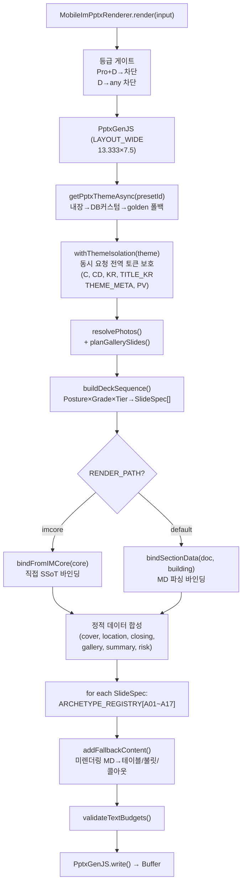

# 📊 CREDEAL PPTX IM 섹션 콘텐츠 생성 & 렌더링 스펙

> **문서 ID**: `DOC-TEST0825-PPTX-IM-SPEC-v3`  
> **생성 일시**: 2026-08-26 07:34 (KST)  
> **감사 대상**: `src/domain/building/mobile-im/pptx/` 전체 (29개 파일)  
> **코드베이스 버전**: 2026-08-26 최신 (전체 재감사)

---

## 📑 목차

1. [PPTX 렌더러 & 오케스트레이션](#1-pptx-렌더러--오케스트레이션)
2. [데이터 바인딩 엔진](#2-데이터-바인딩-엔진)
3. [imlib 컴포넌트 라이브러리](#3-imlib-컴포넌트-라이브러리)
4. [17개 아키타입 렌더링 상세 스펙](#4-17개-아키타입-렌더링-상세-스펙)
5. [덱 시퀀서 상세](#5-덱-시퀀서-상세)
6. [갤러리 플래너](#6-갤러리-플래너)
7. [텍스트 예산 & 바운드 시스템](#7-텍스트-예산--바운드-시스템)
8. [테마 & 프리셋 시스템](#8-테마--프리셋-시스템)
9. [유틸리티 모듈](#9-유틸리티-모듈)

---

## 1. PPTX 렌더러 & 오케스트레이션

### 1.1 렌더링 파이프라인 (`pptx-renderer.ts`, 591행)



### 1.2 핵심 인터페이스

```typescript
interface MobileImPptxInput {
  buildingId: string;
  tier: 'basic' | 'pro';
  preset?: string;
  posture?: InvestmentPosture;
  grade?: 'A' | 'B' | 'C' | 'D';
  incomeArchetype?: 'R-INC-01' | 'R-INC-02' | 'R-INC-03' | 'R-INC-04';
  hasViolation?: boolean;              // 위반건축물 → 대출 억제
  hasJointCollateral?: boolean;        // 공동담보 → 리스크 경고
  doc: { title?; body; sections? };
  building?: { area_signal?; asset_type?; price_band?; owner_id? };
  broker?: { display_name?; company_name?; phone?; specialty? };
  watermark?: { requesterName; phoneLast4; timestamp };
  provenance?: Record<string, ProvenanceKind>;
  supabase?: SupabaseClient;
  logoUrl?: string;
  core?: IMCore;                       // imcore 직접 바인딩
}

interface MobileImPptxOutput {
  buffer: Buffer;
  slideCount: number;
  fileSizeBytes: number;
  generatedAt: string;
  warnings: string[];
}
```

### 1.3 폴백 파이프라인 (`addFallbackContent`)

아키타입이 콘텐츠를 미렌더링한 경우 (바디 쉐이프 $y \geq 1.7$, $h > 0.1$, $w < 12$ 없음), 잔여 마크다운을 분석:
- 마크다운 테이블 → brass 스타일 테이블
- 헤더 블록 → 스타일링 제목
- 불릿 포인트 → 들여쓰기 목록
- 인용(blockquote) → 콜아웃 박스
- 본문 → 표준 단락

---

## 2. 데이터 바인딩 엔진

### 2.1 이중 바인딩 모드 (`data-binder.ts`, 1,657행)

| 모드 | 함수 | 장점 |
|---|---|---|
| **MD 파싱** | `bindSectionData(doc, building)` | LLM 출력 유연 수용 |
| **IMCore 직접** | `bindFromIMCore(core)` | 파싱 드리프트 0% |

### 2.2 소독 파이프라인 (`sanitizePersona` + `stripMarkdown`)

```
1. NaN/null/undefined + 단위 → "--"
2. 시스템 메시지 제거 ("건축물대장 조회 미완료", "임대차 상세 현황")
3. 이모지 → 카테고리 태그 (🚇→[교통], ⭐→★, ✓→✔ 등 15종)
4. 페르소나 언급 제거 ("60대 자산가를 위한" 등)
5. CRE 용어 강제:
   • 네이밍 라이츠 → 사옥 단독 명칭 표기(간판 설치권)
   • 브랜딩 라이츠 → 기업 단독 브랜딩
6. 가드레일 토큰 자연어화 ("[인명 비공개]게" → "담당자에게")
7. 갱신요구권 할루시네이션 → "계약갱신요구권(최초계약일 확인 필요)"
8. 추정 표현 제거, 중복 단어 제거
```

### 2.3 섹션 유형 → 데이터 키 → 아키타입 매핑

| 섹션 유형 | 주 데이터 키 → 아키타입 | 파생 키 → 아키타입 |
|---|---|---|
| `property_overview` | `building`→A04 | `summary`→A02, `land`→A04 |
| `location_access` | `location`→A06 | — |
| `lease_status` | `rentRoll`→A03 | `stability/vacancy/current`→A04 |
| `income_analysis` | `profit`→A05 | `capital`→A16, `dcf/sensitivity`→A05, `loan/tax`→A08, `rentGap/upside/leasing/remodel`→A05, `comps`→A03 |
| `risk_check` | `risk`→A07 | — |
| `investment_thesis` | `thesis`→A15 | — |
| `next_steps` | `process`→A09 | — |
| `occupancy_fit` | `plan`→A04 | `commute`→A06 |
| `cost_comparison` | `vsLease`→A08 | `value`→A04 |
| `site_analysis` | `landDetail`→A04 | `scale`→A05, `eviction`→A04 |
| `development_feasibility` | `feasibility`→A05 | `cost`→A08, `stacking`→A17 |
| `operation_overview` | `kpi`→A13 | `operator`→A04 |
| `gop_analysis` | `revenue`→A05 | `seasonality`→A05 |
| `market_position` | `marketPosition`→A04 | `turnover`→A04 |
| `comparable_analysis` | `comps`→A03 | `trend`→A05, `price`→A04 |

---

## 3. imlib 컴포넌트 라이브러리 (`imlib.ts`, 1,245행)

### 3.1 캔버스 기하

| 상수 | 값 | 단위 |
|---|---|---|
| `W` | 13.333 | " (LAYOUT_WIDE 16:9) |
| `H` | 7.500 | " |
| `M` | 0.620 | " (좌우 마진) |
| `CW` | 12.093 | " (콘텐츠 폭) |

```
col(n, gap) = (CW - gap × (n-1)) / n
colX(i, w, gap) = M + i × (w + gap)
```

### 3.2 5종 레이아웃 스타일 — `head()` / `headD()`

| 스타일 | 번호 장식 | 제목 | 특징 |
|---|---|---|---|
| `classic` | Brass 원(ø0.42") 흰색 번호 | 23pt bold, x=M+0.62 | 전통적 |
| `modern` | 좌 수직 brass 바(w=0.05,h=0.62~0.86) | 22pt, x=M+0.20 | 인라인 키커 |
| `executive` | 중앙 정렬, 상하 gold 헤어라인 | 26pt Noto Serif | 격조 높은 |
| `minimal` | 번호만(10pt), 원형 없음 | 21pt, 짧은 언더라인(2.5") | 미니멀 |
| `dramatic` | 전폭 다크 스트립(W×1.0"), 좌 brass 블록 | 28pt brass + 24pt white | 드라마틱 |

### 3.3 주요 컴포넌트 (21개)

| 함수 | 핵심 | 동적 규칙 |
|---|---|---|
| `stat()` | KPI 카드 | 값 폰트: ≤6자→25pt, ≤12→18pt, ≤20→14pt, >20→11pt, `shrinkText` |
| `rows()` | 키-값 행 | 4-tuple `[label, value, badge?, valColor?]`, 배지 시 40%/38%/20%, 무배지 38%/62% |
| `table()` | 구조화 테이블 | 제브라 배경, 0.3pt 보더, autoPage, 반환: `bottomY` |
| `callout()` | 콜아웃 박스 | 5종 kind (info/good/warn/bad/brass), 좌 수직바 0.04" |
| `watermark()` | 워터마크 | 36pt -30° 85% 투명 |
| `chip()` | Provenance 배지 | 7.2pt, w=1.02, h=0.21 |
| `tag()` | 커스텀 태그 | radius=h/2 |
| `card()` | 컨테이너 카드 | 5종 레이아웃 대응 |
| `waterfall()` | 워터폴 차트 | 7.5pt 라벨, 8pt 값 |
| `stack()` | 스태킹 다이어그램 | 9pt 라벨 |
| `locmap()` | 지도 플레이스홀더 | 10pt |

---

## 4. 17개 아키타입 렌더링 상세 스펙

> 모든 좌표: 인치. W=13.333", H=7.5", M=0.62", CW=12.093".

### A01 — Cover (5종 스타일)

| 스타일 | 배경 장식 | kickerY | 특징 |
|---|---|:---:|---|
| `institutional_masses` | 3 기하 블록 (9.05/10.70/12.05) | 2.22 | 좌 워드마크 |
| `split` | 우 brass 패널 (8.50,0,4.833,7.50) | 2.22 | 좌우 분할 |
| `hero_dark` | 상하 brass 라인 + 중앙 프레임 (M,1.80,CW,3.40) | 2.10 | 중앙 정렬 |
| `corporate_card` | 플로팅 카드 (1.50,1.20,10.33,5.10) | 1.70 | x=2.10 |
| `obsidian_glow` | 3 동심원 (8.0/9.0/9.8) | 2.22 | 글로우 |

**공통**: Kicker 10pt NUM charSpacing 2.5 → **Title 40pt bold TITLE_KR** → Subtitle 14pt → Tags → Price Box (h=1.34, fs=22 bold) → Broker (fs=8.5) → Logo (1.20×0.40)

### A02 — Stat Grid

- 리드 문장: (M, 1.30, CW, 0.5) 15pt bold + brass 언더라인 1.5pt
- KPI 그리드: y=2.15 (리드 시) / 1.50, 2~4열, gap=0.20", h=1.40", 값 20pt bold
- 3 투자 하이라이트: hlStartY, rH=0.64, 번호 배지(0.45×0.40) + 텍스트 11.5pt

### A03 — Large Table (렌트롤/비교사례)

- 위치: (M, 1.80, CW), 스마트 컬럼 가중치 (좁은 키워드 0.6×)
- 폰트: ≤4열→fs13, 5~6→fs11, >6→fs10. ≤8행→rh0.48, >8행→rh0.38
- **MAX_ROWS = 12** → 분할 페이지네이션 (D29 BL-2)
- 각주 + 2열 콜아웃 (tableEnd+0.40, col(2,0.20), h=1.20)

### A04 — Asymmetric 7:5

- 좌 7.50": `L.rows` rh=0.44", fs=14, max 10행
- Brass 수직선: (8.316, 1.50, 0, 5.20) 0.7pt
- 우 with photo: 이미지(8.513, 1.80, 4.20, 3.20) + 콜아웃(5.15, h=1.55)
- 우 no photo: 콜아웃×2 (1.80, h=2.30) + (4.35, h=2.35)

### A05 — Asymmetric 7:4

- Row 1 KPI (3장): y=contentY, w=col(3,0.18)=3.911", h=1.30, 값 22pt bold
- Row 2 KPI (3장): y+1.48, h=1.15, 값 18pt bold
- 라벨 동적 축소: >20자→8.0pt, >16→8.5pt, 기타→9.5pt
- 가치제안 콜아웃: (M, y+0.10, w, h≤1.40), 전폭 또는 2열

### A06 — Diagram (입지 지도)

- 좌 지도: (M, 1.62, 5.60, 4.50) — 3-Tier (Kakao→OSM 3×3→SVG)
- 우 입지 행: (6.62, y, 6.093) rh=0.54", fs=13, max 6행
- 우 콜아웃: h = min(2.0, max(0.7, 0.36 + lines × 0.24 + 0.12))

### A07 — Three Block (리스크)

- 3열 카드: w=col(3,0.28)=3.844", h=4.00", y=1.55
- Brass 상단바(h=0.05) + 카테고리 13.5pt + 상태 12.5pt + 불릿 11pt (lnSp 1.25)
- 하단 고지바: (M, 5.68, CW, 0.68) fs=11
- **공동담보 경고**: `hasJointCollateral` → 자동 주입
- **폴백**: 3개 표준 CRE 카테고리 (법적·공법, 임대차·명도, 물리적·시설)

### A08 — Dual Table

- 좌 (M, 7.30"): 테이블1 (y=1.90) + 테이블2, rh=0.46, fs=13
- 우 (8.20, 4.51"): 콜아웃1 (y=1.90, h=2.10) + 콜아웃2 (y=4.15)

### A09 — Process (3~4단계)

- 카드: w=col(n,0.40), y=1.72, h=3.50
- Brass 원(0.48×0.48, fs=14) + 제목 16pt + 설명 11pt + 태그 9pt
- 연결 화살표 (`rightArrow`)

### A10 — Closing (다크)

- 3-Step 리본 (y=1.60, h=0.72, col(3,0.16))
- 좌 5등급 Provenance (y=2.98 + i×0.52, 배지 1.40×0.32)
- 우 면책 (x=7.10, w=5.61, fs=8.5, lnSp=1.28)
- 푸터 바 (y=6.30, fill accentBg) + 로고 (M+CW-1.44, 1.20×0.36)

### A11 — Room Spec

- 좌 테이블 (M, 1.98, 7.10, rh=0.33, fs=10)
- 우 2×2 stat (x=8.08, w=2.24, h=1.06)
- 위반 경고 (x=8.08, y=4.30, 4.63×1.20, fill=redL, fs=10)

### A12 — Ownership / Checklist

- 좌 테이블 (M, 1.98, 7.10, rh=0.35, fs=10)
- 우 콜아웃 ×3 (x=8.08, 4.63, y=1.98+i×1.38, h=1.24, fs=11)

### A13 — Operating KPI

- 좌 (M, 7.30"): KPI 행 (rh=0.46, fs=13.5, max 7행) + 운영안정 콜아웃 (y=5.20, h=1.35)
- Brass 수직선 (8.12, 1.50, 0, 5.20)
- 우 3 stat 카드 (x=8.32, 4.393, cardH=1.45/1.80)

### A14 — Gallery (6종 토폴로지)

| 타입 | 장수 | 좌표 요약 |
|---|:---:|---|
| `FULL_WIDE` | 1 | (M, 1.35, CW, 5.15) |
| `DUAL_LANDSCAPE` / `DUAL_PORTRAIT` | 2 | 각 (5.976 × 5.15) |
| `ONE_LARGE_TWO_SMALL_H` | 3 | L 60% (7.171) + RT/RB (4.781 × 2.505) |
| `ONE_LARGE_TWO_SMALL_V` | 3 | T large + B 2개 |
| `GRID_2X2` | 4 | 각 (5.976 × 2.505) |

카테고리 배지 (8pt bold white) + 캡션 바 (8.5pt, 40% 다크 스크림). 이미지 폴백→#F0F0F0 roundRect.

### A15 — Thesis (투자 논거)

| 필러 수 | 레이아웃 | 크기 |
|---|---|---|
| 1~3 | 1×3 수평 | w=col(n,0.35)≈3.79", h=2.80~3.80 |
| 4 | 2×2 그리드 | w=5.87", h=1.275~1.775 |

- 배지 11pt brassD + 제목 15pt + 디바이더 + 본문 12pt lnSp 1.30
- 벤치마크 테이블 (rh=0.36, fs=10.5)
- Takeaway 리본 (M, bannerY≤6.62, CW, 0.88, fill brassT)

### A16 — Investment Structure (자본 구조)

- 2열 (5.896", y=1.55, h=4.80)
- **좌**: 취득비용 7행 (매매가/취득세4.6%/중개0.9%/총원가/보증금/대출/순자기자본, rh=0.52, fs=11.5)
- **우**: LTV 시나리오 (0%/40%/50%, colW=[1.6,1.1,1.4,1.4], rh=0.50, fs=11)
- **경고**: `negativeLeverage` → ⚠️ 역레버리지 / else → 💡 자본조달 가이드

### A17 — Pre-completion Marketing (준공전)

- 2열 (5.896", y=1.55, h=4.80)
- **좌**: 스태킹 플랜 (층수/용도/전용면적/타깃, colW=[1.1,1.6,1.2,1.5], rh=0.52, fs=11)
- **우**: 개발 메트릭 5행 (대지/연면적/건폐율·용적률/공사비/사업비, rh=0.48, fs=11)
- **FAR 완화 경고**: `regulationExpiry` → ⏳ 잔여 일수 카운트다운

---

## 5. 덱 시퀀서 상세 (`deck-sequencer.ts`, 232행)

### 5.1 분기 매트릭스

| 등급 | 티어 | 슬라이드 | 시퀀스 |
|---|---|:---:|---|
| **D** | Any | **0** | **발행 차단** (ONTOLOGY_V0.5_SPEC §6.3) |
| **B/C** | Basic | 7~11 | A01→A14→A02→A06→포스처 본문(3)→A04 Title→A07→A12→A15→A09→A10 |
| **A** | Pro | ≤16 | 전체 시퀀스 |

### 5.2 B/C 포스처 본문

| 포스처 | 시퀀스 |
|---|---|
| `income` | A04 Building → A03 RentRoll → A05 Profit |
| `development` | A04 Building → A04 LandDetail → A05 Feasibility |
| `owner_occupied` | A04 Building → A04 Plan → A08 VsLease |
| `operating` | A04 Building → A13 KPI → A05 Revenue |
| `trading` | A04 Building → A04 MarketPosition → A03 Comps |

### 5.3 Pro A등급 Income 아키타입 분기

| 아키타입 | 시퀀스 |
|---|---|
| R-INC-01 (안정형) | A03 RentRoll → A04 Stability → A05 Profit → A16 Capital → A03 Comps |
| R-INC-02 (가치상승) | A03 RentRoll → A05 RentGap → A05 Upside → A16 Capital → A03 Comps |
| R-INC-03 (개발준비) | A03 RentRoll → A04 Vacancy → A05 Leasing → A16 Capital → A03 Comps |
| R-INC-04 (임대정상화) | A03 RentRoll → A04 Current → A05 Remodel → A16 Capital → A03 Comps |

### 5.4 Pro A등급 공통 추가 슬라이드

```
A05 DCF → A05 Sensitivity → A05 TotalReturn → A08 Loan (위반건축물 시 억제) → A08 Tax
→ A04 Title → A03 Comparables → A15 Thesis → A07 Risk → A12 Checklist → A09 Process → A10 Closing
```

### 5.5 예산 규칙 (D29 m-8)

**권장 상한 16페이지**. 초과 시 `closing`, `risk`, `checklist`, `process`, `thesis` 보존하며 중간 슬라이드 트림.

---

## 6. 갤러리 플래너 (`gallery-planner.ts`, 244행)

### 6.1 알고리즘

```
1. 필터: category='map', URL 없는 항목 제외
2. 단축: ≤2장 → 단일 슬라이드
3. 그룹: G1(외관), G2(공용), G3(전용), G4(설비)
4. 포스처별 그룹 우선순위 정렬
5. 배칭: 그룹 경계 존중, 슬라이드당 max 4, max 4슬라이드
6. 로마 숫자 넘버링 (Gallery I~IV)
7. 그룹 제목 자동 생성
```

### 6.2 포스처별 그룹 우선순위

| 포스처 | 1순위 | 2순위 | 3순위 | 4순위 |
|---|---|---|---|---|
| income/trading/operating | G1 외관 | G3 전용 | G2 공용 | G4 설비 |
| owner_occupied | G1 외관 | G2 공용 | G3 전용 | G4 설비 |
| development | G1 외관 | G4 설비 | G3 전용 | G2 공용 |

---

## 7. 텍스트 예산 & 바운드

### 7.1 `TEXT_LIMITS`

| 요소 | 최대 글자 |
|---|:---:|
| slideTitle | 32 |
| kicker | 32 |
| subTitle | 50 |
| leadSentence | 100 |
| subHeading | 35 |
| statLabel | 18 |
| statValue | 10 |
| statSub | 27 |
| calloutTitle | 30 |
| tableHeader | 16 |
| tableCell | 27 |
| note | 140 |

### 7.2 CJK 교정 & 절단

- CJK 폭: $0.19"$ per char @ 10pt
- `enforceTextBudget()`: 한국어 종결점 (`. `, `다. `, `요. `, `음. `) → 클린 절단
- `assertBounds()`: $x + w \leq 12.713"$, $y + h \leq 6.75"$, 허용 오차 +0.05"

---

## 8. 테마 & 프리셋 시스템 (`pptx-theme.ts`, 413행)

### 8.1 5종 내장 프리셋

| 프리셋 | 악센트 | 커버 | 레이아웃 | 폰트 |
|---|---|---|---|---|
| `golden_institutional` | `#B98A2E` Gold | masses | classic | Pretendard |
| `credeal_signature` | `#6B8E00` Lime | split | modern | Pretendard |
| `executive_gold` | `#B8862D` Deep Gold | hero_dark | executive | Noto Serif KR |
| `corporate_clean` | `#059669` Emerald | corporate_card | minimal | Pretendard |
| `pro_dark_obsidian` | `#0284A8` Cyan | obsidian_glow | dramatic | Pretendard |

### 8.2 커스텀 프리셋

- `getPptxThemeAsync(presetId, supabase)`:
  1. 내장 사전 → 2. UUID → `pptx_custom_presets` DB → 3. `golden_institutional` 폴백
  - 커스텀 토큰: tokens, cover_style, layout_style, company_name, tagline, logo_url

### 8.3 WCAG AA 접근성

| 검사 | 최소 비율 |
|---|:---:|
| body vs bg | 4.5:1 |
| ink vs bg | 4.5:1 |
| accent vs bg | 3.0:1 |
| darkBody vs darkCard | 3.0:1 |

---

## 9. 유틸리티 모듈

### 9.1 Basis Enforcer (`basis-enforcer.ts`, 58행)

| 함수 | 규칙 |
|---|---|
| `enforceFloorAreaRatio` | FAR = 지상 연면적만 |
| `enforceCapRateLabel` | NOI/NCF/GOP 라벨 표준화 |
| `validateGopPlacement` | GOP 없이 NOI만 → 경고 |
| `enforceLeaseLaw` | 상가임대차보호법 적용 강제 |
| `enforceRentCeiling` | 법정 임대료 인상 상한 5% |

### 9.2 Provenance Mapper (`provenance-mapper.ts`, 41행)

| 등급 | 심볼 | 가중치 | 라벨 |
|---|---|:---:|---|
| `registry` | ✓ | 1.00 | 등기부 원본 |
| `public_api` | ✓ | 0.95 | 공부확인 |
| `broker_aug` | ● | 0.90 | 브로커 보강 |
| `expert` | ★ | 0.90 | 전문가검증 |
| `ledger` | ✓ | 0.90 | 원장 원본 |
| `seller` | ▲ | 0.65 | 매도인고지 |
| `broker` | ● | 0.60 | 중개인입력 |
| `derived` | ◇ | 0.40 | 파생 계산 |
| `assumed` | ◇ | 0.30 | AI추정·가정 |

`getWeakestLink(provenances)`: 복합 지표 최약 출처 기준 신뢰도 산정.

### 9.3 Image Optimizer (`image-optimizer.ts`, 429행)

| 기능 | 상세 |
|---|---|
| `optimizeImageForPptx` | Sharp 180DPI, max 1800px, MozJPEG 75%, WebP/PNG→JPEG |
| `generateStaticMapPlaceholder` | **Tier 0**: Kakao (커스텀 마커 + POI), **Tier 1**: OSM 3×3 타일 composite + SVG 핀, **Tier 2**: 다크 SVG 벡터 + 거리 링 |

### 9.4 HTML Parser (`html-parser.ts`, 67행)

| 함수 | 용도 |
|---|---|
| `stripHtml` | HTML 태그 제거 |
| `parseHtmlTable` / `parseMarkdownTable` | → ParsedTable |
| `formatKrwCompact` | 만원 → 억/만원 포맷 |

---

## 핵심 파일 인벤토리 (29파일)

| 파일 | 행수 | 역할 |
|---|:---:|---|
| `pptx-renderer.ts` | 591 | 메인 렌더러 (테마 격리, 폴백, 텍스트 예산) |
| `deck-sequencer.ts` | 232 | 덱 시퀀서 (D차단, 16페이지 예산, 5 포스처 분기) |
| `data-binder.ts` | 1,657 | 이중 바인더 (MD/IMCore, CRE 용어, 페르소나 격리) |
| `imlib.ts` | 1,245 | 21개 컴포넌트 (5종 레이아웃, 동적 폰트) |
| `pptx-theme.ts` | 413 | 5종 프리셋 + 커스텀 DB + WCAG AA |
| `gallery-planner.ts` | 244 | 6종 토폴로지, 포스처 그룹, 4슬라이드 배칭 |
| `text-budget.ts` | 123 | 12개 제한 + CJK 0.19" + assertBounds |
| `basis-enforcer.ts` | 58 | FAR/Cap Rate/GOP/상임법/5% 상한 |
| `provenance-mapper.ts` | 41 | **9종 출처** + getWeakestLink |
| `image-optimizer.ts` | 429 | Sharp 180DPI + 3-Tier 지도 |
| `html-parser.ts` | 67 | HTML/MD 파서 + formatKrwCompact |
| `archetypes/index.ts` | — | A01~A17 레지스트리 |
| `archetypes/a01~a17` | 17파일 | 17개 아키타입 빌더 |

---

*본 문서는 2026-08-26 코드베이스 전체 재감사 결과입니다. v2 대비 주요 변경: 9종 출처 계수(5→9), D등급 절대 차단, 16페이지 예산 상한, A12 Checklist 이중 용도, 폴백 렌더링 조건 명확화 (body shape 기하 검사), 텍스트 예산 statSub 27자/tableCell 27자 정밀 확인.*
