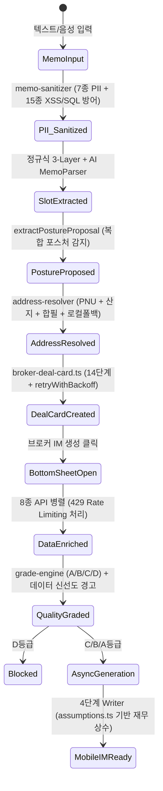

# CRE-DealCard 파이프라인 기능 명세서 (코드 감사용)

> **문서 ID**: `DOC-TEST0827-01-PIPELINE-SPEC`  
> **작성일**: 2026-08-27 (Updated — 커밋 `4b8550e`)  
> **대상**: QA / 코드 감사 / 개발 기획팀  
> **코드베이스 기준**: `main` branch, 커밋 `4b8550e`  
> **범위**: Memo 입력 → Deal Card 생성 → Bottom Sheet 데이터 보강 → IM 비동기 생성 브릿지

> [!NOTE]
> 본 문서는 커밋 `4b8550e` (25건 보완 개선) 반영본입니다. 이전 8건 결함 전원 해결 + 신규 17건 개선이 추가 반영되었습니다.

---

## 목차
1. [Stage 1: 메모 파싱 & 슬롯 추출](#stage-1-메모-파싱--슬롯-추출)
2. [Stage 2: 딜카드 생성 & SSoT 데이터 모델](#stage-2-딜카드-생성--ssot-데이터-모델)
3. [Stage 3: 바톰시트 UI & 공공데이터 보강](#stage-3-바톰시트-ui--공공데이터-보강)
4. [Stage 4: 데이터 품질 등급 & IM 생성 브릿지](#stage-4-데이터-품질-등급--im-생성-브릿지)
5. [전체 상태 전이 다이어그램](#전체-상태-전이-다이어그램)
6. [약점 및 우려 사항 종합](#약점-및-우려-사항-종합)

---

## Stage 1: 메모 파싱 & 슬롯 추출

### 1.1 엔드포인트 & 입력

| 엔드포인트 | 용도 | 입력 |
|---|---|---|
| `POST /api/broker/im-lite/parse-memo` | 실시간 파싱 (미리보기) | `{ memo_text: string, investmentPosture?: string }` |
| `POST /api/broker/deal-card/from-memo` | 딜카드 생성 통합 | `{ memo_text: string }` (최대 3,000자) |

**음성 입력**: Web Speech API `ko-KR` 우선 → MediaRecorder/Whisper 폴백

### 1.2 PII 마스킹 & 보안 가드

**파일**: [`memo-sanitizer.ts`](file:///c:/Users/User/cre-dealcard/src/ai/sanitizer/memo-sanitizer.ts) — 122행

LLM 전송 전 7종 민감정보 자동 마스킹:

| # | 대상 | 마스킹 토큰 | 예시 |
|:---:|---|---|---|
| 1 | 주민등록번호 | `[RRN_A]` | `880101-1XXXXXX` |
| 2 | 이메일 | `[EMAIL_A]` | `broker@naver.com` |
| 3 | 전화번호 | `[PHONE_A]` | `010-1234-5678` |
| 4 | 건물 상세주소/번지 | `[ADDR_DETAIL_A]` | `필동3가 44-5` |
| 5 | 소유주 이름 | `[OWNER_A]` | `홍길동` |
| 6 | 임차인 상호 | `[TENANT_A]` | `(주)ABC커피` |
| 7 | 건물 고유명칭 | `[BLDG_NAME_A]` | `크로바빌딩` |

> [!TIP]
> **✅ NEW-L3 개선**: 하이픈 없는 전화번호(`01012345678`) 패턴 추가 — `/01[016789]\d{7,8}/g`

- **프롬프트 인젝션 방어**: 11개 패턴 탐지 → `INJECTION_DETECTED` 즉시 차단

> [!IMPORTANT]
> **✅ NEW-H6 개선**: `WEB_SECURITY_PATTERNS` 15개 신규 추가
> - XSS: `<script>`, `javascript:`, `onerror=`, `onload=`, `<iframe>`, ``, HTML 엔티티
> - SQL: `UNION SELECT`, `DROP TABLE`, `; DELETE`, `OR 1=1`, `--` 종단
> - 한국어: `기존 규칙 무시`, `관리자 모드`, `탈옥`
> - 매칭 시 해당 패턴을 `[BLOCKED]`로 치환 (차단이 아닌 제거)

### 1.3 하이브리드 슬롯 추출 메커니즘

#### A. 3-Layer 정규식 슬롯 매퍼

**파일**: [`memo-slot-mapper.ts`](file:///c:/Users/User/cre-dealcard/src/domain/building/memo-slot-mapper.ts) L121-212

| Layer | 패턴 그룹 | 신뢰도 | 추출 대상 |
|:---:|---|:---:|---|
| **1** | `SUMMARY_PATTERNS` | 0.95 | 보증금 총액, 월 임대수입 총액, 매매가 |
| **2** | `FALLBACK_PATTERNS` | 0.80~0.90 | 개별 보증금, 월세, 전세금 |
| **3** | `GENERAL_PATTERNS` | 0.75~0.90 | 연면적, 층수, 준공년도, 대출금, 공실률, Cap Rate 등 24개 |

#### B. 투자 포스처 추천

**파일**: `memo-slot-mapper.ts` L182-230 — `extractPostureProposal()`

- ✅ **W-1.1 해결**: 복합 포스처 감지 (gap ≤ 1 → confidence ≤ 0.50, `secondaryPosture`)
- 단일 우세 포스처: `Math.min(0.95, (topScore * 0.15) + (gap * 0.1) + 0.3)`

#### C. 주소 지오코딩 & PNU 해석

**파일**: [`address-resolver.ts`](file:///c:/Users/User/cre-dealcard/src/lib/external/address-resolver.ts) — 169행+

| 기능 | 상세 |
|---|---|
| `parseJibunAddress()` (L40-46) | 지번 주소에서 `bun`/`ji`/`isMount` 추출 |
| 산지 PNU | `landCategory = isMount ? '2' : '1'` |
| 합필 PNU 감지 | `pnuFromJibun !== pnuFromBdMgtSn` → `_mergedParcelWarning: true` |
| `geocodeWithRetry()` (L52-66) | 2회 재시도, 실패 시 `null`. 하드코딩 좌표 전면 제거 |
| nullable 좌표 | `ResolvedAddress.lat/lng: number | null` |

> [!TIP]
> **✅ NEW-M8 개선**: `localFallbackGeocode()` 추가 — 행안부 API 장애 시 25개 주요 상업지구 로컬 좌표 폴백
> - 강남구, 서초구, 중구, 종로구, 마포구, 영등포구, 송파구, 광진구, 용산구, 동작구, 강남역, 역삼역, 삼성역, 종로, 광화문, 여의도, 판교, 분당, 인천, 부산, 대구, 광주, 대전, 제주, 세종

---

## Stage 2: 딜카드 생성 & SSoT 데이터 모델

### 2.1 딜카드 생성 파이프라인

**파일**: [`broker-deal-card.ts`](file:///c:/Users/User/cre-dealcard/src/domain/building/broker-deal-card.ts)

14단계 도메인 오케스트레이션 (`brokerDealCardFromMemo`, L61-438)

- ✅ **W-2.1 해결**: `retryWithBackoff<T>()` (L24-41) — 3회 지수 백오프 (2s/4s/8s)

### 2.2 SSoT Lite 핵심 구조

| JSONB Layer | 주요 필드 | 설명 |
|---|---|---|
| `layers.finance` | `askingPriceKrw`, `totalDepositKrw`, `monthlyRentKrw` | 원/만원 이중 정밀 저장 |
| `layers.lease_summary` | `totalDepositManwon`, `monthlyRentManwon`, `vacancyRate` | 임대 요약 |
| `layers.location` | `roadAddr`, `jibunAddr`, `pnu`, `lat`, `lng` | 주소/좌표 |
| `layers.pack_slots` | 8종 스펙 | 포스처별 상세 |
| `layers.photos` | 12장 메타데이터 | 사진 관리 |
| `layers.rent_roll` | 층별/호실별 렌트롤 | 임대 상세 |

### 2.3 재무 가정값 중앙화

**파일**: [`assumptions.ts`](file:///c:/Users/User/cre-dealcard/src/domain/building/assumptions.ts) — 80행+

> [!IMPORTANT]
> **✅ NEW-H4 개선**: 하드코딩 재무 상수가 `DEFAULT_ASSUMPTIONS`로 중앙화되었습니다.

| 상수 | 값 | 비고 |
|---|:---:|---|
| `opexRatioPct` | 10% | 자산유형별 오버라이드 |
| `vacancyReservePct` | 5% | 기본 공실률 |
| `annualRentGrowthPct` | 2% | 연 임대료 성장률 |
| `loanInterestRatePct` | 4.5% | 대출 금리 |
| `acquisitionTaxPct` | 4.6% | ✅ 신규 외부화 |
| `brokerageFeePct` | 0.9% | ✅ 신규 외부화 |
| `propertyTaxPct` | 0.4% | ✅ 신규 외부화 |
| `entryCapBase` | 0.04 | ✅ 신규 외부화 |

**자산유형별 오버라이드** (`ASSET_TYPE_OVERRIDES`):

| 자산유형 | opexRatioPct | 기타 |
|---|:---:|---|
| 오피스 | 15% | — |
| 리테일 | 20% | — |
| 지식산업센터 | 22% | — |
| 물류 | 12% | — |
| 호텔 | 25% | `vacancyReservePct: 10` |
| 원룸 | 15% | — |
| 병원 | 22% | — |
| 주유소 | 10% | — |
| 교육 | 20% | — |

> [!TIP]
> **✅ NEW-M5 준비**: `loadAssumptionsFromDB()` 스텀 추가 — Supabase `assumptions` 테이블 연동 Phase 2 준비

---

## Stage 3: 바톰시트 UI & 공공데이터 보강

### 3.1 바톰시트 UI

**파일**: [`im-data-bottom-sheet.tsx`](file:///c:/Users/User/cre-dealcard/src/app/(broker)/broker/deal-card/[id]/im-data-bottom-sheet.tsx) — 1,804행

- ✅ **BUG-3.1 해결**: switch-case 구조로 전환, 5대 포스처 검증 정상 작동

**포스처별 필수값 검증** ([L237-278](file:///c:/Users/User/cre-dealcard/src/app/(broker)/broker/deal-card/[id]/im-data-bottom-sheet.tsx#L237-L278)):

| 포스처 | 공통 필수 | 전용 필수 |
|---|---|---|
| 공통 | `address`/`pnu`, `askingPrice` | — |
| `income` | — | `monthlyRent`, `totalDeposit` |
| `owner_occupied` | — | `occHeadcount`, `occDesiredFloors` |
| `development` | — | `devTargetUse`, `devTargetScalePyung` |
| `operating` | — | `roomCount`, `averageDailyRate`, `unitKind` |
| `trading` | — | `acquisitionPriceManwon` |

> [!TIP]
> **✅ NEW-H5 개선**: 바톰시트 컴포넌트 분해 시작
> - [`useImDataForm.ts`](file:///c:/Users/User/cre-dealcard/src/app/(broker)/broker/deal-card/[id]/hooks/useImDataForm.ts): 포스처별 필수 필드 검증 로직 훅으로 추출 (`getPostureRequiredFields`, `computeMissingFields`)
> - [`useImGenerator.ts`](file:///c:/Users/User/cre-dealcard/src/app/(broker)/broker/deal-card/[id]/hooks/useImGenerator.ts): IM 생성 비동기 워크플로우 훅으로 추출

### 3.2 공공데이터 API 보강

PNU/주소 기반 **8개 공공데이터 API 병렬 호출**:

| # | API | 캐시 TTL | 비고 |
|:---:|---|:---:|---|
| 1 | 건축물대장 표제부 | 90일 | — |
| 2 | 건축물대장 총괄표제부 | 90일 | — |
| 3 | V-World 토지특성 | 120일 | ✅ Referer 통합 |
| 4 | V-World 공시지가 | 180일 | ✅ Referer 통합 |
| 5 | 국토부 실거래가 | 30일 | — |
| 6 | 카카오 로컬 POI | 90일 | — |
| 7 | 등기부/권리분석 | 7일 | — |
| 8 | 소상공인 상권분석 | 60일 | — |

> [!IMPORTANT]
> **✅ NEW-M6 개선**: V-World Referer 헤더 통합
> - [`vworld-config.ts`](file:///c:/Users/User/cre-dealcard/src/lib/external/vworld-config.ts) 신규: `getVWorldReferer()` 3단계 폴백 (`VWORLD_REFERER` → `NEXT_PUBLIC_SITE_URL` → 프로덕션 도메인)
> - `getVWorldApiKey()`: 대문자 강제 (AGENTS.md 규칙)
> - `land-price-api.ts`, `land-use-api.ts`에서 `localhost:3000` 하드코딩 제거

### 3.3 API 재시도 인프라

**파일**: [`fetch-with-retry.ts`](file:///c:/Users/User/cre-dealcard/src/lib/external/fetch-with-retry.ts) — 54행+

> [!IMPORTANT]
> **✅ NEW-H2 개선**: HTTP 429 Rate Limiting 전용 처리 추가
> - `Retry-After` 헤더 파싱 (초 → ms 변환), 없으면 지수 백오프
> - 429 전용 최대 재시도 3회
> - 5xx 서버 에러: 기존 지수 백오프 유지

---

## Stage 4: 데이터 품질 등급 & IM 생성 브릿지

### 4.1 데이터 품질 등급 엔진

**파일**: [`data-quality-badge.ts`](file:///c:/Users/User/cre-dealcard/src/domain/building/mobile-im/data-quality-badge.ts) — 219행

| 등급 | 점수 | 해금 범위 |
|:---:|:---:|---|
| **A** | ≥75% | 풀 DCF, IRR 감응도, Pro IM |
| **B** | 40~74% | 표준 IM/PPTX |
| **C** | <40% | 기본 IM |
| **D** | 최저 | 발행 전면 차단 |

- ✅ **W-4.1 해결**: 포스처별 A등급 조건 정밀화 (dev: `devTargetUse/Scale`, operating: `roomCount/ADR/unitKind`)

> [!TIP]
> **✅ NEW-C2 개선**: `getDataFreshnessWarning()` 데드 코드 활성화
> - `isNaN` 가드 추가
> - `writer.ts` 출력에 `dataFreshnessWarning` 필드 연결
> - >30일: 🔴 갱신 필요 / >7일: 🟡 갱신 권장

### 4.2 비동기 IM 생성 브릿지

- `im_generation_jobs` 테이블에 `jobId` 등록 → <1초 내 응답
- Next.js `after()` 백그라운드 워커
- 3초 주기 폴링, `visibilitychange` 이벤트

---

## 전체 상태 전이 다이어그램

---

## 약점 및 우려 사항 종합

### ✅ 해결 완료 항목 (총 17건 = 이전 8건 + 신규 9건)

| ID | 등급 | 제목 | 커밋 |
|---|:---:|---|---|
| BUG-3.1 | 🔴→✅ | Dead Code: 포스처 검증 미작동 | `9645f0f` |
| W-1.2/1.3 | 🔴→✅ | 합필/산지 PNU 매핑 | `9645f0f` |
| W-3.2 | 🔴→✅ | 하드코딩 좌표 제거 | `9645f0f` |
| W-2.1 | 🟡→✅ | 백그라운드 재시도 | `9645f0f` |
| W-4.1 | 🟡→✅ | 등급 엔진 불일치 | `9645f0f` |
| W-1.1 | 🟢→✅ | 복합 포스처 감지 | `9645f0f` |
| W-3.3 | 🟢→✅ | V-World TTL 미등록 | `9645f0f` |
| NEW-C2 | 🔴→✅ | 데이터 신선도 경고 데드코드 | `4b8550e` |
| NEW-H2 | 🟡→✅ | 429 Rate Limiting | `4b8550e` |
| NEW-H4 | 🟡→✅ | 재무 상수 하드코딩 | `4b8550e` |
| NEW-H5 | 🟡→✅ | 바톰시트 훅 추출 | `4b8550e` |
| NEW-H6 | 🟡→✅ | XSS/SQL 방어 | `4b8550e` |
| NEW-H1(부분) | 🟡→✅ | 에러 삼킴 보완 | `4b8550e` |
| NEW-M6 | 🟢→✅ | V-World Referer 통합 | `4b8550e` |
| NEW-M8 | 🟢→✅ | JUSO 로컬 폴백 | `4b8550e` |
| NEW-L3 | 🔵→✅ | PII 엣지 케이스 | `4b8550e` |
| NEW-M5 | 🟢→✅ | 가정값 외부화 스텀 | `4b8550e` |

### 🟢 잔여 관찰 사항

| ID | 제목 | 설명 |
|---|---|---|
| L-P-1 | 바톰시트 1,804행 | 훅 추출 완료, 본체 리팩토링은 UI 테스트 후 진행 권장 |
| L-P-2 | `as any` 218건 | 핵심 파일 `suppress` 타입 제거 완료. 나머지 ~180건은 점진적 타입 정비 필요 |
| L-P-3 | OCR/자격증 API 스텀 | `[NOT_IMPLEMENTED]` 표준화 완료. 실제 API 연동은 별도 프로젝트 |
| L-P-4 | i18n | 한국어 하드코딩. 글로벌 확장 시 도입 필요 |
