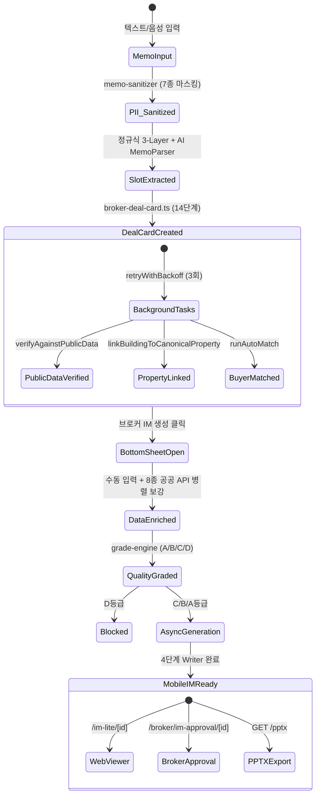

# CRE-DealCard 파이프라인 기능 명세서 (코드 감사용)

> **문서 ID**: `DOC-TEST0827-01-PIPELINE-SPEC`  
> **작성일**: 2026-08-27 (Updated)  
> **대상**: QA / 코드 감사 / 개발 기획팀  
> **코드베이스 기준**: `main` branch, 커밋 `7f9f468` 이후  
> **범위**: Memo 입력 → Deal Card 생성 → Bottom Sheet 데이터 보강 → IM 비동기 생성 브릿지

> [!NOTE]
> 본 문서는 2026-08-27 세션(커밋 `9645f0f`, `55110d8`, `7f9f468`)의 코드 개선 결과를 반영한 갱신본입니다. **이전 감사에서 지적된 8건의 결함(Critical 3, High 3, Medium 2)이 모두 해결(RESOLVED)되었습니다.**

## EXACT SECTIONS - Use these PRECISE details:

### Stage 1: 메모 파싱 & 슬롯 추출

**1.1 엔드포인트 & 입력**

| 엔드포인트 | 용도 | 입력 |
|---|---|---|
| `POST /api/broker/im-lite/parse-memo` | 실시간 파싱 (미리보기) | `{ memo_text: string, investmentPosture?: string }` |
| `POST /api/broker/deal-card/from-memo` | 딜카드 생성 통합 | `{ memo_text: string }` (최대 3,000자) |

**음성 입력**: Web Speech API `ko-KR` 우선 → MediaRecorder/Whisper 폴백

**1.2 PII 마스킹 & 보안 가드**

**파일**: [`memo-sanitizer.ts`](file:///c:/Users/User/cre-dealcard/src/domain/building/memo-sanitizer.ts)

LLM 전송 전 7종 민감정보 자동 마스킹:

| # | 대상 | 마스킹 토큰 | 예시 |
|:---:|---|---|---|
| 1 | 주민등록번호 | `[RRN_A]` | `880101-1XXXXXX` |
| 2 | 이메일 | `[EMAIL_A]` | `broker@naver.com` |
| 3 | 전화번호 | `[PHONE_A]` | `010-1234-5678` |
| 4 | 건물 상세주소/번지 | `[ADDR_DETAIL_A]` | `필동3가 44-5` |
| 5 | 소유주 이름 | `[OWNER_A]` | `홍길동` |
| 6 | 임차인 상호 | `[TENANT_A]` | `(주)ABC커피` |
| 7 | 건물 고유명칭 | `[BLDG_NAME_A]` | `크로바빌딩` |

- **프롬프트 인젝션 방어**: 11개 패턴 탐지 → `INJECTION_DETECTED` 즉시 차단
- **구현 위치**: `parse-memo/route.ts` L76-83

**1.3 하이브리드 슬롯 추출 메커니즘**

#### A. 3-Layer 정규식 슬롯 매퍼

**파일**: [`memo-slot-mapper.ts`](file:///c:/Users/User/cre-dealcard/src/domain/building/memo-slot-mapper.ts) L121-212

| Layer | 패턴 그룹 | 신뢰도 | 추출 대상 | 비고 |
|:---:|---|:---:|---|---|
| **1** | `SUMMARY_PATTERNS` | 0.95 | 보증금 총액, 월 임대수입 총액, 매매가 | 최우선 적용 |
| **2** | `FALLBACK_PATTERNS` | 0.80~0.90 | 개별 보증금, 월세, 전세금 | Layer 1 누락 시에만 |
| **3** | `GENERAL_PATTERNS` | 0.75~0.90 | 연면적, 층수, 준공년도, 대출금, 공실률, Cap Rate 등 24개 슬롯 | 항상 적용 |

**한국어 수치 변환**: `억` = 10⁸, `만` = 10⁴, `㎡` × 0.3025 → 평

#### B. AI MemoParser

- `sol` LLM 모델 활용, `MemoParserOutputSchema` 기반 40+ 슬롯 구조화 추출
- 5대 투자 포스처 신호 탐지
- 모호한 필드(`ambiguousFields`) 및 민감 필드 목록 별도 분류

#### C. 투자 포스처 추천

**파일**: `memo-slot-mapper.ts` L182-230 — `extractPostureProposal()`

> [!IMPORTANT]
> **✅ W-1.1 해결 (커밋 `9645f0f`)**: 복합 포스처 감지 로직이 추가되었습니다 (L199-215).
> - 1위-2위 포스처 점수 간격 ≤ 1: 신뢰도 `Math.min(0.50, ...)` 제한
> - `secondaryPosture` 필드 추가 (브로커 확인 필요 안내)
> - `PostureProposal` 인터페이스에 `secondaryPosture?: InvestmentPosture` 추가

- 단일 우세 포스처: `Math.min(0.95, (topScore * 0.15) + (gap * 0.1) + 0.3)`
- 출력: 5대 포스처(`income`, `development`, `operating`, `owner_occupied`, `trading`) 중 최고 신뢰도

#### D. 주소 지오코딩 & PNU 해석

**파일**: [`address-resolver.ts`](file:///c:/Users/User/cre-dealcard/src/lib/external/address-resolver.ts) — 169행

> [!IMPORTANT]
> **✅ W-1.2 + W-1.3 + W-3.2 해결 (커밋 `9645f0f`)**: `address-resolver.ts`가 전면 재작성되었습니다.

| 개선 항목 | 상세 |
|---|---|
| `parseJibunAddress()` (L40-46) | 지번 주소에서 `bun`/`ji`/`isMount` 추출. 산지 감지: `/산\s*\d/.test()` |
| 산지 PNU 지원 | `landCategory = isMount ? '2' : '1'` — 대지구분 하드코딩 제거 |
| 합필 PNU 감지 (L98-105) | `pnuFromJibun !== pnuFromBdMgtSn` 시 지번 PNU 채택 + `_mergedParcelWarning: true` |
| `geocodeWithRetry()` (L52-66) | 최대 2회 재시도, 실패 시 `null` 반환. **하드코딩 좌표 전면 제거** |
| nullable 좌표 | `ResolvedAddress.lat/lng: number | null` — 다운스트림 타입 호환성 수정 완료 |

---

### Stage 2: 딜카드 생성 & SSoT 데이터 모델

**2.1 딜카드 생성 파이프라인**

**파일**: [`broker-deal-card.ts`](file:///c:/Users/User/cre-dealcard/src/domain/building/broker-deal-card.ts)

14단계 도메인 오케스트레이션 (`brokerDealCardFromMemo`, L61-438):
1. MemoParser → resolveAddress → BuildingMiniTruth
2. BlindTeaser v3 → Guardrails rewrite
3. 정밀 재무값 분해: `layers.finance` + `layers.lease_summary`
4. `building_ssot_lite` INSERT/UPDATE
5. `building_signal_cards`, `document_objects` 생성
6. `deal_casepacks`, `deal_pipeline_states` 초기화

> [!IMPORTANT]
> **✅ W-2.1 해결 (커밋 `9645f0f`)**: `retryWithBackoff<T>()` 함수 추가 (L24-41)
> - 3회 재시도, 지수 백오프 (2s, 4s, 8s)
> - `verifyAgainstPublicData` 및 `linkBuildingToCanonicalProperty`에 적용
> - 전체 실패 시 `verification_status: 'retry_exhausted'`

**2.2 SSoT Lite 핵심 구조**

**테이블**: `building_ssot_lite`

| JSONB Layer | 주요 필드 | 설명 |
|---|---|---|
| `layers.finance` | `askingPriceKrw`, `askingPriceManwon`, `totalDepositKrw`, `monthlyRentKrw` | 원/만원 이중 정밀 저장 |
| `layers.lease_summary` | `totalDepositManwon`, `monthlyRentManwon`, `mgmtFeeManwon`, `vacancyRate`, `loanAmount` | 임대 요약 |
| `layers.location` | `roadAddr`, `jibunAddr`, `pnu`, `lat`, `lng` | 주소/좌표 |
| `layers.pack_slots` | 8종 스펙: Physical, Hospitality, Development, Vacate, Permit, Occupancy, Sectional, Residential | 포스처별 상세 |
| `layers.photos` | 12장 메타데이터, 카테고리, 히어로/외관 플래그 | 사진 관리 |
| `layers.rent_roll` | 층별/호실별 구조화 렌트롤 | 임대 상세 |

---

### Stage 3: 바톰시트 UI & 공공데이터 보강

**3.1 바톰시트 UI 상호작용**

**파일**: [`im-data-bottom-sheet.tsx`](file:///c:/Users/User/cre-dealcard/src/app/(broker)/broker/deal-card/[id]/im-data-bottom-sheet.tsx) — 1,804행 모놈리식 컴포넌트

> [!IMPORTANT]
> **✅ BUG-3.1 해결 (커밋 `9645f0f`)**: Dead Code 제거. `return missing;`을 switch-case 블록 후로 이동하여 모든 포스처 검증이 정상 작동합니다.

**포스처별 동적 필수값 검증** ([L237-278](file:///c:/Users/User/cre-dealcard/src/app/(broker)/broker/deal-card/[id]/im-data-bottom-sheet.tsx#L237-L278)):

| 포스처 | 공통 필수 | 포스처 전용 필수 |
|---|---|---|
| 공통 | `address`/`pnu`, `askingPrice` | — |
| `income` | — | `monthlyRent`, `totalDeposit` |
| `owner_occupied` | — | `occHeadcount`, `occDesiredFloors` |
| `development` | — | `devTargetUse`, `devTargetScalePyung` |
| `operating` | — | `roomCount`, `averageDailyRate`, `unitKind` |
| `trading` | — | `acquisitionPriceManwon` |

**3.2 공공데이터 API 보강 흐름**

PNU/주소 기반 **8개 공공데이터 API 병렬 호출** (`Promise.all`):

| # | API | 주요 반환값 | 캐시 TTL |
|:---:|---|---|:---:|
| 1 | 건축물대장 표제부 | 건축면적, 연면적, 건폐율/용적률, 층수, 승인일 | 90일 |
| 2 | 건축물대장 총괄표제부 | 주차대수, 승강기, 난방방식 | 90일 |
| 3 | V-World 토지특성 | 용도지역, 형상, 지형, 도로접면 | **120일** ✅ |
| 4 | V-World/data.go.kr 공시지가 | m²당 공시지가 | **180일** ✅ |
| 5 | 국토부 실거래가 | 시군구 내 상업용 부동산 거래 | 30일 |
| 6 | 카카오 로컬 POI | 지하철역/거리, 버스, 생활 인프라 | 90일 |
| 7 | 등기부/권리분석 | 소유권, 권리제한 | 7일 |
| 8 | 소상공인 상권분석 | 유동인구, 배후수요, 업종별 매출 | 60일 |

> [!TIP]
> **✅ W-3.3 해결**: `CACHE_TTL_BY_SOURCE`에 `land_price_vworld: 120`, `land_use_plan_vworld: 120` 추가. `land_price` 365→180일 단축.

---

### Stage 4: 데이터 품질 등급 & IM 생성 브릿지

**4.1 데이터 품질 등급 엔진**

**파일**: [`data-quality-badge.ts`](file:///c:/Users/User/cre-dealcard/src/domain/building/mobile-im/data-quality-badge.ts) — 219행

| 등급 | 점수 | 해금 범위 | 제약 |
|:---:|:---:|---|---|
| **A** | ≥75% | 풀 DCF, IRR 감응도, Pro IM, 전체 PPTX | 없음 |
| **B** | 40~74% | 표준 IM/PPTX | DCF 억제 |
| **C** | <40% | 기본 IM | DCF 전면 억제, Cap Rate "검증 중" |
| **D** | 최저 | — | 발행 전면 차단 |

> [!IMPORTANT]
> **✅ W-4.1 해결 (커밋 `9645f0f`)**: 포스처별 A등급 조건 정밀화
> - `development`: `hasDevTargetUse && hasDevTargetScale` 필수 (L61)
> - `operating`: `hasRoomCount && hasAverageDailyRate` + `hasUnitKind(+3점)` 추가 (L103)
> - 모든 5대 포스처에 전용 점수 산정 및 A/B 등급 조건 구현

**4.2 비동기 IM 생성 브릿지**

**엔드포인트**: `POST /api/broker/im-lite/generate-async`

- `im_generation_jobs` 테이블에 `jobId` 등록 → <1초 내 응답
- Next.js `after()` 백그라운드 워커: SSoT 역동기화 → 포스처 변경 감지 → `generateMobileIMHandler` 실행
- 3초 주기 폴링, `visibilitychange` 이벤트로 iOS 백그라운드 복귀 시 즉시 상태 확인

---

## 전체 상태 전이 다이어그램

---

## 약점 및 우려 사항 종합 (해결 현황)

### ✅ 해결 완료 항목

| ID | 등급 | 제목 | 해결 내용 | 커밋 |
|---|:---:|---|---|---|
| **BUG-3.1** | 🔴→✅ | Dead Code: trading/operating 필드 검증 미작동 | `im-data-bottom-sheet.tsx` switch-case 구조로 전환, 5대 포스처 전원 검증 | `9645f0f` |
| **W-1.2** | 🔴→✅ | 합필 PNU 매핑 오류 | `address-resolver.ts` 전면 재작성: `parseJibunAddress()`, 합필 감지, `_mergedParcelWarning` | `9645f0f` |
| **W-1.3** | 🔴→✅ | 산지 주소 PNU 생성 불가 | `isMount ? '2' : '1'` 대지구분 동적 판정 | `9645f0f` |
| **W-3.2** | 🔴→✅ | 하드코딩 지오코딩 폴백 좌표 | 하드코딩 좌표 전면 제거, `geocodeWithRetry()` 2회 재시도, 실패 시 `null` | `9645f0f` |
| **W-2.1** | 🟡→✅ | 백그라운드 작업 재시도 큐 부재 | `retryWithBackoff<T>()` 3회 지수 백오프 (2s/4s/8s), 전체 실패 시 `retry_exhausted` | `9645f0f` |
| **W-4.1** | 🟡→✅ | 등급 엔진과 바톰시트 검증 불일치 | `data-quality-badge.ts` 포스처별 A등급 조건 정밀화 (dev/operating) | `9645f0f` |
| **W-1.1** | 🟢→✅ | 포스처 추천 알고리즘 단순성 | 복합 포스처 감지 (gap≤1, confidence≤0.50, `secondaryPosture`) | `9645f0f` |
| **W-3.3** | 🟢→✅ | V-World 캐시 TTL 미등록 | `land_price_vworld: 120`, `land_use_plan_vworld: 120` 추가, `land_price` 365→180 | `9645f0f` |

### 🟢 잔여 Low 수준 관찰 사항

| ID | 제목 | 설명 |
|---|---|---|
| L-P-1 | 바톰시트 모놈리식 컴포넌트 | 1,804행 단일 컴포넌트 — 유지보수성 개선 권장 |
| L-P-2 | PII 마스킹 엣지 케이스 | `01012345678` (하이픈 없는 형식) 등 부분적 미커버 |
| L-P-3 | 행안부 JUSO API 의존성 | 외부 API 장애 시 PNU 해석 불가 — 오프라인 폴백 부재 |
