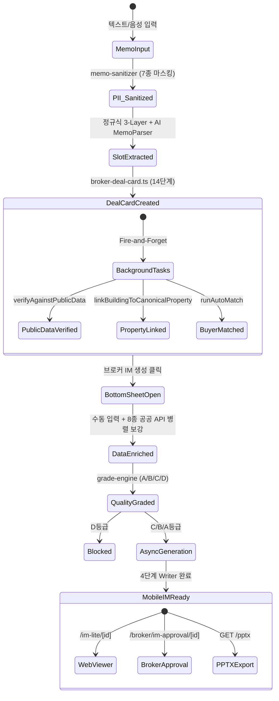

# CRE-DealCard 파이프라인 기능 명세서 (코드 감사용)

> **문서 ID**: `DOC-TEST0827-01-PIPELINE-SPEC`  
> **작성일**: 2026-08-27  
> **대상**: QA / 코드 감사 / 품질 관리팀  
> **코드베이스 기준**: `main` branch, commit `0c40600` 이후  
> **범위**: Memo 입력 → Deal Card 생성 → Bottom Sheet 데이터 보강 → IM 비동기 생성 브릿지

---

## 목차
1. [Stage 1: 메모 파싱 & 슬롯 추출](#stage-1-메모-파싱--슬롯-추출)
2. [Stage 2: 딜카드 생성 & SSoT 데이터 모델](#stage-2-딜카드-생성--ssot-데이터-모델)
3. [Stage 3: 바텀시트 UI & 공공데이터 보강](#stage-3-바텀시트-ui--공공데이터-보강)
4. [Stage 4: 데이터 품질 등급 & IM 생성 브릿지](#stage-4-데이터-품질-등급--im-생성-브릿지)
5. [전체 상태 전이 다이어그램](#전체-상태-전이-다이어그램)
6. [약점 및 우려 사항 종합](#약점-및-우려-사항-종합)

---

## Stage 1: 메모 파싱 & 슬롯 추출

### 1.1 엔드포인트 & 입력

| 엔드포인트 | 용도 | 입력 |
|---|---|---|
| `POST /api/broker/im-lite/parse-memo` | 실시간 파싱 (미리보기) | `{ memo_text: string, investmentPosture?: string }` |
| `POST /api/broker/deal-card/from-memo` | 딜카드 생성 통합 | `{ memo_text: string }` (최대 3,000자) |

**음성 입력**: Web Speech API `ko-KR` 우선 → MediaRecorder/Whisper 폴백

### 1.2 PII 마스킹 & 보안 가드

**파일**: [`memo-sanitizer.ts`](file:///c:/Users/User/cre-dealcard/src/domain/building/memo-sanitizer.ts)

LLM 전송 전 7종 민감정보 자동 마스킹:

| # | 대상 | 마스킹 토큰 | 예시 |
|:---:|---|---|---|
| 1 | 주민등록번호 | `[RRN_A]` | `880101-1XXXXXX` |
| 2 | 이메일 | `[EMAIL_A]` | `broker@naver.com` |
| 3 | 전화번호 | `[PHONE_A]` | `010-1234-5678` |
| 4 | 건물 상세주소/번지 | `[ADDR_DETAIL_A]` | `필동3가 44-5` |
| 5 | 소유주 이름 | `[OWNER_A]` | `홍길동` |
| 6 | 임차인 상호 | `[TENANT_A]` | `(주)ABC커피` |
| 7 | 건물 고유명칭 | `[BLDG_NAME_A]` | `크로바빌딩` |

- **프롬프트 인젝션 방어**: 11개 패턴 탐지 → `INJECTION_DETECTED` 즉시 차단
- **구현 위치**: `parse-memo/route.ts` L76-83

### 1.3 하이브리드 슬롯 추출 메커니즘

#### A. 3-Layer 정규식 슬롯 매퍼

**파일**: [`memo-slot-mapper.ts`](file:///c:/Users/User/cre-dealcard/src/domain/building/memo-slot-mapper.ts) L121-212

개별 호실의 임대료/보증금이 건물 전체 총액을 덮어쓰는 오류를 방지하기 위한 계층적 추출:

| Layer | 패턴 그룹 | 신뢰도 | 추출 대상 | 비고 |
|:---:|---|:---:|---|---|
| **1** | `SUMMARY_PATTERNS` | 0.95 | 보증금 총액, 월 임대수입 총액, 매매가 | 최우선 적용 |
| **2** | `FALLBACK_PATTERNS` | 0.80~0.90 | 개별 보증금, 월세, 전세금 | Layer 1 누락 시에만 |
| **3** | `GENERAL_PATTERNS` | 0.75~0.90 | 연면적, 층수, 준공년도, 대출금, 공실률, Cap Rate 등 24개 슬롯 | 항상 적용 |

**한국어 수치 변환**: `억` = 10⁸, `만` = 10⁴, `㎡` × 0.3025 → 평

#### B. AI MemoParser

**파일**: `broker-deal-card.ts` — `sol` LLM 모델 활용

- `MemoParserOutputSchema` 기반 40+ 슬롯 구조화 추출
- 5대 투자 포스처 신호 탐지: `hospitalitySignals`, `developmentSignals`, `tradingSignals`, `ownerOccupiedSignals`
- 모호한 필드(`ambiguousFields`) 및 민감 필드 목록 별도 분류

#### C. 투자 포스처 추천

**파일**: `memo-slot-mapper.ts` L174-212 — `extractPostureProposal()`

- 포스처별 키워드 빈도 및 격차 분석
- 산출식: `(topScore × 0.15) + (gap × 0.1) + 0.3` (최대 0.95)
- 출력: 5대 포스처(`income`, `development`, `operating`, `owner_occupied`, `trading`) 중 최고 신뢰도

> [!WARNING]
> **약점 W-1.1**: 포스처 추천 산출식이 단순하여, "수익형 + 개발형" 키워드가 동시에 다수 등장하는 메모에서 false positive 가능. 예: "월세 수입 있는 재건축 대상 빌딩" → income과 development 점수가 비슷하면 잘못된 포스처 할당 위험.

#### D. 주소 지오코딩 & PNU 해석

**파일**: [`address-resolver.ts`](file:///c:/Users/User/cre-dealcard/src/lib/external/address-resolver.ts)

1. 행안부 도로명주소 API → `bdMgtSn` 25자리에서 앞 19자리를 PNU로 사용 (L50)
2. Regex 폴백: 지번에서 법정동코드 + 본번/부번 조합 (L74-76)
3. 카카오 지오코딩 → 위경도 좌표 확보

> [!CAUTION]
> **약점 W-1.2 (Critical — 기존 발견)**: 합필 필지에서 `bdMgtSn` 기반 PNU가 대표 필지(아파트 단지 등)를 가리킴. 당산동5가 11-47 실제 사례에서 506㎡ 빌딩이 68,047㎡ 래미안 단지 PNU로 매핑됨.
>
> **약점 W-1.3 (Critical)**: `address-resolver.ts` L98에서 대지구분을 `1`(일반)로 하드코딩. 산지 주소(산 1-1) PNU 생성 불가.

---

## Stage 2: 딜카드 생성 & SSoT 데이터 모델

### 2.1 딜카드 생성 파이프라인

**파일**: [`from-memo/route.ts`](file:///c:/Users/User/cre-dealcard/src/app/api/broker/deal-card/from-memo/route.ts), [`broker-deal-card.ts`](file:///c:/Users/User/cre-dealcard/src/domain/building/broker-deal-card.ts)

```
브로커 인증 (requireBroker)
    │
    ▼
메모 품질 게이트 (CRE 시그널 1개 이상 필수)
    │
    ▼
v3 Guardrails (Compliance & Cold Mode Pitch Guard)  ← route.ts L57-90
    │
    ▼
P0 사전 중복 검사 (checkDuplicateBeforeCreation)   ← route.ts L92-106
    │  ※ AI 실행 전 주소/메모 기반 기존 물건 중복 감지 → 409 에러
    ▼
14단계 도메인 오케스트레이션 (brokerDealCardFromMemo)  ← broker-deal-card.ts L61-438
    │  • MemoParser → resolveAddress → BuildingMiniTruth
    │  • BlindTeaser v3 → Guardrails rewrite
    │  • 정밀 재무값 분해: layers.finance + layers.lease_summary
    │  • building_ssot_lite INSERT/UPDATE
    │  • building_signal_cards, document_objects 생성
    │  • deal_casepacks, deal_pipeline_states 초기화
    ▼
비동기 Fire-and-Forget 백그라운드 작업  ← route.ts L136-144, broker-deal-card.ts L404-430
    • verifyAgainstPublicData (건축물대장 교차검증)
    • linkBuildingToCanonicalProperty (정식 매물 매핑)
    • runAutoMatch (매수자 자동 매칭)
```

> [!WARNING]
> **약점 W-2.1**: Fire-and-forget 프라미스(`verifyAgainstPublicData`, `linkBuildingToCanonicalProperty`)가 실패 시 `console.warn`만 출력하고 재시도 큐 없음. 일시적 네트워크 오류로 영구적 데이터 연계 누락 가능.

### 2.2 SSoT Lite 핵심 구조

**테이블**: `building_ssot_lite`

| JSONB Layer | 주요 필드 | 설명 |
|---|---|---|
| `layers.finance` | `askingPriceKrw`, `askingPriceManwon`, `totalDepositKrw`, `monthlyRentKrw` | 원/만원 이중 정밀 저장 |
| `layers.lease_summary` | `totalDepositManwon`, `monthlyRentManwon`, `mgmtFeeManwon`, `vacancyRate`, `loanAmount` | 임대 요약 |
| `layers.location` | `roadAddr`, `jibunAddr`, `pnu`, `lat`, `lng` | 주소/좌표 |
| `layers.pack_slots` | 8종 스펙: Physical, Hospitality, Development, Vacate, Permit, Occupancy, Sectional, Residential | 포스처별 상세 |
| `layers.photos` | 12장 메타데이터, 카테고리, 히어로/외관 플래그 | 사진 관리 |
| `layers.rent_roll` | 층별/호실별 구조화 렌트롤 | 임대 상세 |

**플랫 컬럼**: `id`, `owner_id`, `pnu`, `area_signal`, `asset_type`, `price_band`, `investment_posture`, `verification_status`

---

## Stage 3: 바텀시트 UI & 공공데이터 보강

### 3.1 바텀시트 UI 상호작용

**파일**: [`im-data-bottom-sheet.tsx`](file:///c:/Users/User/cre-dealcard/src/app/(broker)/broker/deal-card/[id]/im-data-bottom-sheet.tsx) — **1,804행 모놀리식 컴포넌트**

#### 핵심 상호작용 흐름
1. **사전 입력 (Prefill)**: SSoT Lite에서 매각가, 보증금, 월세, 주소, PNU, 공실률, 포스처 자동 주입
2. **포스처 선택**: 5대 포스처 → 동적 필수 필드 UI 변경
3. **특화 입력 모듈**:
   - **렌트롤 임포터** (`rent-roll-importer.tsx`): Excel/CSV(상위 10행 헤더 탐지, 만원/원 변환) 또는 자연어 AI 파싱
   - **사진 업로더** (`image-compressor.ts`): 최대 12장, 8개 카테고리, 캔버스 압축(1920px, 품질 0.82)
   - **포스처별 8종 Pack Slots**: 물류(17필드), 호텔(객실/ADR/OCC), 개발(용도/규모), 사옥(인원/층) 등
4. **IM 생성 트리거**: `handleCreate` (L588-680) → 비동기 생성 → 3초 폴링

#### 포스처별 동적 필수값 검증

**파일**: `im-data-bottom-sheet.tsx` L238-282 — `computedMissingFields`

| 포스처 | 공통 필수 | 포스처 전용 필수 |
|---|---|---|
| 공통 | `address`/`pnu`, `askingPrice` | — |
| `income` | — | `monthlyRent`, `totalDeposit` |
| `owner_occupied` | — | `occHeadcount`, `occDesiredFloors` |
| `development` | — | `devTargetUse`, `devTargetScalePyung` |
| `operating` | — | `roomCount`, `averageDailyRate` |
| `trading` | — | ⚠️ `acquisitionPriceManwon` (Dead Code — 검증 미작동) |

> [!CAUTION]
> **🐛 BUG-3.1 (Critical — Dead Code)**: [`im-data-bottom-sheet.tsx` L272-280](file:///c:/Users/User/cre-dealcard/src/app/(broker)/broker/deal-card/[id]/im-data-bottom-sheet.tsx#L272-L280)
> 
> L272에서 `return missing;`이 **무조건 실행**되어, L274-280의 `trading` 및 `operating` 확장 필드 검증 코드가 **절대 도달 불가능한 Dead Code**입니다.
> ```typescript
> // L272: 여기서 무조건 리턴 → 아래 코드 실행 불가
> return missing;
> // trading 포스처 필드 검증
> if (investmentPosture === 'trading') {
>   if (!acquisitionPriceManwon) missing.push('acquisitionPriceManwon');  // ← Dead Code
> }
> // operating 포스처 확장 필드 검증
> if (investmentPosture === 'operating') {
>   if (!unitKind) missing.push('unitKind');  // ← Dead Code
> }
> ```
> **영향**: `trading` 포스처에서 `acquisitionPriceManwon`(취득가) 없이 IM 생성이 가능하며, `operating` 포스처에서 `unitKind`(객실유형) 없이 생성이 가능합니다. 이는 불완전한 투자 분석으로 이어질 수 있습니다.

### 3.2 공공데이터 API 보강 흐름

**파일**: [`enrich-by-pnu.ts`](file:///c:/Users/User/cre-dealcard/src/lib/external/enrich-by-pnu.ts), [`external-data-orchestrator.ts`](file:///c:/Users/User/cre-dealcard/src/lib/external/external-data-orchestrator.ts)

PNU/주소 기반 **8개 공공데이터 API 병렬 호출** (`Promise.all`, L42-83):

| # | API | 소스 파일 | 주요 반환값 | 캐시 TTL |
|:---:|---|---|---|:---:|
| 1 | 건축물대장 표제부 | `building-register-api.ts` | 건축면적, 연면적, 건폐율/용적률, 층수, 승인일 | 90일 |
| 2 | 건축물대장 총괄표제부 | `building-register-api.ts` | 주차대수, 승강기, 난방방식 | 90일 |
| 3 | V-World 토지특성 | `land-use-api.ts` | 용도지역, 형상, 지형, 도로접면 | 180일 |
| 4 | V-World/data.go.kr 공시지가 | `land-price-api.ts` | m²당 공시지가 | 365일 |
| 5 | 국토부 실거래가 | `real-transaction-api.ts` | 시군구 내 상업용 부동산 거래 | 30일 |
| 6 | 카카오 로컬 POI | `location-poi-api.ts` | 지하철역/거리, 버스, 생활 인프라 | 30일 |
| 7 | 등기부/권리분석 | `registry-api.ts` | 소유권, 권리제한 | 7일 |
| 8 | 소상공인 상권분석 | `commercial-district-api.ts` | 유동인구, 배후수요, 업종별 매출 | 30일 |

**데이터 머지 안전 가드** (L85-107):
- 건축물대장 총괄표제부(`fetchBuildingRecap`)와 표제부 데이터를 머지할 때, 소규모 빌딩 데이터가 단지 전체 데이터로 덮어쓰이는 것을 방지하는 보호 로직 존재

> [!CAUTION]
> **약점 W-3.2 (Critical — 하드코딩 좌표)**: [`address-resolver.ts` L65-70](file:///c:/Users/User/cre-dealcard/src/lib/external/address-resolver.ts#L65-L70) 및 [`enrich-by-pnu.ts` L254-268](file:///c:/Users/User/cre-dealcard/src/lib/external/enrich-by-pnu.ts#L254-L268)에 하드코딩된 지오코딩 폴백 좌표 존재.
>
> 지오코딩 실패 시, "삼성"이 포함된 모든 주소가 `lat=37.5088, lng=127.0631`로, "서초"가 포함된 모든 주소가 `lat=37.4876`으로 매핑됩니다. **상업용 부동산 앱에서 서로 다른 건물이 동일한 좌표점으로 매핑되는 것은 치명적입니다.**

> [!WARNING]
> **약점 W-3.3**: V-World `CACHE_TTL_BY_SOURCE`에 `vworld` 소스 TTL이 별도 등록되어 있지 않음. `land_price` 365일 TTL은 연 1회 공시지가 변경 주기에는 적합하지만, V-World 데이터 수시 업데이트를 반영하지 못함.

---

## Stage 4: 데이터 품질 등급 & IM 생성 브릿지

### 4.1 데이터 품질 등급 엔진

**파일**: [`data-quality-badge.ts`](file:///c:/Users/User/cre-dealcard/src/domain/building/mobile-im/data-quality-badge.ts) L13-141

**등급 체계**:

| 등급 | 점수 | 해금 범위 | 제약 |
|:---:|:---:|---|---|
| **A** | ≥75% | 풀 DCF, IRR 감응도, Pro IM, 전체 PPTX | 없음 |
| **B** | 40~74% | 표준 IM/PPTX | DCF 억제 |
| **C** | <40% | 기본 IM | DCF 전면 억제, Cap Rate "검증 중" 마스킹 |
| **D** | 최저 | — | 발행 전면 차단 |

**점수 산정 요소** (포스처별 가중치 차등):
- `hasPublicData` (+20), `hasZoning` (+15), `hasPhotos` (+10), `hasLandArea` (+10), `hasAskingPrice` (+10) 등

> [!WARNING]
> **약점 W-4.1 (Logic Misalignment)**: 바텀시트의 `computedMissingFields`와 등급 엔진의 가중치 기준이 정렬되지 않음. 예: `development` 포스처에서 바텀시트는 `devTargetUse`를 필수로 요구하지만, 등급 엔진은 이 필드를 검사하지 않음. 결과적으로 **A등급이면서 바텀시트 검증 실패**하는 UX 혼란 발생 가능.

### 4.2 비동기 IM 생성 브릿지

**엔드포인트**: `POST /api/broker/im-lite/generate-async`

```
요청 수신 → im_generation_jobs 테이블에 jobId 등록 → <1초 내 응답
    │
    ▼ (Next.js after() 백그라운드 워커)
SSoT 역동기화
    │ • floor_leases → persistLeaseUnits 변환
    │ • layers.pack_slots, layers.rent_roll, lease_summary 영속화
    ▼
포스처 변경 감지 (C-4)
    │ • 변경 시 기존 IM 문서 무효화 (invalidated_at)
    │ • posture_decisions 이력 기록
    ▼
generateMobileIMHandler 실행
    │ • 온톨로지 조합 검증 (validateCombination)
    │ • enrichBuildingDataByPNU (공공데이터 보강)
    │ • 4단계 위상 Writer (→ Document 2 참조)
    │ • 19개 품질 게이트 + 준법 소독
    │ • HeroCard 조립, DCF 감응도, 법적 면책조항
    │ • document_objects 테이블에 mobile_im 저장
    ▼
im_generation_jobs 상태 → "completed"
```

**클라이언트 폴링**:
- 3초 주기로 `/api/broker/im-lite/job-status?jobId=xxx` 폴링
- `visibilitychange` 이벤트로 iOS 백그라운드 복귀 시 즉시 상태 확인
- 완료 시 `/broker/im-approval/${im_lite_id}` 또는 `/im-lite/${buildingId}`로 라우팅

---

## 전체 상태 전이 다이어그램



---

## 약점 및 우려 사항 종합

### 🔴 Critical (즉시 조치 필요)

| ID | 제목 | 위치 | 설명 |
|---|---|---|---|
| **BUG-3.1** | Dead Code: trading/operating 필드 검증 미작동 | `im-data-bottom-sheet.tsx` L272-280 | `return missing;` 이후 코드 도달 불가. trading 포스처에서 취득가 없이 IM 생성 가능 |
| **W-1.2** | 합필 PNU 매핑 오류 | `address-resolver.ts` L50 | 합필 필지에서 대단지 PNU로 잘못 매핑 → 공시지가/용도지역 왜곡 |
| **W-3.2** | 하드코딩 지오코딩 폴백 좌표 | `address-resolver.ts` L65-70 | "삼성" 포함 주소 모두 동일 좌표점 매핑 |

### 🟡 High (단기 개선 필요)

| ID | 제목 | 위치 | 설명 |
|---|---|---|---|
| **W-2.1** | 백그라운드 작업 재시도 큐 부재 | `broker-deal-card.ts` L404-430 | Fire-and-forget 실패 시 영구적 데이터 연계 누락 |
| **W-4.1** | 등급 엔진과 바텀시트 검증 로직 불일치 | `data-quality-badge.ts` vs `im-data-bottom-sheet.tsx` | A등급이면서 필수 필드 누락 가능 |
| **W-1.3** | 산지 주소 PNU 생성 불가 | `address-resolver.ts` L98 | 대지구분 `1` 하드코딩 |

### 🟢 Medium (중기 개선 권장)

| ID | 제목 | 위치 | 설명 |
|---|---|---|---|
| **W-1.1** | 포스처 추천 알고리즘 단순성 | `memo-slot-mapper.ts` L174-212 | 복합 포스처 메모에서 잘못된 포스처 할당 위험 |
| **W-3.3** | V-World 캐시 TTL 미등록 | `external-data-orchestrator.ts` L17-25 | `vworld` 소스 별도 TTL 없음 |
