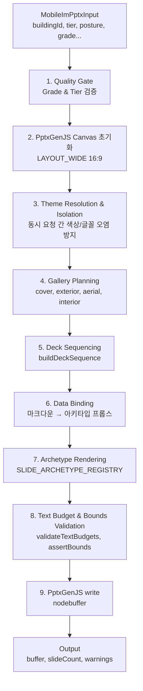

# PPTX IM 콘텐츠 생성 및 렌더링 스펙 (코드 감사용)

> [!NOTE]
> **문서 ID**: `DOC-TEST0827-03-PPTX-IM-SPEC`  
> **작성일**: 2026-08-27 (Updated)  
> **대상**: QA / 코드 감사 / 개발 기획팀  
> **코드베이스**: `main` branch, commits up to `7f9f468`  
> **범위**: `src/domain/building/mobile-im/pptx/` 및 E2E 테스트 인프라  

---

## 목차
1. [PPTX 생성 아키텍처](#1-pptx-생성-아키텍처)
2. [덱 시퀀서 & 등급 게이트](#2-덱-시퀀서--등급-게이트)
3. [데이터 바인딩 & 마크다운 파싱](#3-데이터-바인딩--마크다운-파싱)
4. [18종 슬라이드 아키타입](#4-18종-슬라이드-아키타입)
5. [비중복 렌더링 원칙 구현](#5-비중복-렌더링-원칙-구현)
6. [텍스트 예산 & 물리적 경계 제약](#6-텍스트-예산--물리적-경계-제약)
7. [테마 & 프리셋 시스템](#7-테마--프리셋-시스템)
8. [폴백 & 에러 처리](#8-폴백--에러-처리)
9. [CRE 규칙 적용](#9-cre-규칙-적용)
10. [AI 시각 E2E 테스트 파이프라인](#10-ai-시각-e2e-테스트-파이프라인)
11. [API 라우트 & 배포](#11-api-라우트--배포)
12. [약점 및 우려 사항 종합](#12-약점-및-우려-사항-종합)

---

## 1. PPTX 생성 아키텍처

### 1.1 핵심 오케스트레이터

**파일**: [pptx-renderer.ts](file:///c:/Users/User/cre-dealcard/src/domain/building/mobile-im/pptx/pptx-renderer.ts) — 608행  
**클래스**: `MobileImPptxRenderer`

기존 17개 `buildSlide` 메서드를 전면 교체한 슬림 오케스트레이터:



### 1.2 테마 고립화 (Thread Safety)

**파일**: [pptx-theme.ts](file:///c:/Users/User/cre-dealcard/src/domain/building/mobile-im/pptx/pptx-theme.ts), [imlib.ts](file:///c:/Users/User/cre-dealcard/src/domain/building/mobile-im/pptx/imlib.ts)

`withThemeIsolation(theme, async () => { ... })`:
- 글로벌 스코프에 팔레트 토큰(`C`=밝은색, `CD`=어두운색, `KR`/`TITLE_KR`=타이포, `PV`=출처뱃지)을 동적 주입
- 완료 시 원래 값으로 리셋 → 멀티테넌트 스타일 번짐 방지

---

## 2. 덱 시퀀서 & 등급 게이트

**파일**: [deck-sequencer.ts](file:///c:/Users/User/cre-dealcard/src/domain/building/mobile-im/pptx/deck-sequencer.ts)  
**함수**: `buildDeckSequence(input: DeckSequenceInput): SlideSpec[]`

### 2.1 등급별 슬라이드 범위

| 등급/티어 | 슬라이드 수 | 구성 |
|---|:---:|---|
| **Basic / C등급** | 7~11장 | A01 표지 → A14 사진 → A02 요약 → A06 입지 → 포스처 본문 → A04 제원 → A10 마감 |
| **Pro / A-B등급** | 최대 16장 | 17개 아키타입 동적 배치 |
| **D등급** | 0장 | `[G30] D등급은 발행할 수 없습니다` — 전면 차단 |

### 2.2 슬라이드 트리밍 규칙 & 상수
- **PAGE_MANDATORY** = 12
- **PAGE_RECOMMENDED** = 16
- **PAGE_HARD_LIMIT** = 20

초과 시 선택적 슬라이드 자동 트림이 발생합니다 (단, `closing`, `risk`, `checklist`, `process`, `thesis`, `titleRights` 슬라이드는 보호됨).

---

## 3. 데이터 바인딩 & 마크다운 파싱

**파일**: [data-binder.ts](file:///c:/Users/User/cre-dealcard/src/domain/building/mobile-im/pptx/data-binder.ts)  
**함수**: `bindSectionData`, `bindFromIMCore`

### 3.1 핵심 기능
1. **마크다운 → 구조화 데이터**: `parseMarkdownTable`, 메트릭 추출, 서술/불릿 분리
2. **아키타입별 프롭스 변환**: `transformForArchetype`
3. **페르소나 제거**: `sanitizePersona` (정규식 기반)
4. **마크다운 스트리핑**: `stripMarkdown` (볼드/이탤릭/헤딩 마크다운 태그 제거)
5. **결손 라우팅**: 미확인 데이터(`확인 필요`, `조회 미완료`)를 체크리스트 슬라이드(A18)로 자동 라우팅
6. **결함 마스킹**: `NaN`, `undefined`, `null`, `[object Object]`를 `[확인 필요]`로 정규식 치환

### 3.2 서술형 vs 구조형 분리 (비중복 원칙 지원)
- 연속 텍스트 문단 → 리드 콜아웃 / Value Proposition 블록으로 라우팅
- `항목: 값` 형태의 불릿 → 구조화 테이블/스탯 카드로 라우팅
- 동일 문자열이 양쪽 패널에 동시 출현하지 않도록 분리

---

## 4. 18종 슬라이드 아키타입

**디렉터리**: `src/domain/building/mobile-im/pptx/archetypes/`

| 아키타입 | 명칭 | 레이아웃 | 주요 용도 |
|:---:|---|---|---|
| **A01** | Cover | 전면 | 타이틀, 서브타이틀, 자산 태그, 히어로 이미지, 브로커 로고, 문서번호 |
| **A02** | Stat Grid | 전면 | 리드 문구 + 4~8개 KPI 카드 (2~4 컬럼 그리드) |
| **A03** | Large Table | 전면 | 렌트롤 / 매매사례 비교 대형 테이블 + WALE 트래픽라이트 콜아웃 |
| **A04** | Asymmetric 7:5 | 좌 7.5" : 우 사진 | 좌: 물리 제원/서사, 우: 외관 사진 + 2개 하이라이트 콜아웃 |
| **A05** | Asymmetric 7:4 / 3-Col KPI | 상/하 분할 | 상단 3단 지표 + 하단 전폭 투자 가치 콜아웃 |
| **A06** | Diagram / Map | 좌 지도 : 우 리스트 | 좌: POI 오버레이 지도, 우: 교통/접근성 핵심 포인트 |
| **A07** | Three Block | 3단 수직 | 물리적/임대/재무 리스크 완화 카드 |
| **A08** | Dual Table | 2단 비교 | 자가 vs 임차, 비용 구조 비교 |
| **A09** | Process | 스텝 | 거래 로드맵 + 타임라인 |
| **A10** | Closing | 전면 | 법적 면책조항, 문서번호, 9종 출처 뱃지 정의 |
| **A11** | Room Specs | 테이블 | 호실별 사양 (호텔/물류) |
| **A12** | Ownership | 테이블 | 소유권 구조 / 체크리스트 |
| **A13** | Operating KPI | 그리드 | 호텔 ADR/OCC/RevPAR/GOP 대시보드 |
| **A14** | Gallery | 그리드 | 사진 갤러리 (cover, exterior, aerial, interior) |
| **A15** | 4-Pillar Thesis | 4단 | 투자 논거 4대 축 |
| **A16** | Capital Structure | 도넛 | LTV, DSR, 역레버리지 경고 |
| **A17** | Pre-Completion | 스택 | 준공전 마케팅 스택 |
| **A18** | Deficiency Checklist | 리스트 | 미확인/미제출 데이터 체크리스트 |

---

## 5. 비중복 렌더링 원칙 구현

**규칙 출처**: `AGENTS.md` §3 (PPTX 슬라이드 비중복 렌더링 원칙)

### 5.1 원칙
> [!IMPORTANT]
> 좌/우 분할 레이아웃(A04, A05, A06 등)에서 좌측 영역과 우측 카드에 **동일한 텍스트/불릿 항목을 중복 나열하지 않는다**.

### 5.2 적용 대상 아키타입
- **A04 (Asymmetric 7:5)**: 좌측 = 물리 제원 테이블 / 우측 = 외관 사진 + 투자 하이라이트
- **A05 (Asymmetric 7:4)**: 상단 = 3개 요약 지표 / 하단 = 가치 제안 콜아웃
- **A06 (Diagram/Map)**: 좌측 = 위치 지도 / 우측 = 접근성 포인트
- **A15 (4-Pillar Thesis)**: 4개 독립 투자 축

### 5.3 구현 메커니즘
**파일**: `data-binder.ts` — `transformForArchetype`

1. 서술형 문장(연속 텍스트)과 구조형 불릿(`항목: 값`)을 정규식으로 분류
2. **서술형** → 좌측 Value Proposition 리드 또는 콜아웃 텍스트
3. **구조형** → 우측 스탯 카드 / KPI 테이블
4. 동일 문자열의 양쪽 동시 출현을 원천 방지

---

## 6. 텍스트 예산 & 물리적 경계 제약

**파일**: [text-budget.ts](file:///c:/Users/User/cre-dealcard/src/domain/building/mobile-im/pptx/text-budget.ts)

### 6.1 텍스트 예산 (`TEXT_LIMITS`)

| Element | Max Chars |
|---|---|
| slideTitle | 32 |
| kicker | 32 |
| subTitle | 50 |
| leadSentence | 100 |
| subHeading | 35 |
| statLabel | 18 |
| statValue | 10 |
| statSub | 27 |
| calloutTitle | 30 |
| tableHeader | 16 |
| tableCell | 27 |
| note | 140 |

### 6.2 한국어 CJK 문자 폭 계산
```
characters_per_line = 0.19 × (10 / fontSize) inches
```
- CJK 문자가 라틴 문자보다 넓은 점을 명시적으로 반영

### 6.3 스마트 절삭 (Smart Truncation) & 메타데이터
- **함수**: `enforceTextBudgetWithMeta`
- 리턴: `TextBudgetResult` 인터페이스 (`text, wasTruncated, originalLength, truncatedLength`)
- 단어 중간이 아닌 **한국어 문장 종결부**에서 절삭 (`. `, `다.`, `요.`, `임.`, `함.`)
- 절삭 시 `...` 접미사 추가 및 `console.warn` 에밋 (`validateTextBudgets` L93-104)

### 6.4 물리적 안전 경계 (Safe Bounds)
| 축 | 제한 | 공차 |
|:---:|---|:---:|
| X + W | ≤ 12.713" | ±0.05" |
| Y + H | ≤ 6.75" | ±0.05" |

위반 시 경고 로그 발생 (렌더링은 계속 진행)

---

## 7. 테마 & 프리셋 시스템

### 7.1 5종 빌트인 프리셋
| 프리셋 | 용도 |
|---|---|
| `golden_institutional` | 기관 투자자용 골든 테마 |
| `credeal_signature` | CREDEAL 시그니처 브랜드 |
| `executive_gold` | 임원 프레젠테이션용 |
| `corporate_clean` | 기업 심플 테마 |
| `pro_dark_obsidian` | 프로 다크 테마 |

### 7.2 커스텀 프리셋
- `pptx_custom_presets` 테이블에서 사용자/회사별 커스텀 테마 관리
- **엔드포인트**: `GET /api/broker/pptx-preset`

### 7.3 테마 토큰
- `C`: 밝은 배경 팔레트
- `CD`: 어두운 배경 팔레트
- `KR`: 본문 한국어 글꼴
- `TITLE_KR`: 제목 한국어 글꼴
- `PV`: 출처 뱃지 색상
- **WCAG AA 명도 대비 검증** 적용

---

## 8. 폴백 & 에러 처리

### 8.1 아키타입 폴백 (`addFallbackContent`)
**파일**: `pptx-renderer.ts` L43-221

아키타입 빌더가 본문 렌더링에 실패한 경우 (`addFallbackContent` 리턴 타입: `boolean`):
1. 마크다운 헤딩 → 스타일드 텍스트 블록
2. 불릿 리스트 → 구조화 텍스트
3. 테이블 → PptxGenJS `addTable` 네이티브 렌더링
4. 콘텐츠 없음 → `return true` (L45)
5. Body Shape 있음 → `return true` (L64)

> [!TIP]
> 렌더러의 메인 루프 (L571-580)에서는 `fallbackOk` 리턴값을 확인하여 `false` 인 경우 `continue` 를 통해 빈 슬라이드를 덱에서 안전하게 제외시킵니다.

### 8.2 결함 데이터 마스킹
**파일**: `data-binder.ts`

| 원본 | 치환 |
|---|---|
| `NaN` / `undefined` / `null` / `[object Object]` | `[확인 필요]` |
| `[인명 비공개]` / `[연락처 비공개]` | 제거 |

### 8.3 데이터 완전성 게이트
**파일**: PPTX API `route.ts`
- `dataCompleteness.pptxExportAllowed === false` → Pro 요청 즉시 거부 (422)

---

## 9. CRE 규칙 적용

### 9.1 페르소나 격리 확장 (PPTX 전용)
**파일**: `data-binder.ts` — L1328-1331

> [!NOTE]
> 페르소나 매칭 정규식이 대폭 확장되었습니다. 
> `70대|60대|50대|40대|30대|20대|MZ|초보|고액|고자산|법인|개인|VIP|기관|리츠|시행사|디벨로퍼|부부|은퇴`  
> Target nouns: `자산가|투자자|법인대표|대표|고객|매수자|운용사|펀드|가족`  
> NEW Catch-all: `/(?:[가-힣]+(?:자|가|인|사)\s+(?:맞춤|전용|추천|적합)\s*(?:형|용)?)\s*/gu`

### 9.2 CRE 표준 용어 (PPTX 전용)
**파일**: `data-binder.ts` L1346-1358 ( `CRE_LEXICON_REPLACEMENTS` )

| 원본 패턴 (RegExp) | 대체 문자열 (Replacement) |
|---|---|
| `네이밍 라이츠` | `사옥 단독 명칭 표기(간판 설치권)` |
| `브랜딩 라이츠` | `기업 단독 브랜딩` |
| `테넌트 인센티브` | `인테리어 지원금(TI)` |
| `프리렌트` | `렌트프리(무상임대)` |
| `렌트프리` | `렌트프리(무상임대)` |
| `리커버리 레이트` | `비용 회수율` |
| `캡 레이트` | `연 순수익률(Cap Rate)` |
| `LTV` | `담보인정비율(LTV)` |
| `DSR` | `총부채원리금상환비율(DSR)` |
| `NOI` | `순영업소득(NOI)` |
| `WALE` | `가중평균 잔여임대기간(WALE)` |

### 9.3 출처 뱃지 (9종)
**파일**: `imlib.ts`, `a10-closing.ts`

| 뱃지 | 의미 |
|---|---|
| `✓ 등기·대장` | 공적 장부 확인 |
| `✓ 공공데이터` | 정부 공공데이터 API |
| `● 현장확인` | 브로커 현장 실사 |
| `★ 전문가검증` | 전문가 리뷰 완료 |
| `✓ 원장확인` | 원본 대장 대조 |
| `▲ 매도인고지` | 매도인 직접 제공 |
| `● 중개인입력` | 브로커 수동 입력 |
| `◈ 파생계산` | 엔진 산출 |
| `◇ AI추정·가정` | AI 기반 추정치 |

---

## 10. AI 시각 E2E 테스트 파이프라인

**디렉터리**: `src/tests/e2e/`

### 10.1 검증 파이프라인

```
[1] PPTX Binary 생성
    │
    ▼
[2] OpenXML 구조적 무결성 검사 (AdmZip)
    │  • 런타임 토큰 탐지: >NaN<, >undefined<, >null<, [object Object]
    │  • 비공개 플레이스홀더 잔존 확인
    ▼
[3] 150 DPI 고해상도 PNG 캡처 (LibreOffice + PyMuPDF)
    │
    ▼
[4] 자동화 스코어카드 (e2e-ai-inspector.ts)
    │  • 커버 슬라이드 존재 검증, 팩트 환각 검증
    ▼
[5] HTML 스코어카드 출력 (ai_visual_e2e_report.html)
```

---

## 11. API 라우트 & 배포

### 11.1 PPTX 다운로드 라우트
**파일**: `src/app/api/public/im-lite/[buildingId]/pptx/route.ts`

- **Rate Limit**: IP당 10회/시간
- Supabase `Exports` 버킷에 업로드 → 임시 Signed URL (302 리다이렉트)
- 다운로드 폴백: 버퍼 직접 반환 + 커스텀 헤더(`X-Slide-Count`, `X-Warnings`)

---

## 12. 약점 및 우려 사항 종합

### ✅ RESOLVED ISSUES (Commit: `7f9f468`)

| ID | 기존 등급 | 해결 내역 및 반영 위치 |
|---|---|---|
| **W-PPTX-1** | Critical | **A03 Fallback 차단 후 슬라이드 처리 명확화**<br>`pptx-renderer.ts` L43, L76, L571-580: `addFallbackContent` 리턴 타입을 `boolean`으로 변경하고, A03 BLOCK 시 `return false` 처리. 메인 루프에서 `fallbackOk === false`일 경우 슬라이드 덱에 푸시하지 않고 `continue` 하도록 수정되었습니다. |
| **W-PPTX-2** | High | **Fallback Bounding Box 오버플로 방지**<br>`pptx-renderer.ts` L139-145: 테이블 높이가 `maxY` 초과 시 최대 행(Row)을 계산(`maxRows`)하여 데이터를 자르고(splice) 높이를 재계산하도록 로직이 추가되었습니다. |
| **W-PPTX-3** | High | **텍스트 절삭(Truncation) 시 메타데이터 로깅**<br>`text-budget.ts` L72-91, 93-104: 새로운 `TextBudgetResult`를 도입하는 `enforceTextBudgetWithMeta` 함수가 추가되어, 절삭 시 `console.warn`을 방출하여 경고 정보를 유실하지 않습니다. |
| **W-PPTX-4** | High | **페르소나 정규식 커버리지 대폭 확장**<br>`data-binder.ts` L1328-1331: MZ, 기관, 디벨로퍼, 시니어 등의 연령층/타겟과 "맞춤형", "추천" 등의 포괄적 Catch-all 정규식을 추가하여 LLM의 미등록 변형도 모두 필터링합니다. |
| **W-PPTX-5** | Medium | **CRE Lexicon Extensibility 확보**<br>`data-binder.ts` L1346-1358: 11개 항목을 갖춘 `CRE_LEXICON_REPLACEMENTS` 상수로 분리하여, 새로운 외래어 및 오용 어휘를 일괄 치환(Iterative Replace)합니다. |
| **W-PPTX-6** | Medium | **갤러리 슬라이드 빈 프레임 렌더링 수정**<br>`gallery-planner.ts` L81-83, `a14-gallery.ts` L55-60: 사진이 없을 경우 빈 배열을 반환하고 렌더러에 `{ suppress: true }`를 전달하여 빈 갤러리 슬라이드가 렌더링되지 않도록 조치되었습니다. |
| **W-PPTX-7** | Medium | **슬라이드 하드 리밋(Hard Limit) 적용**<br>`deck-sequencer.ts` L227, 242-246: `PAGE_HARD_LIMIT = 20` 상수를 도입하여, 최대 허용치를 초과하는 슬라이드를 강제로 트림하고 로깅(`console.error`)합니다. |

### 🔵 REMAINING CONCERNS (Low)

| ID | 제목 | 설명 |
|---|---|---|
| **L-PPTX-1** | PDF Export 시 일부 레이아웃 시프트 | 13.333" × 7.5" 와이드 비율을 PDF로 내보낼 때 일부 환경에서 텍스트 상자 패딩이 근소하게 시프트될 가능성 존재 (지속 모니터링 필요). |
