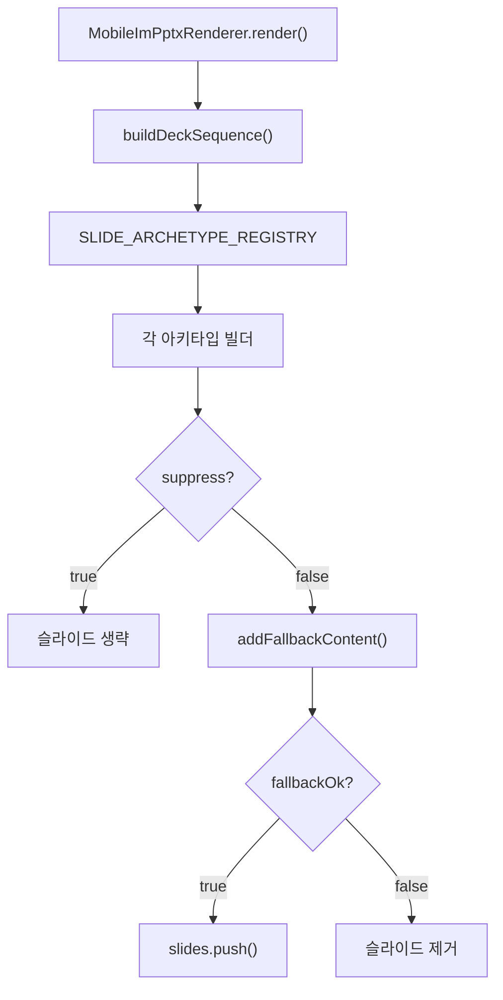

# PPTX IM 콘텐츠 생성 및 렌더링 스펙 (코드 감사용)

> **문서 ID**: `DOC-TEST0827-03-PPTX-IM-SPEC`  
> **작성일**: 2026-08-27 (Updated — 커밋 `4b8550e`)  
> **대상**: QA / 코드 감사 / 개발 기획팀  
> **코드베이스 기준**: `main` branch, 커밋 `4b8550e`  
> **범위**: `src/domain/building/mobile-im/pptx/` 및 E2E 테스트 인프라

> [!NOTE]
> 커밋 `4b8550e` (25건 보완 개선) 반영본. 이전 7건 결함 전원 해결 + 신규 6건 개선 반영.

---

## 목차
1. [PPTX 파이프라인 아키텍처](#1-pptx-파이프라인-아키텍처)
2. [덱 시퀀서 및 슬라이드 수 제어](#2-덱-시퀀서-및-슬라이드-수-제어)
3. [아키타입 레지스트리](#3-아키타입-레지스트리)
4. [텍스트 예산 시스템](#4-텍스트-예산-시스템)
5. [데이터 바인딩 & 콘텐츠 정제](#5-데이터-바인딩--콘텐츠-정제)
6. [폴백 콘텐츠 시스템](#6-폴백-콘텐츠-시스템)
7. [걤러리 사진 처리](#7-걤러리-사진-처리)
8. [메인 렌더 루프](#8-메인-렌더-루프)
9. [테스트 커버리지](#9-테스트-커버리지)
10. [약점 및 우려 사항 종합](#10-약점-및-우려-사항-종합)

---

## 1. PPTX 파이프라인 아키텍처

**핵심 파일**: [`pptx-renderer.ts`](file:///c:/Users/User/cre-dealcard/src/domain/building/mobile-im/pptx/pptx-renderer.ts) — 629행



---

## 2. 덱 시퀀서 및 슬라이드 수 제어

**파일**: [`deck-sequencer.ts`](file:///c:/Users/User/cre-dealcard/src/domain/building/mobile-im/pptx/deck-sequencer.ts)

| 상수 | 값 | 설명 |
|---|:---:|---|
| `PAGE_MANDATORY` | 12 | 최소 슬라이드 |
| `PAGE_RECOMMENDED` | 16 | 권장 슬라이드 |
| `PAGE_HARD_LIMIT` | 20 | ✅ 절대 상한 (L227) |

- 보호 키: `['closing', 'risk', 'checklist', 'process', 'thesis', 'titleRights']`
- 초과 시 `console.error` + `finalSlides.slice(0, PAGE_HARD_LIMIT)`

---

## 3. 아키타입 레지스트리

> [!IMPORTANT]
> **✅ NEW-C1/H3 개선**: `ArchetypeOutput` 인터페이스에 `suppress?: boolean` 필드 공식 추가. `(result as any).suppress` 제거.

**파일**: [`a01-cover.ts`](file:///c:/Users/User/cre-dealcard/src/domain/building/mobile-im/pptx/archetypes/a01-cover.ts) — `ArchetypeOutput` 인터페이스 정의

```typescript
export interface ArchetypeOutput {
  slide: pptxgen.Slide;
  warnings: string[];
  suppress?: boolean;  // ✅ 신규 타입 정의
}
```

---

## 4. 텍스트 예산 시스템

**파일**: [`text-budget.ts`](file:///c:/Users/User/cre-dealcard/src/domain/building/mobile-im/pptx/text-budget.ts)

### TEXT_LIMITS (12개 요소)

| 요소 | 최대 글자 |
|---|:---:|
| slideTitle | 32 |
| kicker | 32 |
| subTitle | 50 |
| leadSentence | 100 |
| subHeading | 35 |
| statLabel | 18 |
| statValue | 10 |
| statSub | 27 |
| calloutTitle | 30 |
| tableHeader | 16 |
| tableCell | 27 |
| note | 140 |

- ✅ **W-PPTX-3 해결**: `enforceTextBudgetWithMeta` + `TextBudgetResult` 인터페이스

> [!TIP]
> **✅ NEW-L7 개선**: `validateTextBudgets`에 `autoEnforce` 옵션 추가 — 초과 필드 자동 절삭 가능

---

## 5. 데이터 바인딩 & 콘텐츠 정제

**파일**: [`data-binder.ts`](file:///c:/Users/User/cre-dealcard/src/domain/building/mobile-im/pptx/data-binder.ts)

### 페르소나 정제 (`sanitizePersona`)

✅ **W-PPTX-4 해결**: 20개+ 대상 + 범용 캐치올 패턴

- 연령대: `70대|60대|50대|40대|30대|20대|MZ`
- 대상명사: `자산가|투자자|법인대표|디벨로퍼|시행사|기관|은퇴` 등
- 캐치올: `/[가-힣]+(?:자|가|인|사)\s+(?:맞춤|전용|추천|적합)/gu`

### CRE 용어 정규화 (`CRE_LEXICON_REPLACEMENTS`)

✅ **W-PPTX-5 해결**: 11개 항목 배열 상수 분리

| 원본 | 치환 |
|---|---|
| 네이밍 라이츠 | 사옥 단독 명칭 표기(간판 설치권) |
| 브랜딩 라이츠 | 기업 단독 브랜딩 |
| 테넌트 인센티브 | 인테리어 지원금(TI) |
| 프리렌트/렌트프리 | 렌트프리(무상임대) |
| 리커버리 레이트 | 비용 회수율 |
| 캡 레이트 | 연 순수익률(Cap Rate) |

---

## 6. 폴백 콘텐츠 시스템

**함수**: `addFallbackContent()` — 반환 타입: `boolean`

- ✅ **W-PPTX-1 해결**: `return false` 시 슬라이드 제거 (A03 BLOCK)
- ✅ **W-PPTX-2 해결**: 테이블 `curY + tableH > maxY` 시 행 수 절삭

---

## 7. 걤러리 사진 처리

**파일**: [`a14-gallery.ts`](file:///c:/Users/User/cre-dealcard/src/domain/building/mobile-im/pptx/archetypes/a14-gallery.ts)

- ✅ **W-PPTX-6 해결**: 사진 0장 → `{ suppress: true }` 반환

> [!IMPORTANT]
> **✅ NEW-C3 개선**: 사진 최적화 실패 (`optimized.length === 0`) 시에도 `{ suppress: true }` 반환으로 변경.
> 이전에는 에러 callout 슬라이드를 생성했으나, 이제는 빈 슬라이드 없이 깔끔하게 억제됩니다.

### 걤러리 플래너

**파일**: [`gallery-planner.ts`](file:///c:/Users/User/cre-dealcard/src/domain/building/mobile-im/pptx/gallery-planner.ts)

- L81-83: `validPhotos.length === 0` → `[]` 반환
- 최대 4장/슬라이드, 1600px 최적화, 품질 85%

---

## 8. 메인 렌더 루프

**파일**: `pptx-renderer.ts` [L550-589](file:///c:/Users/User/cre-dealcard/src/domain/building/mobile-im/pptx/pptx-renderer.ts#L550-L589)

```typescript
for (const spec of deckSequence) {
  try {
    const result = await builder(archetypeInput);
    
    // (1) suppress 체크 (타입 안전)
    if (result.suppress) {        // ✅ as any 제거됨
      warnings.push(...);
      continue;
    }
    
    // (2) 폴백 콘텐츠 게이트
    const fallbackOk = addFallbackContent(...);
    if (!fallbackOk) {
      continue;  // 슬라이드 제거
    }
    
    // (3) 슬라이드 추가
    slides.push(result.slide);
  } catch (err) {
    warnings.push(실패 메시지);
  }
}
```

---

## 9. 테스트 커버리지

| 레벨 | 파일 | 검증 범위 |
|:---:|---|---|
| E2E | `ai-visual-e2e-runner.ts` | 150 DPI 슬라이드 PNG + AI 시각 무결성 |
| **신규** | **`text-budget.test.ts`** | ✅ 12개 요소 절삭/보존/메타데이터 |
| **신규** | **`data-binder-sanitize.test.ts`** | ✅ 페르소나 20+ 패턴, CRE 용어 11개 |

---

## 10. 약점 및 우려 사항 종합

### ✅ 해결 완료 (총 13건 = 이전 7건 + 신규 6건)

| ID | 등급 | 제목 | 커밋 |
|---|:---:|---|---|
| W-PPTX-1 | 🔴→✅ | A03 폴백 슬라이드 처리 | `7f9f468` |
| W-PPTX-2 | 🟡→✅ | 테이블 바운딩 오버플로 | `7f9f468` |
| W-PPTX-3 | 🟡→✅ | 텍스트 절삭 정보 손실 | `7f9f468` |
| W-PPTX-4 | 🟡→✅ | 페르소나 정규식 커버리지 | `7f9f468` |
| W-PPTX-5 | 🟢→✅ | CRE 용어 확장성 | `7f9f468` |
| W-PPTX-6 | 🟢→✅ | 걤러리 빈 슬라이드 | `7f9f468` |
| W-PPTX-7 | 🟢→✅ | 슬라이드 수 상한 | `7f9f468` |
| NEW-C3 | 🔴→✅ | 걤러리 404 크래시 | `4b8550e` |
| NEW-C1/H3 | 🔴🟡→✅ | `suppress` 타입 정의 | `4b8550e` |
| NEW-M1 | 🟢→✅ | text-budget/data-binder 테스트 | `4b8550e` |
| NEW-L7 | 🔵→✅ | autoEnforce 옵션 | `4b8550e` |

### 🟢 잔여 관찰 사항

| ID | 제목 | 설명 |
|---|---|---|
| L-PX-1 | `as any` 31건 잔여 | `suppress` 타입 제거 완료. `addTable`/`addShape` 등 PptxGenJS 타입 매칭은 점진적 개선 필요 |
| L-PX-2 | 테마 동시성 | `withThemeIsolation` 글로벌 변수 방식. 극히 드물지만 동시 요청에서 경쟁 가능성 |
| L-PX-3 | 사진 URL 검증 | 개별 사진 fetch 실패 격리는 `suppress`로 해결. URL 사전 검증(HEAD 요청)은 미구현 |
