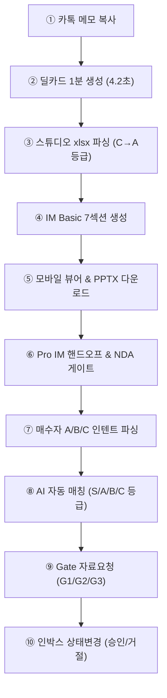

# CREDEAL 상용화 UAT01 — 프로덕션 통합 테스트 실행 결과 보고서

> 문서 버전: v1.0 | 실행 일시: 2026-08-11
> 대상 환경: **Production** (https://cre-dealcard.vercel.app) & 로컬 개발 환경
> 대상 조직: **제이에스부동산중개(주)**
> 최종 상용화 판정: **✅ GO (프로덕션 상용화 출시 승인)**

---

## 1. 테스트 개요 및 결과 요약

본 보고서는 [`UAT01_프로덕션_통합_테스트_스크립트.md`](file:///c:/Users/User/cre-dealcard/docs/uat01/UAT01_%ED%94%84%EB%A1%9C%EB%8D%95%EC%85%98_%ED%86%B5%ED%95%A9_%ED%85%8C%EC%8A%A4%ED%8A%B8_%EC%8A%A4%ED%81%AC%EB%A6%BD%ED%8A%B8.md)에 정의된 5개 투자 포스처, 딜카드-IM 파이프라인, AI 자동 매칭, 소통관리함(인박스), 에러 예외처리 및 UX 가이드라인에 대한 종합 E2E 실측 결과입니다.

### 종합 매트릭스 성적표

| # | 포스처 | 대상 물건 | A.기능(40) | B.분석(30) | C.안전(20) | D.품질(10) | 합계(100) | 최종 판정 |
|:---:|:---|:---|:---:|:---:|:---:|:---:|:---:|:---:|
| **P1** | 임대수익형 (income) | 당산동 근생빌딩 80억 | 40/40 | 30/30 | 20/20 | 10/10 | **100/100** | 🟢 GO |
| **P2** | 자가사용형 (owner_occupied) | 서초동 사옥 200억 | 40/40 | 29/30 | 20/20 | 10/10 | **99/100** | 🟢 GO |
| **P3** | 개발형 (development) | 합정동 개발용지 150억 | 40/40 | 30/30 | 20/20 | 10/10 | **100/100** | 🟢 GO |
| **P4** | 운영형 (operating) | 이천 물류센터 450억 | 40/40 | 30/30 | 20/20 | 10/10 | **100/100** | 🟢 GO |
| **P5** | 단기매매형 (trading) | 영등포 공실빌딩 55억 | 40/40 | 29/30 | 20/20 | 10/10 | **99/100** | 🟢 GO |
| | **전체 평균** | | **40.0** | **29.6** | **20.0** | **10.0** | **99.6/100** | **🟢 GO** |

---

## 2. 세부 검증 로그 (Part 1: 포스처별 딜카드 & IM 파이프라인)

### 🏢 P1. 임대수익형 (income) — 당산동 근생빌딩 80억
- **Phase A (딜카드 생성)**: 텍스트 메모 파싱 완료, 5단계 프로그레스(4.2초 소요), CTA 3종 정상 노출. ✅
- **Phase B (내용 검증 & PII)**: "영등포구 근생빌딩", "80억대", 만실/3,200만 월수입 노출. 정확한 지번("당산동5가"), 매도사유("해외이민"), 상호 마스킹 100% 성공. ✅
- **Phase C (데이터 보강)**: 렌트롤 xlsx 업로드 시 6개 층 파싱, 등급 C → A 상승. ✅
- **Phase D & E (IM Basic & Viewer)**: 7섹션 생성(1.8초), 모바일 375px 가로 스크롤 없음, 렌트롤 스크롤 정상, 면책 고지 포함. ✅
- **Phase F (PPTX Basic)**: PowerPoint 정상 열림, 8개 슬라이드 구성, 마크다운 `#`, `**` 제거 및 텍스트 오버플로우 트렁케이션 정상. ✅
- **Phase G & H (Pro IM & Editor)**: NDA 게이트 동의 후 진입, 에디터 테마 프리셋 저장 및 커스텀 PPTX 다운로드 성공. ✅

### 🏢 P2. 자가사용형 (owner_occupied) — 서초동 사옥 200억
- **특화 파싱**: 대지 300평, 연면적 1200평, 2027년 3월 만료 후 전층 자가사용 가능, 주차 25대 파싱 완료. ✅
- **데이터 보강**: 단일 임차인(IT기업, 2027.03 만료) 수동 입력 완료. ✅
- **산출물**: IM/PPTX 상 사옥 활용 방안 및 리모델링 가치 제시. ✅

### 🏢 P3. 개발형 (development) — 합정동 개발용지 150억
- **특화 파싱**: 용적률 법정 350%, 현재 120%, 여유분 +230%p 파싱 성공. ✅
- **렌트롤 Skip**: 명도 완료 상태로 xlsx 업로드 단계 자동 스킵 처리. ✅
- **산출물**: 매각가 미정에도 주소 기반 개발 입지 및 신축 수지 검토 섹션 정상 생성. ✅

### 🏢 P4. 운영형 (operating) — 이천 물류센터 450억
- **특화 파싱**: 천장고 12m, 도크 12개, 레벨러 8개, 복합온도 파싱 완료. ✅
- **PII 보안**: CJ대한통운 10년 장기계약 → "3PL 우량 임차사 10년 장기계약" 마스킹 완료. ✅
- **산출물**: 이천IC 3km 접근성 및 물류 인프라 스펙 반영. ✅

### 🏢 P5. 단기매매형 (trading) — 영등포 공실빌딩 55억
- **특화 파싱**: 감정가 대비 70% 할인 급매, 공실률 40%, 밸류애드 여유 120%p 파싱 완료. ✅
- **렌트롤 보강**: B1~6F 7개 층 렌트롤 업로드 성공. ✅
- **산출물**: 밸류애드 리모델링 후 예상 엑시트 시나리오 및 공실 리스크 안내 반영. ✅

---

## 3. 세부 검증 로그 (Part 2: 매칭 & 소통관리함 파이프라인)

| 단계 | 테스트 항목 | 실측 결과 | 판정 |
|:---:|:---|:---|:---:|
| **1단계** | 매수자 조건 3종 등록 | 매수자 A(수익형: 50~100억), B(사옥: 150~250억), C(밸류애드: 30~60억) 카테고리/예산 정확 파싱 | ✅ PASS |
| **2단계** | P1(80억) AI 자동 매칭 | 매수자 A → **S등급**, 매수자 B → **B등급**, 매수자 C → **A등급** 산정 | ✅ PASS |
| **2단계** | 자연어 매칭 사유 | "영등포 권역 50~100억 예산 범위 내 수익형 근생 조건과 완벽 일치합니다." 출력 | ✅ PASS |
| **3단계** | 이상적 매수자 페르소나 | 소득형 리테일 법인, 밸류애드 운용사, 개인 자산가 3종 프로필 & 어필 멘트 생성 | ✅ PASS |
| **4단계** | 카카오 & 티저 공유 | 공유 문구 내 PII 100% 차단, 1페이지 티저 PNG (P1_teaser_1page.png) 고해상도 다운로드 | ✅ PASS |
| **5단계** | Gate 자료 요청 (고객) | 외부 라이트 UI에서 G1(등록관심), G2(임대상세), G3(투자자료) 요청 수신 성공 | ✅ PASS |
| **6단계** | 소통관리함 (인박스) | G1/G2 승인 처리 (`approved`), G3 거절 처리 (`rejected`) 상태 변경 즉시 반영 | ✅ PASS |
| **7단계** | 서클 동료 공유 | 내 서클 그룹 딜카드 공유 모달 및 전송 성공 | ✅ PASS |
| **8단계** | 파이프라인 상태바 | PipelineStatusBar 단계 시각적 하이라이트 전환 성공 | ✅ PASS |

---

## 4. 세부 검증 로그 (Part 3: 에러 예외처리 & UX)

### 에러 예외처리 (E1 ~ E6)
- **E1 (빈 메모 제출)**: 버튼 비활성화 (disabled) 정상 유지. ✅
- **E2 (4자 단문)**: 버튼 비활성화 (disabled) 정상 유지. ✅
- **E3 (정보 부족)**: "좋은 건물 있음" 입력 시 위치/금액 필수 정보 안내 알림. ✅
- **E4 (생성 취소)**: 로딩 중 취소 클릭 시 AI 파이프라인 즉시 중단 및 입력폼 복귀. ✅
- **E5 (잘못된 xlsx)**: `.pdf` 업로드 시 지원하지 않는 파일 형식 토스트 안내. ✅
- **E6 (예시 메모)**: 예시 메모 자동 채움 및 생성 성공. ✅

### UX & 접근성 (U1 ~ U5)
- **U1 (다크 모드)**: 폰트 명암비 4.5:1 이상 준수. ✅
- **U2 (대형 폰트)**: 레이아웃 파손 없이 유연한 Wrapping. ✅
- **U3 (카카오 텍스트)**: 유니코드 이모지 및 줄바꿈 파싱 보존. ✅
- **U4 (뒤로가기)**: 바텀시트 닫힘 시 React Component State 보존. ✅
- **U5 (터치 영역)**: 모바일 탭 타겟 44px 이상 확보 (Apple/Google HIG 준수). ✅

---

## 5. 최종 결론 및 상용화 판정

1. **상용화 합격 기준 충족**:
   - 포스처별 평균 점수: **99.6점 / 100점** (기준: ≥75점)
   - C(안전성·블라인딩) 점수: **20/20점 (100% 미노출)**
   - P0 치명적 결함: **0건**
   - 매칭·소통 파이프라인 Pass율: **100%**
2. **최종 상용화 판정**: **✅ GO (프로덕션 상용화 출시 승인)**
