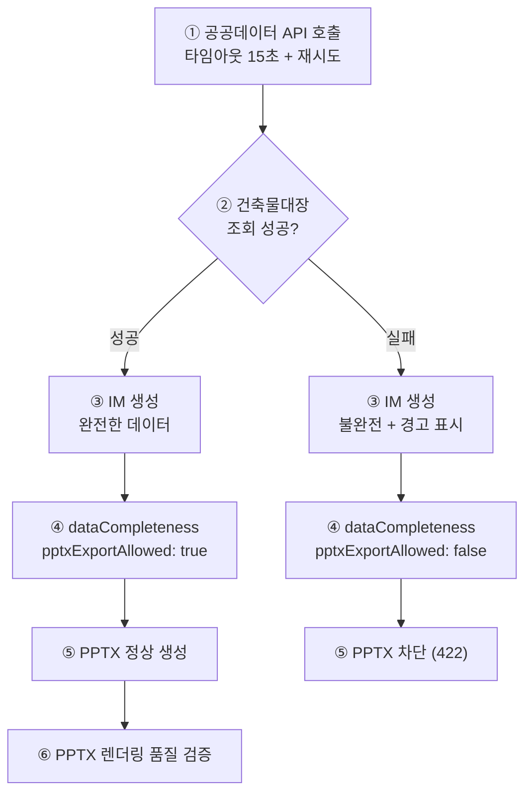

# Mobile IM 생성 E2E 테스트 — 데이터 무결성 & PPTX 품질 검증
> 문서 버전: v1.0 | 최종 수정: 2026-08-11
> 대상 환경: **Production** (https://cre-dealcard.vercel.app) 및 **로컬 개발 환경**
> 테스트 방식: **UI 조작(인간)** + **cURL/콘솔 명령(로컬)**
> 총 소요 예상: 약 3~4시간
> 사전 조건: 테스트 계정 로그인 완료, 최소 1개 딜카드 생성 완료

---

## 1. 테스트 목적

이 테스트는 Mobile IM 생성 파이프라인의 **데이터 무결성**과 **PPTX 변환 품질**을 종합 검증합니다.

### 핵심 검증 포인트



| # | 검증 영역 | 근거 |
|:---:|---|---|
| T1 | 공공데이터 API 타임아웃 + 재시도 | 건축물대장 5초→15초, retry 1회 |
| T2 | 데이터 무결성 게이트 (`dataCompleteness`) | 미조회 시 `pptxExportAllowed: false` |
| T3 | PPTX 차단 게이트 (HTTP 422) | 불완전 데이터 → PPTX 미생성 |
| T4 | Publish Gate 등급 실측 | `grade: 'B'` 하드코딩 제거 확인 |
| T5 | PPTX 렌더링 품질 (오버플로우, 빈 슬라이드) | data-binder, archetypes 수정 |
| T6 | 5개 포스처별 IM 정상 생성 | income/development/owner_occupied/operating/trading |
| T7 | 하위 호환성 (기존 IM 문서) | `dataCompleteness` 없는 문서 → PPTX 통과 |

---

## 2. 테스트 환경

### 2.1 프로덕션 (인간 테스터)

| 항목 | 값 |
|---|---|
| URL | https://cre-dealcard.vercel.app |
| 브라우저 | Chrome 120+ / Safari 17+ |
| 모바일 | iPhone 15 Safari 또는 Galaxy S24 Chrome |
| 뷰어 | MS PowerPoint 또는 Google Slides |

### 2.2 로컬 개발 환경

```bash
# 로컬 서버 시작
npm run dev
# → http://localhost:3000
```

### 2.3 테스트 물건 데이터

| # | 물건명 | 포스처 | 주소 | 매각가 | 월 임대료 |
|:---:|---|:---:|---|---:|---:|
| P1 | 강남역 오피스 | income | 서울시 강남구 역삼동 123-4 | 350억 | 1.2억 |
| P2 | 성수동 개발부지 | development | 서울시 성동구 성수동1가 45 | 180억 | - |
| P3 | 판교 사옥 | owner_occupied | 경기도 성남시 분당구 판교역로 235 | 280억 | - |
| P4 | 홍대 상가 | operating | 서울시 마포구 와우산로 94 | 45억 | 3,200만 |
| P5 | 여의도 트레이딩 | trading | 서울시 영등포구 여의대로 108 | 520억 | 2.5억 |

---

## 3. 테스트 시나리오

### T1. 공공데이터 API 타임아웃 + 재시도 검증

> **목적**: 건축물대장 API 호출이 15초 타임아웃 + 1회 재시도로 정상 동작하는지 확인

#### 로컬 실행 방법

```bash
# 1. 서버 콘솔 로그에서 API 호출 시간 확인
npm run dev

# 2. IM 생성 API 호출 (P1 물건 기준, buildingId를 실제 값으로 교체)
curl -X POST http://localhost:3000/api/broker/im-lite/generate \
  -H "Content-Type: application/json" \
  -H "Cookie: <session-cookie>" \
  -d '{
    "buildingId": "<building-id>",
    "supplemental": {
      "asking_price_manwon": 3500000,
      "monthly_rent_total_krw": 120000000,
      "resolved_address": "서울시 강남구 역삼동 123-4"
    }
  }'

# 3. 서버 콘솔에서 아래 로그 확인
#    ✅ "[im-handler] External data enrichment..." 로그에 에러 없음
#    ✅ "externalDataStatus" 가 'loaded' 또는 'partial'
```

#### UI 실행 방법 (인간 테스터)

1. 딜카드 P1 (강남역 오피스)를 선택합니다.
2. **[IM 생성]** 버튼을 클릭합니다.
3. 생성 완료 후 IM 뷰어에서 **건물 개요** 섹션을 확인합니다.

#### 검증 기준

| # | 체크 포인트 | 기대 결과 | Pass/Fail |
|:---:|---|---|:---:|
| T1-1 | IM 생성 API 응답 시간 | 30초 이내 (기존 5초 타임아웃 대비 여유) | ☐ |
| T1-2 | 건축물대장 데이터 존재 | 연면적, 층수, 용적률, 건폐율 값 존재 | ☐ |
| T1-3 | 공시지가 데이터 존재 | pricePerSqm 값 존재 | ☐ |
| T1-4 | 토지이용계획 존재 | 용도지역 표시 (예: "일반상업지역") | ☐ |
| T1-5 | 서버 로그: 재시도 발생 시 | `[building-register-api] endpoint failed, trying next` 후 성공 | ☐ |
| T1-6 | `"건축물대장 조회 미완료"` 경고 없음 | 마크다운에 경고 노트 미포함 | ☐ |

---

### T2. 데이터 무결성 게이트 (`dataCompleteness`) 검증

> **목적**: IM 저장 시 `dataCompleteness` 메타데이터가 정확히 기록되는지 확인

#### 로컬 실행 방법

```bash
# 1. IM 생성 후 Supabase에서 document_objects 확인
# Supabase Dashboard → Table Editor → document_objects
# building_id 로 필터 → 최신 레코드의 body 컬럼 확인

# 또는 Supabase CLI:
npx supabase db inspect --table document_objects
```

#### 검증 기준 — 정상 케이스 (API 성공)

| # | 체크 포인트 | 기대 결과 | Pass/Fail |
|:---:|---|---|:---:|
| T2-1 | `body.dataCompleteness` 필드 존재 | 객체로 존재 | ☐ |
| T2-2 | `buildingRegister` | `true` | ☐ |
| T2-3 | `buildingRegisterSource` | `"loaded"` | ☐ |
| T2-4 | `qualityGrade` | `"A"` 또는 `"B"` | ☐ |
| T2-5 | `pptxExportAllowed` | `true` | ☐ |
| T2-6 | `generatedAt` | 유효한 ISO 타임스탬프 | ☐ |

#### 검증 기준 — 실패 케이스 (API 타임아웃 시뮬레이션)

> **로컬에서만 가능**: `.env.local`의 `DATA_GO_KR_API_KEY`를 임시로 잘못된 값으로 변경

```bash
# .env.local 수정 (임시)
DATA_GO_KR_API_KEY=INVALID_KEY_FOR_TESTING

# IM 생성 후 document_objects 확인
```

| # | 체크 포인트 | 기대 결과 | Pass/Fail |
|:---:|---|---|:---:|
| T2-7 | `buildingRegister` | `false` | ☐ |
| T2-8 | `buildingRegisterSource` | `"failed"` 또는 `"skipped"` | ☐ |
| T2-9 | `pptxExportAllowed` | `false` | ☐ |
| T2-10 | IM 마크다운에 경고 존재 | `"건축물대장 조회 미완료"` 노트 포함 | ☐ |

> ⚠️ 테스트 후 반드시 `.env.local`의 `DATA_GO_KR_API_KEY`를 원래 값으로 복원하세요.

---

### T3. PPTX 차단 게이트 (HTTP 422) 검증

> **목적**: `pptxExportAllowed: false`인 IM에서 PPTX 다운로드 요청 시 422가 반환되는지 확인

#### 로컬 실행 방법

```bash
# T2의 실패 케이스로 생성된 IM의 buildingId 사용
curl -v "http://localhost:3000/api/public/im-lite/<building-id>/pptx?tier=basic"

# 기대 응답:
# HTTP/1.1 422
# {
#   "error": "PPTX 다운로드 불가",
#   "reason": "건축물대장 등 필수 공공데이터가 조회되지 않았습니다.",
#   "suggestion": "건물 주소를 확인하고 IM을 재생성해 주세요.",
#   "dataStatus": "failed",
#   "qualityGrade": "D"
# }
```

#### UI 실행 방법 (인간 테스터)

1. T2 실패 케이스로 생성된 IM의 뷰어를 엽니다.
2. **[PPTX 다운로드]** 버튼을 클릭합니다.
3. 오류 메시지가 표시되는지 확인합니다.

#### 검증 기준

| # | 체크 포인트 | 기대 결과 | Pass/Fail |
|:---:|---|---|:---:|
| T3-1 | HTTP 상태 코드 | `422 Unprocessable Entity` | ☐ |
| T3-2 | 응답 `error` 필드 | `"PPTX 다운로드 불가"` | ☐ |
| T3-3 | 응답 `reason` 필드 | 건축물대장 미조회 안내 포함 | ☐ |
| T3-4 | 응답 `suggestion` 필드 | 재생성 안내 포함 | ☐ |
| T3-5 | PPTX 파일 미생성 확인 | Supabase Storage `Exports` 버킷에 신규 파일 없음 | ☐ |

---

### T4. Publish Gate 등급 실측 검증

> **목적**: `writer.ts`의 grade가 실제 `computeDataQualityBadge` 결과를 반영하는지 확인

#### 로컬 실행 방법

```bash
# IM 생성 시 서버 로그 확인
# 기대 로그:
# [im-handler] gradeResult: A 85 directData present: false
# 또는
# [im-handler] gradeResult: B 65 directData present: false

# 만약 아래 로그가 보이면 FAIL:
# [mobile-im] Publish gates blocked: ['G04']  ← D등급 차단
```

#### 검증 기준

| # | 체크 포인트 | 기대 결과 | Pass/Fail |
|:---:|---|---|:---:|
| T4-1 | P1 (income, 풀데이터) 등급 | `A` 또는 `B` | ☐ |
| T4-2 | P2 (development, 가격 미정) 등급 | `B` 또는 `C` | ☐ |
| T4-3 | 빈 데이터(주소만) 등급 | `C` 또는 `D` | ☐ |
| T4-4 | D등급 시 publish gate 차단 로그 | `[mobile-im] Publish gates blocked` 출력 | ☐ |
| T4-5 | `body.dataGrade` 값 | Supabase에 실제 등급 저장 | ☐ |

---

### T5. PPTX 렌더링 품질 검증

> **목적**: PPTX 슬라이드에 텍스트 오버플로우, 빈 슬라이드, 내부 시스템 메시지 누출이 없는지 확인

#### 실행 방법 (공통)

1. P1 물건의 IM을 정상 생성합니다.
2. **[PPTX 다운로드]** 버튼으로 Basic PPTX를 다운로드합니다.
3. PowerPoint 또는 Google Slides로 열어 전체 슬라이드를 검토합니다.

#### 검증 기준

| # | 체크 포인트 | 기대 결과 | Pass/Fail |
|:---:|---|---|:---:|
| **표지 슬라이드** | | | |
| T5-1 | 건물명/권역 표시 | 텍스트 존재, 오버플로우 없음 | ☐ |
| T5-2 | 날짜/문서번호 | 정확한 날짜, `IM-XXXXXX` 포맷 | ☐ |
| T5-3 | 표지 레이아웃 | 텍스트가 이미지 영역과 겹치지 않음 | ☐ |
| **건물 개요 슬라이드** | | | |
| T5-4 | 연면적 | 실제 수치 표시 (0 또는 빈칸 아님) | ☐ |
| T5-5 | 층수 | 지상/지하 층수 정확 표시 | ☐ |
| T5-6 | 용적률/건폐율 | 숫자 + `%` 표시 | ☐ |
| T5-7 | 준공연도 | 연도 표시 (공란 아님) | ☐ |
| **재무 분석 슬라이드** | | | |
| T5-8 | Cap Rate | 합리적 수치 (2~15% 범위) | ☐ |
| T5-9 | NOI | 숫자 표시 (0 아님) | ☐ |
| T5-10 | 임대료 테이블 | 최소 1행 데이터 존재 | ☐ |
| **전체 슬라이드 공통** | | | |
| T5-11 | 시스템 내부 메시지 누출 없음 | `"🔍 건축물대장 조회 미완료"` 텍스트 없음 | ☐ |
| T5-12 | 마크다운 원문 누출 없음 | `**볼드**`, `> 인용` 같은 raw 마크다운 없음 | ☐ |
| T5-13 | 빈 슬라이드 없음 | 모든 슬라이드에 최소 1개 콘텐츠 존재 | ☐ |
| T5-14 | 텍스트 오버플로우 없음 | 텍스트가 슬라이드 경계 밖으로 나가지 않음 | ☐ |
| T5-15 | 슬라이드 수 | 6~12매 범위 (극단적 과소/과다 아님) | ☐ |

---

### T6. 5개 포스처별 IM 정상 생성 검증

> **목적**: income, development, owner_occupied, operating, trading 각각의 IM이 해당 포스처에 맞는 섹션 구성으로 생성되는지 확인

#### 실행 방법

각 포스처별 테스트 물건(P1~P5)에 대해 IM을 생성하고, 결과를 비교합니다.

#### 검증 기준

| # | 포스처 | 물건 | 핵심 확인 항목 | 기대 결과 | Pass/Fail |
|:---:|:---:|:---:|---|---|:---:|
| T6-1 | income | P1 | Cap Rate, NOI, 임대차 요약 | 재무 분석 섹션 존재 | ☐ |
| T6-2 | development | P2 | 대지면적, 용도지역, 건폐율/용적률 | 개발 입지 분석 섹션 존재 | ☐ |
| T6-3 | owner_occupied | P3 | 건물규모, 매각가, 교통 접근성 | 사옥 적합성 분석 섹션 존재 | ☐ |
| T6-4 | operating | P4 | 월 매출/수입, 매각가 | 운영 수익 분석 섹션 존재 | ☐ |
| T6-5 | trading | P5 | Cap Rate, 매각가, 임대료 | 매매형 분석 섹션 존재 | ☐ |
| T6-6 | 공통 | 전체 | `dataCompleteness` 메타데이터 | 모든 IM에 `dataCompleteness` 존재 | ☐ |
| T6-7 | 공통 | 전체 | 면책 조항 섹션 | 모든 IM 마지막에 "면책 조항" 포함 | ☐ |

---

### T7. 하위 호환성 검증 (기존 IM 문서)

> **목적**: `dataCompleteness` 필드가 없는 기존 IM 문서에서 PPTX 다운로드가 정상 동작하는지 확인

#### 로컬 실행 방법

```bash
# 1. 기존 IM 문서 ID 확인 (dataCompleteness 없는 문서)
# Supabase Dashboard → document_objects
# body 컬럼에 dataCompleteness 키가 없는 레코드 선택

# 2. 해당 문서의 PPTX 다운로드 시도
curl -v "http://localhost:3000/api/public/im-lite/<building-id>/pptx?doc_id=<doc-id>&tier=basic"

# 기대: HTTP 200 + PPTX 파일 정상 다운로드
```

#### UI 실행 방법 (인간 테스터)

1. 이전에 생성된 기존 IM 목록에서 오래된 IM을 선택합니다.
2. **[PPTX 다운로드]** 버튼을 클릭합니다.
3. 정상적으로 PPTX가 다운로드되는지 확인합니다.

#### 검증 기준

| # | 체크 포인트 | 기대 결과 | Pass/Fail |
|:---:|---|---|:---:|
| T7-1 | 기존 IM → PPTX 요청 | HTTP 200 반환 | ☐ |
| T7-2 | PPTX 파일 정상 | PowerPoint에서 정상 열림 | ☐ |
| T7-3 | 422 오류 미발생 | 게이트에 의해 차단되지 않음 | ☐ |

---

### T8. API 재시도 동작 검증 (로컬 전용)

> **목적**: `fetchWithRetry`의 exponential backoff가 정상 동작하는지 확인

#### 로컬 실행 방법

```bash
# 1. fetch-with-retry.ts에 임시 로그 추가 (디버그 목적)
# 파일: src/lib/external/fetch-with-retry.ts
# for 루프 시작부에 아래 추가:
# console.log(`[fetchWithRetry] attempt ${attempt + 1}/${maxRetries + 1}, timeout=${timeoutMs}ms`);

# 2. 네트워크 지연 시뮬레이션 (Chrome DevTools)
#    → Network 탭 → Throttling → "Slow 3G" 선택
#    → IM 생성 실행

# 3. 서버 로그에서 재시도 패턴 확인
```

#### 검증 기준

| # | 체크 포인트 | 기대 결과 | Pass/Fail |
|:---:|---|---|:---:|
| T8-1 | 첫 번째 시도 실패 시 | 1초 대기 후 재시도 | ☐ |
| T8-2 | 재시도 후 성공 시 | 정상 데이터 반환 | ☐ |
| T8-3 | 2회 모두 실패 시 | `errors` 배열에 기록, IM 생성은 계속 진행 | ☐ |
| T8-4 | 건축물대장 타임아웃 | 15초 (기존 5초 아님) | ☐ |
| T8-5 | 공시지가 타임아웃 | 10초 (기존 5초 아님) | ☐ |

---

### T9. 엣지 케이스 검증

> **목적**: 극단적 입력 조건에서의 안정성 확인

#### 검증 기준

| # | 시나리오 | 입력 조건 | 기대 결과 | Pass/Fail |
|:---:|---|---|---|:---:|
| T9-1 | 최소 데이터 IM | 매각가만 입력 (주소, 임대료 없음) | IM 생성 성공, 등급 C 또는 D | ☐ |
| T9-2 | 주소만 입력 (income) | 주소만, 매각가·임대료 없음 | IM 생성 거부 (`hasMinimumBasicData` 실패) | ☐ |
| T9-3 | 주소만 입력 (development) | 주소만, 매각가 없음 | IM 생성 성공 (개발형은 주소만으로 가능) | ☐ |
| T9-4 | 비정상 Cap Rate | 매각가 1억, 월 임대료 5억 | `financialWarnings` 경고 포함 | ☐ |
| T9-5 | PNU 없는 주소 | "서울시 강남구" (번지 없음) | rawAddress fallback으로 처리 | ☐ |
| T9-6 | 동일 물건 IM 재생성 | 기존 IM 있는 물건에서 재생성 | 신규 document_objects 레코드 생성 | ☐ |
| T9-7 | Pro 등급 부족 | C등급 데이터로 Pro IM 생성 시도 | 422 반환 (`scorePct < 60`) | ☐ |

---

## 4. 결과 요약 시트

### 전체 현황

| 영역 | 총 항목 | Pass | Fail | N/A | 비고 |
|---|:---:|:---:|:---:|:---:|---|
| T1. API 타임아웃+재시도 | 6 | | | | |
| T2. 데이터 무결성 게이트 | 10 | | | | |
| T3. PPTX 차단 게이트 | 5 | | | | |
| T4. Publish Gate 등급 | 5 | | | | |
| T5. PPTX 렌더링 품질 | 15 | | | | |
| T6. 5개 포스처별 생성 | 7 | | | | |
| T7. 하위 호환성 | 3 | | | | |
| T8. API 재시도 동작 | 5 | | | | |
| T9. 엣지 케이스 | 7 | | | | |
| **합계** | **63** | | | | |

### 판정 기준

| 등급 | 기준 | 판정 |
|:---:|---|---|
| 🟢 Pass | 전체 Pass율 95% 이상, Critical(T1~T3) 100% | 배포 승인 |
| 🟡 Conditional | Pass율 85~94%, Critical 100% | 조건부 승인 (비Critical 결함 트래킹) |
| 🔴 Fail | Pass율 85% 미만 또는 Critical 1건 이상 Fail | 배포 보류 |

---

## 5. 테스터 작성 양식

```
테스트 일시: 2026-08-__  __:__
테스트 환경: □ 프로덕션  □ 로컬 (localhost:3000)
테스터 이름: _______________
브라우저/디바이스: _______________

[T1] API 타임아웃+재시도:  Pass __/6  Fail __/6  비고: _______________
[T2] 데이터 무결성 게이트:  Pass __/10 Fail __/10 비고: _______________
[T3] PPTX 차단 게이트:     Pass __/5  Fail __/5  비고: _______________
[T4] Publish Gate 등급:    Pass __/5  Fail __/5  비고: _______________
[T5] PPTX 렌더링 품질:     Pass __/15 Fail __/15 비고: _______________
[T6] 5개 포스처별 생성:    Pass __/7  Fail __/7  비고: _______________
[T7] 하위 호환성:          Pass __/3  Fail __/3  비고: _______________
[T8] API 재시도 동작:      Pass __/5  Fail __/5  비고: _______________
[T9] 엣지 케이스:          Pass __/7  Fail __/7  비고: _______________

총 합계: Pass __/63  Fail __/63
판정: □ 🟢 Pass  □ 🟡 Conditional  □ 🔴 Fail

발견된 결함:
1. _______________
2. _______________
3. _______________

📸 스크린샷 첨부: (결함 발견 시 필수)
```

---

## 6. 부록: cURL 명령 레퍼런스

### IM 생성 (POST)
```bash
curl -X POST http://localhost:3000/api/broker/im-lite/generate \
  -H "Content-Type: application/json" \
  -H "Authorization: Bearer <token>" \
  -d '{
    "buildingId": "<id>",
    "supplemental": {
      "asking_price_manwon": 3500000,
      "monthly_rent_total_krw": 120000000,
      "resolved_address": "서울시 강남구 역삼동 123-4"
    },
    "identity": {
      "assetType": "오피스",
      "investmentPosture": "income"
    },
    "tier": "basic"
  }'
```

### PPTX 다운로드 (GET)
```bash
curl -o output.pptx \
  "http://localhost:3000/api/public/im-lite/<building-id>/pptx?tier=basic"
```

### Supabase에서 dataCompleteness 확인
```sql
SELECT
  id,
  building_id,
  body->'dataCompleteness' as data_completeness,
  body->'dataGrade' as grade,
  created_at
FROM document_objects
WHERE building_id = '<building-id>'
ORDER BY created_at DESC
LIMIT 1;
```
