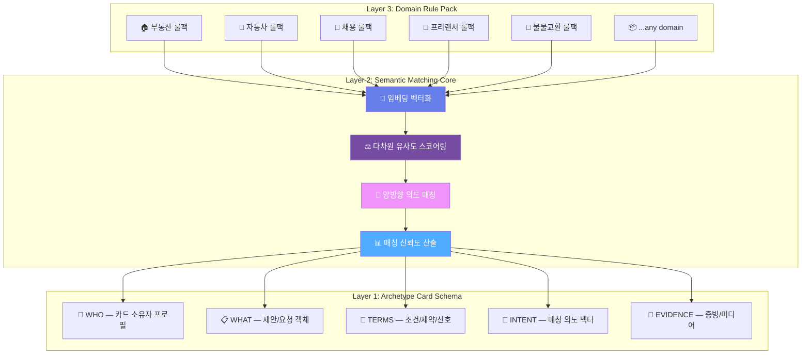
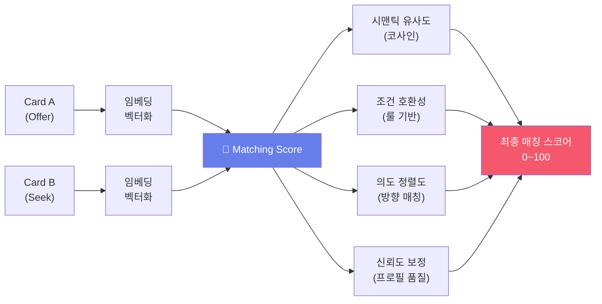
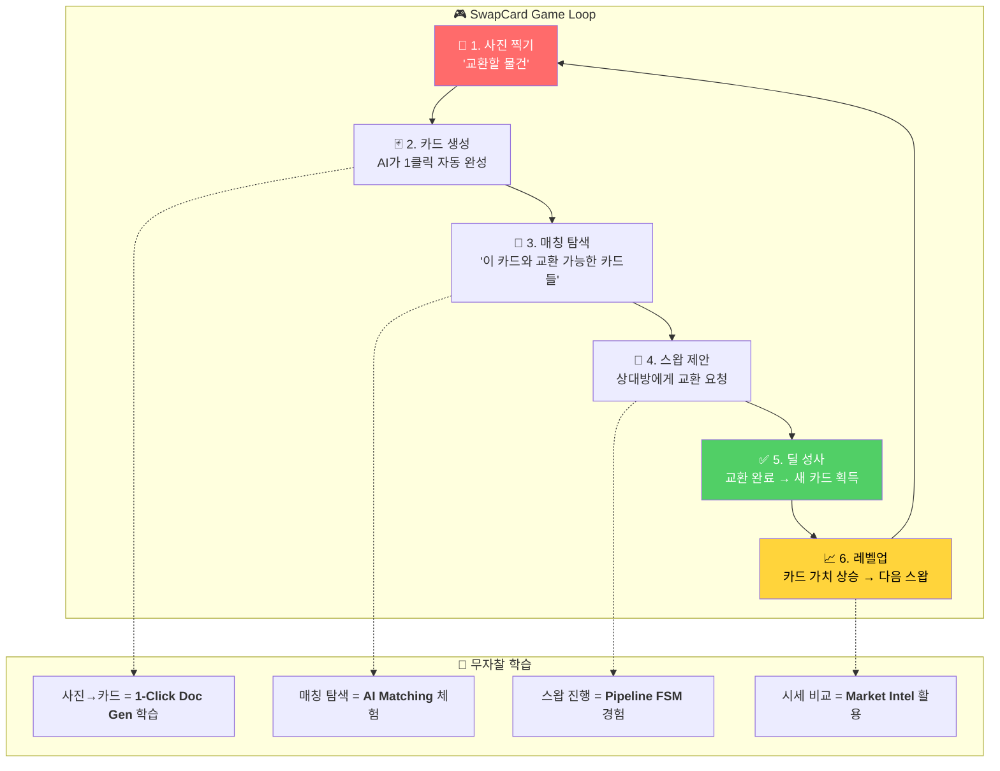
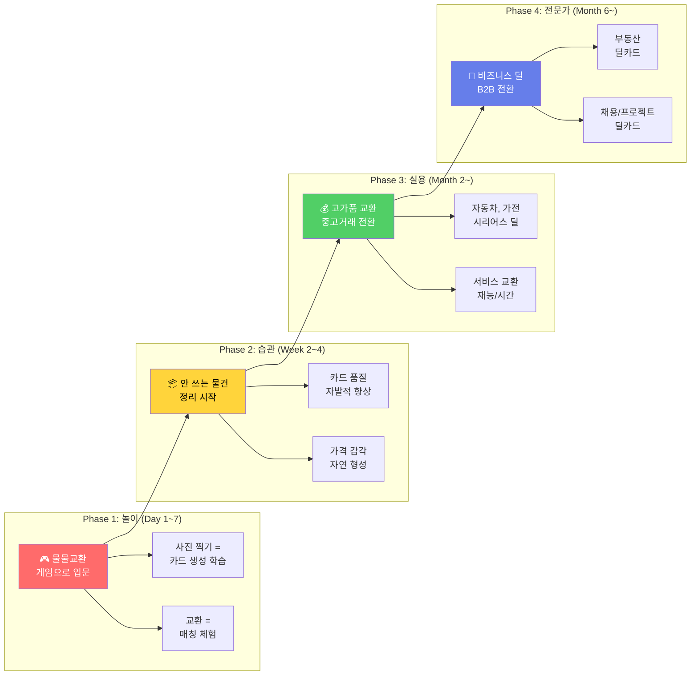
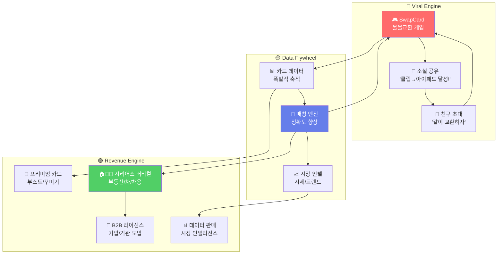
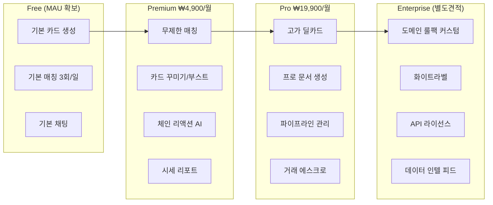

# 🃏 범용 딜카드 매칭 플랫폼 전략

## 핵심 전략 전환

```
❌ Before: 10개 버티컬 앱을 각각 만든다
✅ After:  범용 딜카드 엔진 1개 + 바이럴 트로이목마 서비스 1개
```

> [!IMPORTANT]
> **전략 한 줄 요약**: 누구나 "아무 거래든" 카드 한 장으로 만들고, AI가 자동 매칭하는 **범용 플랫폼**을 만들되, 대중을 끌어들이는 건 **중독성 있는 재미 서비스**로 한다. 사용자는 놀다가 자연스럽게 딜카드를 만들고 매칭하는 법을 '무자찰 학습'한다.

---

## Part 1: 모듈라 아키타입 딜카드 아키텍처

### 딜카드의 범용 구조

모든 "거래"는 본질적으로 동일한 구조를 가집니다:

```
누군가(WHO)가 무언가(WHAT)를 조건(TERMS)에 따라
상대방(COUNTERPART)과 교환(EXCHANGE)하고 싶다
```

이것을 **3-레이어 모듈라 아키텍처**로 설계합니다.



---

### Layer 1: Archetype Card Schema (범용 카드 골격)

**어떤 도메인이든** 아래 5개 슬롯으로 표현됩니다.

```typescript
interface DealCard<T extends DomainPayload = any> {
  // ── 메타 ──
  id: string;
  archetype: CardArchetype;     // 'offer' | 'seek' | 'swap' | 'auction'
  domain: DomainKey;            // 'realestate' | 'car' | 'job' | 'swap' | ...
  
  // ── 5 Universal Slots ──
  who: IdentitySlot;            // 카드 소유자 (신뢰도, 인증 레벨)
  what: ObjectSlot<T>;          // 도메인별 페이로드 (제네릭)
  terms: TermsSlot;             // 가격, 기간, 위치, 조건
  intent: IntentVector;         // AI 생성 의도 임베딩 (768-dim)
  evidence: EvidenceSlot[];     // 사진, 문서, 링크, 인증서
  
  // ── 매칭 메타 ──
  matchPreferences: MatchPref;  // 원하는 상대방 조건
  pipeline: PipelineState;      // FSM 상태
  
  // ── AI 생성 ──
  generatedDoc: GeneratedDocument; // 1-Click 생성 문서
  embedding: number[];           // 시맨틱 서치용 벡터
}
```

**핵심**: `what` 슬롯만 도메인별로 다르고, 나머지는 모두 범용입니다.

```typescript
// 도메인별 페이로드 예시
type RealEstatePayload = {
  propertyType: string; area: number; floor: number; direction: string;
  nearStation: string; builtYear: number;
};

type CarPayload = {
  make: string; model: string; year: number; mileage: number;
  fuelType: string; accidents: number;
};

type JobPayload = {
  role: string; skills: string[]; experience: number;
  salary: Range; workStyle: 'remote' | 'hybrid' | 'onsite';
};

type SwapPayload = {
  item: string; condition: string; category: string;
  estimatedValue: number; description: string;
};
```

---

### Layer 2: Semantic Matching Core (도메인 무관 매칭 엔진)



| 매칭 요소 | 가중치 | 설명 |
|-----------|--------|------|
| **시맨틱 유사도** | 40% | what/terms의 텍스트 임베딩 코사인 유사도 |
| **조건 호환성** | 30% | 가격 범위, 위치, 시기 등 하드 필터 (도메인 룰팩이 정의) |
| **의도 정렬도** | 20% | Offer↔Seek 방향 매칭, 거래 의도 강도 |
| **신뢰도 보정** | 10% | 카드 완성도, 증빙 품질, 사용자 평판 |

> **도메인 룰팩이 하는 일**: 가중치 비율 조정, 하드 필터 정의, 도메인 특화 스코어링 규칙 주입. 매칭 엔진 자체는 건드리지 않음.

---

### Layer 3: Domain Rule Pack (플러그인)

도메인별 차이를 **룰팩 플러그인**으로 격리합니다.

```typescript
interface DomainRulePack {
  key: DomainKey;
  
  // 카드 생성 규칙
  requiredFields: string[];          // 필수 슬롯
  validationRules: ValidationRule[]; // 입력 검증
  aiPromptTemplate: string;          // 1-Click Doc 생성 프롬프트
  
  // 매칭 규칙
  hardFilters: FilterRule[];         // 매칭 전 필터 (예: 위치 반경)
  scoreWeights: ScoreWeightOverride; // 기본 가중치 오버라이드
  pairLogic: 'offer-seek' | 'swap' | 'auction'; // 매칭 모드
  
  // 파이프라인 규칙
  pipelineStages: StageDefinition[]; // FSM 단계 정의
  nudgeRules: NudgeRule[];           // 자동 알림 규칙
  
  // 문서 생성 규칙
  documentTemplate: DocTemplate;     // 생성 문서 포맷
  tierAccess: TierAccessRule[];      // 정보 공개 레벨
}
```

**새 도메인 추가 = 룰팩 JSON 1개 추가.** 엔진 코드 수정 불필요.

---

## Part 2: 바이럴 트로이목마 — 「무자찰 온보딩」 서비스 설계

### 왜 "재미 서비스"가 필요한가?

```
😐 "범용 딜카드 플랫폼입니다" → 아무도 모름, 교육 비용 높음
😍 "이거 재밌어! 한번 해봐!" → 자연 확산, 놀면서 학습
```

| 역사적 선례 | 트로이목마 | 실제 목적 |
|-------------|-----------|-----------|
| WeChat 홍바오 | 설날 돈봉투 게임 | 모바일 결제 온보딩 |
| 당근마켓 동네생활 | 동네 커뮤니티 | 중고거래 활성 사용자 확보 |
| 토스 만보기 | 걸으면 돈 주기 | 금융앱 DAU 확보 |
| 틱톡 | 15초 영상 | 광고 플랫폼 + 커머스 |

### 후보 바이럴 서비스 평가

| # | 서비스 | 바이럴성 | 딜카드 학습 효과 | 데이터 축적 | 종합 |
|---|--------|---------|-----------------|------------|------|
| 1 | 🔄 **물물교환 챌린지** | ⭐⭐⭐⭐⭐ | ⭐⭐⭐⭐⭐ | ⭐⭐⭐⭐ | **🏆 1위** |
| 2 | 🎰 **취향 매칭 게임** | ⭐⭐⭐⭐ | ⭐⭐⭐ | ⭐⭐⭐⭐ | 2위 |
| 3 | 🎁 **재능 교환 마켓** | ⭐⭐⭐ | ⭐⭐⭐⭐ | ⭐⭐⭐ | 3위 |
| 4 | 🏆 **소원 경매** | ⭐⭐⭐⭐ | ⭐⭐⭐ | ⭐⭐ | 4위 |
| 5 | 📮 **타임캡슐 딜** | ⭐⭐⭐ | ⭐⭐ | ⭐⭐⭐ | 5위 |

---

### 🏆 킬러 앱: 「스왑카드 SwapCard」 — 빨간 클립에서 집까지

> *"클립 하나로 시작해서 집 한 채까지 교환해보세요"*

#### 왜 물물교환인가?

1. **딜카드 학습 100% 자연스러움** — 교환할 물건 = 카드 생성, 원하는 물건 = 매칭 조건
2. **검증된 바이럴 메커니즘** — "빨간 클립→집" 챌린지는 글로벌 밈 (Kyle MacDonald, 2006)
3. **거래 허들 최저** — 돈 안 듦, 가볍게 시작, 실패 비용 0
4. **카드 데이터 폭발적 축적** — 모든 물건이 카드가 됨 → 매칭 엔진 학습 데이터
5. **소셜 공유 내장** — "나 클립으로 시작해서 아이패드까지 올라감ㅋㅋ" → 자연 바이럴

---

#### 핵심 게임 메커니즘



---

#### 사용자 시나리오: 30초 온보딩

```
STEP 1: 📸 사용자가 책상 위 볼펜 사진을 찍는다
         ↓
STEP 2: 🃏 AI가 자동으로 "스왑카드" 생성
         ┌─────────────────────────────┐
         │  🃏 SwapCard #4821          │
         │  📦 모나미 볼펜 (파랑, 미사용)  │
         │  💎 추정 가치: ₩1,500        │
         │  🔄 교환 희망: 문구류, 스티커  │
         │  📍 서울 강남구              │
         │  ⭐ 카드 등급: Bronze        │
         └─────────────────────────────┘
         ↓
STEP 3: 🎯 AI 매칭 결과 3개 표시
         "이 카드와 교환 가능한 카드들"
         ├─ 🃏 디즈니 스티커 세트 (매칭 92%)
         ├─ 🃏 무지 노트 3권 (매칭 87%)
         └─ 🃏 색연필 12색 (매칭 81%)
         ↓
STEP 4: 🤝 스왑 제안 → 채팅 → 교환 완료
         ↓
STEP 5: 📈 "축하합니다! Silver 등급 달성!"
         "다음 교환으로 Gold를 노려보세요 🚀"
```

> **사용자가 학습한 것 (자각 없이)**:
> - 사진→구조화 카드 생성 (= DNA-1)
> - AI 매칭 스코어 이해 (= DNA-2)
> - 교환 협상→성사 프로세스 (= DNA-3)
> - 물건 시세 감각 (= DNA-4)

---

#### 게임화 요소: 중독 루프

| 요소 | 메커니즘 | 효과 |
|------|----------|------|
| **🏔️ 클립→집 챌린지** | 1,500원짜리부터 시작해서 가치를 올려가는 메인 퀘스트 | 장기 리텐션 + SNS 공유 |
| **⭐ 카드 등급 시스템** | Bronze → Silver → Gold → Platinum → Diamond | 레벨 갈망 + 카드 품질 향상 동기 |
| **🔗 체인 리액션** | "A→B→C→...→목표" 교환 경로 AI 추천 | 단순 1:1이 아닌 다단계 매칭 경험 |
| **🏆 주간 랭킹** | "이번 주 최고 업그레이드", "최다 교환왕" | 경쟁 심리 + 바이럴 |
| **🎁 럭키 스왑** | 랜덤 교환 이벤트 (뽑기 심리) | DAU 유지 |
| **👥 스왑 파티** | 오프라인 교환 이벤트 (지역별) | 커뮤니티 + PR |

---

#### 무자찰 온보딩 퍼널



| Phase | 사용자 인식 | 실제 학습 | 플랫폼 가치 |
|-------|-----------|-----------|------------|
| **놀이** | "재밌는 교환 게임" | 카드 생성 + 매칭 UX | 사용자 확보 + 기초 데이터 |
| **습관** | "정리정돈 + 용돈 벌기" | 카드 품질 최적화 | 양질의 카드 데이터 축적 |
| **실용** | "중고거래 대안" | 파이프라인 관리 | 거래 수수료 수익 |
| **전문가** | "비즈니스 도구" | 풀 딜카드 활용 | B2B 라이선스 + 컨설팅 |

---

## Part 3: 플라이휠 — 전체 전략 구조



### 플라이휠 핵심 동력

```
스왑카드로 재미있게 교환 → 카드 데이터 축적 → 매칭 정확도↑
→ 더 좋은 매칭 → 더 많은 사용자 유입 → 더 많은 데이터
→ 고가 거래로 자연 확장 → 수익화 → 재투자
```

---

## Part 4: 수익 모델 스펙트럼



| 수익원 | Phase | 예상 비중 |
|--------|-------|----------|
| 프리미엄 구독 | Phase 1~2 | 30% |
| 거래 수수료 (고가) | Phase 2~3 | 25% |
| 카드 부스트/광고 | Phase 1~ | 15% |
| B2B 룰팩 라이선스 | Phase 3~ | 15% |
| 데이터 인텔리전스 | Phase 3~ | 15% |

---

## Part 5: 실행 로드맵

### Phase 0: Core Engine (Month 1~3)
```
[  ] 범용 DealCard Schema 구현
[  ] Semantic Matching Core 구현
[  ] Domain Rule Pack 인터페이스 정의
[  ] SwapCard 룰팩 구현 (첫 번째 플러그인)
```

### Phase 1: SwapCard MVP (Month 3~5)
```
[  ] 사진→카드 1클릭 생성 (DNA-1)
[  ] 기본 매칭 + 스와이프 UI
[  ] 채팅 + 교환 확정 플로우
[  ] 클립→집 챌린지 게임화
[  ] 소셜 공유 기능
```

### Phase 2: 성장 + 두 번째 룰팩 (Month 5~9)
```
[  ] 카드 등급 + 랭킹 시스템
[  ] 체인 리액션 매칭 AI
[  ] 중고거래 룰팩 추가 (가격 거래)
[  ] 매칭 엔진 정확도 튜닝
[  ] 시세 인텔리전스 대시보드
```

### Phase 3: 시리어스 버티컬 (Month 9~18)
```
[  ] 부동산 룰팩
[  ] 자동차 룰팩
[  ] 채용/프리랜서 룰팩
[  ] B2B 라이선스 모델 출시
[  ] 도메인 룰팩 마켓플레이스
```

---

## Part 6: Unfair Advantage 정리

| 경쟁 우위 | 설명 | 모방 난이도 |
|-----------|------|-------------|
| **범용 매칭 엔진** | 도메인 무관하게 작동하는 시맨틱 매칭 — 새 도메인은 룰팩만 추가 | ⭐⭐⭐⭐⭐ |
| **크로스도메인 데이터** | 물물교환→중고→부동산으로 이어지는 사용자 행동 데이터 | ⭐⭐⭐⭐⭐ |
| **무자찰 온보딩** | 게임으로 학습된 수백만 사용자 → 시리어스 버티컬 전환 비용 0 | ⭐⭐⭐⭐ |
| **네트워크 효과** | 카드가 많을수록 매칭↑ → 카드 더 생성 → 선순환 | ⭐⭐⭐⭐ |
| **Dark Data Moat** | 미성사 거래 데이터로 시장 인텔리전스 독점 | ⭐⭐⭐⭐⭐ |

> [!CAUTION]
> **핵심 방어선**: 경쟁사가 "물물교환 앱"은 따라 만들 수 있지만, **범용 매칭 엔진 + 크로스도메인 데이터 + 시리어스 버티컬 전환 퍼널**의 3중 결합은 모방 불가.

---

## 특허 전략 확장

기존 CRE 딜시스템 특허에 추가로 아래 특허 출원 권고:

| # | 특허명 | 핵심 청구항 |
|---|--------|-----------|
| P-1 | **도메인 무관 범용 딜카드 매칭 시스템** | 아키타입 스키마 + 룰팩 플러그인 + 시맨틱 매칭의 3-레이어 구조 |
| P-2 | **게임화 기반 무자찰 온보딩 방법** | 바이럴 게임 → 카드 생성 학습 → 시리어스 전환 퍼널 |
| P-3 | **체인 리액션 다자간 매칭 알고리즘** | A→B→C→...→N의 순환 교환 경로 최적화 |
| P-4 | **크로스도메인 거래 의도 임베딩** | 이종 도메인 카드 간 시맨틱 유사도 산출 방법 |

---

> [!TIP]
> **한 줄 비전**: *"세상의 모든 거래를 카드 한 장으로."*
> 
> 스왑카드는 "물물교환 게임"이 아닙니다. 세상의 모든 복잡한 거래를 단순화하는 **범용 딜카드 플랫폼의 트로이목마**입니다.
