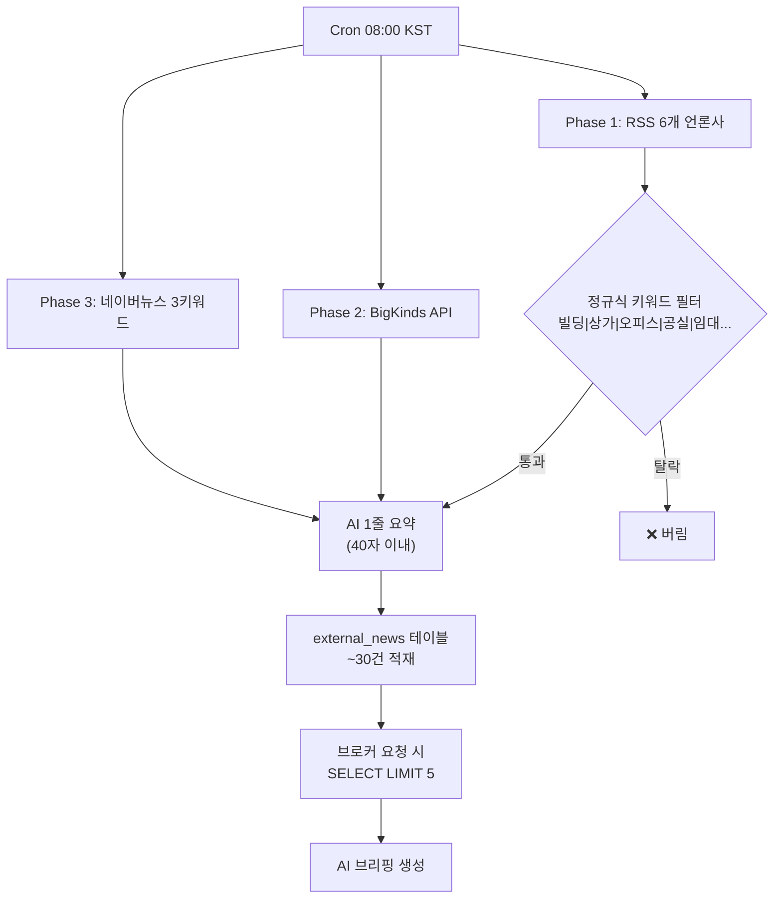

# 뉴스 파이프라인 정밀 감사 + LLM 기반 고도화 계획

## 현재 파이프라인 구조



## 발견된 5가지 구조적 결함

### 결함 1: 🔴 키워드 필터가 단순 정규식

```typescript
// 현재 (market-crawlers.ts L106)
const isRelevant = /빌딩|상가|오피스|공실|임대|매매|분양|경매|리모델|지산|근생|상업용|평당|수익률/.test(
  item.title + item.description
);
```

| 잡히는 것 | 놓치는 것 |
|---|---|
| "강남 오피스 공실률 하락" ✅ | "기준금리 25bp 인하 결정" ❌ (CRE에 직접 영향) |
| "성수 꼬마빌딩 80억 체결" ✅ | "서울시 용도지역 변경안 발표" ❌ (자산가치 직접 영향) |
| "상업용 부동산 경매" ✅ | "LTV·DSR 규제 완화" ❌ (매수력 직접 영향) |

> [!CAUTION]
> **정규식은 "상업용 부동산 직접 언급" 뉴스만 잡습니다.** 금리·세제·규제·도시계획 등 CRE에 핵심적인 간접 영향 뉴스를 전부 놓칩니다.

---

### 결함 2: 🔴 AI 요약이 1줄 40자 → 맥락/수치 손실

```typescript
// 현재
systemPrompt: "꼬마빌딩 중개 브로커 관점에서 1줄(40자 이내) 핵심 요약."
```

예시 손실:
- 원문: "서울 오피스 공실률이 전분기 대비 0.3%p 하락한 2.1%를 기록. 특히 GBD 권역은 1.4%로 역대 최저"
- 40자 요약: "서울 오피스 공실률 2.1% 하락세" → **GBD 1.4% 핵심 수치 손실**

---

### 결함 3: 🟡 LIMIT 5 고정

```typescript
// 현재 (route.ts L60)
serviceClient.from("external_news").select("...").limit(5)
```

오늘 금리인하 + 서울시 용도변경 + 대형 실거래 3가지 빅뉴스가 있어도 **5건 중 2건은 덜 중요한 뉴스**가 차지할 수 있음.

---

### 결함 4: 🟡 권역 무관 전체 뉴스

성수 브로커에게 여의도 재건축 뉴스가 동일 비중으로 전달됨. **브로커 선택 권역과의 연관성 점수**가 없음.

---

### 결함 5: 🟡 감성 분석이 제목 정규식

```typescript
// 현재
const sentiment = item.title.match(/급증|상승|돌파|강세/) ? "bullish"
  : item.title.match(/하락|위축|공실|유찰|침체/) ? "bearish" : "neutral";
```

"오피스 공실률 하락" → "하락" 매칭 → `bearish` 판정 → **실제로는 bullish (공실 감소)**

---

## 고도화 개선안

### Phase A: 뉴스 수집 강화 (Cron 측)

#### [MODIFY] [market-crawlers.ts](file:///c:/Users/User/cre-dealcard/src/domain/external/market-crawlers.ts)

**A1. 정규식 필터 → LLM 적합성 판단**:
- RSS에서 전체 뉴스를 먼저 수집 (최대 30건)
- **LLM batch call**: 30건을 한 번에 전달하여 CRE 적합성 + 권역 연관성 + 중요도 점수 부여
- 점수 7/10 이상만 저장

```
[LLM 적합성 판단 프롬프트]
아래 뉴스 목록에서 "상업용 부동산 1인 브로커"에게 영업상 중요한 뉴스를 선별하세요.

판단 기준:
- 직접 CRE: 빌딩 매매/임대/경매/공실 → 8~10점
- 간접 CRE: 금리/LTV/세제/도시계획/재개발 → 6~8점
- 무관: 주거/아파트/전원주택 → 1~3점

각 뉴스에 대해 JSON 출력:
{score: 1-10, regions: ["gbd","seongsu","ybd","all"], topic: "카테고리"}
```

**A2. AI 요약 강화**: 1줄 40자 → **3줄 150자 + 핵심 수치 추출**

```
[강화 요약 프롬프트]
꼬마빌딩 브로커 관점에서 요약하세요:
1줄: 핵심 팩트 (수치 포함)
2줄: 브로커 임플리케이션 (내 매물/매수자에 어떤 영향?)
3줄: 추천 액션
```

**A3. 감성 분석 LLM 기반**:
```
정규식 → LLM: "이 뉴스가 상업용 부동산 시장에 bullish/bearish/neutral 인지 판단"
```

---

### Phase B: 브리핑 생성 고도화 (route.ts 측)

#### [MODIFY] [route.ts](file:///c:/Users/User/cre-dealcard/src/app/api/broker/morning-intelligence/route.ts)

**B1. LIMIT 5 → 동적 10 + 권역 필터**:
```typescript
// Before
serviceClient.from("external_news").select("...").limit(5)

// After
serviceClient.from("external_news")
  .select("title, summary, source, url, sentiment, regions, importance_score")
  .order("importance_score", { ascending: false })
  .order("created_at", { ascending: false })
  .limit(10)
```

**B2. 복수 토픽 브리핑 구조화**:
프롬프트에서 "5줄 요약" 대신 **"토픽별 분리 브리핑"** 요청:
```json
{
  "briefing_topics": [
    { "topic": "금리정책", "tag": "📰", "content": "..." },
    { "topic": "GBD 실거래", "tag": "📊", "content": "..." },
    { "topic": "경매시장", "tag": "🔨", "content": "..." }
  ]
}
```

---

### Phase C: external_news 테이블 스키마 확장

```sql
ALTER TABLE external_news ADD COLUMN IF NOT EXISTS importance_score INTEGER DEFAULT 5;
ALTER TABLE external_news ADD COLUMN IF NOT EXISTS regions TEXT[] DEFAULT '{"all"}';
ALTER TABLE external_news ADD COLUMN IF NOT EXISTS topic VARCHAR(50);
```

---

## 수정 파일 목록

| 파일 | 변경 | 핵심 |
|---|---|---|
| [market-crawlers.ts](file:///c:/Users/User/cre-dealcard/src/domain/external/market-crawlers.ts) | LLM 적합성 판단 + 요약 강화 + 감성 LLM | 뉴스 수집 품질 |
| [naver-search.ts](file:///c:/Users/User/cre-dealcard/src/domain/external/naver-search.ts) | 검색어 다각화 + 요약 강화 | 네이버 뉴스 품질 |
| [route.ts](file:///c:/Users/User/cre-dealcard/src/app/api/broker/morning-intelligence/route.ts) | LIMIT 10 + 중요도 정렬 + 토픽별 브리핑 | 브리핑 품질 |

## Verification Plan
- `npm run build` 통과
- Cron 수동 트리거 → `external_news`에 `importance_score`, `regions` 채워지는지 확인
- 브리핑에 복수 토픽이 [📰], [📊] 등 태그별로 구분되어 표시되는지 확인
