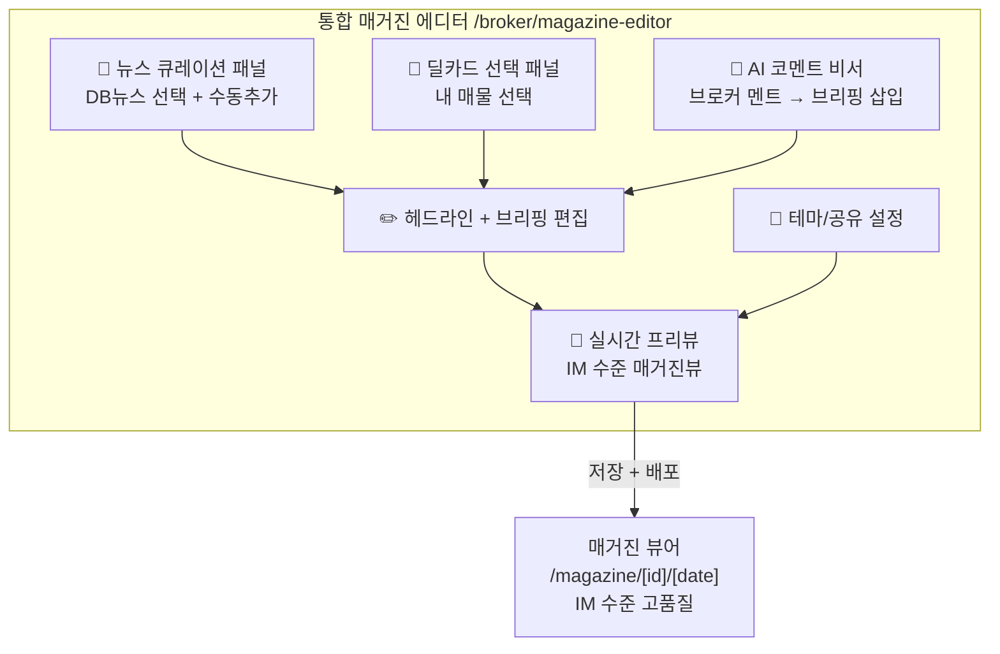

# 매거진 에디터 통합 고도화 — 확정 구현 계획

## 사용자 결정 사항

| 질문 | 결정 |
|------|------|
| 매거진 = 뉴스레터? | ✅ **대체** — 매거진이 뉴스레터를 완전 대체 |
| 스튜디오 ↔ 에디터 | ✅ **통합** — 스튜디오 기능을 에디터 안에 통합 (원스톱) |
| AI 코멘트 위치 | ✅ **브리핑 추가** — AI 브리핑 본문 내 별도 블록으로 삽입 |

## 구현 아키텍처 (After)



---

## Phase 1: 매거진 에디터 통합 (스튜디오 기능 흡수)

> [!IMPORTANT]
> `/broker/studio` 페이지는 유지하되, 뉴스큐레이션/AI코멘트/화이트라벨 3개 핵심 기능을 매거진 에디터 내 탭/패널로 통합합니다.

#### [REWRITE] [magazine-editor/page.tsx](file:///c:/Users/User/cre-dealcard/src/app/(broker)/broker/magazine-editor/page.tsx)

현재 182줄 → 예상 ~500줄. 좌측 패널 구조:

```
┌─────────────────────────────┐
│ 매거진 에디터          [저장] │
│ 2026-06-22 발행본           │
├─────────────────────────────┤
│ [뉴스📰] [딜카드🏢] [설정⚙️] │  ← 탭 네비게이션
├─────────────────────────────┤
│ ■ 헤드라인                   │
│ [____________________]      │
│                             │
│ ■ AI 브리핑                  │
│ [____________________]      │
│ [____________________]      │
│                             │
│ ■ 💬 브로커 코멘트           │
│ [간단입력] → [✨AI 확장]      │
│ [____________________]      │
│                             │
│ ■ 선택된 뉴스 (3건)          │
│ ☑ 강남 오피스 거래 활발      │
│ ☑ 금리 인하 전망             │
│ ☐ 성수동 개발 호재           │
│                             │
│ [📧 매거진 발행 및 공유]     │
│ [👁 실제 화면으로 보기]       │
└─────────────────────────────┘
```

**핵심 변경:**
- URL 쿼리 `?deals=,news=` 파싱하여 초기 선택 반영
- AI 코멘트 비서 인라인 통합: 입력 → AI 확장 → 브리핑에 자동 삽입
- 뉴스 큐레이션: `external_news`에서 중요도순 로드 + 토글 선택
- 딜카드 선택: `building_ssot_lite`에서 내 매물 로드 + 토글 선택
- 화이트라벨 테마: 설정 탭에서 색상/slug 편집
- **"매거진 발행"** 버튼: 저장 + 캐시 + 카톡 공유 원클릭

---

## Phase 2: 매거진 뷰어 IM 수준 리라이트

#### [REWRITE] [magazine-view.tsx](file:///c:/Users/User/cre-dealcard/src/app/(public)/magazine/[brokerId]/[date]/magazine-view.tsx)

현재 671줄 → 예상 ~1,000줄. 모바일 IM의 고품질 패턴 이식:

**추가 섹션:**

| # | 섹션 | IM 패턴 | 구현 |
|---|------|---------|------|
| 1 | 💬 브로커 코멘트 | — (신규) | 보라색 강조 박스, AI 뱃지 |
| 2 | 📊 시장 데이터 카드 | SectionCard 접기/펼치기 | 실거래/임대동향/상권 데이터 |
| 3 | 📰 뉴스 카드 강화 | SectionCard | 토픽별 그룹 + 접기/펼치기 |
| 4 | 🏢 딜카드 풀카드 | PhotoGallery 패턴 | 가로 스와이프 + 사진 + 가격 |
| 5 | 📈 데이터 소스 뱃지 | aiRole 뱃지 | 🔵공공데이터 🟣AI분석 🟢실시간 |

**강화 기존 섹션:**

| 섹션 | Before | After |
|------|--------|-------|
| Hero | 브로커 이니셜 원 | 프로필 사진 + 자격증 + 전문 분야 태그 |
| AI 브리핑 | 단순 텍스트 | RichBriefing + 핵심 인사이트 하이라이트 박스 |
| 투자자 심리 | Fear&Greed 게이지만 | + 전주 대비 화살표 + 요약 한줄 |
| 경매 픽 | 기본 리스트 | 할인율 프로그레스바 + 감정가 대비 |
| 하단 CTA | 전화+공유 | 전화 + 카톡 공유 + 이메일 3중 CTA |

**화이트라벨 테마 지원:**
```tsx
// 매거진 데이터에 themeColor 포함
const accent = data.themeColor || "#6366f1";
// CSS 변수로 전파하여 전체 매거진에 적용
style={{ "--accent": accent } as React.CSSProperties}
```

---

## Phase 3: 매거진 API 데이터 확대

#### [MODIFY] [route.ts](file:///c:/Users/User/cre-dealcard/src/app/api/magazine/[brokerId]/route.ts)

모닝 인텔리전스 API와 동일한 데이터 소스를 매거진에도 제공:

**추가할 데이터:**
```typescript
// 현재: news, sentiment, auctions, reports (4개)
// 추가: realTxs, rentalTrend, commercialDistrict (3개)
const [news, sentiment, auctions, reports, realTxs, rentalTrend, commercialDistrict] =
  await Promise.all([
    // ... 기존 4개 ...
    supabase.from("external_transactions").select("...").eq("district", district).limit(5),
    supabase.from("rental_trend_data").select("...").eq("region", region).limit(1),
    supabase.from("commercial_district").select("...").eq("district_code", districtCode).maybeSingle(),
  ]);
```

**매거진 데이터 객체 확장:**
```typescript
const magazineData = {
  ...기존,
  // 신규 데이터
  brokerComment: null,           // 에디터에서 삽입
  recentTransactions: [...],     // 실거래 5건
  rentalTrend: {...},            // 임대동향
  commercialDistrict: {...},     // 상권 데이터
  themeColor: "#6366f1",         // 화이트라벨 테마
  selectedNewsIds: [],           // 큐레이션 선택 뉴스
};
```

**AI 프롬프트 강화:**
- 실거래 데이터 포함하여 "최근 거래 동향" 분석 지시
- 임대동향 포함하여 "공실률·렌탈 인덱스" 비교 지시
- 브로커 코멘트가 있으면 톤앤매너 맞춤 연계

---

## Phase 4: 스튜디오 → 에디터 리디렉트

#### [MODIFY] [studio/page.tsx](file:///c:/Users/User/cre-dealcard/src/app/(broker)/broker/studio/page.tsx)

- "뉴스레터 발송하기" 버튼 텍스트를 **"📰 매거진 편집으로 이동"** 으로 변경
- 화이트라벨 섹션의 핵심 기능을 에디터로 이전
- 스튜디오는 **대시보드+통계** 역할로 축소 (기존 기능 유지하되 중복 제거)

---

## 파일 변경 범위 요약

| 파일 | 변경 | 규모 |
|------|------|------|
| `magazine-editor/page.tsx` | **REWRITE** | 182줄 → ~500줄 |
| `magazine-view.tsx` | **REWRITE** | 671줄 → ~1,000줄 |
| `api/magazine/[brokerId]/route.ts` | **MODIFY** | +80줄 (데이터 추가) |
| `studio/page.tsx` | **MODIFY** | 텍스트/링크 변경 |

## Verification Plan

### 빌드 검증
```bash
npx tsc --noEmit
npm run build
```

### 기능 검증 시나리오
1. 매거진 에디터에서 뉴스 3개 선택 → 프리뷰에 즉시 반영 확인
2. AI 코멘트 입력 → AI 확장 → 브리핑에 "💬 브로커 코멘트" 블록 표시
3. 딜카드 2개 선택 → 프리뷰에 풀카드 표시
4. "매거진 발행" → DB 저장 + `/magazine/{slug}/{date}` 정상 접근
5. 매거진 뷰어: 접기/펼치기, 데이터 소스 뱃지, 화이트라벨 테마 색상 적용
6. 스튜디오에서 "매거진 편집으로 이동" 클릭 → 에디터 정상 이동
