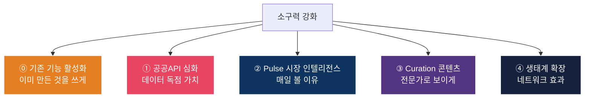

# 소구력 강화 — MECE 브레인스토밍

> **목표**: 기존 기능을 강화/확장하여 3개 세그먼트의 PoC 참가 동기와 리텐션을 높인다  
> **방법**: 4대 강화축 × 3대 세그먼트의 MECE 매트릭스

---

## MECE 프레임워크

**5대 강화축**은 사용자가 시스템에 돌아오는 이유를 상호배타적으로 분류합니다:



| 축 | 사용자 귀환 이유 | 핵심 질문 |
|----|--------------|---------|
| ⓪ 기존 기능 활성화 | "이미 만든 기능을 제대로 보여주기" | 사용자가 존재를 알고 있나? |
| ① 공공API 심화 | "여기서만 볼 수 있는 데이터" | 다른 데서 구할 수 없나? |
| ② Pulse 시장 인텔리전스 | "매일 아침 확인하는 시장 현황" | 매일 접속할 이유가 있나? |
| ③ Curation 콘텐츠 | "고객에게 보여주면 전문가로 보임" | 내 영업에 직접 쓸 수 있나? |
| ④ 생태계 확장 | "여기 안 하면 뒤처지는 느낌" | 동료/경쟁자도 쓰고 있나? |

---

## 축 ⓪: 기존 기능 활성화 — "이미 만들었는데 아무도 모른다"

> [!WARNING]
> **가장 중요한 발견:** 시스템에는 이미 **15개 AI 에이전트, ~75개 DB 테이블, 21개 공개 페이지**가
> 구축되어 있으나, PoC 소개서에는 극히 일부만 언급되어 있습니다.
> **신규 개발 없이, 기존 기능을 제대로 노출하는 것만으로 소구력이 크게 올라갑니다.**

### PoC 소개서에 빠진 핵심 기능들

| 기능 | 현재 구현 상태 | PoC 소개서 언급 | 소구력 |
|------|-------------|--------------|-------|
| **Building Radar** ("이 건물, 딜 될까?") | ✅ 완료 — `/building-radar` | ❌ 없음 | ★★★★★ |
| **Marketplace** (임대차 블라인드 검색) | ✅ 완료 — `/marketplace` | ❌ 없음 | ★★★★☆ |
| **Space AI** (Vibe Fit/Tenant Fit) | ✅ 완료 — 에이전트 4개 | ❌ 없음 | ★★★★☆ |
| **Leasing Page** (AI 자동 임대 페이지) | ✅ 완료 — `/leasing/[slug]` | ❌ 없음 | ★★★★★ |
| **Broker Profile** (AI 자동 프로필) | ✅ 완료 — `/broker-profile/[slug]` | ❌ 없음 | ★★★★☆ |
| **Owner Readiness** (건물주 셀프 진단) | ✅ 완료 — `/owner-readiness` | ❌ 없음 | ★★★★☆ |
| **Agora AI 답변** (7개 카테고리) | ✅ 완료 — `/agora` | 일부 | ★★★★☆ |
| **Pulse 5축 시그널** (8권역) | ✅ 완료 — `/pulse` | ❌ 없음 | ★★★★☆ |
| **Insight/Oiticle** (8종 콘텐츠) | ✅ 완료 — `/insight` | ❌ 없음 | ★★★★☆ |
| **Explore** (매물 탐색) | ✅ 완료 — `/explore` | ❌ 없음 | ★★★☆☆ |
| **Hub** (중앙 대시보드) | ✅ 완료 — `/hub` | ❌ 없음 | ★★★☆☆ |
| **DealCard Pipeline** (상태머신) | ✅ 완료 | 일부 | ★★★☆☆ |
| **Crowdfunding** (투자 매칭) | ✅ 완료 — DB 테이블 | ❌ 없음 | ★★★☆☆ |
| **Broker CRM** (고객/연락 관리) | ✅ 완료 — DB 테이블 | ❌ 없음 | ★★★★☆ |
| **Retrofit** (에너지 리모델링) | ✅ 완료 — API+DB | ❌ 없음 | ★★★☆☆ |

### 활성화 탑 5 (개발 비용 제로, 소구력 극대화)

#### 🥇 Z1. Building Radar → 소개서 전면 배치

```
"이 건물, 딜 될까?" — 주소만 넣으면 AI가 판단

현재 상태: 완전 구현 (/building-radar + /api/public/building-radar)
PoC 소개서: 언급 없음
필요 작업: 소개서에 추가 + PoC 온보딩 시 데모 시연

소구력:
  꼬마빌딩: ★★★★★ — "내가 보고 있는 건물, 딜 가능성을 AI가 알려준다"
  집합건물: ★★★★☆ — 구분상가/오피스텔 적용 가능
  전문직:   ★★★☆☆ — 감정평가 참고

킬러 포인트: 매물 소싱 단계에서 사용 → 딜카드 이전 단계
           = 시스템 사용의 진입점이 늘어남
```

#### 🥈 Z2. AI 자동 임대 페이지 → 상가 공실 해결 도구로 포지셔닝

```
공실 상가의 AI 마케팅 페이지 자동 생성
→ Vibe Fit (분위기 분석) + Tenant Fit (업종 적합도)
→ 캠페인 카피 자동 생성 + 리싱 페이지 퍼블리싱

현재 상태: 에이전트 4개 + /leasing/[slug] 완전 구현
PoC 소개서: 언급 없음
필요 작업: 집합건물 중개사 소개 시 전면 배치

소구력:
  꼬마빌딩: ★★★★☆ — 1층 상가 공실 해결
  집합건물: ★★★★★ — 이것이 집합건물 중개사의 핵심 소구 포인트!
  전문직:   ★★★☆☆ — 인테리어 Vendor 연결
```

#### 🥉 Z3. Pulse 5축 시그널 → "출근 시 한 번 보는 시장 대시보드"로 프레이밍

```
이미 구현된 5축 시그널 (수요/공급/가격/심리/파트너)
→ 8개 권역별 pulseScore (0-100) + AI 해석

현재 상태: 완전 구현 (/pulse + /pulse/[region]/[period])
PoC 소개서: 언급 없음
필요 작업: 소개서 + 온보딩 시 "매일 아침 이것만 보세요" 가이드

소구력:
  꼬마빌딩: ★★★★★ — 시장 동향 파악
  집합건물: ★★★★☆ — 상가 시장 포함
  전문직:   ★★★★☆ — 시장 리서치
```

#### Z4. Broker CRM + 연락 이력 → "수첩 대체" 포지셔닝

```
broker_clients + contact_history 테이블 이미 존재
→ 고객별 상담 이력 + 매물 선호 추적

현재 상태: DB 완료, UI 부분 구현
필요 작업: 간단한 CRM UI 완성 (1~2주)

소구력:
  꼬마빌딩: ★★★★☆ — 고객 관리 체계화
  집합건물: ★★★★☆ — 방문 고객 관리
  전문직:   ★★☆☆☆ — 해당 없음
```

#### Z5. Owner Readiness (건물주 셀프 진단) → 건물주 유입 채널

```
건물주가 직접 "내 건물 팔 준비가 됐을까?" 셀프 체크
→ 결과에 따라 중개사 연결 제안

현재 상태: 완전 구현 (/owner-readiness)
필요 작업: 건물주 대상 마케팅 연동

소구력:
  꼬마빌딩: ★★★★★ — 매물 소싱의 새 채널
  집합건물: ★★★☆☆ — 제한적
  전문직:   ★★★★☆ — 감정평가/세무 연결
```

---

## 축 ①: 공공API 심화 — "여기서만 볼 수 있는 데이터"

### 현재 연동 (10종 — 외부 3종 + 내부 AI 7종)

| # | 엔드포인트 | 소스 | 데이터 | 현재 활용 |
|---|----------|------|--------|--------|
| 1 | `/api/public/address` | 행안부 도로명주소 | 주소 정규화 | 딜카드 주소 입력 |
| 2 | `/api/public/building-register` | 국토부 건축물대장 | 용도/면적/층수/구조/건폐율/용적률 | 딜카드 교차검증 |
| 3 | `/api/public/transactions` | 국토부 실거래가 | 거래가/일시/면적 (서울 전역 ETL) | 가격대 검증 |
| 4 | `/api/public/building-radar` | **AI 내부** | "이 건물, 딜 될까?" 리포트 | Building Radar |
| 5 | `/api/public/market-report` | **AI 내부** | 권역별 시장 리포트 | Market Report |
| 6 | `/api/public/broker-profile` | **내부 DB** | 브로커 프로필+성과 | 프로필 페이지 |
| 7 | `/api/public/buildings/[id]/snapshot` | **내부 (G2)** | 건물 스냅샷 (게이트 필요) | 매수자 공유 |
| 8 | `/api/public/reverse-onboarding` | **내부** | 블라인드 티저 → 매수 의향 자동 생성 | 역방향 온보딩 |
| 9 | `/api/pulse/generate` | **AI + 내부** | 5축 시그널 → AI 요약 | Pulse 대시보드 |
| 10 | `/api/oiticle/generate` | **AI + 내부** | 8종 콘텐츠 자동 생성 | Insight 페이지 |

### 신규 연동 아이디어 (6종)

#### 💡 A1. 한국부동산원 임대동향 + 공실률 API

```
데이터:     권역별 상업용 부동산 공실률, 임대료 지수, 투자수익률 (분기별)
소스:       한국부동산원 부동산통계 조회 서비스 (data.go.kr)
구현 난이도: ★★☆☆☆ (REST API, 키 발급 즉시)

활용 방법:
  딜카드 생성 시 → "이 권역의 현재 공실률은 X%, 임대료 지수는 Y"
  → 매수자에게 보내는 IM에 공식 통계가 자동 포함
  → 중개사: "내가 감으로 말하는 게 아니라 공식 데이터가 나온다"

소구력 (세그먼트별):
  꼬마빌딩: ★★★★★ — 투자 판단의 핵심 지표
  집합건물: ★★★★☆ — 상가 공실률 확인
  전문직:   ★★★☆☆ — 감정평가/금융 자문 시 참고
```

#### 💡 A2. 토지이용계획확인서 API (토지e음)

```
데이터:     용도지역/지구/구역, 행위제한, 건폐율/용적률 상한
소스:       국토교통부 토지이용규제정보 서비스
구현 난이도: ★★★☆☆ (PNU 코드 필요 → 주소변환 연동)

활용 방법:
  딜카드 생성 시 → "이 토지는 제2종일반주거지역, 건폐율 60%/용적률 200%"
  → 리모델링/재건축 가능성 자동 판단
  → "용적률 소진 여부"까지 표시 → 밸류애드 투자자에게 핵심 정보

소구력:
  꼬마빌딩: ★★★★★ — 밸류애드/재건축 딜의 핵심
  집합건물: ★★★☆☆ — 구분상가 일부 적용
  전문직:   ★★★★☆ — 변호사(규제 확인), 감정평가사
```

#### 💡 A3. 등기부등본 간편 조회 연동 (대법원 인터넷등기소)

```
데이터:     소유자, 근저당, 가압류, 전세권, 지상권 등
소스:       대법원 인터넷등기소 API (제한적 제공)
구현 난이도: ★★★★★ (API 접근 제한, 유료, 법적 검토 필요)

활용 방법:
  딜카드 생성 시 → "근저당 설정 여부" 자동 확인
  → 매수자가 가장 먼저 확인하는 것 = 등기부
  → "등기부까지 한 번에" → 킬러 피처 후보

소구력:
  꼬마빌딩: ★★★★★ — 모든 거래의 첫 단계
  집합건물: ★★★★★ — 동일
  전문직:   ★★★★☆ — 법무사의 핵심 업무와 직결

⚠️ 난이도 최상 — PoC 이후 단계 추천
```

#### 💡 A4. 건물 에너지 효율 등급 API (에너지공단)

```
데이터:     건물 에너지 효율등급, 에너지 사용량
소스:       한국에너지공단 건물에너지 데이터
구현 난이도: ★★★☆☆

활용 방법:
  딜카드/건물주 리포트에 → "이 건물 에너지등급: B등급"
  → ESG 투자자/임차인에게 어필 포인트
  → 리모델링 시 에너지 효율 개선 ROI 계산 가능

소구력:
  꼬마빌딩: ★★★☆☆ — ESG 중시 투자자 대상
  집합건물: ★★☆☆☆ — 제한적
  전문직:   ★★★☆☆ — PM/FM, 인테리어 Vendor
```

#### 💡 A5. 서울시 상권분석 API (소상공인시장진흥공단)

```
데이터:     상권 유동인구, 업종별 매출, 개폐업률, 주요 업종 분포
소스:       소상공인시장진흥공단 상권정보 API
구현 난이도: ★★☆☆☆ (REST API, 잘 문서화)

활용 방법:
  상가 딜카드/임대차 매칭 시 → "이 상권 유동인구 월 X만명, F&B 매출 Y억"
  → 임차인에게: "이 상가의 상권 데이터입니다"
  → 건물주에게: "이 상권은 F&B 임차 수요가 높습니다"

소구력:
  꼬마빌딩: ★★★★☆ — 1층 상가 수익률 판단
  집합건물: ★★★★★ — 상가 공실 매칭의 핵심 데이터
  전문직:   ★★★☆☆ — 감정평가, 금융 자문
```

#### 💡 A6. 국토부 공시지가 API

```
데이터:     개별공시지가, 표준지공시지가
소스:       국토교통부 개별공시지가 서비스
구현 난이도: ★★☆☆☆

활용 방법:
  딜카드에 → "이 토지의 공시지가: ₩X/㎡, 시세 대비 Y%"
  → 양도세/취득세 계산의 기초 데이터
  → 세무사 Vendor 연계 시 자동 기초 데이터 제공

소구력:
  꼬마빌딩: ★★★★☆ — 세금 계산의 기본
  집합건물: ★★★☆☆ — 구분상가 일부
  전문직:   ★★★★★ — 세무사/감정평가사의 핵심 입력 데이터
```

### 공공API 우선순위 매트릭스

| API | 구현 난이도 | 꼬마빌딩 소구력 | 집합건물 소구력 | 전문직 소구력 | **우선순위** |
|-----|----------|------------|------------|----------|----------|
| A5. 상권분석 | ★★☆ 쉬움 | ★★★★ | ★★★★★ | ★★★ | **🥇 1순위** |
| A1. 임대동향/공실률 | ★★☆ 쉬움 | ★★★★★ | ★★★★ | ★★★ | **🥈 2순위** |
| A6. 공시지가 | ★★☆ 쉬움 | ★★★★ | ★★★ | ★★★★★ | **🥉 3순위** |
| A2. 토지이용계획 | ★★★ 중간 | ★★★★★ | ★★★ | ★★★★ | 4순위 |
| A4. 에너지효율 | ★★★ 중간 | ★★★ | ★★ | ★★★ | 5순위 |
| A3. 등기부등본 | ★★★★★ 어려움 | ★★★★★ | ★★★★★ | ★★★★ | Seed 이후 |

---

## 축 ②: Pulse 시장 인텔리전스 — "매일 아침 확인하는 시장 현황"

### 현재 Pulse 기능 (이미 구축된 5축 시스템)

| 축 | 추적 시그널 | 데이터 소스 |
|---|----------|----------|
| **수요 (Demand)** | Gate 요청 수, 매수 의향 수, S등급 매칭 수 | `activity_events`, `match_results` |
| **공급 (Supply)** | 신규 딜카드, 활성 딜카드, 신규 임대 공간 | `building_ssot_lite`, `lease_spaces` |
| **가격 (Price)** | 평균 가격 갭%, 가격 갭 변동, 저항선 | `market_leading_indicators` |
| **심리 (Sentiment)** | Agora 질문 수, 인기 카테고리, Hot 스레드 | `agora_threads` |
| **파트너 (Partner)** | 신규 서비스 카드, 리드 건수, 인기 Vendor | `service_cards`, `service_matches` |

→ 8개 권역 × pulseScore(0-100) + AI 트렌드 해석 → `cre_pulses` 테이블 저장
→ **시스템은 구축되어 있으나, 사용자가 매일 찾을 이유가 부족합니다.**
→ 아래 아이디어는 이 기반 위에 **접근성과 습관 형성**을 강화합니다.

### 신규 Pulse 아이디어 (6종)

#### 💡 B1. 실거래가 히트맵 — "이번 달 어디가 뜨거운가"

```
기능:     서울 지도 위에 최근 3개월 상업용 부동산 실거래 건수/금액을 
         히트맵으로 시각화. 권역별 전월 대비 거래량 증감 표시.
데이터:   이미 연동된 실거래가 API + 주소→좌표 변환 (연동 완료)
구현:     프론트엔드 지도 컴포넌트 + API 집계 쿼리
난이도:   ★★★☆☆

소구력:
  꼬마빌딩: ★★★★★ — "요즘 성수가 뜨겁네" → 매수자에게 공유
  집합건물: ★★★★☆ — 구분상가 거래 동향
  전문직:   ★★★★☆ — 감정평가, 금융 자문의 참고 자료

킬러 포인트: "출근하면서 히트맵 한 번 보고, 
            어디에 집중할지 결정한다" → 매일 접속 이유
```

#### 💡 B2. 권역별 가격 추이 차트 — "성수 vs 을지로 vs 합정"

```
기능:     8개 권역(GBD/YBD/CBD/성수/판교/마포/종로/홍대)별
         ㎡당 평균 거래가, 거래 건수를 시계열 차트로 표시.
         최근 6개월~2년 트렌드 + AI 코멘트.
데이터:   실거래가 API 축적 데이터
구현:     차트 라이브러리 + AI 트렌드 해석
난이도:   ★★★☆☆

소구력:
  꼬마빌딩: ★★★★★ — "매수자에게 이 차트 보여주면 설득력"
  집합건물: ★★★☆☆ — 구분상가 한정
  전문직:   ★★★★☆ — 금융/감정 자문 근거

킬러 포인트: "고객한테 시장 동향을 차트로 보여주면
            '이 중개사는 다르다'고 느낀다" → 전문가 브랜딩
```

#### 💡 B3. "오늘의 시장" AI 브리핑 — 모닝 푸시

```
기능:     매일 아침 8시, AI가 전날의 시장 변화를 3줄로 요약.
         "어제 성수권역 근생 50억대 거래 2건 체결, 
          강남 오피스 공실률 전분기 대비 0.3%p 하락"
         → 카톡/알림으로 발송
데이터:   실거래가 + 임대동향 + Agora 트렌드 종합
구현:     크론 잡 + AI 요약 + 알림 시스템
난이도:   ★★★☆☆

소구력:
  꼬마빌딩: ★★★★★ — "출근길에 이거 보면 하루가 달라진다"
  집합건물: ★★★★☆ — 상가/오피스텔 동향 포함 시
  전문직:   ★★★★☆ — 고객 상담 전 시장 현황 파악

킬러 포인트: "매일 아침 알림 → 습관 형성 → DAU 극대화"
            이것이 리텐션의 핵심 엔진
```

#### 💡 B4. 딜카드 기반 시장 감성 지수

```
기능:     시스템 내 딜카드 생성 건수, 매수 의향 등록 건수,
         매칭 요청 건수를 종합하여 "시장 체감 온도" 표시.
         "이번 주 성수: 🔥🔥🔥 (딜카드 12건, 매수 의향 8건)"
데이터:   내부 데이터 (외부 API 불필요)
구현:     집계 쿼리 + UI 컴포넌트
난이도:   ★★☆☆☆

소구력:
  꼬마빌딩: ★★★★☆ — "시장이 살아나고 있네"
  집합건물: ★★★☆☆ — 참고 수준
  전문직:   ★★★☆☆ — 시장 감각 유지

킬러 포인트: 사용자가 많아질수록 데이터가 정확해짐
            → 네트워크 효과 → 경쟁자 진입 장벽
```

#### 💡 B5. 건물주 매도 시그널 감지

```
기능:     공공데이터에서 "매도 의지"를 추론할 수 있는 시그널 감지:
         - 근저당 변동 (등기부 변경)
         - 건축물 용도 변경 신청
         - 인근 매물 급매 등록
         - 세금 체납 공매 정보
         → "이 건물주가 팔 가능성이 높습니다" 알림
데이터:   등기부(향후)+건축물대장+실거래가 종합
구현:     매우 복잡 — 데이터 파이프라인 + ML
난이도:   ★★★★★

소구력:
  꼬마빌딩: ★★★★★ — "매물 소싱의 성배"
  집합건물: ★★★☆☆ — 제한적
  전문직:   ★★★☆☆ — 간접 활용

⚠️ 장기 비전 — Series A 이후
```

#### 💡 B6. 주간 권역 리포트 — 인쇄/공유 가능

```
기능:     매주 월요일, 각 권역의 1주간 동향을 PDF/이미지로 자동 생성.
         "성수 주간 리포트 — 2026.06.1주차"
         → 거래 건수/가격대/신규 매물/공실 변동
         → 중개사가 고객에게 카톡으로 바로 전달 가능
데이터:   실거래가 + 딜카드 + Agora 종합
구현:     PDF 생성 + 자동 발송
난이도:   ★★★☆☆

소구력:
  꼬마빌딩: ★★★★★ — "이걸 매수자한테 보내면 전문가로 보인다"
  집합건물: ★★★★☆ — 상가 동향 포함 시
  전문직:   ★★★★★ — 감정평가/금융 자문 시 첨부 자료

킬러 포인트: 중개사가 "직접 만든 것처럼" 고객에게 보낼 수 있음
            → 전문가 브랜딩 → 거래 성사율 ↑
```

### Pulse 우선순위

| 기능 | 난이도 | 꼬마빌딩 | 집합건물 | 전문직 | **우선순위** |
|------|--------|--------|--------|-------|----------|
| B3. 모닝 브리핑 | ★★★ | ★★★★★ | ★★★★ | ★★★★ | **🥇 Quick Win** |
| B6. 주간 리포트 PDF | ★★★ | ★★★★★ | ★★★★ | ★★★★★ | **🥈 Quick Win** |
| B1. 실거래 히트맵 | ★★★ | ★★★★★ | ★★★★ | ★★★★ | **🥉 Medium** |
| B4. 시장 감성 지수 | ★★ | ★★★★ | ★★★ | ★★★ | 4순위 |
| B2. 가격 추이 차트 | ★★★ | ★★★★★ | ★★★ | ★★★★ | 5순위 |
| B5. 매도 시그널 | ★★★★★ | ★★★★★ | ★★★ | ★★★ | 장기 비전 |

---

## 축 ③: Curation 콘텐츠 — "고객에게 보여주면 전문가로 보인다"

### 신규 Curation 아이디어 (6종)

#### 💡 C1. "요즘 뜨는 권역" 특집 — AI 자동 생성

```
기능:     월 2회, AI가 실거래 데이터+트렌드를 분석하여
         "이번 달 성수 권역 — 왜 거래가 늘고 있나"
         형태의 미니 리포트 자동 생성.
         → 중개사가 고객에게 "이거 보셨어요?"로 공유

난이도:   ★★☆☆☆ (AI 생성 + 편집 자동화)
소구력:   꼬마빌딩 ★★★★★ | 집합건물 ★★★☆☆ | 전문직 ★★★★☆
```

#### 💡 C2. 세무/법률 실무 팁 — Agora 인기 답변 큐레이션

```
기능:     Agora에서 조회수/좋아요 높은 질문+답변을
         "이번 주 베스트 Q&A" 형태로 자동 큐레이션.
         "꼬마빌딩 양도세 비과세 요건 총정리"
         → 카드 뉴스 형태로 공유 가능

난이도:   ★★☆☆☆
소구력:   꼬마빌딩 ★★★★☆ | 집합건물 ★★★★★ | 전문직 ★★★★★
```

#### 💡 C3. 딜카드 쇼케이스 — "이런 딜이 있었습니다" (익명화)

```
기능:     실제 생성된 딜카드를 완전 익명화하여
         "성수 80억대 근생 → 3주 만에 매수자 매칭 성공" 
         형태의 성공 사례 발행.
         → PoC 참여 동기 강화 + 신규 사용자 유입

난이도:   ★★☆☆☆
소구력:   꼬마빌딩 ★★★★★ | 집합건물 ★★★★☆ | 전문직 ★★★☆☆
```

#### 💡 C4. 건물 상태 진단 체크리스트 — AI 인터랙티브

```
기능:     매수 전 건물 실사(Due Diligence) 체크리스트를
         AI가 대화형으로 안내. "방수 상태는?" → "확인 필요"
         → 체크 완료 후 PDF 리포트 자동 생성
         → 전문가(PM/FM Vendor)에게 견적 요청 연동

난이도:   ★★★☆☆
소구력:   꼬마빌딩 ★★★★☆ | 집합건물 ★★★☆☆ | 전문직 ★★★★★
```

#### 💡 C5. 세금 시뮬레이터 — "이 건물 사면 세금이 얼마?"

```
기능:     매수가/보유 기간/법인 여부 입력 →
         취득세/양도세/종부세 자동 계산 (공시지가 API 연동).
         → "법인으로 사면 ₩X, 개인이면 ₩Y" 비교 표시
         → 세무사 Vendor 자동 연결

난이도:   ★★★☆☆ (세무 로직 복잡)
소구력:   꼬마빌딩 ★★★★★ | 집합건물 ★★★★☆ | 전문직 ★★★★★
```

#### 💡 C6. "내 딜카드 성과 리포트" — 월간 중개사 개인 리포트

```
기능:     매월 말, 중개사 개인의 활동 요약 자동 생성.
         "이번 달: 딜카드 8건, 매칭 12건, 게이트 요청 3건"
         → 시각적 그래프 + 전월 대비 성장률
         → "올해 목표까지 X건 남았습니다" 게이미피케이션

난이도:   ★★☆☆☆
소구력:   꼬마빌딩 ★★★★☆ | 집합건물 ★★★☆☆ | 전문직 ★★☆☆☆
```

---

## 축 ④: 생태계 확장 — "여기 안 하면 뒤처진다"

### 신규 생태계 아이디어 (6종)

#### 💡 D1. 중개사 간 공동중개(Co-Brokerage) 매칭

```
기능:     "나는 매물이 있는데 매수자가 없다"
         ↔ "나는 매수자가 있는데 매물이 없다"
         → AI가 자동 매칭 → 공동중개 제안
         → 수수료 50:50 자동 정산

난이도:   ★★★★☆
소구력:   꼬마빌딩 ★★★★★ | 집합건물 ★★★★☆ | 전문직 ★★☆☆☆
```

#### 💡 D2. 매수자 공개 위시리스트 — "이런 건물 찾습니다"

```
기능:     매수자가 직접 위시리스트 등록:
         "성수/합정 50~80억 근생, 주차 5대+"
         → 매물을 가진 중개사가 자동 알림 수신
         → 닭-달걀 문제의 역방향 해결

난이도:   ★★★☆☆
소구력:   꼬마빌딩 ★★★★★ | 집합건물 ★★★★☆ | 전문직 ★★★☆☆
```

#### 💡 D3. Vendor 리뷰 시스템 — "이 법무사 평점 4.8"

```
기능:     거래 완료 후 Vendor에 대한 리뷰/평점.
         → 높은 평점 Vendor = 우선 추천
         → Vendor의 참여 동기 극대화

난이도:   ★★☆☆☆
소구력:   꼬마빌딩 ★★★☆☆ | 집합건물 ★★★☆☆ | 전문직 ★★★★★
```

#### 💡 D4. "건물주 전용" 포탈 — 자산 관리 대시보드

```
기능:     건물주가 직접 가입하여 자기 건물의
         시세/공실/에너지/관리비를 모니터링.
         → 매도 의향 표시 → 중개사에게 자동 알림
         → 건물주 → 중개사 → 매수자 순환 생태계

난이도:   ★★★★☆
소구력:   꼬마빌딩 ★★★★★ | 집합건물 ★★★☆☆ | 전문직 ★★★★☆

⚠️ 시장 확장형 — Seed 이후
```

#### 💡 D5. 카카오톡 채널 연동 — 딜카드 자동 발송

```
기능:     딜카드 생성 → 카카오톡 채널로 자동 포스팅
         → 매수 후보에게 알림톡 자동 발송
         → "카톡 복사 → 붙여넣기" 단계조차 제거

난이도:   ★★★☆☆ (카카오 비즈니스 API)
소구력:   꼬마빌딩 ★★★★★ | 집합건물 ★★★★☆ | 전문직 ★★☆☆☆
```

#### 💡 D6. 중개사 AI 명함/프로필 페이지

```
기능:     중개사의 전문 분야, 거래 실적(익명화), 전문 권역을
         AI가 자동 생성한 프로필 페이지로 표시.
         → "용산 꼬마빌딩 전문 | 거래 실적 X건"
         → 고객이 중개사를 선택하는 기준 제공
         → SEO로 검색 유입

난이도:   ★★☆☆☆
소구력:   꼬마빌딩 ★★★★☆ | 집합건물 ★★★★☆ | 전문직 ★★★☆☆
```

---

## 종합 — Quick Win 로드맵

### 🔴 PoC 전 2주 (즉시 구현)

| # | 기능 | 축 | 난이도 | 최대 소구력 |
|---|------|---|--------|----------|
| 1 | **B3. 모닝 브리핑** | Pulse | ★★★ | ★★★★★ |
| 2 | **B4. 시장 감성 지수** | Pulse | ★★ | ★★★★ |
| 3 | **C6. 월간 개인 리포트** | Curation | ★★ | ★★★★ |
| 4 | **D6. AI 명함/프로필** | 생태계 | ★★ | ★★★★ |

### 🟡 PoC 중 1~3개월

| # | 기능 | 축 | 난이도 | 최대 소구력 |
|---|------|---|--------|----------|
| 5 | **A5. 상권분석 API** | 공공API | ★★ | ★★★★★ |
| 6 | **A1. 임대동향/공실률** | 공공API | ★★ | ★★★★★ |
| 7 | **B6. 주간 권역 리포트** | Pulse | ★★★ | ★★★★★ |
| 8 | **B1. 실거래 히트맵** | Pulse | ★★★ | ★★★★★ |
| 9 | **C5. 세금 시뮬레이터** | Curation | ★★★ | ★★★★★ |
| 10 | **D5. 카톡 채널 연동** | 생태계 | ★★★ | ★★★★★ |

### 🟢 Seed 이후

| # | 기능 | 축 | 난이도 |
|---|------|---|--------|
| 11 | A2. 토지이용계획 | 공공API | ★★★ |
| 12 | A6. 공시지가 | 공공API | ★★ |
| 13 | D1. 공동중개 매칭 | 생태계 | ★★★★ |
| 14 | D2. 매수자 위시리스트 | 생태계 | ★★★ |
| 15 | D4. 건물주 포탈 | 생태계 | ★★★★ |

### 🔵 Series A 이후

| # | 기능 | 축 | 난이도 |
|---|------|---|--------|
| 16 | A3. 등기부 연동 | 공공API | ★★★★★ |
| 17 | B5. 매도 시그널 감지 | Pulse | ★★★★★ |

---

## 핵심 요약

> [!IMPORTANT]
> ### 소구력 극대화 공식
>
> **매일 돌아오는 이유** = Pulse 모닝 브리핑  
> **매번 쓸 때마다 가치** = 공공API 자동 연동 (상권+공실률+공시지가)  
> **고객에게 보여줄 것** = 주간 리포트 + 세금 시뮬레이터  
> **떠나기 어려운 이유** = 카톡 연동 + 공동중개 네트워크  
>
> 4개 축이 **모두** 작동해야 리텐션이 만들어집니다.  
> 하나만 강해서는 "가끔 유용한 도구"에 머뭅니다.
