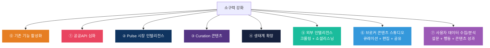

# 소구력 강화 확장판 — 8대 축 MECE 브레인스토밍

> **이 문서는 기존 5대 축(⓪~④) 위에 3개 신규 축(⑤~⑦)을 추가한 확장판입니다.**  
> 기존 축 ⓪~④는 [feature_brainstorm.md](file:///C:/Users/User/.gemini/antigravity/brain/d2d6a4d0-e3e7-407c-97de-4a471780cf82/feature_brainstorm.md) 참조

---

## 전체 프레임워크 — 8대 강화축



| 축 | 사용자 귀환 이유 | 데이터 방향 |
|----|--------------|----------|
| ⓪ 기존 기능 활성화 | "이미 만든 것을 쓰게" | — |
| ① 공공API 심화 | "여기서만 볼 수 있는 데이터" | 외부 → 시스템 |
| ② Pulse 인텔리전스 | "매일 아침 확인" | 내부 → 사용자 |
| ③ Curation 콘텐츠 | "전문가로 보이게" | 시스템 → 고객 |
| ④ 생태계 확장 | "뒤처지는 느낌" | 사용자 ↔ 사용자 |
| **⑤ 외부 인텔리전스** | **"시장을 제일 먼저 안다"** | **외부(웹/소셜) → 시스템** |
| **⑥ 브로커 콘텐츠 스튜디오** | **"내 이름으로 전문가 콘텐츠 보낸다"** | **시스템 → 브로커 편집 → 고객** |
| **⑦ 사용자 데이터 수집/분석** | **"고객이 뭘 원하는지 데이터로 안다"** | **고객/사용자 → 시스템 → 인사이트** |

---

## 축 ⑤: 외부 인텔리전스 — 크롤링 + 소셜리스닝

### 왜 필요한가

```
현재 시스템의 데이터 소스:
  ✅ 공공API (건축물대장, 실거래가, 도로명주소)
  ✅ 내부 데이터 (딜카드, 매칭, Agora)
  ❌ 시장 뉴스/리서치 보고서
  ❌ 소셜 미디어 버즈 (네이버 카페, 블로그, 유튜브)
  ❌ 전문기관 리포트 (CBRE, 쿠시먼, NAI코리아)

→ 중개사가 "시장이 어떻게 돌아가나" 알려면 여전히 
  네이버 검색 + 유튜브 + 카페를 따로 봐야 함
→ 이것을 시스템이 자동으로 수집/요약하면 매일 접속 이유가 됨
```

### 아이디어 7종

#### 💡 E1. 썸트렌드(SomeTrend) 소셜리스닝 연동

```
기능:     CRE 핵심 키워드의 소셜 버즈 추적
         "꼬마빌딩" "성수 상가" "강남 오피스" "근생 투자"
         → 일별 언급량 추이 + 연관 키워드 + 감성 분석
         → Pulse 대시보드의 "심리(Sentiment)" 축 강화

연동:     썸트렌드 Data+ API (HTTP/HTTPS)
         또는 MCP 연동 (AI 에이전트 직접 호출)
비용:     월 ~₩75만~₩800만 (호출량 기반)
         → PoC: MCP 크레딧 기반 소량 시작 (₩10~30만/월)
난이도:   ★★★☆☆

활용 — Pulse 시그널 강화:
  현재: 5축 중 "심리" 축은 Agora 데이터만 사용
  강화: 소셜 버즈 데이터 추가 → 시장 심리 정확도 ↑

  "이번 주 '성수 꼬마빌딩' 소셜 언급량 +45%,
   '상가 공실' 부정 감성 비중 30%→22%로 개선"

소구력:
  꼬마빌딩: ★★★★★ — "시장 분위기를 수치로 안다"
  집합건물: ★★★★☆ — "오피스텔 시세" 등 키워드 추적
  전문직:   ★★★★☆ — 리서치 자료로 활용
```

#### 💡 E2. CRE 뉴스 자동 수집 + AI 요약 (크롤링)

```
기능:     부동산 전문 매체를 일 1회 크롤링 → AI 요약
         → "오늘의 CRE 뉴스 3선" 자동 생성

크롤링 대상:
  - 한경 집코노미 (부동산 섹션)
  - 매경 부동산 센터
  - 조선비즈 부동산
  - 이데일리 부동산
  - KB부동산 리포트
  - 디비리츠(DBRITZ)

구현:     Node.js 크롤러 (RSS/HTML) + AI 요약
         → cre_oiticles 테이블에 자동 저장
         → /insight 페이지에 "오늘의 뉴스" 섹션 추가
난이도:   ★★★☆☆
법적:     RSS/공개 기사 요약 → robots.txt 준수 + 출처 명시

소구력:
  꼬마빌딩: ★★★★★ — "출근하면 이것부터 본다"
  집합건물: ★★★★☆ — 관련 뉴스 포함 시
  전문직:   ★★★★★ — 고객 상담 전 최신 이슈 파악
```

#### 💡 E3. CBRE/쿠시먼 분기 보고서 자동 추출 + 딜카드 연동

```
기능:     글로벌 자문사의 분기 리포트를 자동 수집
         → 핵심 수치(공실률, 임대료, Cap Rate) 추출
         → 딜카드/IM에 "CBRE 2026 Q2 기준: 
            서울 오피스 공실률 7.2%" 자동 삽입

대상:
  - CBRE Korea: Seoul Figures (분기)
  - 쿠시먼: MarketBeat (분기)
  - NAI Korea: 마켓 리포트 (반기)

구현:     PDF 다운로드 → AI 구조화 → price_features 테이블
난이도:   ★★★★☆ (PDF 파싱 복잡)

소구력:
  꼬마빌딩: ★★★★★ — "IM에 CBRE 데이터가 자동으로!"
  집합건물: ★★★☆☆ — 오피스 한정
  전문직:   ★★★★★ — 감정평가/금융의 핵심 참고자료
```

#### 💡 E4. 네이버 부동산 카페 감성 분석

```
기능:     네이버 부동산 카페(부동산스터디 등)의 
         인기 글 키워드 + 감성 추적
         → "이번 주 카페에서 '급매' 언급 +120%"
         → 시장 불안/호황 심리 선행지표

구현:     네이버 검색 API + 감성 분류 AI
난이도:   ★★★☆☆
법적:     네이버 API 활용 (크롤링 아닌 API)

소구력:
  꼬마빌딩: ★★★★☆ — 시장 심리 선행 파악
  집합건물: ★★★★☆ — 아파트/오피스텔 관련 풍부
  전문직:   ★★★☆☆ — 참고 수준
```

#### 💡 E5. 유튜브 CRE 크리에이터 트렌드 추적

```
기능:     CRE 전문 유튜버의 최신 영상 주제를 자동 추적
         "이번 주 부동산 유튜브 인기 토픽: 
          성수 리모델링 투자, 강남 오피스 공실"
         → 투자자/매수자가 뭘 궁금해하는지 선행 파악

구현:     YouTube Data API v3 (무료 할당량)
난이도:   ★★☆☆☆

소구력:
  꼬마빌딩: ★★★★☆ — 매수자 관심사 파악
  집합건물: ★★★☆☆ — 제한적
  전문직:   ★★★☆☆ — 참고 수준
```

#### 💡 E6. 경매/공매 정보 자동 수집

```
기능:     대법원 경매정보 + 캠코 공매 → 자동 수집
         → 인근 경/공매 건이 있으면 딜카드에 
           "주의: 인근 유사 물건 공매 진행 중" 표시
         → 또는 "기회: 인근 경매 낙찰가 → 시세 참고"

구현:     공개 사이트 크롤링 + 주소 매칭
난이도:   ★★★☆☆

소구력:
  꼬마빌딩: ★★★★★ — 경매 시세는 핵심 참고 지표
  집합건물: ★★★★☆ — 구분상가 경매 빈번
  전문직:   ★★★★☆ — 변호사/법무사 업무 직결
```

#### 💡 E7. 상업지역 임대 시세 크롤링 (네이버부동산/직방)

```
기능:     네이버부동산/직방의 상가 임대 호가를 주기적 수집
         → 권역별 평균 임대료 추이 → Pulse에 통합
         → "이 상권의 현재 호가: ₩X/㎡ (전월 대비 +Y%)"

구현:     네이버부동산 API(비공식) 또는 화면 파싱
난이도:   ★★★★☆ (비공식 API → 안정성 이슈)
법적:     robots.txt 준수 필요

소구력:
  꼬마빌딩: ★★★★★ — 수익률 계산의 핵심
  집합건물: ★★★★★ — 상가 임대 시세 파악
  전문직:   ★★★★☆ — 감정평가 참고
```

### 외부 인텔리전스 우선순위

| 기능 | 난이도 | 비용 | 꼬마빌딩 | 집합건물 | 전문직 | **우선순위** |
|------|--------|------|--------|--------|-------|----------|
| E2. CRE 뉴스 AI 요약 | ★★★ | ₩0 | ★★★★★ | ★★★★ | ★★★★★ | **🥇 Quick Win** |
| E5. 유튜브 트렌드 | ★★ | ₩0 | ★★★★ | ★★★ | ★★★ | **🥈 Quick Win** |
| E6. 경매/공매 수집 | ★★★ | ₩0 | ★★★★★ | ★★★★ | ★★★★ | **🥉 PoC 중** |
| E1. 썸트렌드 연동 | ★★★ | ~₩30만/월 | ★★★★★ | ★★★★ | ★★★★ | PoC 중 |
| E4. 카페 감성 분석 | ★★★ | ₩0 | ★★★★ | ★★★★ | ★★★ | PoC 중 |
| E7. 임대 시세 크롤링 | ★★★★ | ₩0 | ★★★★★ | ★★★★★ | ★★★★ | Seed 후 |
| E3. CBRE 보고서 추출 | ★★★★ | ₩0 | ★★★★★ | ★★★ | ★★★★★ | Seed 후 |

---

## 축 ⑥: 브로커 콘텐츠 스튜디오 — 큐레이션 + 편집 + 공유 + 트래킹

### 핵심 개념

```
현재 플로우:
  시스템이 콘텐츠 생성 → 브로커가 "복사" → 카톡에 "붙여넣기"
                         (편집 불가)      (추적 불가)

개선 플로우:
  시스템이 콘텐츠 생성 → 브로커가 "편집/큐레이션"
  → "내 이름으로 발송" → 고객 열람 추적 → 관심도 스코어링
  → 재방문 / 후속 콘텐츠 자동 추천
```

### 아이디어 6종

#### 💡 F1. 콘텐츠 큐레이션 대시보드 — "내 뉴스레터 만들기"

```
기능:     시스템이 생성한 콘텐츠를 드래그&드롭으로 큐레이션
         
         왼쪽 패널: 콘텐츠 라이브러리
         ├── 📊 이번 주 성수 리포트 (Pulse)
         ├── 📰 오늘의 CRE 뉴스 3선
         ├── 🏢 신규 딜카드 3건 (블라인드)
         ├── 📋 꼬마빌딩 양도세 Q&A (Agora 인기)
         └── 💡 "이 건물, 딜 될까?" 결과 (Building Radar)
         
         오른쪽 패널: 나만의 뉴스레터 편집기
         → 콘텐츠 선택 + 순서 편집 + 코멘트 추가
         → "김대표님께 — 이번 주 성수 동향입니다"

난이도:   ★★★☆☆
소구력:
  꼬마빌딩: ★★★★★ — "내 이름으로 전문가 뉴스레터를 보낸다"
  집합건물: ★★★★☆ — 상가 관련 콘텐츠 선별
  전문직:   ★★★★★ — 고객 관계 관리 + 브랜딩

킬러 포인트: 
  "AI가 만든 걸 그대로 보내면 내 것이 아님.
   내가 편집하고 코멘트를 달면 → 내 전문성이 된다."
```

#### 💡 F2. 카카오톡/이메일 발송 + 열람 추적

```
기능:     큐레이션한 콘텐츠를 발송 채널별로 전달
         
         📱 카카오 알림톡 → 고객에게 자동 발송
         📧 이메일 → HTML 뉴스레터 형태
         🔗 공유 링크 → 고유 URL 생성 (트래킹 포함)

         추적 데이터:
         ├── 열람 여부 (open rate)
         ├── 클릭한 콘텐츠 (어떤 딜카드를 봤는지)
         ├── 체류 시간 (얼마나 오래 봤는지)
         └── 재방문 여부

난이도:   ★★★★☆ (카카오 비즈니스 API + 이메일 서비스)
소구력:
  꼬마빌딩: ★★★★★ — "이 매수자가 내 딜카드를 3번 봤다"
  집합건물: ★★★★☆ — 임차인 관심도 추적
  전문직:   ★★★★☆ — 상담 후 자료 발송 추적

킬러 포인트:
  "매수자가 블라인드 딜카드를 5번 열어봤다
   → '관심이 있구나' → 전화 타이밍 포착"
```

#### 💡 F3. 고객 관심도 스코어링 (Lead Scoring)

```
기능:     콘텐츠 열람 데이터 + CRM 데이터를 종합하여
         각 고객의 "관심도 점수"를 자동 계산
         
         점수 구성:
         ├── 딜카드 열람 횟수 × 3점
         ├── 뉴스레터 오픈 × 1점
         ├── Gate 요청 (상세 정보 요청) × 10점
         ├── 전화 상담 이력 × 5점
         └── 최근 접촉일 기준 감점 (7일마다 -2점)

         → "🔥 김투자 (78점) — 성수 50억대 관심"
         → "❄️ 박대표 (12점) — 3주째 무반응"

난이도:   ★★★☆☆
소구력:
  꼬마빌딩: ★★★★★ — "누구한테 먼저 전화할지 안다"
  집합건물: ★★★★☆ — 임차인 우선순위 파악
  전문직:   ★★★★☆ — Vendor 리드 우선순위

킬러 포인트:
  "감으로 전화하지 말고, 점수 순으로 전화하세요."
```

#### 💡 F4. 딜카드 공유 페이지 — 화이트라벨

```
기능:     딜카드를 "내 브랜드"로 포장한 공유 페이지 생성
         
         dealcard.kr/share/김중개사/성수-근생-80억
         → 브로커 프로필 + 딜카드 + 문의 버튼
         → 매수자가 "이 중개사는 전문적이네" 느낌

         이 페이지에서:
         ├── 딜카드 상세 열람
         ├── 모바일 IM 다운로드
         ├── Gate 요청 (상세 정보 신청)
         └── 1:1 문의 (카톡/전화)

난이도:   ★★★☆☆
소구력:
  꼬마빌딩: ★★★★★ — 전문가 브랜딩의 완성
  집합건물: ★★★★☆ — 구분상가 한정
  전문직:   ★★★☆☆ — 간접 활용
```

#### 💡 F5. 콘텐츠 성과 대시보드 — "내 콘텐츠 ROI"

```
기능:     발송한 콘텐츠의 성과를 한눈에 표시
         
         이번 주 성과:
         ├── 발송 12건 → 열람 8건 (66%)
         ├── 딜카드 클릭 5건
         ├── Gate 요청 2건
         └── 추정 전환 매출: ₩X (거래 중개료 기준)

         베스트 콘텐츠: "성수 주간 리포트" (열람률 89%)
         워스트 콘텐츠: "세무 팁" (열람률 12%)
         → "시세 데이터가 들어간 콘텐츠가 반응이 좋습니다"

난이도:   ★★★☆☆
소구력:
  꼬마빌딩: ★★★★☆ — 영업 성과 가시화
  집합건물: ★★★☆☆ — 활용도 낮을 수 있음
  전문직:   ★★★★★ — Vendor 마케팅 ROI 측정
```

#### 💡 F6. AI 코멘트 어시스턴트 — "내 말투로 코멘트 달기"

```
기능:     큐레이션 시 브로커가 한 줄 코멘트를 달면
         AI가 브로커의 말투를 학습하여 확장
         
         브로커 입력: "성수 요즘 뜨겁습니다"
         AI 확장: "성수 권역 6월 거래 건수가 전월 대비 
                  +30% 증가했습니다. 특히 50~80억대 
                  근생 건물에 매수 문의가 집중되고 있어,
                  관심 있으신 분은 빠른 검토를 권합니다."
         → 브로커가 수정/승인 → 발송

난이도:   ★★★☆☆
소구력:
  꼬마빌딩: ★★★★★ — "AI가 쓴 티 안 나는 전문 코멘트"
  집합건물: ★★★★☆ — 동일
  전문직:   ★★★★☆ — Agora 답변에도 활용
```

### 콘텐츠 스튜디오 우선순위

| 기능 | 난이도 | 꼬마빌딩 | 집합건물 | 전문직 | **우선순위** |
|------|--------|--------|--------|-------|----------|
| F1. 큐레이션 대시보드 | ★★★ | ★★★★★ | ★★★★ | ★★★★★ | **🥇 핵심 MVP** |
| F6. AI 코멘트 어시스턴트 | ★★★ | ★★★★★ | ★★★★ | ★★★★ | **🥈 핵심 MVP** |
| F4. 화이트라벨 공유 페이지 | ★★★ | ★★★★★ | ★★★★ | ★★★ | **🥉 PoC 중** |
| F2. 발송 + 열람 추적 | ★★★★ | ★★★★★ | ★★★★ | ★★★★ | PoC 중 |
| F3. 관심도 스코어링 | ★★★ | ★★★★★ | ★★★★ | ★★★★ | PoC 중 |
| F5. 성과 대시보드 | ★★★ | ★★★★ | ★★★ | ★★★★★ | Seed 후 |

---

## 축 ⑦: 사용자 데이터 수집/분석 — 설문 + 행동 + 콘텐츠 성과

### 핵심 개념

```
현재: 사용자가 시스템을 "쓰기만" 함 → 데이터가 시스템에 남지 않음
목표: 모든 사용 행위가 데이터로 축적 → 인사이트로 환원

3대 데이터 파이프라인:
  ① 설문 데이터 — 사용자의 "말"  (명시적)
  ② 행동 데이터 — 사용자의 "행동" (암묵적)
  ③ 콘텐츠 성과 — 고객의 "반응"  (외부)
```

### 아이디어 7종

#### 💡 G1. PoC 참여자 설문 시스템 (3단계)

```
기능:     PoC 기간 중 3회 설문 자동 실시
         
         📋 온보딩 설문 (가입 직후):
         ├── 현재 주력 거래 유형
         ├── 월 평균 딜카드/매물장 작성 건수
         ├── 가장 시간 많이 쓰는 업무
         └── 기대하는 기능 1순위

         📋 중간 설문 (6주차):
         ├── NPS (0~10점)
         ├── 가장 유용한 기능 (복수 선택)
         ├── 아쉬운 점 / 개선 요청
         └── 동료에게 추천하겠는가?

         📋 종료 설문 (12주차):
         ├── NPS (0~10점)
         ├── 유료 전환 의향 (₩X만/월이면?)
         ├── 가장 높은 가치를 느낀 기능
         └── 유료화 시 반드시 필요한 기능

구현:     시스템 내 설문 UI + Supabase 저장
         → 인앱 팝업 (강제성 부여)
난이도:   ★★☆☆☆

킬러 포인트:
  PoC 종료 시 "NPS 45, 유료 전환 의향 65%" 
  → 투자 유치 시 핵심 트랙션 데이터
```

#### 💡 G2. 행동 분석 퍼널 — 딜카드 → 공유 → Gate → 거래

```
기능:     모든 사용자 행동을 activity_events에 자동 기록
         → 전환 퍼널 분석

         퍼널 단계:
         1. 로그인
         2. 딜카드 생성 (메모 입력)
         3. 딜카드 열람 (결과 확인)
         4. 콘텐츠 공유 (카톡/이메일/링크)
         5. 매수자 열람 (공유 링크 오픈)
         6. Gate 요청 (상세 정보 신청)
         7. 매칭 성사
         8. 거래 체결

         이탈 지점:
         "딜카드 생성 → 공유" 전환율 40% 
         → 공유 UX를 개선하면 효과 극대화

구현:     activity_events 테이블 (이미 존재) 활용
         + 집계 대시보드 (관리자용)
난이도:   ★★★☆☆

킬러 포인트:
  "어디서 사용자가 이탈하는가" → 제품 개선의 나침반
  투자자에게: "공유→열람 전환율 72%"는 강력한 숫자
```

#### 💡 G3. 기능별 사용 빈도 히트맵

```
기능:     각 기능의 사용 빈도를 히트맵으로 시각화
         
         🔥🔥🔥🔥🔥 딜카드 생성
         🔥🔥🔥🔥   건축물대장 조회
         🔥🔥🔥     카톡 복사
         🔥🔥       모바일 IM
         🔥         매수자 매칭
         ❄️         Full IM Studio
         ❄️         건물주 리포트

         → 🔥 = 소구력 높음 (유료화 대상)
         → ❄️ = 소구력 낮음 (제거 또는 개선 대상)

구현:     activity_events 집계 + 관리자 대시보드
난이도:   ★★☆☆☆
```

#### 💡 G4. 콘텐츠 A/B 테스트 프레임워크

```
기능:     동일 콘텐츠를 2가지 버전으로 생성
         → 랜덤 배분 → 열람/클릭/전환률 비교
         
         예: 주간 리포트 제목
         A: "성수 권역 6월 1주차 동향"
         B: "🔥 성수 거래 +30%! 지금 놓치면..."
         → B가 열람률 2.3배 → B 스타일 표준화

구현:     variant 플래그 + 성과 추적
난이도:   ★★★☆☆
```

#### 💡 G5. 고객 반응 데이터 → CRM 자동 연동

```
기능:     콘텐츠 열람 데이터를 broker_clients에 자동 반영
         
         "김투자님이 성수 딜카드를 3회 열람"
         → CRM에 자동 기록
         → 다음 연락 시 "성수 관심 있으시다고요?" 가능
         → 고객별 관심 매물 유형 자동 태깅

구현:     공유 추적 이벤트 → broker_clients 업데이트
난이도:   ★★★☆☆

소구력:
  꼬마빌딩: ★★★★★ — "고객이 뭘 봤는지 내가 안다"
  집합건물: ★★★★☆ — 임차인 관심 파악
  전문직:   ★★★☆☆ — 간접 활용
```

#### 💡 G6. 주간 PoC 인사이트 리포트 (관리자용)

```
기능:     PoC 운영팀에게 매주 자동 생성되는 리포트
         
         📊 이번 주 PoC 리포트:
         ├── DAU/WAU/MAU 추이
         ├── 딜카드 생성 건수 (누적/주간)
         ├── 기능별 사용 빈도 순위
         ├── 설문 NPS 추이
         ├── 이탈 위험 사용자 (7일+ 미접속)
         ├── 파워 유저 (상위 20%)
         └── 다음 주 액션 추천 (AI)

구현:     크론 잡 + AI 요약 + 이메일/카톡 발송
난이도:   ★★★☆☆

킬러 포인트:
  투자자 미팅 시: "주간 데이터 12주치가 있습니다"
  → PoC의 모든 것이 정량화된 데이터
```

#### 💡 G7. 시장 체감 설문 — 중개사 경기 체감 지수

```
기능:     주 1회, 중개사에게 3문항 초간단 설문 (10초)
         
         Q1. 이번 주 문의 건수는? (많다/보통/적다)
         Q2. 매수자 심리는? (적극/관망/위축)
         Q3. 3개월 후 시장은? (상승/보합/하락)

         → 집계하여 "DealCard 경기 체감 지수" 생성
         → Pulse에 표시: "현장 중개사 75%가 '상승' 전망"
         → 이것은 어디에서도 구할 수 없는 독자 데이터

구현:     인앱 위젯 (토스트 형태) + 집계
난이도:   ★★☆☆☆

소구력:
  꼬마빌딩: ★★★★★ — "내 동료들은 어떻게 보고 있나"
  집합건물: ★★★★☆ — 동일
  전문직:   ★★★★★ — 이 데이터를 외부에 팔 수 있음(!)

킬러 포인트:
  "썸트렌드로는 소셜 심리를 알 수 있지만,
   현장 중개사의 체감은 여기서만 알 수 있다."
  → 독자 데이터 = 경쟁 불가능한 해자(Moat)
```

### 데이터 수집 우선순위

| 기능 | 난이도 | 데이터 가치 | 투자 유치 활용 | **우선순위** |
|------|--------|----------|------------|----------|
| G1. 3단계 설문 | ★★ | ★★★★★ | ★★★★★ | **🥇 PoC 전 필수** |
| G7. 체감 지수 설문 | ★★ | ★★★★★ | ★★★★★ | **🥈 PoC 1주차** |
| G2. 행동 퍼널 | ★★★ | ★★★★★ | ★★★★★ | **🥉 PoC 전 필수** |
| G3. 기능 히트맵 | ★★ | ★★★★ | ★★★★ | PoC 전 |
| G5. 반응→CRM 연동 | ★★★ | ★★★★ | ★★★ | PoC 중 |
| G6. 주간 인사이트 | ★★★ | ★★★★ | ★★★★★ | PoC 1주차 |
| G4. A/B 테스트 | ★★★ | ★★★★ | ★★★★ | Seed 후 |

---

## 종합 — 8대 축 통합 로드맵

### 🔴 PoC 전 2주 (즉시 구현)

| # | 기능 | 축 | 난이도 | 핵심 효과 |
|---|------|---|--------|---------|
| 1 | **G1. 3단계 설문 시스템** | ⑦ 데이터 | ★★ | 투자 유치 핵심 데이터 |
| 2 | **G2. 행동 분석 퍼널** | ⑦ 데이터 | ★★★ | 제품 개선 나침반 |
| 3 | **G3. 기능 히트맵** | ⑦ 데이터 | ★★ | 유료화 우선순위 |
| 4 | **Z1~Z5. 기존 기능 활성화** | ⓪ 활성화 | ★☆ | 소개서만 수정 |
| 5 | **B3. 모닝 브리핑** | ② Pulse | ★★★ | DAU 극대화 |

### 🟡 PoC 1~4주차 

| # | 기능 | 축 | 난이도 | 핵심 효과 |
|---|------|---|--------|---------|
| 6 | **G7. 체감 지수 설문** | ⑦ 데이터 | ★★ | 독자 데이터 = 해자 |
| 7 | **G6. 주간 인사이트 리포트** | ⑦ 데이터 | ★★★ | 투자자 미팅 자료 |
| 8 | **E2. CRE 뉴스 AI 요약** | ⑤ 외부 | ★★★ | 매일 접속 이유 |
| 9 | **F1. 큐레이션 대시보드** | ⑥ 스튜디오 | ★★★ | 전문가 브랜딩 |
| 10 | **F6. AI 코멘트 어시스턴트** | ⑥ 스튜디오 | ★★★ | 내 말투로 전문 콘텐츠 |

### 🟢 PoC 5~12주차

| # | 기능 | 축 | 난이도 | 핵심 효과 |
|---|------|---|--------|---------|
| 11 | **A5. 상권분석 API** | ① 공공API | ★★ | 상가 매칭 데이터 |
| 12 | **A1. 임대동향/공실률** | ① 공공API | ★★ | IM에 공식 통계 |
| 13 | **E6. 경매/공매 수집** | ⑤ 외부 | ★★★ | 시세 참고 |
| 14 | **E1. 썸트렌드 연동** | ⑤ 외부 | ★★★ | 소셜 심리 분석 |
| 15 | **F2. 발송 + 열람 추적** | ⑥ 스튜디오 | ★★★★ | 고객 관심도 파악 |
| 16 | **F3. 관심도 스코어링** | ⑥ 스튜디오 | ★★★ | 전화 우선순위 |
| 17 | **B6. 주간 리포트 PDF** | ② Pulse | ★★★ | 고객에게 공유 |
| 18 | **C5. 세금 시뮬레이터** | ③ Curation | ★★★ | 매수자 설득 |

### 🔵 Seed 이후

| # | 기능 | 축 |
|---|------|---|
| 19 | F4. 화이트라벨 공유 | ⑥ 스튜디오 |
| 20 | E3. CBRE 보고서 추출 | ⑤ 외부 |
| 21 | E7. 임대 시세 크롤링 | ⑤ 외부 |
| 22 | D1. 공동중개 매칭 | ④ 생태계 |
| 23 | G4. A/B 테스트 | ⑦ 데이터 |

---

## 데이터 플라이휠 — 모든 축이 만드는 선순환

```
                    ┌──────────────────────┐
                    │  ⑤ 외부 인텔리전스   │
                    │  (뉴스/소셜/크롤링)   │
                    └──────┬───────────────┘
                           │ 수집
                    ┌──────▼───────────────┐
                    │  ② Pulse + ③ Curation │
                    │  (AI 가공 + 시각화)    │
                    └──────┬───────────────┘
                           │ 생성
                    ┌──────▼───────────────┐
                    │  ⑥ 브로커 스튜디오    │
                    │  (편집 + 코멘트)       │
                    └──────┬───────────────┘
                           │ 발송
                    ┌──────▼───────────────┐
                    │  고객 (매수자/건물주)  │
                    │  열람 + 반응           │
                    └──────┬───────────────┘
                           │ 피드백
                    ┌──────▼───────────────┐
                    │  ⑦ 데이터 수집/분석   │
                    │  (행동+설문+성과)      │
                    └──────┬───────────────┘
                           │ 인사이트
                    ┌──────▼───────────────┐
                    │  더 나은 콘텐츠 생성   │
                    │  → ② Pulse/③ 강화    │
                    └──────────────────────┘
                           ↑ 반복
```

> [!IMPORTANT]
> ### 최종 소구력 극대화 공식 (v2)
>
> | 단계 | 시스템 역할 | 사용자 역할 | 데이터 |
> |------|----------|----------|-------|
> | **수집** | 외부 데이터 자동 수집 (⑤) | — | 외부→내부 |
> | **가공** | AI가 요약/시각화 (②③) | — | 내부 처리 |
> | **편집** | 큐레이션 도구 제공 (⑥) | **브로커가 편집+코멘트** | 사용자 입력 |
> | **발송** | 채널별 자동 전달 (⑥) | 수신자 선택 | 발송 기록 |
> | **추적** | 열람/클릭 자동 추적 (⑦) | — | 반응 데이터 |
> | **분석** | 관심도 스코어링 (⑦) | 다음 행동 결정 | 인사이트 |
> | **개선** | 더 나은 콘텐츠 추천 | 반복 | 플라이휠 |
>
> **핵심: 브로커가 "소비자"에서 "편집자"로 전환될 때,**  
> **시스템은 "도구"에서 "인프라"가 됩니다.**  
> **인프라는 떠나기 어렵습니다.**
