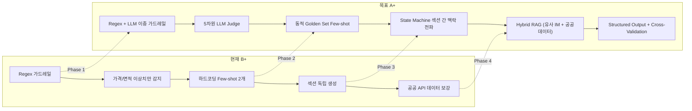

# 🏗️ 모바일 IM 생성 엔진 — SOTA 고도화 구현 계획

> **목표**: 현재 B+ → **A+ (SOTA 이상)** 으로 파이프라인 품질 도달  
> **근거 문서**: [IM Quality Audit](file:///C:/Users/User/.gemini/antigravity/brain/73ebf506-5b37-432c-b1a1-9d789598c101/im_generation_quality_audit.md) + [aihompyhub 기술 이식 분석](file:///C:/Users/User/.gemini/antigravity/brain/73ebf506-5b37-432c-b1a1-9d789598c101/aihompyhub_to_cre_tech_transfer.md)  
> **아키텍처 원칙**: Deterministic(재무) ⊕ LLM(서사) ⊕ LLM-as-Judge(검증) — 3계층 분리

---

## 현재 상태 vs 목표 상태



---

## Phase 1: 검증 계층 강화 (현재 가장 취약한 부분)

> 현재 가장 큰 갭: **AI가 생성한 서사의 의미론적 정확성을 검증할 수단이 없음**

---

### 1-1. [NEW] `im-judge.ts` — LLM-as-Judge 평가 엔진

**위치**: `src/domain/building/mobile-im/im-judge.ts`  
**원본 참조**: [aihompyhub/llmJudge.ts](file:///c:/Users/User/aihompyhub/apps/storefront/lib/ai/llmJudge.ts)

```typescript
interface IMJudgeScore {
  factual_accuracy: number;     // 0-5: SSoT/공공데이터와 일치하는가?
  financial_soundness: number;  // 0-5: Cap Rate↔NOI 일관성, 수치 논리
  regulatory_compliance: number;// 0-5: 투자 추천·보장 언어 없는가?
  investor_value: number;       // 0-5: 매수자에게 유용한 정보 밀도
  data_grounding: number;       // 0-5: 출처 없는 주장이 있는가?
  overall: number;              // 가중 평균
  feedback: string;             // 개선 제안
  citation_check: string[];     // AI가 언급한 수치 vs 실제 데이터 비교 목록
}
```

**동작 원리**:
1. AI가 생성한 섹션 마크다운 + 원본 입력 데이터(SSoT + 공공데이터)를 함께 Judge에 전달
2. Judge는 **"AI가 A라고 썼는데, 실제 데이터에는 B"** 같은 불일치를 수치로 평가
3. `overall < 3.0`이면 해당 섹션을 **템플릿 폴백**으로 대체
4. 결과를 `document_objects.body.judge_scores`에 저장하여 시계열 품질 추적

**비용 통제**:
```typescript
// aihompyhub 패턴 차용: 확률적 샘플링
function shouldJudge(sampleRate: number = 0.15): boolean {
  return Math.random() < sampleRate;  // 15% 섹션만 Judge 실행
}
// OR: needs_check 섹션은 100%, confirmed 섹션은 10%
function shouldJudgeByConfidence(confidence: string): boolean {
  if (confidence === 'needs_check') return true;    // 100%
  if (confidence === 'inferred') return Math.random() < 0.3;  // 30%
  return Math.random() < 0.1;                       // 10%
}
```

---

### 1-2. [NEW] `cre-quality-gate.ts` — CRE 전용 CMOS Quality Gate

**위치**: `src/domain/building/mobile-im/cre-quality-gate.ts`  
**원본 참조**: [aihompyhub/quality-gate.ts](file:///c:/Users/User/aihompyhub/apps/storefront/lib/ai/quality-gate.ts)

현재 `guardrails.ts`의 Regex 검사를 **LLM 기반 의미론적 검사**로 보완합니다.

```typescript
interface CREQualityGateResult {
  passed: boolean;
  riskLevel: 'low' | 'medium' | 'high';
  issues: Array<{
    type: 'investment_guarantee' | 'fabricated_data' | 'legal_assertion'
        | 'misleading_comparison' | 'ungrounded_market_claim';
    excerpt: string;
    suggestion: string;
  }>;
  autoDisclaimerRequired: boolean;
  suggestedDisclaimer?: string;
}
```

**Regex가 놓치는 케이스 (LLM이 잡는 것)**:
| Regex 미감지 | LLM 감지 가능 |
|-------------|-------------|
| "이 건물은 투자하기에 매우 좋습니다" | ✅ 투자 추천 패러프레이징 |
| "역세권 입지로 공실 걱정이 없을 것입니다" | ✅ 근거 없는 확정적 주장 |
| "인근 시세 대비 20% 저렴한 가격입니다" | ✅ 검증 불가능한 가치 비교 |
| "이 권역의 공실률은 하락 추세입니다" | ✅ 출처 없는 시장 트렌드 주장 |

**핵심 설계**: `responseMimeType: 'application/json'` (aihompyhub에서 검증된 패턴)으로 **Structured Output을 강제**하여 파싱 에러를 원천 방지합니다.

---

### 1-3. [MODIFY] `writer.ts` — 검증 레이어 통합

**위치**: [writer.ts](file:///c:/Users/User/cre-dealcard/src/domain/building/mobile-im/writer.ts)

섹션 생성 루프에 Judge + Quality Gate를 삽입:

```diff
 // ── AI 생성 시도 ───
 let generatedByAi = false;
 try {
   const rawText = result.content.trim();
   if (rawText.length > 50) {
     const halluCheck = detectHallucination(rawText, ...);
     if (halluCheck.anomaly) {
       // 기존: 수치 이상치 감지
+    } else if (shouldJudgeByConfidence(confidence)) {
+      // NEW: LLM-as-Judge 의미론적 검증
+      const judgeResult = await judgeIMSection(rawText, bssotFlat, externalData, sectionType);
+      if (judgeResult.overall < 3.0) {
+        console.warn(`[im-judge] Section ${sectionType} score ${judgeResult.overall} → fallback`);
+        // 템플릿 폴백
+      } else {
+        markdown = rawText;
+        generatedByAi = true;
+      }
     } else {
       markdown = rawText;
       generatedByAi = true;
     }
   }
 }

 // Risk Boundary 가드레일 (기존 Regex)
 const riskCheck = runRiskBoundaryCheck(markdown, sectionType);
+// NEW: LLM 기반 Quality Gate (Regex가 놓친 패러프레이징 감지)
+const gateResult = await runCREQualityGate(markdown, sectionType);
+if (!gateResult.passed && gateResult.riskLevel === 'high') {
+  markdown = generatePremiumTemplate(...); // 안전한 템플릿으로 대체
+}
```

---

### 1-4. [MODIFY] `narrative-prompt.ts` — 프롬프트 고도화

#### A. Negative Prompting 추가

```diff
 [작성 규칙]
 1. 글자 수: ...
 ...
+8. 데이터 경계: 제공된 데이터에 없는 정보는 절대 창작하지 마세요. 모르는 항목은 반드시
+   "실사 단계에서 확인 필요" 또는 "데이터 미확보"로 표기하세요.
+9. 출처 표기: 공공데이터 기반 수치 뒤에는 반드시 "(건축물대장 기준)" 등 출처를 병기하세요.
+   AI가 추론한 내용에는 "(AI 추정)" 레이블을 붙이세요.
+10. 교차 검증: 이전 섹션에서 언급한 수치(공실률, 면적 등)와 반드시 일관되게 작성하세요.
+    [이전 섹션 요약]이 제공되면 그 수치를 그대로 사용하세요.
```

#### B. Structured Output 강제

```diff
-const result = await callLLM({
-  systemPrompt: MOBILE_IM_NARRATIVE_SYSTEM,
-  userPrompt,
-  model: IM_AI_MODEL,
-  temperature: 0.3,
-  maxTokens: 900,
-});
+const result = await callLLM({
+  systemPrompt: MOBILE_IM_NARRATIVE_SYSTEM,
+  userPrompt,
+  model: IM_AI_MODEL,
+  temperature: 0.3,
+  maxTokens: 1000,
+  responseFormat: {
+    type: 'json_schema',
+    json_schema: {
+      name: 'im_section_output',
+      schema: {
+        narrative_markdown: 'string',     // 본문 마크다운
+        data_citations: ['string'],       // 사용한 데이터 포인트 목록
+        unknown_items: ['string'],        // 모르는/미확보 항목 목록
+        self_confidence: 'high|medium|low' // 자체 확신도
+      }
+    }
+  }
+});
```

---

### 1-5. [NEW] `cross-validator.ts` — 섹션 간 교차 검증

**위치**: `src/domain/building/mobile-im/cross-validator.ts`

AI가 생성한 7개 섹션의 **수치 일관성**을 사후 검증합니다.

```typescript
interface CrossValidationResult {
  passed: boolean;
  inconsistencies: Array<{
    field: string;          // 예: "vacancy_rate"
    section1: { type: string; value: string };  // 섹션3: "공실 30%"
    section2: { type: string; value: string };  // 섹션4: "안정적 완전임대"
    severity: 'critical' | 'warning';
  }>;
}

// 검증 항목:
// 1. 공실률: lease_status ↔ income_analysis ↔ investment_thesis
// 2. 면적: property_overview ↔ income_analysis (평당가 계산 근거)
// 3. 가격대: property_overview ↔ income_analysis (Cap Rate 분모)
// 4. 건물 연식: property_overview ↔ risk_check (노후화 언급 일관성)
// 5. 교통접근성: location_access ↔ investment_thesis (입지 가치 주장 근거)
```

---

## Phase 2: 학습 & 진화 시스템 (품질 자동 향상)

---

### 2-1. [NEW] `golden-im-manager.ts` — IM Golden Set 자동 진화

**위치**: `src/domain/building/mobile-im/golden-im-manager.ts`  
**원본 참조**: [aihompyhub/goldenSetManager.ts](file:///c:/Users/User/aihompyhub/apps/storefront/lib/ai/goldenSetManager.ts)

```typescript
interface GoldenIMEntry {
  documentId: string;
  buildingId: string;
  assetType: string;          // 오피스 | 상가 | 지산 | 물류
  priceBand: string;          // 50억 미만 | 50-100억 | 100억+
  sections: MobileIMSection[];
  brokerEdits: Array<{        // 브로커가 수정한 부분 추적
    sectionType: string;
    originalMarkdown: string;
    editedMarkdown: string;
  }>;
  judgeScore: number;
  approvedAt: string;
}

// 핵심 함수: 승인 시 자동 Golden 등록
async function markAsGoldenIM(documentId: string): Promise<void>;

// Few-shot 블록 동적 생성
async function buildIMFewShotBlock(
  assetType: string,    // 같은 자산 유형의 Golden IM 검색
  priceBand: string,    // 비슷한 가격대 우선
  sectionType: string,  // 해당 섹션 유형만
  limit: number = 2     // 최대 2개
): Promise<string>;

// Fine-tuning 데이터 내보내기 (향후 커스텀 모델 훈련용)
async function exportForFinetune(format: 'jsonl'): Promise<string>;
```

**브로커 승인 워크플로우 연결**:
```
브로커가 IM 리뷰 페이지에서 수정·승인
    ↓
save-sections API에서 수정 diff 저장
    ↓
approve API에서 judgeScore > 4.0이면 자동 Golden 등록
    ↓
다음 IM 생성 시 같은 assetType+priceBand의 Golden을 Few-shot으로 주입
```

---

### 2-2. [MODIFY] `narrative-prompt.ts` — 동적 Few-shot 주입

```diff
 export function buildNarrativeUserPrompt(...): string {
+  // Golden Set에서 동적 Few-shot 블록 조회
+  const fewShotBlock = await buildIMFewShotBlock(
+    assetType, priceBand, sectionType, 2
+  );

   return `
 [섹션 정보]
 ...
 [데이터셋]
 ...
+${fewShotBlock ? `\n[우수 IM 사례 (참조용 — 이 스타일로 작성하세요)]\n${fewShotBlock}` : ''}
+
 [개별 미션]
 ${sectionMission[sectionType]}
 `;
 }
```

---

## Phase 3: 상태 머신 기반 섹션 간 맥락 전파

---

### 3-1. [NEW] `im-generation-state-machine.ts` — IM 생성 상태 머신

**위치**: `src/domain/building/mobile-im/im-generation-state-machine.ts`  
**원본 참조**: [aihompyhub/conversationStateMachine.ts](file:///c:/Users/User/aihompyhub/apps/storefront/lib/ai/conversationStateMachine.ts)

```typescript
type IMGenStage =
  | 'data_collection'     // SSoT + 공공데이터 수집
  | 'property_overview'   // 섹션 1
  | 'location_analysis'   // 섹션 2
  | 'lease_status'        // 섹션 3
  | 'income_analysis'     // 섹션 4
  | 'risk_check'          // 섹션 5
  | 'investment_thesis'   // 섹션 6
  | 'next_steps'          // 섹션 7
  | 'cross_validation'    // 섹션 간 교차 검증
  | 'quality_gate'        // LLM Judge 종합 평가
  | 'pending_approval';   // 브로커 리뷰 대기

// Forward-only 전이
const IM_TRANSITIONS: Record<IMGenStage, IMGenStage[]> = {
  data_collection:   ['property_overview'],
  property_overview: ['location_analysis'],
  location_analysis: ['lease_status'],
  lease_status:      ['income_analysis'],
  income_analysis:   ['risk_check'],
  risk_check:        ['investment_thesis'],
  investment_thesis: ['next_steps'],
  next_steps:        ['cross_validation'],
  cross_validation:  ['quality_gate'],
  quality_gate:      ['pending_approval'],
  pending_approval:  [],
};

interface IMGenContext {
  stage: IMGenStage;
  keyFacts: string[];          // 누적된 핵심 사실 (이전 섹션에서 추출)
  sectionSummaries: Record<string, string>; // 각 섹션의 200자 요약
  numericalAnchors: {          // 수치 앵커 (교차 검증용)
    totalAreaSqm?: number;
    vacancyPct?: number;
    monthlyRentKrw?: number;
    capRateBase?: number;
    buildingAge?: number;
  };
}
```

**핵심 이점**: 섹션 2(입지 분석)에서 "도보 5분 역세권"이라 썼으면, 섹션 6(투자 메리트)에서 `keyFacts`를 참조하여 "역세권 프리미엄"을 일관되게 언급합니다.

---

### 3-2. [MODIFY] `writer.ts` — 순차 생성 + 맥락 전파

```diff
-// ── 섹션 루프 ──
-for (let i = 0; i < MOBILE_IM_SECTIONS_7.length; i++) {
+// ── 상태 머신 기반 순차 생성 ──
+const ctx: IMGenContext = {
+  stage: 'data_collection',
+  keyFacts: [],
+  sectionSummaries: {},
+  numericalAnchors: {
+    totalAreaSqm: totalAreaForGuard,
+    vacancyPct,
+    monthlyRentKrw: supplemental.monthly_rent_total_krw,
+    capRateBase: undefined,
+    buildingAge: undefined,
+  },
+};
+
+for (let i = 0; i < MOBILE_IM_SECTIONS_7.length; i++) {
   const sectionType = MOBILE_IM_SECTIONS_7[i];
+  ctx.stage = sectionType as IMGenStage;

   // AI 프롬프트에 이전 섹션 맥락 주입
   const userPrompt = buildNarrativeUserPrompt(
     sectionType,
     normalizedForProvenance,
     external_data || null,
     supplemental,
     sectionMarketIndicators,
+    ctx  // 이전 섹션의 keyFacts + numericalAnchors 전달
   );

   // ... AI 생성 ...

+  // 생성 후 맥락 업데이트
+  ctx.sectionSummaries[sectionType] = markdown.slice(0, 200);
+  ctx.keyFacts.push(...extractKeyFacts(markdown, sectionType));
+  updateNumericalAnchors(ctx.numericalAnchors, markdown, sectionType);
 }

+// ── 교차 검증 단계 ──
+ctx.stage = 'cross_validation';
+const crossValResult = runCrossValidation(sections, ctx.numericalAnchors);
+if (!crossValResult.passed) {
+  // critical 불일치가 있는 섹션만 재생성 또는 템플릿 교체
+  for (const issue of crossValResult.inconsistencies.filter(i => i.severity === 'critical')) {
+    const idx = sections.findIndex(s => s.section_type === issue.section2.type);
+    if (idx >= 0) sections[idx].confidence = 'needs_check';
+  }
+}
```

---

## Phase 4: Semantic RAG — 유사 IM 참조 기반 서사 강화

---

### 4-1. [NEW] `im-rag-service.ts` — CRE 전용 RAG 서비스

**위치**: `src/domain/building/mobile-im/im-rag-service.ts`  
**원본 참조**: [aihompyhub/semanticRagService.ts](file:///c:/Users/User/aihompyhub/apps/storefront/lib/ai/semanticRagService.ts)

```typescript
interface IMRagQuery {
  assetType: string;
  priceBand: string;
  areaSignal: string;
  sectionType: MobileIMSectionType;
  maxResults?: number;
}

interface IMRagResult {
  similarIMs: Array<{
    documentId: string;
    sectionMarkdown: string;  // 유사 IM의 같은 섹션 내용
    similarity: number;
    assetType: string;
    isGolden: boolean;
  }>;
  marketData: Array<{        // 시장 리포트/뉴스
    title: string;
    text: string;
    source: string;
    publishedAt: string;
  }>;
  strategy: 'vector' | 'tag' | 'lexical' | 'fallback';
  knowledgeBlock: string;    // 프롬프트에 주입할 포맷된 블록
}
```

**3중 검색 전략** (aihompyhub 패턴):
1. **Vector Search**: 과거 승인된 IM의 섹션들을 임베딩하여 유사 검색
2. **Tag Boosting**: 같은 `assetType` + `priceBand` + `areaSignal` 우선
3. **Lexical Fallback**: 키워드 기반 폴백

**Chunk-Level Attribution**:
```
[보유한 유사 IM 참고자료 (SSoT)]
- [출처1] [강남 오피스 80억대 IM]: 본 자산은 GBD 핵심 입지에...
- [출처2] [역삼동 오피스 75억 IM]: Cap Rate 3.2% 기준으로...

→ 응답 시 참조한 출처 번호를 [출처N] 형식으로 표기하세요.
```

---

### 4-2. [NEW] `im-embedding-worker.ts` — IM 섹션 임베딩

**위치**: `src/domain/building/mobile-im/im-embedding-worker.ts`

```typescript
// 브로커가 IM을 승인할 때 비동기로 실행
async function embedApprovedIM(documentId: string): Promise<void> {
  const sections = await fetchIMSections(documentId);
  for (const section of sections) {
    const embedding = await generateEmbedding(
      `${section.title}: ${section.markdown.slice(0, 500)}`
    );
    await supabase.from('im_section_embeddings').upsert({
      document_id: documentId,
      section_type: section.section_type,
      embedding,
      metadata: { assetType, priceBand, areaSignal, isGolden: true }
    });
  }
}
```

---

## 버그 수정 (Audit에서 발견)

### [MODIFY] `financials.ts` — landValueRatio 계산 버그 수정

```diff
 // L152 부근: totalAreaSqm → platArea (대지면적)
-const landValueRatio = landPricePerSqm && totalAreaSqm
-  ? (landPricePerSqm * totalAreaSqm) / purchasePriceKrw
+const landValueRatio = landPricePerSqm && platAreaSqm
+  ? (landPricePerSqm * platAreaSqm) / purchasePriceKrw
   : null;
```

### [MODIFY] `value-add-engine.ts` — OPEX 보존 비율 불일치 수정

```diff
-const additionalAnnualNoi = additionalMonthlyRent * 12 * 0.82;
+const additionalAnnualNoi = additionalMonthlyRent * 12 * 0.85; // writer.ts와 일치
```

---

## 파일 변경 요약

### Component 1: 검증 계층 (Phase 1)

#### [NEW] [im-judge.ts](file:///c:/Users/User/cre-dealcard/src/domain/building/mobile-im/im-judge.ts)
LLM-as-Judge 5차원 평가 엔진. 확률적 샘플링 + DB 축적 + 3.0 미만 시 템플릿 폴백.

#### [NEW] [cre-quality-gate.ts](file:///c:/Users/User/cre-dealcard/src/domain/building/mobile-im/cre-quality-gate.ts)
LLM 기반 Structured JSON 안전성 검증. Regex가 놓치는 패러프레이징 감지.

#### [NEW] [cross-validator.ts](file:///c:/Users/User/cre-dealcard/src/domain/building/mobile-im/cross-validator.ts)
7개 섹션 간 수치 일관성 사후 검증 (공실률·면적·가격·건물연식·교통접근성).

#### [MODIFY] [writer.ts](file:///c:/Users/User/cre-dealcard/src/domain/building/mobile-im/writer.ts)
Judge + Quality Gate + Cross-Validation을 섹션 생성 루프에 통합.

#### [MODIFY] [narrative-prompt.ts](file:///c:/Users/User/cre-dealcard/src/domain/building/mobile-im/narrative-prompt.ts)
Negative Prompting(규칙 8-10) + Structured Output 강제 + 이전 섹션 맥락 주입 슬롯 추가.

---

### Component 2: 학습 진화 (Phase 2)

#### [NEW] [golden-im-manager.ts](file:///c:/Users/User/cre-dealcard/src/domain/building/mobile-im/golden-im-manager.ts)
브로커 승인 시 자동 Golden Set 등록 → 동적 Few-shot 블록 생성 → Fine-tuning 내보내기.

#### [MODIFY] [im-approval API](file:///c:/Users/User/cre-dealcard/src/app/api/broker/im-lite/%5Bid%5D/approve/route.ts)
승인 시 `markAsGoldenIM()` 호출 추가.

---

### Component 3: 상태 머신 (Phase 3)

#### [NEW] [im-generation-state-machine.ts](file:///c:/Users/User/cre-dealcard/src/domain/building/mobile-im/im-generation-state-machine.ts)
Forward-only 전이 + keyFacts 누적 + numericalAnchors 교차 검증.

#### [MODIFY] [writer.ts](file:///c:/Users/User/cre-dealcard/src/domain/building/mobile-im/writer.ts)
독립 루프 → 상태 머신 기반 순차 생성 + 맥락 전파.

---

### Component 4: Semantic RAG (Phase 4)

#### [NEW] [im-rag-service.ts](file:///c:/Users/User/cre-dealcard/src/domain/building/mobile-im/im-rag-service.ts)
3중 검색(Vector + Tag + Lexical) + RRF + Chunk-Level Attribution.

#### [NEW] [im-embedding-worker.ts](file:///c:/Users/User/cre-dealcard/src/domain/building/mobile-im/im-embedding-worker.ts)
승인된 IM 섹션을 비동기 임베딩하여 Supabase pgvector에 저장.

---

### Component 5: 버그 수정

#### [MODIFY] [financials.ts](file:///c:/Users/User/cre-dealcard/src/domain/building/mobile-im/financials.ts)
`landValueRatio` 계산에 `totalAreaSqm` 대신 `platAreaSqm`(대지면적) 사용.

#### [MODIFY] [value-add-engine.ts](file:///c:/Users/User/cre-dealcard/src/domain/building/mobile-im/value-add-engine.ts)
OPEX 보존 비율 `0.82` → `0.85`로 통일 (`writer.ts`와 일치).

---

## 검증 계획

### 자동 테스트

```bash
# 1. 타입 체크 + 빌드
npm run build

# 2. Judge가 실제로 hallucination을 잡는지 확인
# → 의도적으로 잘못된 수치를 넣은 테스트 섹션을 생성하여 Judge score < 3.0 확인

# 3. Cross-Validator가 불일치를 감지하는지 확인
# → 섹션3에 공실 30%, 섹션4에 "완전임대" 넣어서 critical 감지 확인
```

### 수동 검증
- 실제 딜카드에서 IM 생성 → 리뷰 페이지에서 Judge 점수 확인
- Golden Set 등록 → 다음 IM 생성 시 Few-shot 주입 확인
- Structured Output이 정상 파싱되는지 로그 확인

---

## 예상 품질 향상 지표

| 평가 항목 | 현재 (B+) | Phase 1 후 | Phase 2 후 | Phase 3-4 후 (목표) |
|----------|----------|-----------|-----------|-----------------|
| 프롬프트 엔지니어링 | B | A- | A | A+ |
| Hallucination 방지 | B- | A | A | A+ |
| 가드레일 (금융 규제) | A | A+ | A+ | A+ |
| 출처 추적 | A | A | A | A+ (Citation) |
| RAG | C | C | B | A |
| 논리 일관성 | B- | A- | A | A+ |
| 자동 학습/진화 | — | — | A | A+ |
| **종합** | **B+** | **A-** | **A** | **A+** |

> [!IMPORTANT]
> **Phase 1만으로도 B+ → A-** 도달이 가능합니다. Phase 1은 신규 파일 3개 + 기존 파일 수정 2개로 구성되어 가장 빠르게 효과를 볼 수 있습니다. 승인 시 Phase 1부터 구현을 시작하겠습니다.
