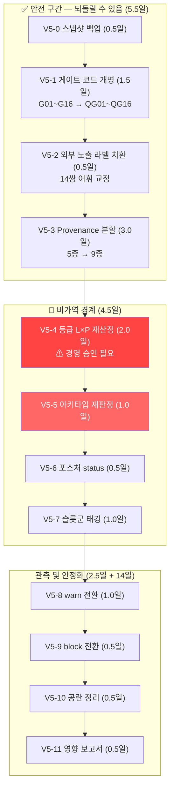

# 구현 계획서 Part 3 — S4 온톨로지 v0.5 마이그레이션 (12.5일 + 관측 14일)

> **선행**: S0~S3 전량 완료
> 
> 이 문서는 `MIGRATION_RUNBOOK.md` §9의 12단계를 정밀 구현 명세로 전환합니다.
> **V5-4 이후는 되돌릴 수 없습니다. 멈출 수 있어야 합니다.**

---

## 마이그레이션 단계 총괄



---

## V5-0 · 스냅샷 백업 (0.5일)

#### [NEW] SQL 마이그레이션

```sql
-- ⚠ V5-4 진입 전 반드시 실행. 이 스냅샷이 유일한 롤백 수단입니다.
BEGIN;
  CREATE TABLE _v04_snapshot_deals AS TABLE deals;
  CREATE TABLE _v04_snapshot_ssot AS TABLE building_ssot_lite;
  CREATE TABLE _v04_snapshot_publish AS TABLE publish_records;
  CREATE TABLE _v04_snapshot_golden AS TABLE im_golden_sets;
  CREATE TABLE _v04_snapshot_lease AS TABLE lease_ledger;
  
  -- 검증 쿼리
  DO $$
  DECLARE
    d_cnt BIGINT; s_cnt BIGINT;
  BEGIN
    SELECT count(*) INTO d_cnt FROM deals;
    SELECT count(*) INTO s_cnt FROM _v04_snapshot_deals;
    IF d_cnt != s_cnt THEN
      RAISE EXCEPTION 'Snapshot mismatch: deals=%, snapshot=%', d_cnt, s_cnt;
    END IF;
  END $$;
COMMIT;
```

**롤백**: `DROP TABLE _v04_snapshot_*;` (원본 무변경)

---

## V5-1 · 게이트 코드 개명 (1.5일)

> `G07`이라는 로그 한 줄이 정본(`CATALOG_RULES`)과 운영(`quality-gates-v02.ts`)에서 서로 다른 것을 뜻합니다.

#### [MODIFY] [quality-gates-v02.ts](file:///c:/Users/User/cre-dealcard/src/domain/building/mobile-im/quality-gates-v02.ts) (121줄)

`PUBLISH_GATES` 배열 (L84~101)의 16개 게이트 ID를 일괄 치환:

```diff
  // L84~101: 게이트 정의
- { id: 'G01', label: '매각가 존재', severity: 'block', check: ... },
- { id: 'G02', label: '면적 존재',   severity: 'block', check: ... },
+ { id: 'QG01', label: '매각가 존재', severity: 'block', check: ... },
+ { id: 'QG02', label: '면적 존재',   severity: 'block', check: ... },
  // ... G03~G16 → QG03~QG16 전부
```

#### 전역 치환 대상 (6개 파일)

| 파일 | 위치 | 변경 |
|---|---|---|
| `quality-gates-v02.ts` | L84~101 | `G01`~`G16` → `QG01`~`QG16` |
| `writer.ts` | L164~191 | `gateReport.failedBlocks` 코드 참조 |
| `im-core.ts` | L32~42 `GateCode` | QG 접두사 추가 |
| `deterministic-gates.ts` | L36~305 | `checkG19`→`checkQG19` 등 |
| `cross-validator.ts` | 전체 | 게이트 코드 참조 |
| 프론트엔드 게이트 표시 | 여러 파일 | 게이트 ID 표시 문자열 |

#### [NEW] 레거시 매핑 보존

```typescript
// src/domain/building/mobile-im/legacy-gate-map.ts
export const LEGACY_GATE_MAP: Readonly<Record<string, string>> = {
  'G01':'QG01','G02':'QG02','G03':'QG03','G04':'QG04',
  'G05':'QG05','G06':'QG06','G07':'QG07','G08':'QG08',
  'G09':'QG09','G10':'QG10','G11':'QG11','G12':'QG12',
  'G13':'QG13','G14':'QG14','G15':'QG15','G16':'QG16',
} as const;
```

**롤백**: git revert (코드 변경만)

---

## V5-2 · 외부 노출 라벨 치환 (0.5일)

#### [MODIFY] [enums.ts](file:///c:/Users/User/cre-dealcard/src/domain/ontology/enums.ts)

`CATALOG_LEXICON.md` 치환 14쌍 중 `internal_label` 스코프에 해당하는 항목:

```diff
  // 아키타입 라벨 — CATALOG_LEXICON LexiconScope: internal_label
  // 지면에 노출되므로 금지어/치환 적용
  
  // INVESTMENT_POSTURE 관련 아키타입 라벨은 별도 매핑에서 관리
  // R-INC-01: '초안정수익형' → '임대 안정형'
  // R-INC-02: '밸류애드형'   → '가치 상승 여력형'
```

#### [MODIFY] [b2c-labels.ts](file:///c:/Users/User/cre-dealcard/src/domain/ontology/b2c-labels.ts)

```diff
  // B2C_LABEL_MAP 내 치환
- { slotKey: 'capRate', b2cLabel: 'Cap Rate', ... },
+ { slotKey: 'capRate', b2cLabel: '연 수익률', ... },
- { slotKey: 'rentRoll', b2cLabel: '렌트롤', ... },  
+ { slotKey: 'rentRoll', b2cLabel: '임대 현황', ... },
```

**롤백**: git revert

---

## V5-3 · Provenance 5종 → 9종 분할 (3.0일)

#### [MODIFY] [provenance.ts](file:///c:/Users/User/cre-dealcard/src/domain/ontology/provenance.ts)

**현행** (L27~63): 5-Tier (`public`=1.00, `expert`=0.95, `seller`=0.65, `broker`=0.60, `assumed`=0.30)

```diff
+ // Line 27~63: PROVENANCE_REGISTRY 확장
+ export const PROVENANCE_REGISTRY: Record<ProvenanceTier, ProvenanceMeta> = {
+   registry:   { tier: 'registry',   badge: '✓', label: '공부확인',     score: 1.00, responsibility: '발급기관' },
+   public_api: { tier: 'public_api', badge: '✓', label: '공공API',     score: 0.95, responsibility: 'API 운영기관' },
+   broker_aug: { tier: 'broker_aug', badge: '●✓', label: '공공+보강',  score: 0.80, responsibility: '중개인+운영기관' },
+   expert:     { tier: 'expert',     badge: '★', label: '전문가검증',   score: 0.95, responsibility: '해당 자격사' },
+   ledger:     { tier: 'ledger',     badge: '📋', label: '원장확인',    score: 0.70, responsibility: '원장 제공자' },
+   seller:     { tier: 'seller',     badge: '▲', label: '매도인고지',   score: 0.65, responsibility: '매도인' },
+   broker:     { tier: 'broker',     badge: '●', label: '중개인입력',   score: 0.60, responsibility: '중개인' },
+   derived:    { tier: 'derived',    badge: '⚙', label: '파생계산',    score: null, responsibility: '시스템' },
+   assumed:    { tier: 'assumed',    badge: '◇', label: 'AI추정·가정', score: 0.30, responsibility: '없음' },
+ };
```

**derived 최약 고리 승계** (C21):
기존 `composeAdditive`/`composeRatio`/`composeScenario` (L103~180)는 이미 `weakestLink` 패턴을 구현하고 있으므로, 새로운 `derived` 티어에 대해 `score: null` → `Math.min(...inputs)` 로직만 추가:

```typescript
// derivedConfidence — C21 구현
export function derivedConfidence(inputs: ProvenanceTier[]): number {
  const scores = inputs.map(p => PROVENANCE_REGISTRY[p].score).filter(s => s !== null) as number[];
  return scores.length > 0 ? Math.min(...scores) : 0.30;
}
```

#### [NEW] DB 마이그레이션: Provenance 데이터 변환

```sql
-- V5-3: 기존 5종 → 9종 일괄 매핑
-- building_ssot_lite.supplemental_data JSONB 내 provenance 필드
UPDATE building_ssot_lite
SET supplemental_data = jsonb_set(
  supplemental_data,
  '{provenance}',
  (
    SELECT jsonb_object_agg(
      key,
      CASE value::text
        WHEN '"public"'  THEN '"registry"'::jsonb
        WHEN '"expert"'  THEN '"expert"'::jsonb
        WHEN '"seller"'  THEN '"seller"'::jsonb
        WHEN '"broker"'  THEN '"broker"'::jsonb
        WHEN '"assumed"' THEN '"assumed"'::jsonb
        ELSE value
      END
    )
    FROM jsonb_each(supplemental_data->'provenance')
  )
)
WHERE supplemental_data ? 'provenance';

-- 검증
SELECT DISTINCT value
FROM building_ssot_lite, jsonb_each_text(supplemental_data->'provenance')
WHERE supplemental_data ? 'provenance';
-- 결과에 'public' 0건이어야 진행
```

**롤백**: 역매핑 SQL (`registry`→`public` 등)

---

## V5-4 · 등급 L×P 재산정 (2.0일) 🔴 비가역

> [!CAUTION]
> **경영 승인 필요**. 등급이 바뀌면 이미 발행된 IM의 잠금 상태와 어긋납니다.

#### [MODIFY] [grade-engine.ts](file:///c:/Users/User/cre-dealcard/src/domain/asset/grade-engine.ts)

**현행** (300줄): 100점 만점 단일 점수 (`NEW_WEIGHTS` L82~91, `scorePct` → A≥75/B≥40/C<40)

**개편**: L×P 2차원 매트릭스

```typescript
// 1. P축 해상도 산정 (공공 수집 — 전 포스처 공통)
function resolveP(slots: SlotMap): PropertyResolution {
  const pSlots = ['land_parcel','building_basic','zoning','road_access','title_encumbrance'];
  const fillRate = pSlots.filter(s => isFilled(slots, s)).length / pSlots.length;
  if (fillRate >= 0.8) return 'P3';
  if (fillRate >= 0.6) return 'P2';
  if (fillRate >= 0.3) return 'P1';
  return 'P0';
}

// 2. L축 해상도 산정 (중개인 입력 — 포스처별 상이)
const L_AXIS_SLOTS: Record<InvestmentPosture, string[]> = {
  income:          ['lease_roll', 'financial_input'],
  owner_occupied:  ['occupancy_plan', 'physical_spec'],
  development:     ['vacate_plan', 'permit_risk', 'development_plan'],
  operating:       ['operating_performance', 'hospitality_spec'],
  trading:         ['market_comp', 'holding_history'],
};

function resolveL(slots: SlotMap, posture: InvestmentPosture): Resolution {
  const lSlots = L_AXIS_SLOTS[posture];
  const fillRate = lSlots.filter(s => isFilled(slots, s)).length / lSlots.length;
  // 포스처별 가중치 적용 (grade-profiles.ts POSTURE_ADJUSTMENT 연동)
  const adjusted = applyPostureAdjustment(fillRate, posture);
  if (adjusted >= 0.8) return 'R3';
  if (adjusted >= 0.5) return 'R2';
  if (adjusted >= 0.2) return 'R1';
  return 'R0';
}

// 3. 등급 매트릭스
function gradeMatrix(l: Resolution, p: PropertyResolution): Grade {
  if (l === 'R0' || p === 'P0') return 'D';
  if (l >= 'R2' && p >= 'P2') return 'A';
  if (l >= 'R1' && p >= 'P2') return 'B';
  if (l >= 'R1' && p === 'P1') return 'C';
  return 'D';
}

// 4. GradeResult 확장
export interface GradeResult {
  grade: Grade;
  L: Resolution;
  P: PropertyResolution;
  lFillRate: number;
  pFillRate: number;
  lockedMetrics: { key: string; missing: string[] }[];
  nextStep: NextStep | null;
  // 하위 호환
  scorePct: number;  // L+P 합산 백분율 (기존 UI 호환용)
  dcfEligible: boolean;
}
```

#### [MODIFY] [grade-profiles.ts](file:///c:/Users/User/cre-dealcard/src/domain/ontology/grade-profiles.ts)

기존 `GRADE_THRESHOLDS = { A: 85, B: 65, C: 40 }` (L166) → L×P 매트릭스로 대체.
`gradeProfile()` 함수 (L78~106)의 100점 정규화 가중치를 L축/P축 각각에 배분:

```typescript
// P축 가중치 (전 포스처 공통, 합 50)
const P_WEIGHTS: Record<string, number> = {
  land_parcel: 12, building_basic: 12, zoning: 10,
  road_access: 8, title_encumbrance: 8,
};

// L축 가중치 (포스처별, 합 50)
const L_WEIGHTS: Record<InvestmentPosture, Record<string, number>> = {
  income: { lease_roll: 30, financial_input: 20 },
  operating: { operating_performance: 35, hospitality_spec: 15 },
  // ...
};
```

---

## V5-5 ~ V5-11 (4.5일 + 14일 관측)

| 단계 | 작업 | 대상 파일 | 공수 |
|---|---|---|---:|
| V5-5 | R-INC 아키타입 재판정 | `deck-sequencer.ts` L141~171 | 1.0일 |
| V5-6 | 포스처 status 산정 | `posture-contract.ts` | 0.5일 |
| V5-7 | L축/P축 슬롯군 태깅 | `grade-profiles.ts` | 1.0일 |
| V5-8 | warn 전환 + 관측 시작 | `.env` `DETERMINISTIC_GATES=warn` | 1.0일 |
| V5-9 | block 전환 (G20은 warn 유지) | `.env` `DETERMINISTIC_GATES=block` | 0.5일 |
| V5-10 | 폐기 공란 정리 | `enums.ts`, `constraint-validator.ts` | 0.5일 |
| V5-11 | 영향 보고서 작성 | 문서 | 0.5일 |

#### V5-8 관측 지표 (14일)

```sql
-- 게이트별 warn 발동 빈도
SELECT gate_code, count(*), 
       count(*) FILTER (WHERE is_false_positive) AS false_positives
FROM gate_events
WHERE created_at >= NOW() - INTERVAL '14 days'
  AND mode = 'warn'
GROUP BY gate_code
ORDER BY count(*) DESC;
-- 오탐(false_positive) 0건 확인 후 block 전환
```

---

## 검증 계획

```bash
# V5-0 검증
psql -c "SELECT count(*) FROM deals EXCEPT SELECT count(*) FROM _v04_snapshot_deals;"
# 결과: 0 (일치)

# V5-1 검증
grep -r "'\''G0[1-9]'\''\\|'\''G1[0-6]'\''" src/ --include="*.ts" | grep -v "LEGACY_GATE_MAP"
# 결과: 0건 (구 코드 잔존 없음)

# V5-3 검증
psql -c "SELECT DISTINCT value FROM building_ssot_lite, jsonb_each_text(supplemental_data->'provenance') WHERE supplemental_data ? 'provenance';"
# 결과: registry, public_api, broker_aug, expert, ledger, seller, broker, derived, assumed만

# V5-4 검증
npm run test -- --grep "grade-engine"
npm run test -- --grep "grade-matrix"
psql -f scripts/check-grade-migration.sql  # A 승격 딜 목록 추출

# 전체
npm run build
npm run test
```

**DoD**:
- [x] 구 게이트 코드 `G01~G16` 잔존 0건 (LEGACY_GATE_MAP 제외)
- [x] 구 Provenance 이름 0건
- [x] L×P 등급 산정 — 5종 포스처 각 1건 통과
- [x] A 승격 딜 전량 수동 심사 완료
- [x] 14일 관측 — 오탐 0건 · 미탐 0건
