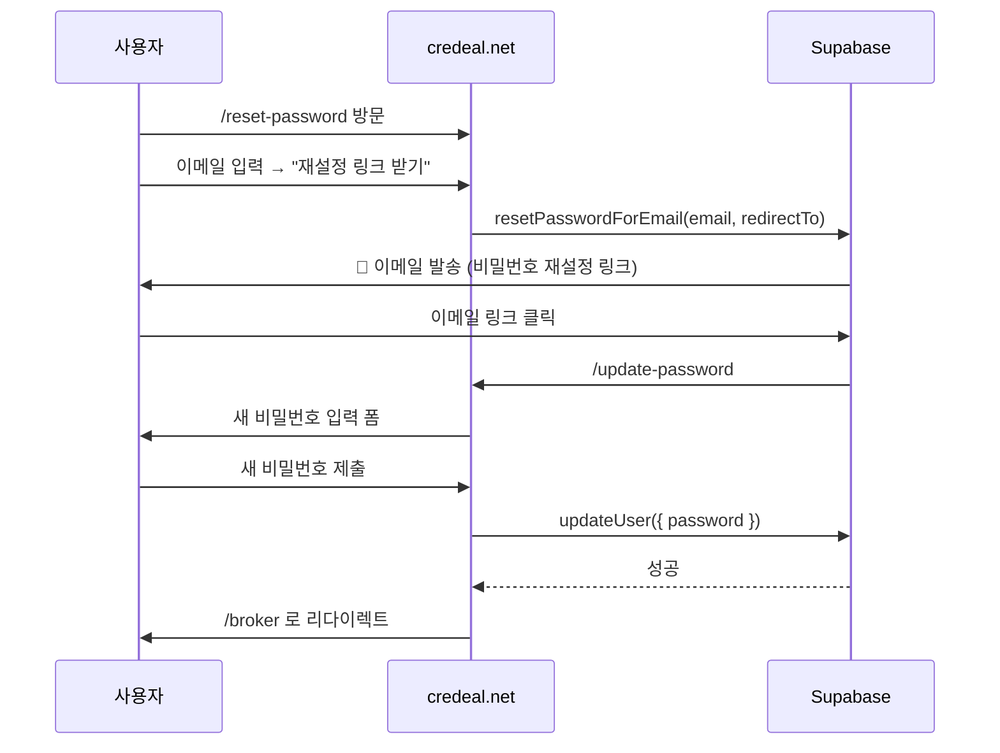

# Supabase 비밀번호 재설정 설정 가이드

## 1. Site URL 설정

**경로**: Supabase Dashboard → Authentication → URL Configuration

| 항목 | 값 |
|------|-----|
| **Site URL** | `https://www.credeal.net` |

---

## 2. Redirect URLs 설정

**경로**: 같은 페이지 → Redirect URLs → Add URL

아래 URL들을 **모두** 추가하세요:

```
https://www.credeal.net/update-password
https://credeal.net/update-password
https://www.credeal.net/api/auth/callback
https://credeal.net/api/auth/callback
https://www.credeal.net/broker
https://credeal.net/broker
```

> [!IMPORTANT]
> 로컬 개발 환경도 필요하면 `http://localhost:3000/**` 패턴도 추가하세요.

---

## 3. 이메일 템플릿 설정

**경로**: Supabase Dashboard → Authentication → Email Templates

### 3-1. Reset Password (비밀번호 재설정)

**Subject**:
```
[크리딜] 비밀번호 재설정 안내
```

**Body** (HTML):
```html
<div style="font-family: 'Apple SD Gothic Neo', 'Malgun Gothic', sans-serif; max-width: 480px; margin: 0 auto; padding: 40px 24px; background: #0b0f19; color: #e2e8f0; border-radius: 16px;">
  <div style="text-align: center; margin-bottom: 32px;">
    <h1 style="font-size: 24px; font-weight: 800; color: #ffffff; margin: 0;">크리딜 DealCard</h1>
    <p style="font-size: 13px; color: #94a3b8; margin-top: 8px;">상업용 부동산 AI 딜카드 플랫폼</p>
  </div>

  <div style="background: #1e293b; border: 1px solid #334155; border-radius: 12px; padding: 24px; margin-bottom: 24px;">
    <h2 style="font-size: 18px; font-weight: 700; color: #ffffff; margin: 0 0 12px 0;">🔐 비밀번호 재설정</h2>
    <p style="font-size: 14px; color: #cbd5e1; line-height: 1.6; margin: 0;">
      비밀번호 재설정을 요청하셨습니다.<br/>
      아래 버튼을 클릭하면 새 비밀번호를 설정할 수 있습니다.
    </p>
  </div>

  <div style="text-align: center; margin: 32px 0;">
    <a href="{{ .ConfirmationURL }}" 
       style="display: inline-block; background: linear-gradient(135deg, #8b5cf6, #6366f1); color: #ffffff; font-size: 15px; font-weight: 700; text-decoration: none; padding: 14px 40px; border-radius: 12px;">
      비밀번호 재설정하기 →
    </a>
  </div>

  <div style="background: #1a1a2e; border: 1px solid #2d2d44; border-radius: 8px; padding: 16px; margin-bottom: 24px;">
    <p style="font-size: 12px; color: #94a3b8; margin: 0; line-height: 1.5;">
      ⚠️ 본인이 요청하지 않으셨다면 이 메일을 무시하세요.<br/>
      이 링크는 24시간 동안 유효합니다.
    </p>
  </div>

  <div style="text-align: center; border-top: 1px solid #1e293b; padding-top: 16px;">
    <p style="font-size: 11px; color: #475569; margin: 0;">
      © 2026 크리딜 (credeal.net) · 상업용 부동산 AI 딜카드
    </p>
  </div>
</div>
```

### 3-2. Confirm Signup (회원가입 확인) — 선택

**Subject**:
```
[크리딜] 이메일 인증을 완료해주세요
```

**Body** (HTML):
```html
<div style="font-family: 'Apple SD Gothic Neo', 'Malgun Gothic', sans-serif; max-width: 480px; margin: 0 auto; padding: 40px 24px; background: #0b0f19; color: #e2e8f0; border-radius: 16px;">
  <div style="text-align: center; margin-bottom: 32px;">
    <h1 style="font-size: 24px; font-weight: 800; color: #ffffff; margin: 0;">크리딜 DealCard</h1>
    <p style="font-size: 13px; color: #94a3b8; margin-top: 8px;">상업용 부동산 AI 딜카드 플랫폼</p>
  </div>

  <div style="background: #1e293b; border: 1px solid #334155; border-radius: 12px; padding: 24px; margin-bottom: 24px;">
    <h2 style="font-size: 18px; font-weight: 700; color: #ffffff; margin: 0 0 12px 0;">👋 가입을 환영합니다!</h2>
    <p style="font-size: 14px; color: #cbd5e1; line-height: 1.6; margin: 0;">
      크리딜에 가입해주셔서 감사합니다.<br/>
      아래 버튼을 클릭하여 이메일 인증을 완료해주세요.
    </p>
  </div>

  <div style="text-align: center; margin: 32px 0;">
    <a href="{{ .ConfirmationURL }}" 
       style="display: inline-block; background: linear-gradient(135deg, #8b5cf6, #6366f1); color: #ffffff; font-size: 15px; font-weight: 700; text-decoration: none; padding: 14px 40px; border-radius: 12px;">
      이메일 인증하기 →
    </a>
  </div>

  <div style="text-align: center; border-top: 1px solid #1e293b; padding-top: 16px;">
    <p style="font-size: 11px; color: #475569; margin: 0;">
      © 2026 크리딜 (credeal.net) · 상업용 부동산 AI 딜카드
    </p>
  </div>
</div>
```

---

## 4. SMTP 설정 (권장)

**경로**: Supabase Dashboard → Project Settings → Authentication → SMTP Settings

Supabase 기본 SMTP는 시간당 발송 제한이 있습니다. 프로덕션에서는 자체 SMTP를 설정하세요.

| 항목 | 예시 값 |
|------|---------|
| Host | `smtp.gmail.com` 또는 `email-smtp.ap-northeast-2.amazonaws.com` |
| Port | `587` |
| Sender email | `noreply@credeal.net` |
| Sender name | `크리딜 DealCard` |

---

## 5. 비밀번호 재설정 플로우 요약



---

## 6. 체크리스트

- [ ] **Site URL** = `https://www.credeal.net`
- [ ] **Redirect URLs**에 위 6개 URL 모두 추가
- [ ] **Reset Password 이메일 템플릿** 한국어로 변경
- [ ] (선택) **SMTP 설정** — 자체 발송 서버 등록
- [ ] `/reset-password` 페이지 접속 테스트
- [ ] 재설정 이메일 수신 확인
- [ ] 이메일 링크 → `/update-password` 리다이렉트 확인
- [ ] 새 비밀번호로 로그인 확인
